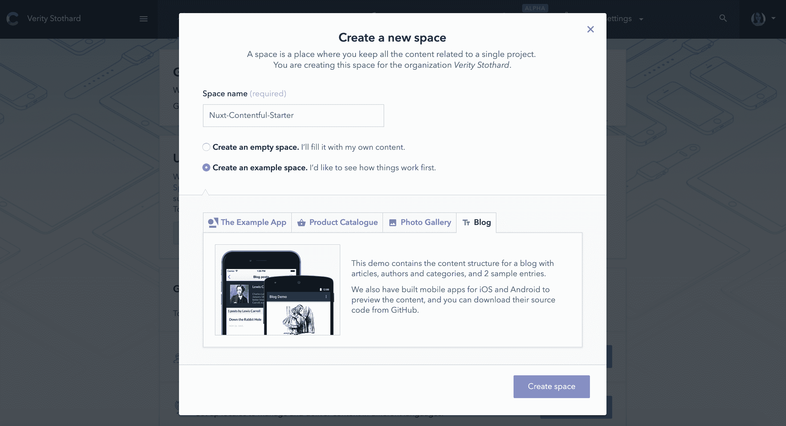
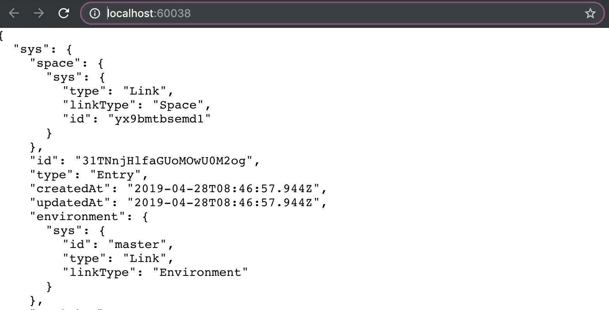
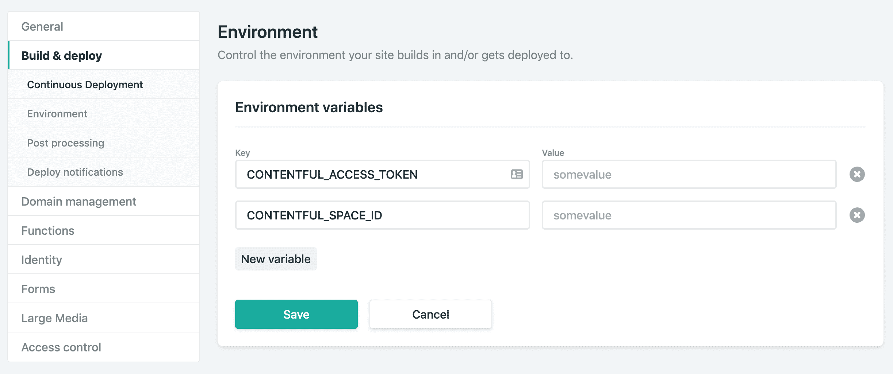
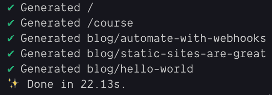

# 用 Nuxt，Contentful，Netlify 和 Tailwind 建立一个博客

> 原文：<https://dev.to/vstothard/build-a-blog-with-nuxt-contentful-netlify-and-tailwind-4ok8>

*本文最初发布于[veritystothard.com](http://www.veritystothard.com/blog/build-blog-with-nuxt-contentful-netlify-tailwind)。*

在这里检查项目库[，在这里](https://github.com/VStothard/nuxt-contentful-starter)检查网络部署[。](https://nuxt-contentful-starter.netlify.com)

注意:这篇文章假设你对 JavaScript 框架有一些经验，它是用 Nuxt 版本 2.4.0 编写的

### 创建一个 Nuxt app

首先，我们需要为您的项目创建一个资源库，我们将使用 Github。这是可选的，但是我们稍后将使用这个 repo 来部署到 [Netlify](https://www.netlify.com/) ，所以请确保您的提供商是受支持的。

创建并克隆您的回购后:

*   在当前目录下创建 Nuxt 应用:`yarn create nuxt-app`
*   *或*，创建在一个子目录:`yarn create nuxt-app <my-project->`

运行上面的一个，我们将被引导通过设置过程。作为参考，这些是我对这个项目的选择:

*   服务器框架:无
*   要安装的功能:无
*   UI 框架:顺风
*   测试框架:无
*   渲染模式:通用
*   包装经理:纱线

更多关于 Nuxt 安装的信息，请查看他们的[文档](https://nuxtjs.org/guide/installation/)。

要启动项目，请运行`yarn run dev`

### 建立一个令人满意的空间

创建一个帐户或登录到 [Contentful](https://www.contentful.com/) ，并使用博客模板为您的项目创建一个空间:

[](//images.ctfassets.net/8i5c5iwa1tzc/9uVM8oPdqGGWsWWe5O23b/4c176448291ce310755a286a3e7a0368/Screen_Shot_2019-04-28_at_6.45.51_pm.png)

环顾四周，你会发现 Contentful 已经自动为我们创建了一些虚拟内容。

为了使用 access 我们的内容，我们需要将 Contentful 添加到我们的项目中，并设置我们的环境变量以便在 api 调用中使用。要安装，运行`yarn add contentful`。

在项目的根目录下创建一个. env 文件，并添加您的详细信息。您可以在设置> api 密钥>示例空间令牌 1 中找到您的空间详细信息。您将需要“空间 ID”和“内容交付 API -访问令牌”

```
 CONTENTFUL_SPACE_ID=[SPACE_ID]
    CONTENTFUL_ACCESS_TOKEN=[ACCESS_TOKEN] 
```

在您的`nuxt.config.js`文件中，将环境变量映射到 env 对象中。

```
 export default {
      ...
      env: {
        spaceId: process.env.CONTENTFUL_SPACE_ID,
        accessToken: process.env.CONTENTFUL_ACCESS_TOKEN
      },
      ...
    } 
```

为了在整个项目中访问我们的 env 变量，我们需要通过运行`yarn add dotenv`来安装 [dotenv](https://www.npmjs.com/package/dotenv) ，然后要求它在你的`nuxt.config.js`
的顶部

```
 require('dotenv').config()

    export default {
    ...
    } 
```

现在我们已经设置好了所有的变量，让我们在`/plugins/`文件夹中创建一个 Nuxt 插件来处理客户端的创建，并使其可以全局访问。我们将插件命名为`contentful.js`，使我们的环境变量可以在一个配置对象中访问，然后初始化并导出客户端:

```
 const contentful = require('contentful')

    const config = {
        space: process.env.spaceId,
        accessToken: process.env.accessToken
    }

    const client = contentful.createClient(config)

    export default client 
```

然后，您需要将插件添加到`nuxt.config.js`中，并重启您的项目以使其可用:

```
 export default {
        ...
        plugins: [
          '~/plugins/contentful.js'
        ]
        ...
    } 
```

### 获取带有异步数据的条目

异步数据允许你在页面上预先呈现数据，所以你的站点的第一次加载速度非常快，你可以在这里[阅读。](https://nuxtjs.org/guide/async-data/)

首先，我们将在主页上设置一些文章预览。在`pages/index.vue`中，我们将创建一个异步函数，获取所有类型为‘blogPost’的条目，并将它们打印到页面上

*注意:异步数据只能在页面级工作，不能在组件中工作。*

您应该看到您的输入数据被打印到 JSON 页面上。

[](//images.ctfassets.net/8i5c5iwa1tzc/4R0k2NVq1EgWnGMs10ksIe/aec4ba957c45cb0ae7af940671f81574/Screen_Shot_2019-04-29_at_5.29.17_pm.png)

现在我们可以使用这些数据为每个返回的帖子创建一个预览图片:

```
 <template>
      <div>
        <div v-for="(post, i) in blogPosts" :key="i">
          <nuxt-link :to="{ name: `blog-slug`, params: { slug: post.fields.slug }}">
            <div v-if="post.fields.heroImage" class="w-full h-64 bg-cover bg-center" :style="`background-image: url('https:${post.fields.heroImage.fields.file.url}')`"></div>
            <p v-if="post.fields.publishDate">{{post.fields.publishDate}}</p>
            <h2 v-if="post.fields.title">{{post.fields.title}}</h2>
            <p v-if="post.fields.description">{{post.fields.description}}</p>
            <p >
              <span v-for="(tag, i) in post.fields.tags" :key="i">
                <template v-if="i < 2">#{{tag}} </template>
              </span>
            </p>
          </nuxt-link>
        </div>
      </div>
    </template>

    <script>
    import contentful from "~/plugins/contentful.js";

    export default {
        async asyncData(context) {
            let blogPosts = await contentful.getEntries({ content_type: "blogPost" });

            return {
               blogPosts: blogPosts.items
            }
        }
    };
    </script> 
```

### 动态页面

现在，我们需要我们的预览瓦片在我们点击它们时链接到某个地方，所以让我们创建一个动态博客页面，它使用在`<nuxt-link>`中传递的参数来用期望的博客文章填充页面。

在 pages 文件夹中，创建一个名为`blog`的文件夹，包含一个名为`_slug.vue`的文件

我们的动态博客文章页面(`_slug.vue`)将使用 asyncData 函数返回类型为“博客文章”*和*与 URL 中的 slug 匹配的 slug 字段的条目，例如`/static-sites-are-great/`。

```
 <template>
      <div>
        <nuxt-link to="/">back to latest posts</nuxt-link>
        <div v-if="content.fields.heroImage" class="w-full h-64 bg-cover bg-center" :style="`background-image: url('${content.fields.heroImage.fields.file.url}')`"></div>
        <p v-if="content.fields.publishDate">{{content.fields.publishDate}}</p>
        <h2 v-if="content.fields.title">{{content.fields.title}}</h2>
        <vue-markdown>{{content.fields.body}}</vue-markdown>
        <p>
          <span v-for="(tag, i) in content.fields.tags" :key="i">
            <template v-if="i < 2">#{{tag}} </template>
          </span>
        </p>
      </div>
    </template>
    <script>
    import contentful from "~/plugins/contentful.js";

    export default {
      async asyncData({ env, params }) {
        return await contentful
          .getEntries({
            content_type: "blogPost",
            "fields.slug": params.slug
          })
          .then(entries => {
            return {
              content: entries.items[0]
            };
          })
          .catch(console.error);
      }
    };
    </script> 
```

你可能会注意到你的博客文章的正文内容看起来有点古怪，这是因为数据是在 [markdown](https://github.com/adam-p/markdown-here/wiki/Markdown-Cheatsheet) 中返回的，需要在以 HTML 格式呈现在页面上之前进行解析。为了解决这个问题，我们需要通过运行`yarn add vue-markdown`来安装一个 markdown 解析器，比如 [vue-markdown](https://www.npmjs.com/package/vue-markdown) 。

我们需要这个模块是全局可访问的，所以我们将创建另一个插件文件来导入模块并注册`vue-markdown`组件。我们将这个插件命名为`vueMarkdown.js`。

```
 import VueMarkdown from 'vue-markdown';

    Vue.component('VueMarkdown', VueMarkdown) 
```

不要忘记添加到 nuxt.config.js 中的插件列表，并重启你的项目:

```
 export default {
        ...
        plugins: [
          '~/plugins/contentful.js',
          '~/plugins/vueMarkdown.js'
        ],
        ...
    } 
```

现在我们可以将文章主体包装在组件中，并看到它被转换成 HTML:

```
 <vue-markdown>{{content.fields.body}}</vue-markdown> 
```

### 部署到网络生活

设置一个帐户或登录到 [Netlify](https://www.netlify.com/) ，并按照他们的说明设置您的部署。

您的构建设置应该是:

*   存储库:[您的存储库 url]
*   基本目录:未设置
*   构建命令:nuxt 生成
*   发布目录:dist
*   部署日志可见性:日志是公开的

在环境部分(Site settings > Build & Deploy > Environment)，您将需要添加您的环境变量，就像您在`.env`文件中拥有它们一样。

[](//images.ctfassets.net/8i5c5iwa1tzc/5Okk51q9ye989TE7dhMBZ6/c6c5a8d3374ed141c9d5263bd32988fa/Screen_Shot_2019-04-30_at_8.29.03_am.png)

通过 Netlify 的魔力，您的项目应该持续地部署在 push to master 上🙌

### 设置动态路线生成

如果您访问您的 Netlify URL 并点击 around，您的站点应该会正常工作，但是您可能会注意到，当您刷新页面时，我们创建的动态博客页面会显示“未找到页面”错误。这是因为当 Netlify 运行`nuxt generate`命令时，nuxt 在配置中查找一个`generate: {}`对象以确定它需要创建哪些路由，但没有找到。

我们需要回到我们的项目，并指定我们希望为类型为`blogPost`的内容空间中的每个条目生成一条路线。

在`nuxt.config.js`中，我们需要导入 Contentful 并设置我们的客户端。你可能会注意到这是我们在`contentful.js`插件中的代码的副本。在这种情况下，我们不能使用插件，因为我们在`nuxt.config.js`中设置的环境变量在完成解析之后的*之前是不可访问的。因此，我们需要在文件的顶部创建客户机，以便在配置完成解析之前让我们能够访问 Contentful。* 

```
 const contentful = require('contentful')
    const config = {
        space: process.env.CONTENTFUL_SPACE_ID,
        accessToken: process.env.CONTENTFUL_ACCESS_TOKEN
    }
    const client = contentful.createClient(config)

    export default {
        ...
    } 
```

接下来，我们将创建一个异步函数来获取每个条目的 slug，并将它们推送到一个路由数组:

```
 generate: {
        routes: async function () {
          const entries = await client.getEntries({ content_type: "blogPost" });
          const routes = []
          entries.items.forEach(item => {
            routes.push(`blog/${item.fields.slug}`)
          })
          return routes
        }
      } 
```

要测试您的功能，运行`yarn generate`，您应该看到您的路线记录在终端中

[](//images.ctfassets.net/8i5c5iwa1tzc/sOkcnDgYVk7e4OWVoQqdU/6fcd606d4c0e1e166f938dbadb9f09be/Screen_Shot_2019-04-29_at_4.53.37_pm.png)

最后，将您的更改提交到您的生产分支，并检查路由在您的 Netlify 站点上是否按预期工作。

### 顺风造型💅🏻

现在我们已经设置了功能，我们可以使用 tailwind 来设计我们的博客，在 GitHub 上查看完成的项目，看看我是如何设计所有东西的。

[https://github.com/VStothard/nuxt-contentful-starter](https://github.com/VStothard/nuxt-contentful-starter)