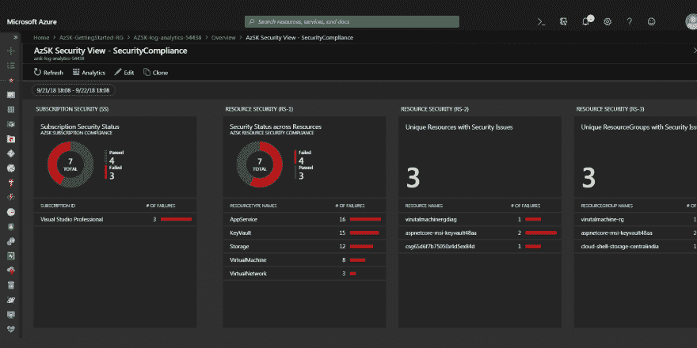
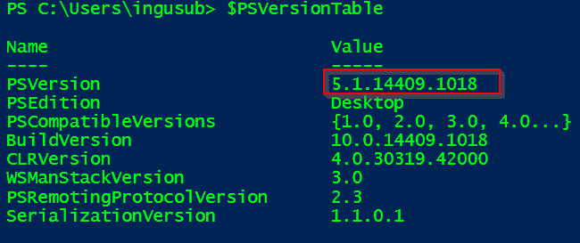
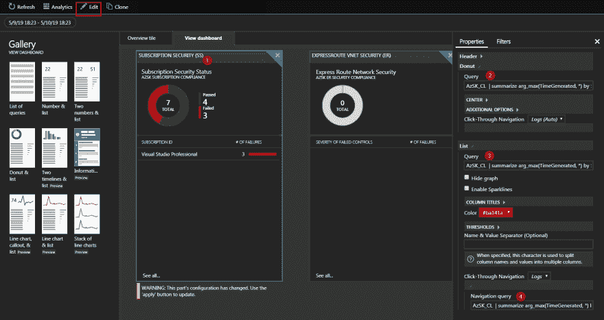
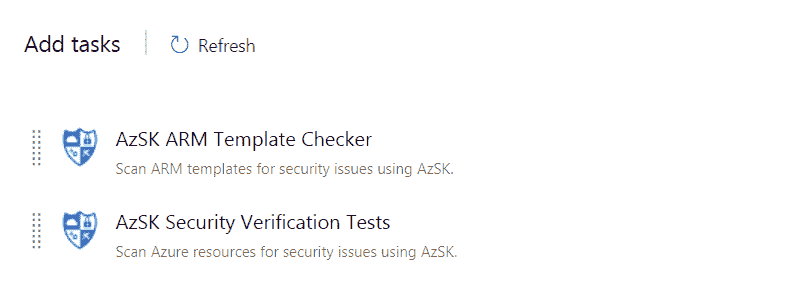

# 如何使用 Azure 安全开发工具包(AzSK)提高 Azure 安全性

> 原文：<https://dev.to/gurucharan94/how-to-improve-your-azure-security-with-the-secure-devops-kit-for-azure-azsk-3m16>

用于 Azure 的安全 DevOps 工具包(AzSK) 是一个免费的开源工具包，它检查你的 Azure 资源的操作和安全最佳实践。该套件的核心是一个 Powershell 模块，通过检查以下关键领域来满足端到端 Azure 订阅和资源安全需求

*   **订阅安全** - ARM 策略、RBAC(基于角色的访问控制)、安全中心配置
*   **资源安全**——Https 配置、防火墙规则、密钥轮换、令牌过期、备份和灾难恢复配置等等。

这篇文章将向您展示如何开始使用安全的 DevOps 工具包的核心功能

*   安装 AzSK 并运行第一次扫描
*   了解扫描结果。
*   将扫描结果推送到 Azure 日志分析并可视化扫描结果，如下图所示

如果您想尝试一些高级功能，我还提供了官方文档的链接，例如

*   自定义安全检查
*   Azure DevOps (VSTS)和 Jenkins 集成，将这些检查纳入您的部署管道。
*   部署后的持续安全监控。

[](https://res.cloudinary.com/practicaldev/image/fetch/s--3oIHqdDg--/c_limit%2Cf_auto%2Cfl_progressive%2Cq_auto%2Cw_880/https://www.gurucharan.in/asseimg/AzSK/AzSK-LogAnalytics.png) 

<figcaption>AzSK-Log 分析</figcaption>

## **安装 AzSK 并运行第一次扫描**

亲爱的读者，我假设你对 Powershell 有基本的了解。如果你需要开始学习或者温习你的 Powershell，AzSK 团队已经做了很棒的工作来帮助你完成这个速成课程。

确保您的机器上安装了 **PowerShell 版本 5** 或更高版本。您可以通过在 PowerShell 窗口上运行`$PSVersionTable`来检查您机器上安装的 Powershell 版本。如果需要，请更新您的 PowerShell 版本。更新基本上是直截了当的。谷歌是你最好的朋友😊

[](https://res.cloudinary.com/practicaldev/image/fetch/s--MRqlAMD8--/c_limit%2Cf_auto%2Cfl_progressive%2Cq_auto%2Cw_880/https://www.gurucharan.in/asseimg/AzSK/PSVersion.png)T3】Powershell 版本

一旦你安装了正确版本的 Powershell，下一步就是你**相信我，复制并粘贴脚本**到你的 Powershell ISE 窗口并运行它们。😊这些脚本广泛使用了新的 Azure Powershell (Az)模块。我已经包括了脚本试图完成的内容的概述，以及任何必要的行内注释。

### **复制粘贴-钻取 1**

练习 1 涉及到为 Azure 安装安全的 DevOps 工具包。安装不需要管理员权限，并且为当前登录的用户安装模块。Azure 安全工具包在很大程度上依赖于新的 Azure Powershell (Az)模块。您可以运行下面的脚本在您的机器上安装 AzSK。安装可能需要一些时间，与此同时，您可以查看一下[官方安装说明](https://azsk.azurewebsites.net/00a-Setup/Readme.html)，其中包含常见安装问题的答案。

```
# Install AzSK
Install-Module AzSK -Scope CurrentUser -AllowClobber -Force

# Display some info about AzSK
Get-InstalledModule AzSK

# Lists all the commands available in AzSK
Get-Help AzSK 
```

### **复制粘贴-钻取 2**

现在，AzSK 已成功安装，drill 2 包含以下脚本，它通过设置日志分析工作区来可视化结果，从而帮助我们从 AzSK 获得最大价值。

下面的脚本

*   将 AzSK 导入当前会话
*   提示您登录 Azure
*   在您选择的订阅中创建新的资源组
*   然后，它用 AzSK 可视化创建一个日志分析工作区
*   将 AzSK 配置为将扫描结果推送到新创建的工作区

将下面的脚本保存在一个名为 **AzSK-setup.ps1** 的文件中。从已经打开的 Powershell ISE 窗口中，您可以运行`.\AzSK-setup.ps1 -SubscriptionName "your-subscription-name"`

```
Param
(
    [Parameter(Mandatory=$true)] [string]$SubscriptionName,
    [string]$Location = "East US"
)
$RgName = "AzSK-GettingStarted-RG"

#The script requires Powershell 5 or higher. Imports AzSK in current session.
Import-Module AzSK

Connect-AzAccount

Get-AzSubscription -SubscriptionName "Visual Studio Professional" | Set-AzContext

# Check if a resource group by name "AzSK-GettingStarted-RG" exists
Get-AzResourceGroup -Name $RgName `
                         -ErrorAction SilentlyContinue `
                         -ErrorVariable rgError

if ($rgError)
{ # Resource Group Does not exists. Create a new one.
   New-AzResourceGroup -Name $RgName -Location $Location
}

#Create a Log analytics Workspace if not exists
$LogAnalyticsWorkspace = Get-AzOperationalInsightsWorkspace `
                        -ResourceGroupName $RgName | Select -First 1

if ($LogAnalyticsWorkspace.Count -eq 0)
{
    $WorkspaceName = "AZSK-log-analytics-" + (Get-Random -Maximum 99999)
    $LogAnalyticsWorkspace = New-AzOperationalInsightsWorkspace `
                                -ResourceGroupName $RgName `
                                -Name $WorkspaceName `
                                -Location $Location `
                                -Sku "standalone"
}

#Get Subscription Id
$SubscriptionId = Get-AzSubscription `
                    | Where-Object Name -eq $SubscriptionName `
                    | Select-Object Id

# Setup AzSK View in Log Analytics
Install-AzSKOMSSolution -OMSSubscriptionId $SubscriptionId.Id `
                        -OMSResourceGroup $RgName `
                        -OMSWorkspaceId $LogAnalyticsWorkspace.CustomerId `
                        -DoNotOpenOutputFolder

$LogAnalyticsKeys = Get-AzOperationalInsightsWorkspaceSharedKeys `
                      -ResourceGroupName $RgName `
                      -Name $LogAnalyticsWorkspace.Name `

Set-AzSKOMSSettings -OMSWorkspaceID $LogAnalyticsWorkspace.CustomerId -OMSSharedKey $LogAnalyticsKeys.PrimarySharedKey 
```

### **复制粘贴-演练 3**

这是有趣的部分，我们最终可以扫描我们的 Azure 工作负载，并将它们与安全最佳实践进行比较。

*   下面的脚本扫描您选择的订阅以及其中的所有资源。运行此脚本会在控制台上显示扫描结果的实时进度。**扫描的订阅可以与包含日志分析工作区的订阅不同。**

*   除了将结果推送到 Log Analytics 工作区之外，还会以 CSV、PDF 和 Json 格式对结果进行汇总。

*   扫描还会生成修复脚本(不运行它们)，这些脚本可用于自动修复失败的安全控制。

将下面的脚本保存在一个名为 **AzSK-Scan.ps1** 的文件中。从已经打开的 Powershell ISE 窗口中，您可以运行`.\AzSK-Scan.ps1 -SubscriptionName "your-subscription-name"`

```
Param
(
    [Parameter(Mandatory=$true)][string]$SubscriptionName
)
Import-Module AzSK
Connect-AzAccount # Skip this in cloud shell
# Run this in a new Powershell Window after running previous script

$SubscriptionId = Get-AzSubscription `
                    | Where-Object Name -eq $SubscriptionName `
                    | Select-Object Id

# Sets Location where scan results are stored to current folder.
Set-AzSKUserPreference -OutputFolderPath (Get-Location).Path

# Scan the subscription against Security Best Practices
Get-AzSKSubscriptionSecurityStatus -SubscriptionId $SubscriptionId.Id -GeneratePDF Portrait -GenerateFixScript

# Scan the individual resources against Security Best Practices
Get-AzSKAzureServicesSecurityStatus -SubscriptionId $SubscriptionId.Id -GeneratePDF Portrait -GenerateFixScript

# Resets location where scan results are stored.
Set-AzSKUserPreference -ResetOutputFolderPath 
```

## **AzSK 扫描结果**

AzSK 扫描结果存储在与当前工作目录相关的名为 AzSKLogs 的文件夹中。的。csv 文件是理解结果的良好起点。它们包含关于扫描的控制、状态、严重性和其他不言自明的细节的详细信息。将它转换成电子表格，格式化成表格，添加你的 excel 魔法，然后通过电子邮件发给你的老板。

由于使用了`GenerateFixScript`参数，修复脚本也得以生成。**在针对生产工作负载运行修复脚本之前，请谨慎操作并进行测试。**

您可以前往 Azure 门户，导航到日志分析工作区，并看到扫描结果也被推送到已配置的日志分析工作区。[第一次扫描通常需要大约 30 分钟，扫描结果才会显示在日志分析中](https://docs.microsoft.com/en-us/azure/log-analytics/log-analytics-data-ingestion-time)。随后的结果显示得更快。

**专业提示:**日志分析的内置可视化**仅显示过去 3 天的基线控制**。基线控制是最重要的安全控制，可确保良好的基本安全水平。

来匹配。csv 文件。您必须编辑工作区，并专门修改跨每个刀片的查询，并专门从查询中删除 **`where TimeGenerated > ago(3d)`** 和 **`IsBaselineControl_b == true`** 部分。您还可以添加/删除/编辑刀片来定制用于日志分析的 AzSK 解决方案。

[](https://res.cloudinary.com/practicaldev/image/fetch/s--uqFXOkXZ--/c_limit%2Cf_auto%2Cfl_progressive%2Cq_auto%2Cw_880/https://www.gurucharan.in/asseimg/AzSK/Edit-AzSK-Queries.png)

<figcaption>AzSK-编辑-查询</figcaption>

## **高级功能**

*   **[持续保证(CA)模式](https://azsk.azurewebsites.net/04-Continous-Assurance/Readme.html)** -这是一个 Azure Automation runbook，它以您选择的扫描频率扫描您的订阅。这对于系统已经运行，并且您希望持续监控安全状态以避免*安全漂移*的情况非常有帮助。

*   中央扫描模式下的持续保证(CA)——当您有大量订阅时，您可以在中央扫描模式下设置**CA**，这使您能够使用包含自动化操作手册的单个主订阅来监控多个目标订阅。这种配置可能需要几个小时，而且不可靠。小心遵循这些说明。

*   **[定制安全规则](https://azsk.azurewebsites.net/07-Customizing-AzSK-for-your-Org/Readme.html)** - AzSK 还提供了定制安全控制的可能性，这有助于您做诸如禁用某些控制、更改控制严重性、修改建议消息等事情。基于你的背景。

*   **警报** -由于扫描结果被配置为发送到 Azure 日志分析工作区，您可以使用日志分析 API 配置警报。

*   **[与 Azure DevOps 和 Jenkins](https://azsk.azurewebsites.net/03-Security-In-CICD/Readme.html)** 的 CI / CD 集成——从 ps 控制台定期运行这些安全扫描很好，但将它们集成到您的 CI/CD 管道中更好。AzSK 为 Azure DevOps(以前的 VSTS)和 Jenkins 提供了扩展。

[](https://res.cloudinary.com/practicaldev/image/fetch/s--En_0AaRa--/c_limit%2Cf_auto%2Cfl_progressive%2Cq_auto%2Cw_880/https://www.gurucharan.in/asseimg/AzSK/AZSK-AzureDevOps.png)

<figcaption>【azsk-Azur voips】</figcaption>

Secure DevOps Kit for Azure 具有可配置的安全策略、自动生成的修复、多种结果格式、CI/CD 扩展以及带有查询和警报功能的现成日志分析仪表板，是与 Azure 合作的团队采用安全第一的思维模式并在 Azure 上创建安全工作负载的必备工具。