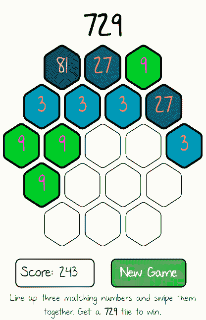
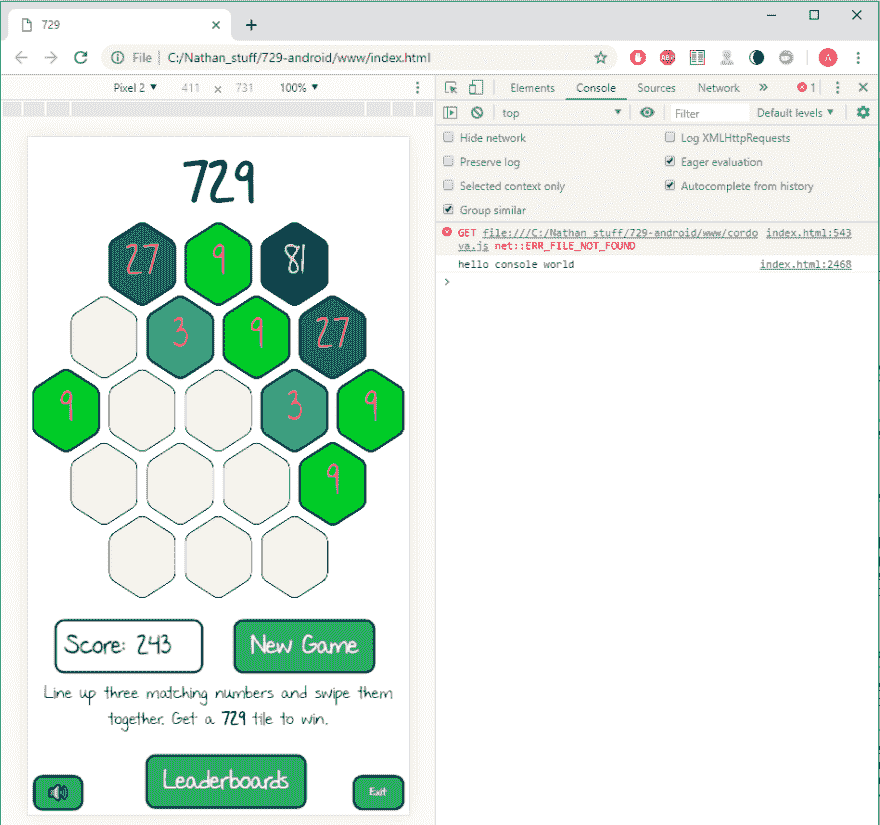
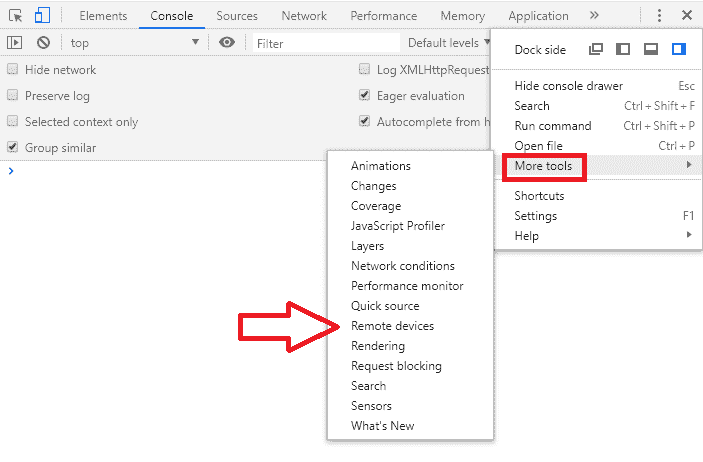
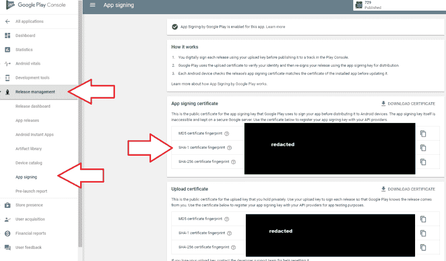

# 我通过 Cordova 将 HTML5 游戏引入 Android 的经历

> 原文：<https://dev.to/aeium/my-experience-bringing-an-html5-game-to-android-via-cordova-dm6>

去年我做了一个类似 2048 风格的 html5 小游戏，有一些关键的不同。你可以在这里玩。[https://aeium.github.io/729/](https://aeium.github.io/729/)这篇文章将讲述我将游戏移植到 android，并在 play store 上发布的经历。就这篇文章的目的而言，我认为更关注游戏的底层技术而不是特定的 UI/设计是有意义的，如果我做了更新，这可能会更好地保存到另一篇文章中。

当我第一次在 facebook 上发布网页版游戏时，我注意到我的一些朋友正在发布分数和截图，所以排行榜似乎是游戏的自然补充。

据我所知，最直接的方法可能是在 AWS 中提供某种 ec2 实例，并在 nodeJS 或 flask 中为页面配置后端。然而，这将是昂贵的，而且对游戏的捐赠似乎不太可能覆盖持续保持服务器在线的成本。

下一个选择是只使用一个数据库，并定义一些 AWS lambda 路由来更新和查询排行榜数据库。这条路线似乎是一个很好的选择，因为当 ec2 实例什么都不做时，我不需要为停机时间付费。这也是一个学习新技术的机会，这似乎对这种任务非常有用。

当一个朋友提醒我考虑苹果应用商店和谷歌 play 商店时，这是我最喜欢的选择。两家商店都有免费的游戏服务，包括我正在准备打造的排行榜功能。很好。此外，应用程序商店有一种独特的属性，他们(可能)会向我支付费用，而不是我向他们支付服务费用。那也很好。

缺点是游戏主要是 javascript，但也有一些基于 html 和 css 的基本 DOM。我知道 react native 是一个用 web 技术构建应用程序的流行框架，但我没有使用 react 来构建游戏，所以这意味着重构，这是我想避免的。

我向我的朋友承诺，我会寻找轻量级的解决方案，将游戏移植到 Android 上。如果我可以避免整体重构，似乎值得一试。

我发现的一个东西是 Phonegap build 服务，它是基于 Cordova 的。这是一项免费服务，可以从网页上编译手机可执行文件，第一个项目是免费的。老实说，我有点怀疑这是否可行。我将他们的默认 config.xml 文件添加到存储库中，并单击按钮接收我的。apk 文件(编译的 android 可执行文件)。

[https://github.com/Aeium/729/blob/master/config.xml](https://github.com/Aeium/729/blob/master/config.xml)

我真的很震惊，它的工作方式是正确的。我刚刚为一个 android 应用程序添加了一个样板 config.xml，构建服务给了我一个二维码 URL 来将 apk 下载到我的手机上。在决定将网页移植到手机上几分钟后，我就编译了一个工作版本，这是我完全没有想到的。

一些小的东西坏了，比如底部的链接，但游戏本身非常简单，最初被设计成可以在手机上正常显示，同样的格式仍然有效。Phonegap/Cordova 软件所做的似乎只是推出一个小的迷你浏览器应用程序，只显示游戏网页的本地版本，这基本上正是我所需要的。

接下来，我只需要做一些调整，连接排行榜游戏服务插件，将编译好的 apk 提交给谷歌，看起来我可能会在一天内完成这个项目。从这一点来看，成品似乎非常接近，这总是一个好的开始。事情很少真的会变成那样，但是即使事情变得更复杂，遇到挫折，清楚地知道自己要去哪里总是好的。

在这一点和在 play store 上实际发布游戏之间，有两个主要且相互关联的问题需要克服，这两个问题与让调试器和 google play 游戏服务排行榜正常工作有关。

第一个障碍:

本机 Webview 调试器

要解决的第一个问题是简单地建立一个工作开发环境，当我的 javascript 代码在手机上执行时，我可以在这个环境中访问控制台输出。通常，这就像在浏览器中打开页面，然后在浏览器中打开控制台一样简单。

chrome 内置了一个手机“模拟器”,在通过 Cordova toolchain 发送之前，你可以使用它来预览网页。对于您需要做的大部分开发来说，这已经足够了，因为 Cordova 在通过工具链后忠实地显示相同的页面方面做得非常好。

但是这对于这个项目来说还不够。我把“模拟器”放在引号中，因为它并不是真的模拟电话，而是模拟电话的网络浏览。这对于你需要做的大部分事情来说是非常有用的，但是通过这种模拟来访问手机的原生功能是不可能的。他们根本不存在。

我想整合谷歌游戏服务插件，该插件使用手机的原生功能。为此，开发需要在真实的(或完全仿真的)手机中进行。

在做一些研究时，我发现谷歌 chrome 有另一个工具也可以帮助解决这个问题。在开发者工具下，如果你选择“更多工具”，然后选择“远程设备”，就可以连接到你的手机，进入开发者工具菜单，查看在手机内运行的网络视图，包括 Cordova 应用程序。相当酷！

但这是我遇到的第一个大障碍。手机显示出来了，它的浏览器显示出来了，但是我的应用程序没有显示。问题是我从 phonegap build service 获得的可执行文件处于生产模式。Cordova 有两种模式，调试和生产。在生产模式下，不允许连接到内部 webview。这其实是一件好事，因为调试器 javascript 控制台非常强大。如果允许它连接到任何生产 Cordova 应用程序，那么将它们拆成碎片是非常容易的。也就是说，对于我的游戏，这意味着编辑排行榜或向排行榜提交虚假分数。

phonegap build 服务确实有一个“调试”选项，但即使选中了该选项，应用程序仍然没有在我的设备上显示为 webview。我仍然不知道为什么，但因为我无法打开构建服务的盖子，弄清楚发生了什么，这是一个阻碍。

所以，我要感谢 Phonegap 构建服务，它让我非常接近我的目标，并激励我，但我发现我无法单独使用该构建服务。

我最终决定安装 Cordova 命令行，并配置一个项目，在那里我将能够编译。apk 文件，从而打开一点，看看我是否能得到可调试的手机可执行文件。apk 文件)那样。

最简单的方法就是安装 android studio。我，可能和你们中的一些人一样，对为这个特定的任务学习一个专门的 IDE 没有兴趣。我想要的只是一个项目文件夹，我可以一个文件一个文件地正确配置，并从那里通过命令行构建我的 apk。根据我的经验，这是理解多种不同类型的软件项目的一种通用而有效的方法。对我来说，编辑配置文件中的参数似乎比观看如何导航 Android Studio 图形特性的视频简单得多。

Cordova 命令行非常适合创建我想要的工作流，但是安装 android studio 仍然是获得 android SDK 最简单的方法。android SDK 有 Cordova 工作所需的工具，它也有一些你需要的工具，比如 adb(在平台工具文件夹中)。

因此，在安装了最新的 jdk、android sdk(通过安装 android studio，您实际上并不需要使用它)和 Cordova 命令行之后，一旦建立了环境，自己构建可执行文件并不困难。

解决方案 1:

使用 Cordova CLI 而不是 phonegap 构建服务。

这解决了我在 Phonegap build 服务中遇到的问题，我无法通过远程设备调试器连接到我的应用程序 webview。我真的不知道有什么不同，但当我在本地编译它们时，调试模式工作。接触到它的感觉真好。

我在手机上开发的工作流程仍然不理想，我会通过 cordova 命令行编译一个 apk，从我的手机上卸载旧版本，这将断开我的远程调试器，然后通过 adb 重新安装，打开它，然后我需要再次连接调试器。对我来说，这看起来像是大量的跑腿工作，如果我需要迭代一个问题，这不是我想要的过程。

然而，另一方面，你需要用这种技术做的大部分开发，你甚至根本不需要把它带到手机上。你需要做的大部分事情只是构建一个手机格式的网页，chrome 伪模拟器在这方面表现很好。这个繁琐的工作流程只需要集成本地的 cordova 插件。

第二个障碍:

游戏服务的签名和授权

建立了这个过程后，我觉得已经准备好集成 google play 游戏服务插件，并将排行榜添加到我的游戏中。这里我遇到了第二个问题。游戏服务插件无法连接到服务。我有我的调试器，所以我知道连接到谷歌游戏服务的函数调用在模块内部失败了，当我试图连接时返回它的默认失败回调。

最终，这变成了一个认证问题。为了配置 google play 游戏服务，您需要在各种 google 开发者控制台中整理一些东西。

首先，您需要在 google play 开发者控制台中创建应用程序。从这里你可以浏览你的游戏服务，获得一个应用 ID 号，并将这个 ID 号输入到 config.sml 文件中的 Cordova 游戏服务插件中。这是我做的。

此外，为了将 apk 上传到 google play，您需要对其进行签名。这意味着生成一个私钥。为此，我使用了 keytool 程序，它是 java SDK 附带的。有了这个私钥，你就能够给你编译的 apk 一个特定的签名，然后 google 将能够在以后的版本中识别这个签名。太好了，这正是我们想要的。

然而，我在这里遇到了一个非常奇怪的障碍，这让我想起了我之前在连接远程调试器时遇到的问题。当您构建可执行文件(。apk 在这种情况下)与科尔多瓦，有两种不同的模式，调试和生产。调试模式将允许连接到远程调试器，而生产模式则不允许。

当您编译 apk 时，可以为它提供一个私钥来对编译后的输出进行签名。通常，您的生产版本将使用您的个人私钥进行签名，而调试版本将使用标准调试密钥进行签名。也可以构建一个未签名的产品版本，然后添加签名，这两种方法都很好。

我想在调试模式下连接到 google play 游戏服务。我的 play game services 插件无法连接的原因是因为谷歌希望看到我唯一的产品签名，而不是调试签名。

我对此做了一些研究，发现可以配置 Cordova 使用不同的密钥来签署调试模式可执行文件。奇怪的是，这对我根本不起作用。不管我如何配置项目，我发现调试可执行文件仍然由调试密钥签名。实际上，我仍然不确定这里发生了什么，也许是一个错误。

因此，结果我又被卡住了。我可以编译一个可以连接到使用正确密钥签名的 google play 服务的生产版本，或者我可以编译一个使用调试密钥的调试版本，并连接到我的调试器。我不能两者兼顾。

解决方案 2:

通过谷歌开发人员控制台编辑证书中的预期签名。

我的突破是我记得在 google API 开发者控制台中可以改变预期的签名。因此，我没有用生产密钥编译调试模式，而是简单地将另一端的预期密钥改为调试密钥。

理解这一点至关重要，这是一个与 google play 开发者控制台完全不同的控制台。你需要编辑预期签名的控制台是 [google 开发者控制台](https://console.developers.google.com/)控制台，而不是你在这一步之前需要使用的 [google play 控制台](https://play.google.com/apps/publish)。

确保您选择了正确的项目，导航到凭据，然后您可以告诉它(粘贴)现有凭据应该具有的 SHA-1 签名，或者添加一个新凭据。

如果您不知道调试签名是什么，可以解压缩您的调试 APK 并使用 keytool 来读取签名。关于这一点，我会让你参考这个。

一旦我这样做了，我就能够连接到 google play 游戏服务，同时手机也连接到远程调试器。万岁！

实际上，就在我准备发布这款游戏之前，我又遇到了一个非常相似的问题。当我做一些最终测试时，我切换了 google play 游戏服务 API 凭证，以期待生产密钥而不是调试密钥。然而，我在这里犯了一个疏忽。您随 apk 发送的签名是您向 play store 提交可执行文件时向 play store 表明身份的方式，但它不是 google 随您的可执行文件一起发送给最终用户的签名。

还有第三个密钥对分发的可执行文件进行签名，google 会删除您的私钥签名。所以有三个签名。首先，有一个调试签名，这是我在调试版本中使用的。第二，有我的签名，向 play store 证明我确实是我提交的内容的作者。第三，有谷歌的签名，证明它的应用程序确实是由谷歌发布的。这是最终用户应用程序将要签署的签名，也是 API 希望最终用户在发布后拥有的签名。

我基本上又一次被这个问题完全阻塞了，我只是在控制台中点击，直到我在发布管理下找到“应用程序签名”标签。在此选项卡中，它详细介绍了两个证书，应用程序签名证书和上传证书。我一看到这一点，就知道将 api 转换为“最终用户”应用程序签名，而不是我个人的“生产”上传签名，将会解决这个问题。

为了明确起见，我将包括一个图像，详细说明在哪里可以找到这把钥匙。

这个签名必须与您在 [google developer console](https://console.developers.google.com/) 中定义的凭证之一相匹配，以便您选择要连接的 API(在我的例子中是游戏服务)，这与需要 debug 签名来连接 debug 版本非常相似。

在你发布游戏后，移除调试键授权也是一个好主意。

事后看来，可以说出站和入站应用有一个单独的证书是有道理的，但这确实让我感到惊讶。

这些是我在发布这个应用时遇到的主要障碍，以及我是如何克服它们的。我还需要解决一些小问题，但是这篇文章足够长了，足以涵盖我遇到的大问题。

总的来说，我和科尔多瓦相处得很好。很难将这与完全原生的应用程序开发进行比较和对比，因为我没有这样做的经验，但我真的很感激有一个可行的、相当轻量级的工具可以将网页转换为原生的手机应用程序。

如果你想在排行榜上测试你的勇气，你可以在这里或通过下面的二维码找到 Android 版本[。感谢阅读。](https://play.google.com/store/apps/details?id=com.aeium.puzzle_729)

