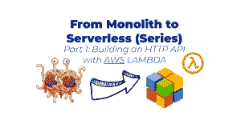
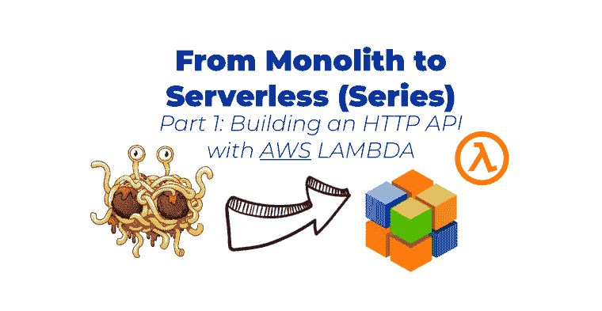
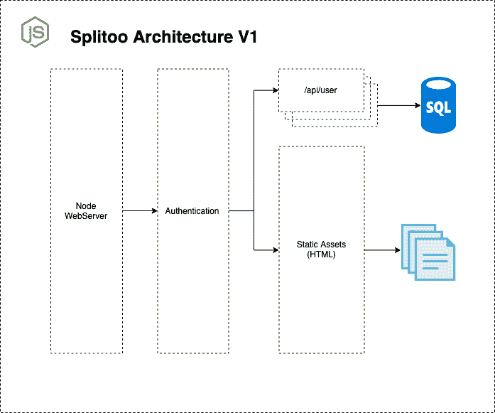
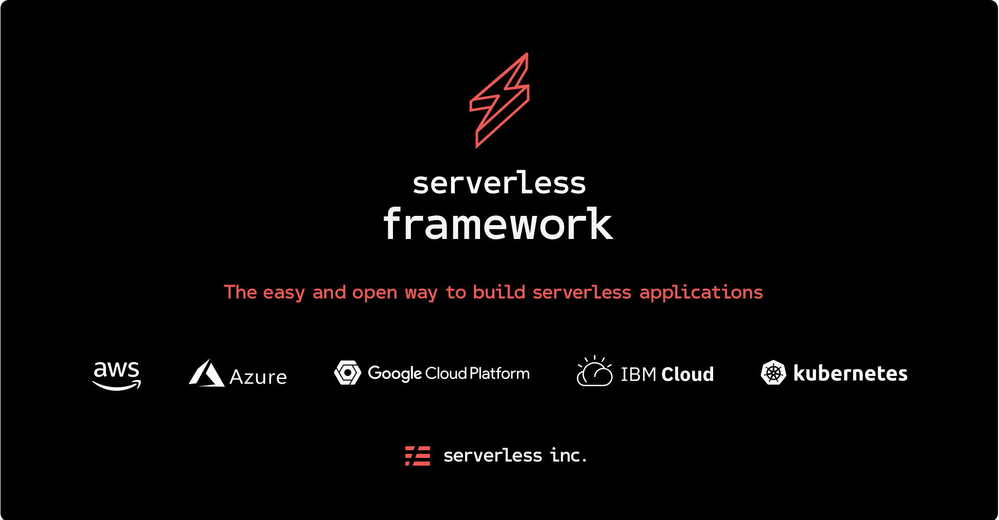

# 在无服务器框架上设置 REST API

> 原文：<https://dev.to/loujaybee/setting-up-a-rest-api-on-serverless-framework-4cab>

*第一部分:整体到无服务器系列*

[](https://res.cloudinary.com/practicaldev/image/fetch/s--PNv2cucp--/c_limit%2Cf_auto%2Cfl_progressive%2Cq_auto%2Cw_880/https://i1.wp.com/www.thedevcoach.co.uk/wp-content/uploads/2019/04/Screenshot-2019-04-24-at-17.17.14.png%3Ffit%3D300%252C155%26ssl%3D1)

大家好，欢迎来到这个深入的多部分系列的第一部分，这个系列将把一个单一的应用程序分解成一个基于 Lambda 的云架构！

能不能说#流行语！？

开个玩笑——今天我们将少用术语，多讲细节。我还没有在这个网站上做过真正的系列，所以我很兴奋！

到本文结束时，您将知道如何在 [AWS](https://aws.amazon.com) 上设置和运行[无服务器框架](https://serverless.com/)来创建一个基于 HTTP Lambda 的 API。

[](https://res.cloudinary.com/practicaldev/image/fetch/s--s5VtIYHA--/c_limit%2Cf_auto%2Cfl_progressive%2Cq_auto%2Cw_880/https://i1.wp.com/www.thedevcoach.co.uk/wp-content/uploads/2019/04/Screenshot-2019-04-24-at-17.17.14.png%3Ffit%3D760%252C393%26ssl%3D1)

在整个系列中，我们将深入介绍一个真实的生产迁移的细节，我正在将一个 NodeJS 应用程序从一个整体部署(在 [Heroku](https://www.heroku.com/) 上)迁移到 [AWS Lambda](https://aws.amazon.com/lambda/) 无服务器上。

这种分解大型应用程序的过程是许多公司最近已经做的或者正在考虑做的事情(并且有很好的理由)。这种类型的迁移也是现代应用程序生命周期中很自然的一步。也就是说，从一个大石块开始，然后把它分解。

## 为什么这个系列不同

如果现在你在想“Lou，等等……难道没有其他的文章已经在讨论这个问题了吗?”？是什么让你的文章与众不同？”那么你有一个很好的问题，让我花一点时间来回答它。

确实有一些非常好的文章。但是……事情是这样的:很多文章向你展示了两件事情中的一件:

**A.** 一项技术的最基本要素，它能让你快速前进，但却忽略了细节。例如，“*在 5 分钟内启动并运行无服务器框架*”，或者“*您的第一个 AWS Lambda！”*。

或者，文章看起来像:

**B.** 深入的主题领域教程，没有更广泛的背景和理由，例如“*如何为 AWS Lambda* 设置最佳内存分配”。

现在，我不是在给这些文章抹黑。我也写过很多像他们一样的作品。

但是，这次我想做的有点不同。

因为，如果你像我一样:你需要更大的画面，你需要知道如何填补空白。这听起来像你吗？

在这个系列中，我不会创建一些虚构的待办事项应用程序，而是讲述我正在进行的一个名为 [Splitoo](http://www.splitoo.com) 的 web 应用程序的真实迁移的真实步骤。

但是，当然我会把它分解成细节，让它尽可能容易理解。

我所希望的是，在本系列结束时，我们已经有了一个关于从单一应用程序到细粒度、微服务类型的应用程序架构的很好的案例研究。到最后，我们应该有我开始时希望有的系列。

因此，如果你对无服务器之类的云原生技术感兴趣，并且你是一个全面的思考者，那么你来对地方了。

## 我们今天要讲什么

将一个庞然大物分解成更小的细粒度服务可不是一件容易的事。因此，让我们来解决我们今天将如何处理它。

将有两个部分。在第一部分，我们将涵盖背景知识，以设置场景。我们将讨论我们当前的状态架构及其局限性。在第二部分中，我们将继续创建一个带有无服务器框架的 AWS Lambda 概念验证。我们将使用概念验证来评估我们是要继续使用无服务器方法，还是转向其他方法。

对于介绍性文章来说，这应该足够了。随着本系列的继续，我们将深入到诸如架构决策和权衡、基础设施即代码实现、[监控策略](https://dev.to/loujaybee/serverless-error-monitoring-strategies-41c2-temp-slug-1962472)等概念的细节中。

无论如何，这是足够的前序，让我们开始吧！

## 第一部分:背景&背景

在这一节中，我们将为系列的其余部分设置场景，所以我们需要相当多的细节。让我们看一下当前应用程序的一些细节:

*   当前的架构限制是什么
*   了解迁移的原因
*   了解我们将如何着手打破它

### 什么是 Splitoo？

自然，从 Splitoo 的业务领域开始是有意义的。这样我们就能理解为什么我会把 AWS Lambda 作为应用程序堆栈中的主要工具。

首先什么是 Splitoo？

Splitoo 是一个财务应用程序，用于与您认识的人分担费用。

用户创建*计划*，详细列出价格和付款时间表。然后，用户与朋友、同事或邻居分享链接，分摊购物费用。Splitoo 用来分摊成本(甚至盈利！)体育团队成员资格、家庭电影流媒体包的费用等等。

[](https://res.cloudinary.com/practicaldev/image/fetch/s--epVryeXI--/c_limit%2Cf_auto%2Cfl_progressive%2Cq_auto%2Cw_880/https://i1.wp.com/www.thedevcoach.co.uk/wp-content/uploads/2018/09/Screen-Shot-2018-09-29-at-15.35.58.png%3Fresize%3D760%252C458%26ssl%3D1) 尽管出于本系列的目的，您不需要了解太多关于 Splitoo 的知识。但是，我们确实需要了解一些关于技术堆栈的细节。

所以现在让我们把它盖住！

Splitoo 是一个基于 web 的单页面应用程序，由一个 [React](https://reactjs.org/) 前端构建而成。Splitoo 有一个 [NodeJS 后端](https://nodejs.org/en/)，用于 Express 提供的(* _ cough * _ something)REST-ful HTTP Web API，并使用 [Postgres](https://www.postgresql.org/) 数据库进行持久化。

Splitoo 利用 [Auth0](https://auth0.com/) 、基于云的登录认证(社交和普通用户名/密码)并使用相当多的[条纹](https://stripe.com)来完成支付的繁重工作。

整个应用程序是由 Heroku 构建和部署的，作为一个大的构建和部署步骤(所有东西都是一次性交付的)。最后，在升级到生产之前，Splitoo 使用单个暂存环境运行。

到目前为止这些都有意义吗？希望如此！

了解了技术栈之后，让我们更仔细地看看 Splitoo 架构。

### Splitoo 架构

[](https://res.cloudinary.com/practicaldev/image/fetch/s--W0Ze3JW_--/c_limit%2Cf_auto%2Cfl_progressive%2Cq_auto%2Cw_880/https://i1.wp.com/www.thedevcoach.co.uk/wp-content/uploads/2019/04/Splitoo-Backend-V1.png%3Fresize%3D697%252C581%26ssl%3D1)

从图中可以看出，前端和后端都是由同一个流程提供服务的。几乎是老派的三层架构。

三层架构是内置的应用程序(你猜对了！)三层。通常这是表示层(没有业务逻辑)、应用层(有很多业务逻辑)和存储应用程序当前状态的持久层。

三层架构非常适合启动简单的项目，因为它让事情变得美好而简单。这是建筑界的大众高尔夫。安全。可靠。把工作做完。但是，如果你突然发现自己被新生的孩子淹没了(或者被现金淹没了)，你可能需要扩展到一辆家庭货车，或者一辆轻快的运动自行车，这取决于你在做什么！

虽然我称赞三层架构是一个很好的、普通的启动和运行型架构，但它也有一些缺点。

让我们现在解决这些问题。

这种架构的主要困难是:

*   **性能优化很难**。例如:对基本资产(文件、图像、css)的请求与后端的 API 共享资源。因此，如果 Splitoo 主页收到来自谷歌的流量激增，访问其计划详情的用户将受到影响。
*   **没那么容易监控**。基础设施位于共享主机上，因此很难获得细粒度的指标。如果我们有一个行为不当的 API(比如说使用了太多的内存)，我们就冒着关闭整个应用程序的风险。
*   它会变得很乱。像这样的整体式应用程序很快会变成一个臭名昭著的泥巴球架构，其中的问题完全混乱，维护成本失控。
*   它的部署过程风险更大。根据定义，整体式应用程序必须一起部署。这意味着你冒着以更新一小部分为代价而毁掉整个应用的风险。此外，作为一个应用程序(和业务规模),将应用程序分解是有意义的，这样[不同的团队可以独立交付](https://dev.to/loujaybee/youre-selling-it-wrong--how-to-explain-devops-so-your-business-will-care-31p8-temp-slug-9603793)。

所以——如果我们知道我们目前的整体方法存在一些问题，这就提出了一个问题:我们需要做些什么来补救？

首先，我们需要承认一个整体可能不太适合我们，我们可能想要尝试不同的架构模式。如果我们想做到这一点，我们需要首先做一件叫做*寻找应用接缝的事情。*

那是什么意思？很高兴你问了，因为这是下一个！

### 分割应用程序:通过找到它的接缝

分解一个完整的应用程序需要一个过程，山姆·纽曼称之为 T2 寻找应用程序的缝隙。

但是找到一个应用的 seam 是什么意思呢？让我解释一下…

发现和应用的 seam 是一个应用于基于微服务的架构的概念。这个过程实质上是找到当前应用程序中可以轻松移动、在其他地方实现并与整体重新集成的部分。希望新的服务有一个更谨慎的 API 和设计模式！

那么，假设我们已经知道了 Splitoo 架构，那么应用程序的接缝在哪里呢？

嗯，其实也不少。

但是……为了这第一篇文章的目的，它是针对 AWS Lambda 的，我们将会看到一些后端 API。

许多现有的后端执行将一些数据代理到 Stripe API 的任务。由于这些 API 的性质，研究 Lambda 作为执行这种类型计算的工具是非常有意义的。为什么？因为 Lambda 是按需的、短命的和无状态的，就像很多 Splitoo API 一样。

现在值得注意的是:并不全是玫瑰！AWS Lambda 的好处也是有代价的，比如更大的复杂性、额外部署过程中的开销等。因此，考虑到这一点，我们真的应该进一步调查这是否是我们的正确选择。

## 第 2 部分:创建我们的第一个无服务器 Lambda

现在我们已经确定了我们想要使用 AWS Lambda 以及为什么要使用它，让我们来看一下设置的步骤。

本节的目标是创建一个概念验证 Lambda，它将允许我们评估我们是否将补救整体方法的上述困难。

### 介绍无服务器框架

[](https://camo.githubusercontent.com/16068dbb37e2d7fdae1127de35a336c5f254a5e7/68747470733a2f2f73332e616d617a6f6e6177732e636f6d2f6173736574732e6769746875622e7365727665726c6573732f726561646d652d7365727665726c6573732d6672616d65776f726b2e6a7067)

为了快速掌握 AWS lambda，我们将利用一个名为无服务器框架的工具。

无服务器框架是一个非常简洁的小 API / SDK，它可以让你立刻在无服务器上运行。该框架的真正卖点是它如何解决问题，比如通过创建 AWS Lambda 设置所需的所有资源来编写我们的基础设施代码。

如果您以前曾经像这样设置过基础设施，您会知道其中有相当多的细微差别，而且可能会非常繁琐。但是，在我们的情况下，我们并不追求完美(只是现在！)所以离地速度对我们很管用！

### 打造我们的首个无服务器 Lambda

所以，让我们继续创建我们的第一个 Lambda，你很快就会看到，它非常简单。

如果你想继续学习本教程的其余部分，我建议设置一个 [git repo](https://help.github.com/en/articles/create-a-repo) 来存储我们的例子。你还需要一些 [AWS 证书](https://aws.amazon.com/premiumsupport/knowledge-center/create-and-activate-aws-account/)在手。

首先，你需要 SDK，你可以这样安装:

```
npm install serverless -g 
```

现在，安装了 SDK 之后，我们就可以基于现成的无服务器框架模板制作 Lambda 了。如果您之前创建了一个 repo，请在您的根目录下运行以下命令。如果没有，也不用担心，现在只需在您喜欢的任何目录中运行即可。

```
serverless create --template aws-nodejs 
```

厉害！

现在你应该在当前目录中有一个基本的 Lambda 设置。

现在，仅仅把我们的 Lambda 代码放在本地是没有用的，我们想做的是把它放在我们的 AWS 账户上，这样它可以在世界上的任何地方被调用。要部署 Lambda，只需运行:

```
serverless deploy 
```

现在，您的 AWS 基础设施和 Lambda 函数将在云中创建。如果你想测试，你可以像这样执行你的新 Lambda:

```
serverless invoke -f hello -l 
```

很简单？在这一点上，我印象非常深刻。

无服务器框架在这里为我们做了很多繁重的工作，比如创建一个 [CloudFormation Stack](https://aws.amazon.com/cloudformation/) (这是我们的 AWS 资源的分组)。

启动并运行后，我建议你暂停一会儿，在你的 AWS 控制台上看看我们刚刚制作的资源。您应该能够看到以下资源:

*   日志组
*   一个 S3 桶
*   Lambda 版本

### 将 API 端点附加到我们的 Lambda

到目前为止，我们已经得到了很酷的。

但是，有一个问题。

我们实际上并没有向外界公开我们的 Lambda。它目前只在 AWS 内部私下执行。

我们现在要做的是给我们的 Lambda 附加一个 HTTP 路由，这样我们就可以调用一个 URL 并触发我们的 Lambda。这是使用 AWS 服务 API 网关完成的。

幸运的是，有了无服务器框架，这非常容易。我们所要做的就是将以下内容添加到我们的 serverless.yml 文件中。它应该已经在那里了，所以你只需要取消注释代码。

```
events: - http:  path: email-template    method: get 
```

完成后，重新运行部署命令。现在，我们应该有一个 Lambda，在 AWS 中运行，连接到一个公共端点(控制台输出中显示了 URL)。真是太贴心了！

### 创造两种环境

我们已经走了这么远，还有最后一件事我想告诉你。

默认情况下，Serverless 将您创建的 Lambda 设置为开发环境。但是我们不希望总是直接部署到生产中，有时我们可能希望在安全的环境中测试类似的功能。为此，我们需要一个测试环境。

要创建一个生产环境，我们所要做的就是向我们的无服务器框架传递一个不同的标志，它将为我们设置好一切。因此，要拥有两个环境，我们需要做的就是获取现有的功能并部署两次(参数略有不同)。所以继续运行下面的代码:

```
serverless deploy --stage=production 
```

现在将部署另一个 Lamdba(与另一个一起)。现在，您已经启动并运行了测试环境和生产环境！

在这一点上，我印象非常深刻。设置概念验证几乎不需要任何时间。我们接下来要做的是在我们新创建的概念验证的基础上添加一些其他要素。但是，这在一天之内要讲的内容有点太多了，所以我们将在这里结束，很快回来讲下一期。

### 功能执行完毕！

系列的开始到此结束！第一次我不想做太多，因为我想给你一点时间来试验基本的无服务器框架设置。在未来，正如承诺的那样，我们将开始考虑如何使我们的设置更先进。

因此，在以后的文章中，我们将讨论:

*   监控工具
*   应用架构
*   安全措施
*   构建流程
*   …以及更多！

希望您现在对如何开始使用无服务器框架有了更多的了解，因为我们迈出了打破单一应用程序并转向 AWS Lambda 的第一步。

在我离开之前:如果你想知道我今天没有提到的任何事情，请在下面留言。别忘了你也可以[注册时事通讯](https://thedevcoach.co.uk/newsletter)来获取未来的更新和系列的其他内容。下期帖子再见！

* * *

在无服务器框架上设置 REST API 的帖子[最早出现在](https://www.thedevcoach.co.uk/restful-api-serverless-framework/)[的开发者蔻驰](https://www.thedevcoach.co.uk)上。

像您一样加入云原生软件工程师社区。

使用[thedevcoach.co.uk](https://thedevcoach.co.uk)了解最新的云技术，并学习核心云工程主题的基本技能，如:Docker。无服务器和 Linux，等等。[加入我们](https://thedevcoach.co.uk/newsletter)并取得成功！