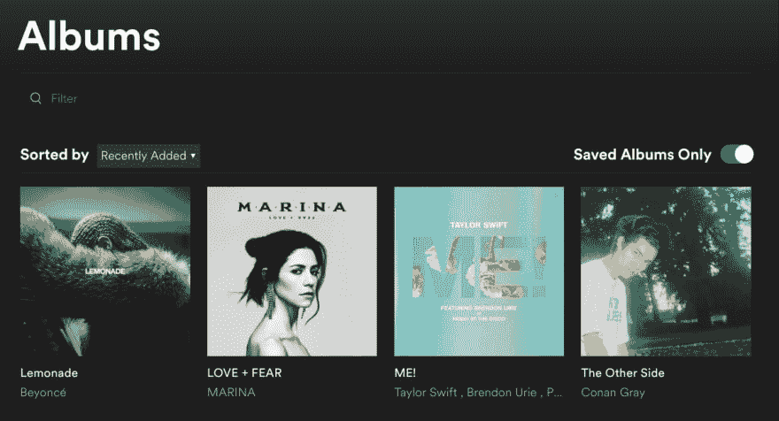
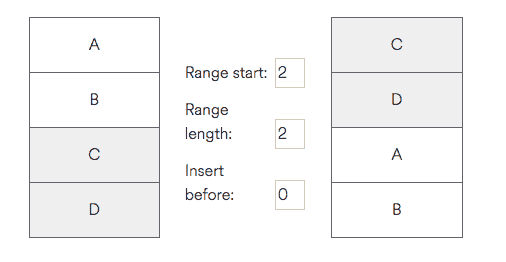

# 使用 spotify-web-sdk 处理对 Spotify Web API 的请求

> 原文：<https://dev.to/calluswhatyouwant/using-spotify-web-sdk-to-handle-requests-to-the-spotify-web-api-2oj6>

这是 **Meet spotify-web-sdk 的第一篇帖子！**系列，其中我们([称我们为你想要的](https://dev.to/calluswhatyouwant/call-us-what-you-want-is-officially-on-board-1km))将评论 Spotify Web API 提供的可能性和我们的一些代码设计选择。在第一部分中，我们将了解 spotify-web-sdk 如何帮助构建[应用程序](https://github.com/calluswhatyouwant/spotify-playlist-editor)，该应用程序使用 Spotify Web API 来检索信息和管理用户数据。

## [calluswhatyouwant](https://github.com/calluswhatyouwant)/[Spotify-we b-SDK](https://github.com/calluswhatyouwant/spotify-web-sdk)

### Spotify Web API 的 JS SDK。

<article class="markdown-body entry-content container-lg" itemprop="text">

# Spotify Web SDK

Spotify Web API 的 JavaScript SDK 请注意，这个项目仍然是测试版。

## 目录

*   [特性](https://raw.githubusercontent.com/calluswhatyouwant/spotify-web-sdk/master/#features)
*   [安装](https://raw.githubusercontent.com/calluswhatyouwant/spotify-web-sdk/master/#installation)
*   [用途](https://raw.githubusercontent.com/calluswhatyouwant/spotify-web-sdk/master/#usage)
*   [社区](https://raw.githubusercontent.com/calluswhatyouwant/spotify-web-sdk/master/#community)
    *   [建议新功能或报告错误](https://raw.githubusercontent.com/calluswhatyouwant/spotify-web-sdk/master/#suggest-a-new-feature-or-report-a-bug)
    *   [自己动手](https://raw.githubusercontent.com/calluswhatyouwant/spotify-web-sdk/master/#do-it-yourself)
    *   [维护人员](https://raw.githubusercontent.com/calluswhatyouwant/spotify-web-sdk/master/#maintainers)
    *   [名人堂](https://raw.githubusercontent.com/calluswhatyouwant/spotify-web-sdk/master/#hall-of-fame)
*   [执照](https://raw.githubusercontent.com/calluswhatyouwant/spotify-web-sdk/master/#license)

## 特征

### “我为什么要用这个？”

我们希望为您处理困难的工作，即使是提出简单的请求，例如获取赛道信息，您也需要进行一系列设置。在我们的帮助下，您可以在这里做同样的事情:

```
import * as spotify from 'spotify-web-sdk';
spotify.init({ token: 'YOUR SPOTIFY TOKEN HERE!' }); // You should only need to run this once.
spotify.getTrack('3LOpHuEpjkL4T1Zcjhko8w'); // Or any other track id.
```

Enter fullscreen mode Exit fullscreen mode

对，就这么简单！

### “我还是觉得一点都不辛苦。

…</article>

[View on GitHub](https://github.com/calluswhatyouwant/spotify-web-sdk)

# 现实问题(*改天，另一场戏*)

我的 Spotify 图书馆的专辑部分非常杂乱——问题是，如果我保存一首新单曲，它最终也会被保存为专辑。保持一种简单的方式来访问每张专辑对我来说很重要，因为大多数时候我宁愿从头到尾听一整张 EP/LP，而不是点击播放列表中的随机播放按钮。

<figure>

[](https://res.cloudinary.com/practicaldev/image/fetch/s--Um0jvxCa--/c_limit%2Cf_auto%2Cfl_progressive%2Cq_auto%2Cw_880/https://thepracticaldev.s3.amazonaws.com/i/pqktrt0hmqdhrxudc6ta.png)

<figcaption>**ME!** and **The Other Side** are both singles but also show up in my Spotify library as albums.</figcaption>

</figure>

我想到了一个看似简单的解决方案:我创建了一个包含我听过的每张专辑的第一首曲目的播放列表。拥有这个播放列表也是记录我第一次听新发行的音乐的一个很好的方法(至少当我记得马上添加它们的时候)。问题已解决...至少部分是。好吧，为了让事情更有条理，我还是想按照发行日期对我的专辑参考进行分类。问题是 Spotify 不支持这种排序方法，尽管用户在五年多的时间里一直在[请求这种方法。我想我们不能拥有一切。](https://community.spotify.com/t5/Live-Ideas/Your-Music-Sort-Music-in-quot-Your-Music-quot-by-Year/idi-p/744893)

我搜索了为我管理这种分类的工具，有一个很棒的网络应用叫做 [Sort Your Music](http://sortyourmusic.playlistmachinery.com/) 。尽管使用起来非常简单高效，但他们的排序方法会覆盖曲目的添加日期。我知道我有点难搞([嗯](https://genius.com/Taylor-swift-me-lyrics))，但是知道这是可能的，我决定实现我自己的工具。没有什么比自己动手做更好的了，对吧？

# 我有一点点烧伤，但没问题

使用 Spotify Web API 管理播放列表可以使用两个端点来完成:[一个端点允许替换所有曲目](https://developer.spotify.com/documentation/web-api/reference/playlists/replace-playlists-tracks)和[另一个端点可用于重新排序一首曲目或一组曲目](https://developer.spotify.com/documentation/web-api/reference/playlists/reorder-playlists-tracks/)。与第一个不同，第二个不涉及指示曲目添加时间的时间戳和添加者的标识符(对于协作播放列表)。

<figure>

[](https://res.cloudinary.com/practicaldev/image/fetch/s--113_b26J--/c_limit%2Cf_auto%2Cfl_progressive%2Cq_auto%2Cw_880/https://thepracticaldev.s3.amazonaws.com/i/lfcnbuvlnmvemungeuyu.png)

<figcaption>Visualization of how the "reorder a playlist's tracks" endpoint works. Source: [Spotify for Developers](https://developer.spotify.com/documentation/web-api/reference/playlists/reorder-playlists-tracks/)</figcaption>

</figure>

如上所述，端点的工作方式是对播放列表进行排序需要大量连续的请求(基本上，播放列表中的每个曲目一个请求)，这也意味着这比简单地覆盖所有内容需要更长的时间。牺牲是必须要做的，但结果正是我们所期望的:这是 Spotify 播放列表编辑器。

<figure>

[](https://res.cloudinary.com/practicaldev/image/fetch/s--Ih3NqGfw--/c_limit%2Cf_auto%2Cfl_progressive%2Cq_auto%2Cw_880/https://thepracticaldev.s3.amazonaws.com/i/7ookuks66s0203i3s9n3.png)

<figcaption>Once logged in, something like that should appear to you.</figcaption>

</figure>

# 详述过程(但不要太多)

我想尽可能快地原型化一个 React 应用程序，所以我使用了 [create-react-app](https://facebook.github.io/create-react-app/) ，节省了我大量的配置时间。总的来说，我建议每个人花时间去理解如何从头开始创建一个 React 应用程序，但这肯定会派上用场！为了简单起见， **Spotify 播放列表编辑器**是无服务器的，但仍然允许任何人通过实现[隐式授权流](https://developer.spotify.com/documentation/general/guides/authorization-guide/)来访问他们的 Spotify 数据。

我包含了一些包和工具包来简化编码过程(例如， [Bootstrap](https://getbootstrap.com) 这样我就可以少担心样式，而[beautiful](https://prettier.io/)有助于保持代码整洁)。我认为值得一提的是，我正在使用[流](https://flow.org)进行静态类型检查。我喜欢 JavaScript 是一种动态类型语言，但是由于 SDK 处理许多模型，这些模型都有许多属性，所以 Flow 成为了一个很好的盟友。

<figure>

[](https://res.cloudinary.com/practicaldev/image/fetch/s--X1y3_tBK--/c_limit%2Cf_auto%2Cfl_progressive%2Cq_auto%2Cw_880/https://thepracticaldev.s3.amazonaws.com/i/jjhcgbimvjazm6wcvcb8.png)

<figcaption>Also, React + Flow + [IntelliSense](https://code.visualstudio.com/docs/editor/intellisense) is a dream combo.</figcaption>

</figure>

## 认识一下 Spotify Web API 自称的最好的朋友，spotify-web-sdk！

下面是取自*用户页面*组件的一段代码。你可以看到一些对 SDK 的直接导入:

```
/* @flow */

import React, { Component } from 'react';
import {
    /* Functions that wrap Spotify endpoints */
    init,
    getCurrentUserPlaylists,
    getCurrentUserProfile,
    /* Models */
    Page,
    PlaylistSimplified,
    PrivateUser,
} from 'spotify-web-sdk';

type Props = {
    history: any,
};

type State = {
    page: Page<PlaylistSimplified>,
    playlists: PlaylistSimplified[],
    user: PrivateUser,
};

class UserPage extends Component<Props, State> {
    // ...
} 
```

Enter fullscreen mode Exit fullscreen mode

一旦用户连接到 Spotify，*用户页面*就是应用程序的主页面。它的主要目的是显示当前用户的播放列表列表，并有一个按钮允许他们选择感兴趣的播放列表。最初，检索五个播放列表:

```
componentDidMount = async () => {
    const page = await getCurrentUserPlaylists({ limit: 5 });
    this.setState({
        page,
        playlists: page.items,
    });
} 
```

Enter fullscreen mode Exit fullscreen mode

通过将页面对象保持在状态，请求更多播放列表变得非常简单。这是因为 spotify-web-sdk 的 Page 对象上已经实现了以下逻辑:

```
class Page<T> {
    // ...
    async getNextPage() {
        if (!this.hasNext()) throw new Error('There are no more pages');
        const params = {
            ...this.queryParams,
            limit: this.limit,
            offset: this.offset + this.limit,
        };
        const response = await this.getAxiosPageInstance().get('/', { params });
            return new Page<T>(response.data, this.t, this.wrapper);
    }
} 
```

Enter fullscreen mode Exit fullscreen mode

因此，在播放列表编辑器中处理所有这些逻辑可以归结为一个函数调用，不再需要跟踪诸如限制和偏移之类的值:

```
loadMorePlaylists = async () => {
    const { page } = this.state;
    const nextPage = await page.getNextPage(); // Sit back and let spotify-web-sdk handle the hard work!
    this.setState(prevState => {
        const playlists = prevState.playlists.concat(nextPage.items);
        return { playlists, page: nextPage };
    });
}; 
```

Enter fullscreen mode Exit fullscreen mode

该应用程序的全部目的是让用户对他们的播放列表进行排序，所以让我们开始吧。从*播放列表页*，用户可以选择一种分类方法(包括发布日期！).最初，定义了磁道的预期顺序，然后执行顺序操作对它们进行重新排序。这或多或少是它在代码中的工作方式:

```
import { reorderPlaylistTracks } from 'spotify-web-sdk';

export const sortPlaylistTracksByAttribute = async (
    playlistId: string,
    attribute: string
) => {
    let insertionOrder = await getInsertionOrder(playlistId, attribute);
    return insertionOrder.reduce(async (previousPromise, current) => {
        await previousPromise;
        return moveTrackToTop(playlistId, current);
    }, Promise.resolve());
};

const getInsertionOrder = async (
    playlistId: string,
    attribute: string
) => { /* Determines the insertion order based on the attribute. */ };

const moveTrackToTop = (id: string, oldIndex: number) =>
    reorderPlaylistTracks(id, oldIndex, { rangeLength: 1, insertBefore: 0 }); 
```

Enter fullscreen mode Exit fullscreen mode

顺便说一句，如果你不熟悉这种使用 *Array.prototype.reduce()* 顺序解析承诺的方法，有一篇很棒的文章介绍了它是如何工作的，最重要的是，**为什么**它会工作。来看看[的 CSS 招数](https://css-tricks.com/why-using-reduce-to-sequentially-resolve-promises-works/)！

如果您想了解更多的细节，我认为提交日志可以作为一个很好的指南，告诉您添加了什么内容以及何时添加的，因为我会尽量给出描述性的、简洁的提交消息。 **Spotify 播放列表编辑器**也在直播右侧[这里](https://calluswhatyouwant.github.io/spotify-playlist-editor/)如果你想玩一会儿。如果你遇到任何意想不到的事情，请在项目的 GitHub 库中创建一个问题。公关也是受欢迎的，我们确实有一些问题已经开放，所以随你便！

## 呼叫 whatyouwant / [ spotify 播放列表编辑器](https://github.com/calluswhatyouwant/spotify-playlist-editor)

### 您可以随意对 Spotify 播放列表进行排序。

<article class="markdown-body entry-content container-lg" itemprop="text">

# Spotify 播放列表编辑器

随心所欲地对 Spotify 播放列表进行排序！ <g-emoji class="g-emoji" alias="hammer_and_wrench" fallback-src="https://github.githubassets.cimg/icons/emoji/unicode/1f6e0.png">🛠</g-emoji>

[](https://raw.githubusercontent.com/calluswhatyouwant/spotify-playlist-editor/master/./main-page.png)

## 目录

*   [特性](https://raw.githubusercontent.com/calluswhatyouwant/spotify-playlist-editor/master/#features)
*   [社区](https://raw.githubusercontent.com/calluswhatyouwant/spotify-playlist-editor/master/#community)
    *   [安装和使用](https://raw.githubusercontent.com/calluswhatyouwant/spotify-playlist-editor/master/#installation-and-usage)
    *   [部署](https://raw.githubusercontent.com/calluswhatyouwant/spotify-playlist-editor/master/#deployment)
    *   [建议新功能或报告错误](https://raw.githubusercontent.com/calluswhatyouwant/spotify-playlist-editor/master/#suggest-a-new-feature-or-report-a-bug)
    *   [维护人员](https://raw.githubusercontent.com/calluswhatyouwant/spotify-playlist-editor/master/#maintainers)

## 特征

*   从您最近的 Spotify 曲目或您有史以来的热门曲目中创建新的播放列表；
*   播放列表排序依据
    *   播放列表轨道属性(添加日期)；
    *   曲目属性(名称、长度、人气)；
    *   专辑属性(名称、发行日期)；
    *   艺术家属性(姓名)。

### 当前的限制

*   强烈建议创建您想要编辑的播放列表的副本，或者使用播放列表创建选项之一。(随便玩玩，但是要安全的做！);
*   您只能对不超过 100 首曲目的播放列表进行排序；
*   排序可能需要一段时间(包含 100 首曲目的播放列表可能需要 30 秒到 1 分钟)。在排序完成之前，不要重新加载或关闭播放列表页面。

## 社区

### 安装和使用

只需运行`yarn install`来安装项目的依赖项…

</article>

[View on GitHub](https://github.com/calluswhatyouwant/spotify-playlist-editor)

* * *

这是第一部分 **Meet spotify-web-sdk！**系列。你怎么想呢?请在评论中告诉我们！如果你有兴趣知道我们在做什么，你可以[在 Twitter](https://twitter.com/CallUsWhat) 上找到我们。

非常感谢您的阅读，下次再见！😉