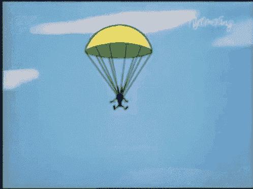
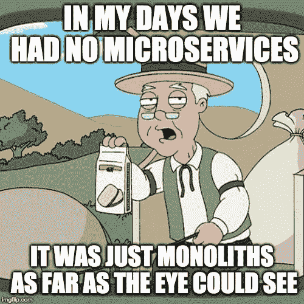
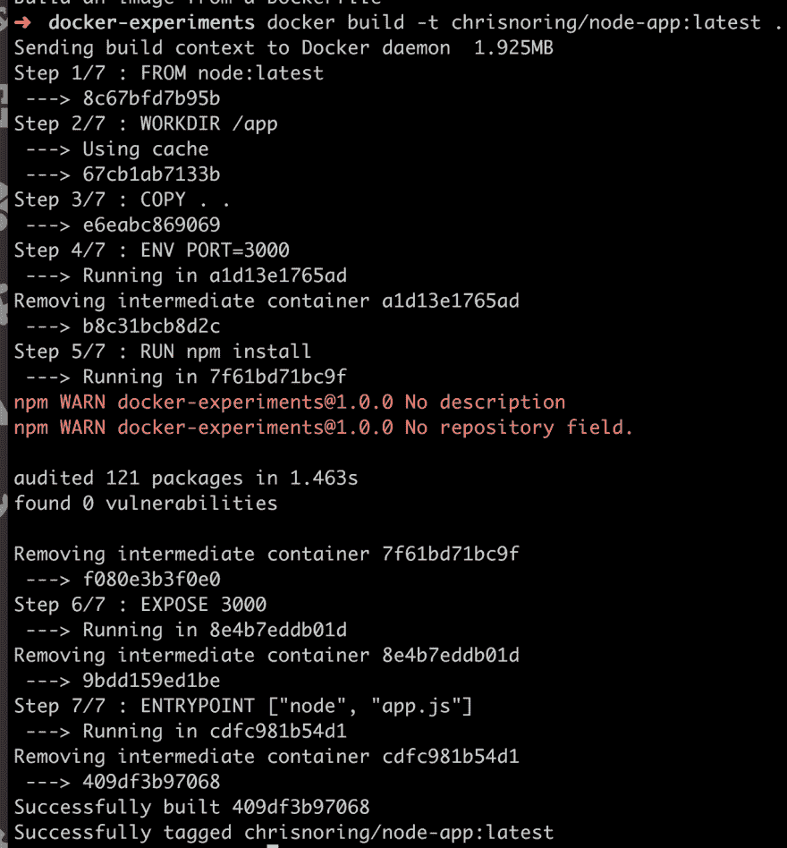

# 最重要的 Docker 概念及其命令的速成课程

> 原文：<https://dev.to/azure/a-crash-course-to-the-most-important-docker-concepts-and-their-commands-4eio>

在 [Twitter](https://twitter.com/chris_noring) 上关注我，很乐意接受您对主题或改进的建议/Chris

> 我为你写了这篇文章，你刚刚空降到一个周一开始的项目中，现在是周五下午，你有 2 个小时的空闲时间，而你就像是*废物*。我感觉你，我去过无数次了。不要担心，当你读完这篇文章的时候，你会对代码和 Docker 有更多的了解，尤其是他们在会议上谈论的内容。

[](https://res.cloudinary.com/practicaldev/image/fetch/s--zyXd-_BW--/c_limit%2Cf_auto%2Cfl_progressive%2Cq_66%2Cw_880/https://thepracticaldev.s3.amazonaws.com/i/if0ywc9htfpn5mvy6mxw.gif)

TLDR；这篇文章旨在为 Docker 上的这个 [5 部分系列做准备。这个想法是为了传达错误的心态是如何阻止你正确地学习 Docker 的。我通过讲述我如何学习 Docker 的故事来传达这一点。如果您在这里学习了大量的 Docker，但对听这个故事不感兴趣，其中确实包含一些有用的命令，那么请点击进入 5 部分系列，因为这可能是您所想的。](https://dev.to/softchris/5-part-docker-series-beginner-to-master-3m1b?wt.mc_id=devto-blog-chnoring)

还在吗？太好了，故事时间。

这个故事旨在让您从高层次上了解最重要的概念以及与之相关的命令。我写了这些自我生活的故事，希望能让你开心，这样你就能看到什么时候无知慢慢变成了知识。你们中的一些人可能不知道不包括容器和 Docker 的 IT 职业，但是我记得那些单片应用程序，Pepperidge farm 也记得:

[](https://res.cloudinary.com/practicaldev/image/fetch/s--Mt07xB39--/c_limit%2Cf_auto%2Cfl_progressive%2Cq_auto%2Cw_880/https://thepracticaldev.s3.amazonaws.com/i/79fc3sbw00g9zbngda5g.jpg)

此外，我们涵盖了不稳定的第一周，甚至可能是第一个你乐于*复制粘贴* docker 命令的项目。然而，您真的应该考虑真正地学习它，尤其是如果您想编写 API 或使用更大的解决方案。看看我为此写的这个系列:
[Docker](https://dev.to/softchris/5-part-docker-series-beginner-to-master-3m1b)上的 5 部分系列但是现在，让我们假设这是星期五下午，所以继续阅读:)

## 资源

最后，我在本文中提到了一些值得深入研究的概念:

*   [云中 Docker 的快速概述](https://azure.microsoft.com/en-gb/services/kubernetes-service/docker/?wt.mc_id=devto-blog-chnoring)如果你正在阅读这篇文章，你是在寻找 Docker 的初级读本，但在某些时候，你需要知道如何在生产环境中继续使用它。在某个时候，生产环境很可能就是云
*   [我的 5 部分系列在 Docker 上](https://dev.to/softchris/5-part-docker-series-beginner-to-master-3m1b?wt.mc_id=devto-blog-chnoring)

## 周一早上——这不过是一个剧本

好的。所以当你开始你的新项目时，你对 Docker 一无所知，他们告诉你安装 Docker。你进入这个页面[安装链接](https://docs.docker.com/install/)，根据你的操作系统，你会安装不同的组件。

此时，您仍然不明白发生了什么，但您已经安装了 Docker。

### 嘲笑还是不嘲笑，这就是问题？

你的新同事很可能给了你一份长剧本或短剧本。可能看起来有点奇怪，但别担心，我找到你了。我第一次得到这些脚本时，它看起来像这样:

```
docker run -d -p 8000:3000 --name my-container --link mysql-db:mysql chrisnoring/node 
```

公平地说，它甚至更长。但是在这一点上，即使是上面的命令也足以让我困惑。

我运行了脚本，发现一切正常。当我说工作时，它旋转了一堆端点，我的前端应用程序最终与之对话。

> 我觉得很棒。这就是你用它来模仿端点的原因吗？

当时，我非常关注前端，在我的世界里，我只是希望后端的人和我自己就一个合同达成一致，一个我们都可以同意的 JSON 模式，这样我就可以平静地工作。当然，Docker 远不止这些，但取决于你在团队中的角色，你可能需要一段时间才能意识到它的价值。

## 我已经运行了它，但出现了一些问题

运行这个脚本意味着它迟早会崩溃，当它抛出一个错误时，你需要知道它为什么会崩溃。这就是发生在我身上的事情，这就是我对一些基本概念和一些非常有用的命令的介绍。好的，所以我不记得是我的电脑睡着了，还是出了什么问题，导致我的一个或多个端点关闭。它停机了，没有反应。那时，我的码头工人同事告诉我，

> 找出哪些集装箱在上面，哪些在下面。只需重启失败的容器。

当然，我就像一个问号。我只知道如何在终端中复制粘贴脚本。那时，一个同事告诉我运行这个命令:

```
docker ps 
```

然后我看到了这样一个列表:

[](https://res.cloudinary.com/practicaldev/image/fetch/s--0aSN6WJm--/c_limit%2Cf_auto%2Cfl_progressive%2Cq_auto%2Cw_880/https://thepracticaldev.s3.amazonaws.com/i/qss97semkxqvg4v0m77a.png)

您也可以运行:

```
docker ps -a 
```

所以你可以得到更多的细节。

然后像这样输入来打开容器:

```
docker run -p 8000:3000 chrisnoring/node 
```

我就像 uhu，*复制命令到记事本*。我突然知道如何列出一些容器，如果不在那里，就拿出一个来。那时，我想，容器是什么？

好的，在那一点上，我学到了:

*   复制粘贴，我可以复制粘贴那个更长的命令来显示所有内容
*   **docker ps** ，显示所有运行中的集装箱
*   docker ps -a ，显示所有的容器，甚至是已经存在的容器和一些详细信息
*   docker 运行，打开一个容器，里面有一些额外的命令，比如端口和图像名称

在项目的其余部分，情况一直如此。我是说我专注于前端，不觉得我需要 Docker。

## 我不懂 Docker，可以教我吗？

我已经设法通过上述项目只是复制粘贴命令，是的，它可以做到。毕竟，做纯前端工作，我不觉得我需要知道。在某些情况下这可能是真的，但一般来说，知识就是力量。

所以几年后，我结束了一个全是微服务的项目，就像其他地方一样。Docker 被大量使用，通常我开始在前端工作，然后我决定写一些后端原因是 Node.js 和 Express，我知道这两个技术。那时，仅仅复制粘贴一些命令是不够的。我需要许多终端启动并运行，并且包含真实数据以模拟真实环境。

> 突然间，它不仅仅是嘲笑端点，而是创造一个类似于生产环境的环境。

我说的第一件事是这是如何工作的，我们如何提升我们的服务？

> 回答是:只要输入`docker-compose up`就可以了

我就像呃..Docker，Docker Compose，同样的东西，不同的东西，我习惯的让一切正常运行的长脚本在哪里？

> 旁白:没有长篇剧本。

我不明白这是做什么的。我对一位同事说:“为什么是 Docker 作曲，而不是 Docker something?”？

> 让我们从头开始我的同事说。让我们从头说起 Docker。

### 基础知识

你需要知道的第一件事是，有一种东西叫做图像、容器和一个`Dockerfile`。您可以用一个`docker build`命令从 docker 文件构建您的图像。`Dockerfile`就像是你的映像的配方，你需要什么操作系统，安装什么库，使用什么变量等等。就在这时，他给我看了一个`Dockerfile`。当然，我不记得它到底是什么样子，但我会给你看一些类似的东西:

```
// Dockerfile

FROM node:latest

WORKDIR /app

COPY . .

ENV PORT=3000

RUN npm install

EXPOSE 3000

ENTRYPOINT ["node", "app.js"] 
```

在这里，您可以从顶部看到我们如何首先使用`FROM`命令选择一个名为 Node 的操作系统映像。这是安装了 Node.js 的 Ubuntu。它将从 Docker Hub 下载，Docker Hub 是一个中央存储库:

[](https://res.cloudinary.com/practicaldev/image/fetch/s--1KEcp5Ou--/c_limit%2Cf_auto%2Cfl_progressive%2Cq_auto%2Cw_880/https://thepracticaldev.s3.amazonaws.com/i/lvgvcqmw4irh5cp5u27p.png)

接下来是用 WORKDIR 在 app 中设置一个工作目录。

之后，我们使用 copy 将文件从我们所在的位置复制到 docker 容器中。此后，我们用 ENV 设置一个环境变量。

接下来，我们在终端中用 RUN 调用一个命令，在本例中，它安装 package.json 文件中指定的每个库。

下一步，也是最后一步，我们打开一个端口 3000，这样我们就可以通过 EXPOSE 从外部与容器进行通信。

最后，我们用入口点启动一个程序。

那是`Dockerfile`，让我们建立我们的形象。我们用`docker build`来做，像这样:

```
docker build -t chrisnoring/node-app:latest . 
```

上面做了两件事，`-t`用名称`chrisnoring/node-app:latest`标记图像，其次，我们在最后用`.`指出 Dockerfile 的位置。因此，在这一点上，它通读 docker 文件，拉下操作系统，并开始将每个命令作为一层添加到映像之上。我们称之为分层文件系统。我们可以在下面的例子中看到这一点:

[](https://res.cloudinary.com/practicaldev/image/fetch/s--KR-6_3eh--/c_limit%2Cf_auto%2Cfl_progressive%2Cq_auto%2Cw_880/https://thepracticaldev.s3.amazonaws.com/i/xgz8iqc5z4u321lfxvxb.png)

我们看到两件事指出了这一点，一是`Step 1/7`。它将 Dockerfile 文件中的每个命令作为一个步骤来执行。此后，它开始说`Removing intermediate container...`。这意味着它从先前的图像层创建一个临时容器(您的最新指令)。然后，它开始删除每一层，当它完成了。最后一层用你在`docker build`中给它的名字来标记。

### 运行/停止一个容器

好了，现在我们有了一个映像，它包含了我们需要的所有东西，操作系统、env 文件、我们的应用程序等等。但是我们需要根据我们的图像创建一个容器。我们通过调用:
来实现

```
docker run -p 8005:3000 chrisnoring/node-app 
```

上面所做的是首先用`-p`在我方和容器之间创建一个开口，语法类似于`-p [our port]:[container port]`。那我们说什么形象，那就是`chrisnoring/node-app`。

这将打开一个容器，我们可以从港口`8005`开始导航，比如:
[](https://res.cloudinary.com/practicaldev/image/fetch/s--p8qOZ5Bu--/c_limit%2Cf_auto%2Cfl_progressive%2Cq_auto%2Cw_880/https://thepracticaldev.s3.amazonaws.com/i/6x34rdzlxmctl0615h19.png)

好了，我们学习了`docker run`，那启动和停止呢？

如果你已经有了一个正在运行的容器，你可以用`docker stop [container id]`来停止它。最简单的方法是用`docker ps`找到它的容器 id。您不需要输入完整的集装箱 id，只需输入前 3-4 个字符。这应该会降低你的集装箱。在这一点上，它仍然存在，所以你很容易开始与`docker start [container id]`。

### 复合坞站

> 好了，你用图像、容器和 Docker 文件教会了我 Docker 的基础知识。这个码头工人作曲怎么样？

好吧，Docker Compose 是一个当你有很多容器时可以使用的工具。要使用它，您需要定义一个`docker-compose.yml`。在这里，您可以指定您的所有服务，如何构建它们，它们如何关联，它们需要什么变量等等。虽然你仍然为每个服务使用 Dockerfiles，但是 Docker Compose 是一种在一组图像和容器上执行事情的方式。

这次谈话持续了几个星期，在这个过程中我学到了很多东西...:)

## 总结

正如你所看到的，我曾经在一个地方，我第一次没有使用 Docker。然后我开始把它作为我复制粘贴的命令来使用，最后，我看到了曙光，意识到我需要它。这导致这 5 部分指南最终。

[5 部分 Docker 系列](https://dev.to/softchris/5-part-docker-series-beginner-to-master-3m1b)

我希望我讲述的旅程对你有所帮助，让你知道没有正确学习一项技术会有什么后果，并且最终接受它将意味着你的工具集增加了一个有价值的工具。我知道在某种程度上，你们中的许多人将会或可能会追随我的脚步。所以请阅读我的 5 部分系列，我向你保证，你会看到光明