# 项目发布:Docker + AWS + Selenium + Terraform。让它运行起来。

> 原文：<https://dev.to/david_j_eddy/project-release-docker-aws-selenium-terraform-get-it-up-and-running-1o53>

## 一点背景

最近在办公室，我被分配到的团队被分配了一个任务，为一个项目构建一个快速启动工具链。这让我想到，使用我最喜欢的工具启动 Selenium Grid 来测试 web 应用程序有多容易？因为我也非常支持在大脑中测试一些东西，所以我说‘是的，做这个’。所以这里是如何使用我用 Docker、AWS、Selenium 和 Terraform 组装的项目。

## 第 1 部分:本地设置

首先，请确保先决条件已配置并正常运行。特别是 AWS CLI 和 Terraform。这两个工具是核心工具，必须在本地发挥作用。(如果需要，请向供应商咨询设置说明。)

[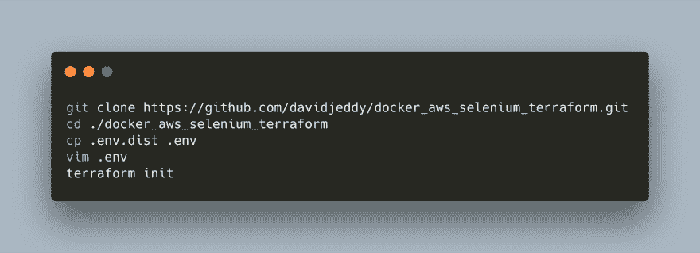](https://res.cloudinary.com/practicaldev/image/fetch/s--1U3_k0vF--/c_limit%2Cf_auto%2Cfl_progressive%2Cq_auto%2Cw_880/https://blog.davidjeddy.com/wp-content/uploads/2019/05/dast_0.png)

添加配置值后，初始化 Terraform 配置。

[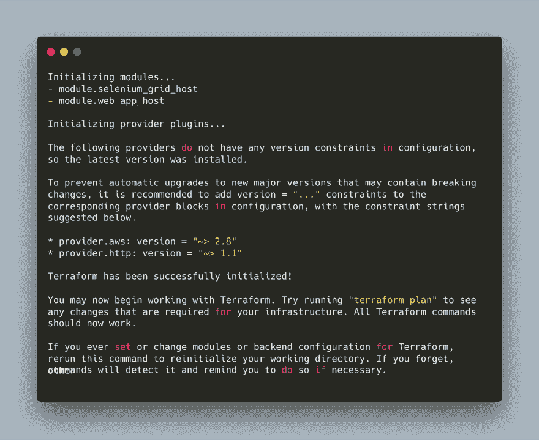](https://res.cloudinary.com/practicaldev/image/fetch/s--e5pErFHA--/c_limit%2Cf_auto%2Cfl_progressive%2Cq_auto%2Cw_880/https://blog.davidjeddy.com/wp-content/uploads/2019/05/dast_0_1.png)

如果一切按预期进行，我们应该返回到终端提示符，并成功初始化 Terraform 项目。完成后，让我们继续建立基础架构。

带有建议参数的

<figure>[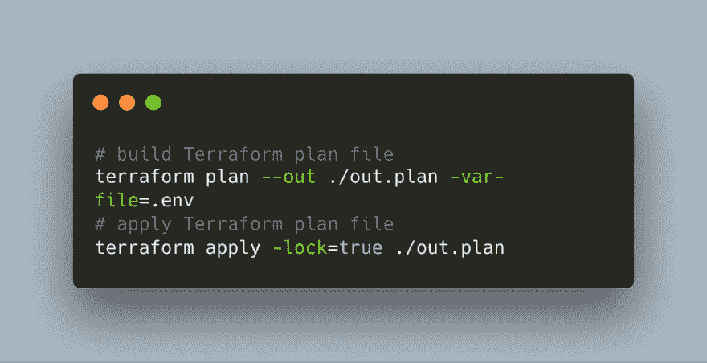](https://res.cloudinary.com/practicaldev/image/fetch/s--J8MaQq_o--/c_limit%2Cf_auto%2Cfl_progressive%2Cq_auto%2Cw_880/https://blog.davidjeddy.com/wp-content/uploads/2019/05/dast_1.png) 

<figcaption>`terraform plan`和`terraform apply`命令。</figcaption>

</figure>

<figure>[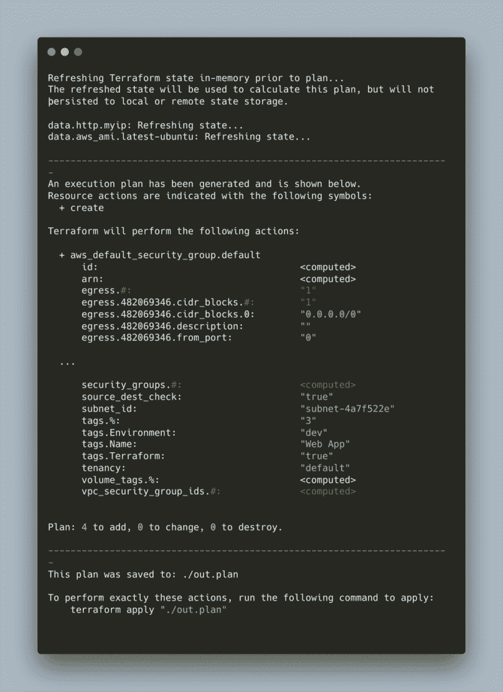](https://res.cloudinary.com/practicaldev/image/fetch/s--usU6vUD8--/c_limit%2Cf_auto%2Cfl_progressive%2Cq_auto%2Cw_880/https://blog.davidjeddy.com/wp-content/uploads/2019/05/dast_1_1-1048x1440.png) 

<figcaption>`terraform plan`由此产生输出。</figcaption>

</figure>

<figure>[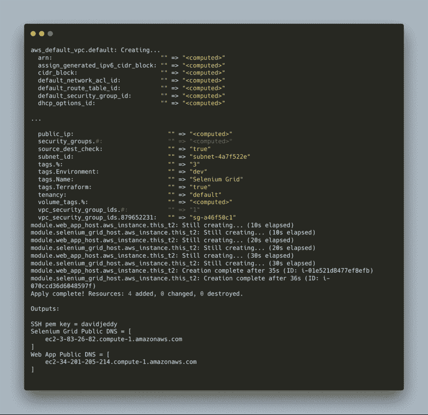](https://res.cloudinary.com/practicaldev/image/fetch/s--8UXk7zI9--/c_limit%2Cf_auto%2Cfl_progressive%2Cq_auto%2Cw_880/https://blog.davidjeddy.com/wp-content/uploads/2019/05/dast_1_2-1488x1440.png) 

<figcaption>`terraform apply`由此产生输出。</figcaption>

</figure>

## 第 2 部分:设置 Selenium 网格服务

该项目有两个主要部分。Selenium 网格主机和 Web 应用程序主机。下一步是设置 Selenium 网格主机。幸运的是，Selenium 团队提供了一个基本的`docker-compose.yml`。我把它放到了`./resources/selenium.sh`脚本中。理想情况下，一个软件配置工具将被用来传输配置到远程主机，但嗯，我不喜欢它。不管怎样，两台主机都有两个设置步骤:通过 SCP 复制脚本；然后通过 SSH 传递命令来执行脚本。

<figure>

<figcaption>SCP 和 SSH 命令逻辑。</figcaption>

</figure>

<figure> 

<figcaption>SCP 将脚本复制到 Selenium 主机上。</figcaption>

</figure>

<figure>[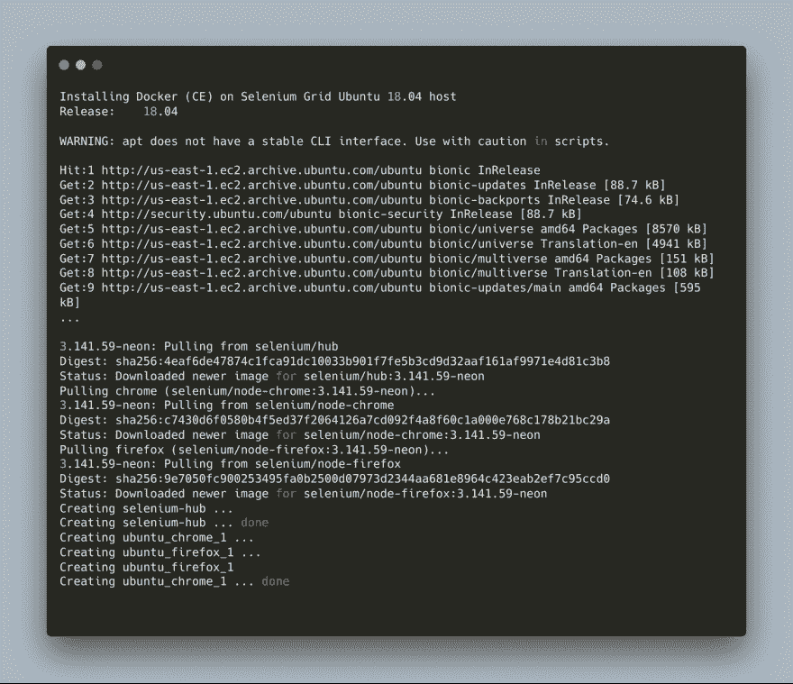](https://res.cloudinary.com/practicaldev/image/fetch/s--T4tDsM8J--/c_limit%2Cf_auto%2Cfl_progressive%2Cq_auto%2Cw_880/https://blog.davidjeddy.com/wp-content/uploads/2019/05/dast_2_2-1670x1440.png) 

<figcaption>脚本执行结束。</figcaption>

</figure>

如果你熟悉 docker-compose，那么最后几行你应该也很熟悉。我们在这里看到的是正在处理的 docker-compose.yml 和正在启动的服务。在这一点上，我们有一个功能齐全的死亡站...呃...硒网格。如果我们访问机器的公共 DNS，那么 web 控制台应该加载 Selenium 网格(从 terraform apply 输出中提供)。(注意:Selenium 网格不安全。它既没有访问控制，也没有身份验证。任何公共电网前都要设置保安。)

<figure>[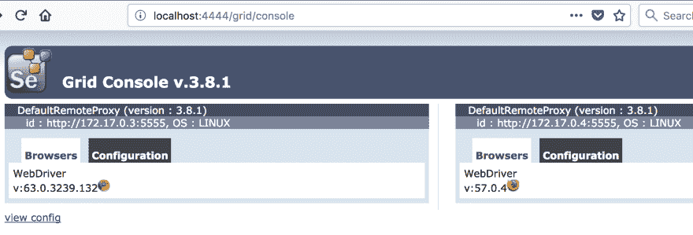](https://res.cloudinary.com/practicaldev/image/fetch/s--WHryjvGq--/c_limit%2Cf_auto%2Cfl_progressive%2Cq_auto%2Cw_880/https://blog.davidjeddy.com/wp-content/uploads/2019/04/dast-selenium-grid-web-console.png) 

<figcaption>忽略本地主机地址，此镜像为‘借用’。</figcaption>

</figure>

## 第 3 部分:设置 Web 应用服务

现在，网格已经启动并运行，可以启动 Web 应用程序了。在这个项目中，我使用了 Java Spring Boot 宠物诊所网络应用程序。这似乎是一个合乎逻辑的选择，因为 1)许多人都熟悉它，2)编写 Selenium 测试用例与我过去使用的其他工具相似。所以让我们开始吧。

<figure> 

<figcaption>命令与设置硒网格</figcaption>

</figure>

非常相似

<figure> 

<figcaption>看起来眼熟...</figcaption>

</figure>

<figure>[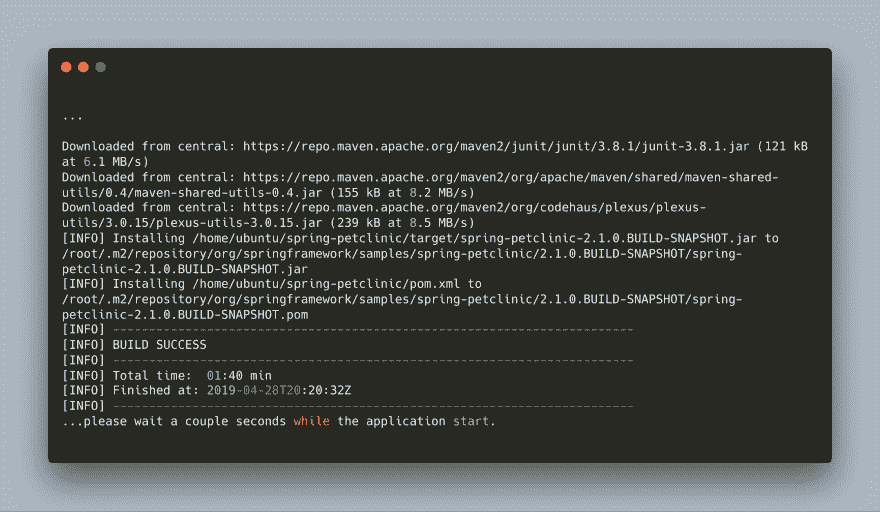](https://res.cloudinary.com/practicaldev/image/fetch/s--mF4brI5j--/c_limit%2Cf_auto%2Cfl_progressive%2Cq_auto%2Cw_880/https://blog.davidjeddy.com/wp-content/uploads/2019/05/dast_3_2.png) 

<figcaption>启动并运行，真好！</figcaption>

</figure>

与 Selenium 设置不同，这需要更长的时间，因为 web 应用程序需要编译和启动。过了一会儿，虽然访问公共 DNS 应该导致宠物诊所应用程序在浏览器中加载。

<figure> 

<figcaption>看看它们可爱的动物吧！:可爱:</figcaption>

</figure>

不错！一切都正常运行。到目前为止，一切顺利。

## 第四部分:执行！

一切就绪并运行后，剩下的唯一一件事就是触发 Selenium 浏览器测试。这就是事情变得有点混乱的地方。测试用例逻辑在 Web 应用程序实例上执行(在生产系统中不是一个好主意),并连接到 Selenium 网格的 hub 实例。中枢服务接收测试请求能力，并将其路由到适当的浏览器节点。在我们的例子中，是 Linux 上的 Chrome。执行命令有点长，但它不需要使用手动硬任何值。当将工具集成到 CI / CD 管道中时，这对于自动化非常重要。

<figure> 

<figcaption>通过 SSH 向 Web App 传递执行命令。</figcaption>

</figure>

[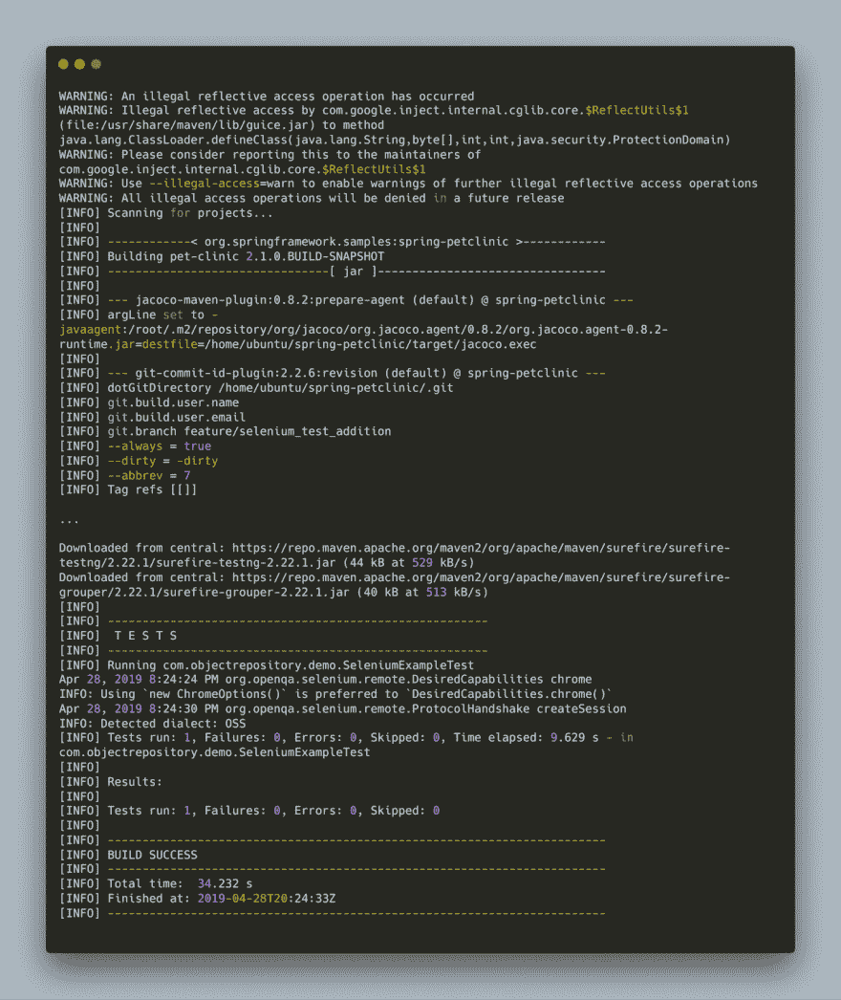](https://res.cloudinary.com/practicaldev/image/fetch/s--2mVaREBU--/c_limit%2Cf_auto%2Cfl_progressive%2Cq_auto%2Cw_880/https://blog.davidjeddy.com/wp-content/uploads/2019/05/dast_4_1-1211x1440.png)

爆炸了！成功执行的浏览器测试。

Selenium 是一个大规模特性，甚至可以对执行的每个步骤进行截屏；测试可以用 Java、Javascript、Python 和许多其他语言编写。[说真的，看看文档](https://www.seleniumhq.org/docs/07_selenium_grid.jsp)。

## 第五步:把一切都记下来

像所有美好的事物一样，这一切必须结束。因为这些都是用 Terraform 组装的，所以它的停机速度甚至比启动还要快。非常适合临时环境或概念验证。

[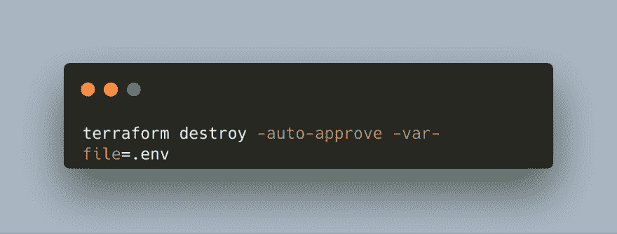](https://res.cloudinary.com/practicaldev/image/fetch/s--eEKodRft--/c_limit%2Cf_auto%2Cfl_progressive%2Cq_auto%2Cw_880/https://blog.davidjeddy.com/wp-content/uploads/2019/05/dast_5.png)

[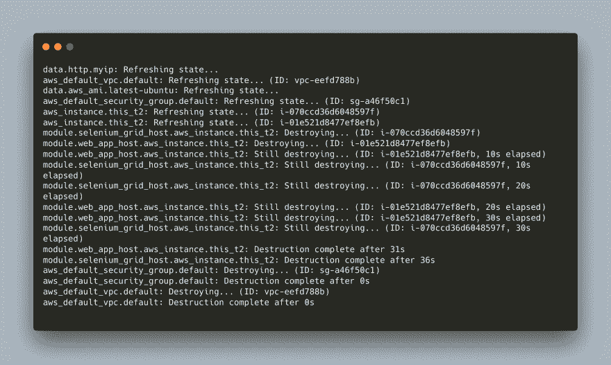](https://res.cloudinary.com/practicaldev/image/fetch/s--UK7CfIW5--/c_limit%2Cf_auto%2Cfl_progressive%2Cq_auto%2Cw_880/https://blog.davidjeddy.com/wp-content/uploads/2019/05/dast_5_1.png)

## 额外收获:请求/响应图

<figure>[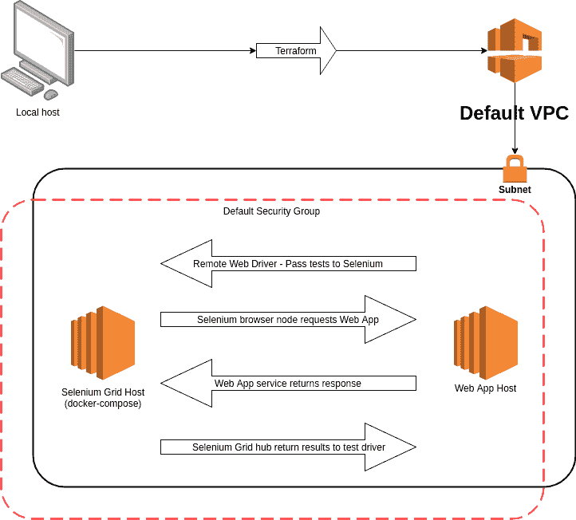](https://res.cloudinary.com/practicaldev/image/fetch/s--LHY7YStD--/c_limit%2Cf_auto%2Cfl_progressive%2Cq_auto%2Cw_880/https://blog.davidjeddy.com/wp-content/uploads/2019/04/Docker-AWS-Selenium-Tefferaform.png) 

<figcaption>不要把事情看得这么复杂。</figcaption>

</figure>

希望你觉得这篇文章对我来说很有启发性。它显示了自动化工具是多么灵活和强大，可以不费吹灰之力就让事情正常运行和可管理。

## 资源

*   GitHub 资料档案库:【https://github . com/davidjeddy/docker _ AWS _ selenium _ terra form】