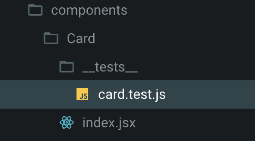
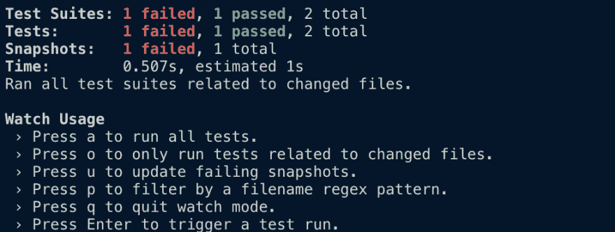

# 带着玩笑跑起来

> 原文：<https://dev.to/paulryan7/up-running-with-jest-5ae3>

## 本文的目标

本文的目标是向您提供用 Jest 测试 React 组件的基础知识，有了这些知识，您就可以在开始测试自己的组件时立即投入使用。准备好了吗？我们开始吧。

## 样本成分

我在 Codesandbox 中创建了一个简单的卡片组件。

[](https://res.cloudinary.com/practicaldev/image/fetch/s--IxZVeOGu--/c_limit%2Cf_auto%2Cfl_progressive%2Cq_auto%2Cw_880/https://thepracticaldev.s3.amazonaws.com/i/06fbikl6am3h6gz4ph4f.png)

该组件接受一个在点击`Discover`按钮时进行处理的道具。

这里是代码沙盒，所以你可以跟着:
[https://codesandbox.io/embed/18wyxn60zl](https://codesandbox.io/embed/18wyxn60zl)

谈到测试，Codesandbox 还有很长的路要走，我甚至没有进行快照测试，所以我建议[在这里](https://github.com/PaulRyan17/Jest-Testing-Example)克隆我的 repo，然后在你的本地机器上继续。

## 安装笑话

在开始使用 Jest 之前，我们需要做的第一件事是安装它。要安装 Jest，运行以下命令:
`npm install -D jest react-test-renderer`

谢天谢地，`create-react-app`已经处理好了，所以我们可以运行`npm test`来运行我们的测试:)

## 创建我们的测试目录

Jest 在名为`__tests__`的目录中寻找测试，将`__tests__`目录添加到您的`Card`组件中。

接下来我们需要做的是在`__tests__`目录中创建一个测试文件，我们将把我们的文件命名为`card.test.js`

您的文件夹结构现在应该如下所示:

[](https://res.cloudinary.com/practicaldev/image/fetch/s--29aZ0dNd--/c_limit%2Cf_auto%2Cfl_progressive%2Cq_auto%2Cw_880/https://thepracticaldev.s3.amazonaws.com/i/3heck30dtlv6e8k8k5cu.png)

## 创建快照测试

首先运行命令:
`npm test`

这将在观察模式下启动 Jest，因此任何时候我们做出更改，我们的测试都将重新运行。

我们将编写的第一个测试是快照测试。

将以下代码添加到您的`card.test.js`文件中:

```
import React from "react";
import Card from "..";
import Renderer from "react-test-renderer";

it("renders correctly", () => {
  const tree = Renderer.create(<Card />).toJSON();
  expect(tree).toMatchSnapshot();
}); 
```

这将在一个名为`__snapshots__`的目录中创建我们组件的 JSON 快照，这意味着只要组件发生变化，测试就会失败。继续修改组件中的一些内容，比如文本，您将得到以下内容:
[](https://res.cloudinary.com/practicaldev/image/fetch/s--wz6c0XQt--/c_limit%2Cf_auto%2Cfl_progressive%2Cq_auto%2Cw_880/https://thepracticaldev.s3.amazonaws.com/i/2163ds5mwqv9lbo98uw1.png)

要解决这个问题，只需按下`u`就可以更新快照。

## 测试回调函数

我们现在将使用库`enzyme`来帮助我们，它给了我们很多方便的工具，并让我们免去了很多麻烦。

我们需要安装几个依赖项:
`npm install enzyme enzyme-adapter-react-16 --save-dev`

现在将以下内容添加到测试文件的顶部:

```
import Adapter from 'enzyme-adapter-react-16';
import { mount, configure } from 'enzyme'
configure({adapter: new Adapter()}); 
```

为了让酶工作，我们需要创建一个适配器，适配器让酶与您的 React 版本(即 React 16)一起工作。

现在让我们添加一个新的测试:

```
it('triggers the callback function', ()=>{

}) 
```

现在让我们填写正文，我已经注释了每一行，所以很容易理解。

```
// in order to test the callback function we first need to mock it
const onClickCallback = jest.fn()
// pass our mock function as the prop the Card
let card = mount(<Card handleClick={onClickCallback} />) // find out button i.e. the button that triggers the callback and click it
const button = card.find('button').simulate('click')
// our mock function should have been called once
expect(onClickCallback).toHaveBeenCalledTimes(1) 
```

## 测试回调函数是否传递了正确的值

我们的回调函数传递回硬编码的字符串`discover`，让我们测试一下，以确保它被正确传递。

除了最后一行:
之外，该函数与上面类似

```
it('callback function is the passed the string discover', ()=>{
  // in order to test the callback function we first need to mock it
  const onClickCallback = jest.fn()
  // pass our mock function as the prop the Card
  let card = mount(<Card handleClick={onClickCallback} />)
  // find out button i.e. the button that triggers the callback and click it
  const button = card.find('button').simulate('click')
  // test to see if our function was called with the right param
  expect(onClickCallback).toHaveBeenCalledWith('discover')
}) 
```

感谢阅读。

我希望你获得了一些知识，我会继续添加到这篇文章，所以考虑这个草案 1:)

我也是推特的忠实粉丝，有将近 100 名粉丝，[所以如果你想的话，请关注我。](https://twitter.com/PaulRyan7)