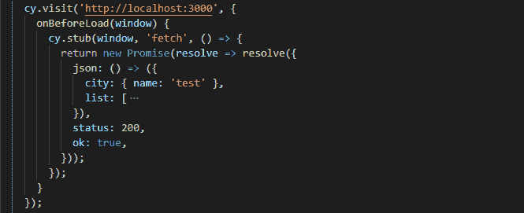
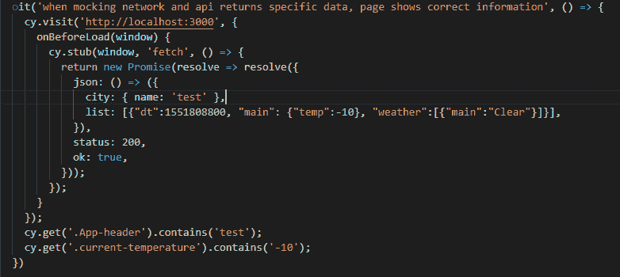
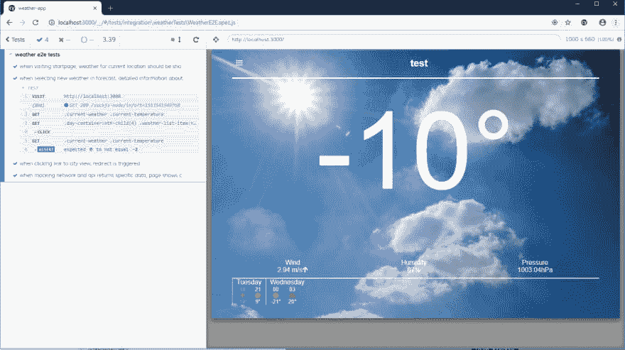

# 使用 Cypress 简化 E2E 测试

> 原文：<https://dev.to/mstamstrom/making-e2e-testing-easy-with-cypress-pk5>

# 赛普拉斯:让 E2E 测试变得简单

Cypress 是一个非常棒的 E2E 测试框架，具有一致性、快速性和易用性。它是从零开始建造的，所以不含硒。我最近尝试了一下，发现 Cypress 非常容易安装和开始使用。编写测试很容易，而且感觉非常快速和可靠。Cypress 还提供了一个很棒的测试运行者站点，在那里你可以看到你的测试运行以及调试测试等等。

我们将在本文中介绍:

*   从网络应用的角度看 E2E 测试
*   了解柏树及其特征
*   了解如何设置 Cypress
*   了解如何用 Cypress 编写 E2E 测试
*   浏览如何使用 Cypress 测试跑步者

## e2e 考什么和为什么考？

测试是关于质量的。我们希望确保我们的网络应用程序不包含错误。单元测试测试尽可能小的部分，并测试所有的边缘情况。另一方面，E2E 测试测试整个功能，从 GUI 到 API，然后返回。在 E2E 测试中，我们通常坚持快乐的路径，因为我们在单元测试中覆盖了所有的边缘情况。

我对 web 应用程序 E2E 测试的定义是:

> E2E 测试是从用户的角度来测试 web 应用

我们在浏览器中自动测试应用程序，以确保所有功能保持一致，并随着应用程序的发展保持一致和正确。我通常将一个 E2E 测试视为测试用户故事中的一个流程，E2E 测试应该采取与手动测试用户故事相同的步骤，并产生相同的最终结果。

当 E2E 测试时，我们使用哪个框架并不重要。将 web 应用程序视为一个黑匣子，我们通过 GUI 对其进行测试。

## 我们将在本文中测试什么

本文中的测试示例将基于我的天气应用程序中的一个视图，如下所示。
[T3】](https://res.cloudinary.com/practicaldev/image/fetch/s--5jWdtVz9--/c_limit%2Cf_auto%2Cfl_progressive%2Cq_auto%2Cw_880/https://thepracticaldev.s3.amazonaws.com/i/53594ahag986cuc8pqt7.PNG)

## 柏树

> 网络已经进化了。最后，测试也是如此。

Cypress 是一个 E2E 测试框架。它是从零开始构建的，以减少不一致的结果并提高速度。它适用于单元测试、集成测试和 E2E 测试。它是免费的、开源的，在本地安装了一个测试运行程序和一个记录测试运行的仪表板服务。

Cypress 的重点是让安装 Cypress 变得容易，让编写、运行和调试测试变得容易。我真的认为 Cypress 已经在这些方面取得了成功，它非常容易上手，用 jest 编写单元测试几乎和用 Cypress 编写 E2E 测试一样容易。

Cypress 现阶段只支持各大浏览器的 Chrome，但他们正在致力于 Firefox、Edge 和 IE11 的跨浏览器支持。

### 有些柏树的特征

Cypress 有很多很棒的特性。从 E2E 的角度来看，主要特征是:

*   存根和间谍
*   时间旅行，以查看测试运行程序中每个测试所采取的所有步骤
*   在 Chrome 开发工具等熟悉的工具中调试
*   实时重新加载
*   控制网络流量
*   自动等待
*   失败测试的截图和视频
*   一致的结果

Cypress 附带了 mocha 和 chai 作为测试框架，所以一切都已经设置好了，可以开始了。提到的特征之一是自动等待。这真是太棒了，因为我们现在再也不用检查元素是否在 DOM 中，或者执行 setTimeout 并希望元素已经出现。Cypress commands 自动等待命令完成，当它完成时，它进入测试中的下一个命令。如果 Cypress 命令在 5 秒钟后没有完成，测试将失败。

对于使用自动等待的 Cypress，所有的 Cypress 命令都是异步的，但是它们是同步运行的。

```
 cy.get(...).click() 
```

在这个例子中，get()和 click()都是异步命令，但是 get()必须在 click 命令运行之前完成。因此，每个命令就像一个承诺，在运行下一个命令之前必须完成。

### 为什么柏树试验更可靠？

Cypress 的一个特点是结果一致。Cypress 是从零开始构建的，以获得更一致的结果，但是为什么 Cypress 中的 E2E 测试比基于硒的 E2E 框架更一致呢？
Selenium 和类似的框架通过在浏览器之外运行来运行，并通过网络执行远程命令。Cypress 则相反，它在浏览器内部运行。这就是为什么 Cypress 可以产生更一致的测试结果，并且在我看来速度更快。这也使得 Cypress 能够提供其他不错的特性，比如模仿和捕获网络流量。

## 树立柏树

赛普拉斯让我们很容易就能启动并运行。首先，安装 Cypress:

```
 npm install --save-dev cypress 
```

这将下载所有 Cypress 需要的东西。之后，这才打开柏树:

```
 ./node_modules/.bin/cypress open 
```

第一次运行这个命令时，Cypress 将为您开始编写 E2E 测试做好一切准备。Cypress 还包括一个示例文件夹，其中有许多有价值的示例和提示。

但是这个命令实际上并不是关于设置的。这个命令真正做的是打开测试运行程序。在测试运行程序中，我们可以看到我们的 E2E 测试运行，调试我们的测试和其他事情。Cypress 启动命令应该添加到 package.json 中。

```
 "cypress:open": "cypress open",
  "cypress:run": "cypress run" 
```

Cypress run 命令将在终端中运行测试，这在 CI 上很有用。

## 编写我们的第一个测试

设置好 Cypress 之后，我们就可以开始编写 E2E 测试了。让我们看看 E2E 测试是怎样的。在本测试中，我们希望检查在选择预测列表中的一个项目时，主温度是否会发生变化。

[](https://res.cloudinary.com/practicaldev/image/fetch/s--WqtUO5GJ--/c_limit%2Cf_auto%2Cfl_progressive%2Cq_auto%2Cw_880/https://thepracticaldev.s3.amazonaws.com/i/04t3hvx057br38g7yiyg.PNG)

Cypress 命令不返回元素，而是使用链接。但是由于 Cypress 命令类似于 promise，并且 promises 是 thenable，我们可以等待 Cypress 命令完成，然后用`then()`获取 Cypress 命令产生的元素。

请注意，cypress 命令类似于承诺，但不完全是承诺。所以我们可以在命令完成时使用 then 来触发回调，但是我们不能使用 async/await。

## 存根(仿制品)

嘲讽是控制应用程序某些方面的好方法。即使我们正在测试一个黑盒，例如获得对 API 或地理位置的控制也是非常有用的，因此我们可以将一些 E2E 测试集中在其他方面。

在赛普拉斯，我们用树桩来嘲笑。

```
cy.stub(object, method)
cy.stub(object, method, replacerFunction) 
```

因此，举例来说，我们可以对某些测试使用 stub `fetch`。

[](https://res.cloudinary.com/practicaldev/image/fetch/s--yaI3WI2Y--/c_limit%2Cf_auto%2Cfl_progressive%2Cq_auto%2Cw_880/https://thepracticaldev.s3.amazonaws.com/i/pyut6lh1amz071wrj38k.PNG)

通过这种方式，我们可以确保我们的应用程序在给定来自 API 的特定响应的情况下，准确地呈现正确的信息。

> 存根应该位于 onBeforeLoad 中，这使得存根在 localhost 的当前访问中可用。

[](https://res.cloudinary.com/practicaldev/image/fetch/s--1w-usozr--/c_limit%2Cf_auto%2Cfl_progressive%2Cq_auto%2Cw_880/https://thepracticaldev.s3.amazonaws.com/i/g9st58272n4gw076923p.PNG)

这是另一个存根，我们希望地理位置是瑞典斯德哥尔摩的中心。这样，在运行这个测试时，无论在哪里运行这个测试，我们都将获取斯德哥尔摩的天气。

## 什么时候嘲笑，什么时候不嘲笑？

能够嘲笑某些事情并知道期待什么样的回报真的很好。虽然我们不应该总是嘲笑，它应该是一个很好的组合。首先，如果可能的话，编写几个不带存根的 E2E 测试。因此，我们首先从头到尾进行测试，确保所有集成都正常工作。然后，我们可以开始使用存根来确保我们的 GUI 准确地呈现正确的信息。

## 编写模拟测试

[](https://res.cloudinary.com/practicaldev/image/fetch/s--eAyfAVJr--/c_limit%2Cf_auto%2Cfl_progressive%2Cq_auto%2Cw_880/https://thepracticaldev.s3.amazonaws.com/i/lz704sbweg5cu2p73khx.PNG) 在这个测试中，我们使用 contain 命令，它检查获取的元素是否包含输入值。该命令既适用于特定元素，也适用于元素容器。

## 测试跑步者

赛普拉斯有一个很棒的测试跑步者。这是一个非常棒的工具，有很多特性。在测试运行程序中，我们可以看到我们的测试运行，调试我们的测试，并看到我们的测试在应用程序中采用了正确的路径。测试运行程序在 chrome 实例中运行，因此可以访问 chrome devtools 进行调试。

[](https://res.cloudinary.com/practicaldev/image/fetch/s--XIcv_CaP--/c_limit%2Cf_auto%2Cfl_progressive%2Cq_auto%2Cw_880/https://thepracticaldev.s3.amazonaws.com/i/5itmoehzaml8c8mkvo0c.PNG)

这是一组 E2E 测试的照片。我们可以从这里运行所有的测试，也可以打开 chrome devtools 来检查元素或调试我们的 web 应用程序。

[](https://i.giphy.com/media/hsDZCF1iVDCGc3lcEn/source.gif)

这是我检查 E2E 测试的 GIF。当悬停在 E2E 测试中的不同步骤上时，测试运行人员会可视化 Cypress 命令影响了哪个元素。它还显示了在测试的每一步中 GUI 所处的状态。这就是 Cypress 所说的时间旅行，我们可以通过 E2E 测试的每一步，看看 GUI 是如何看待每一步的。这对于调试和查看我们的 GUI 是否如预期的那样运行是非常棒的。还要注意，当悬停在 click 事件上时，测试运行程序会显示该点击的前后。

## 结论

这就是本文的全部内容。希望你喜欢它，我启发你尝试 E2E 赛普拉斯测试。在这篇文章中，我们首先来看看什么是 E2E 测试。然后，我们讨论了 Cypress 的一些特性，并深入探讨了设置、存根、如何编写 E2E 测试以及最后的时间旅行测试运行程序。

如果你想了解更多关于 Cypress 的内容，他们在 Cypress.io 上有很棒的文档，有关于如何编写 E2E 测试的例子和指南。

如果你想看到整个天气应用程序，它是在 GitHub 网页直播。如果你有兴趣看更多我的 E2E 测试，这个项目可以在我的 GitHub 上找到。

## 资源

[柏树文档](https://docs.cypress.io)
[Github 项目](https://github.com/mStamstrom/weather-app)