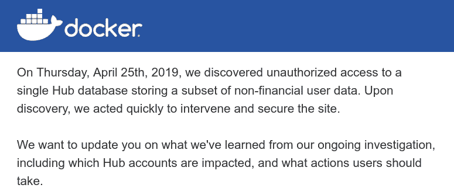
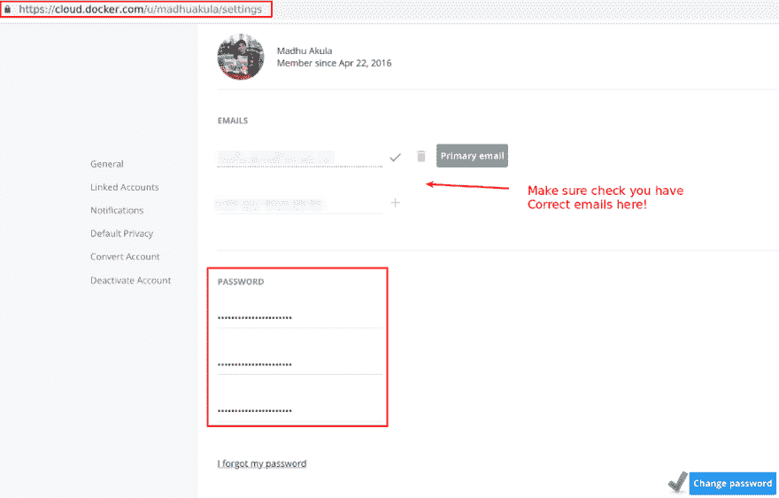
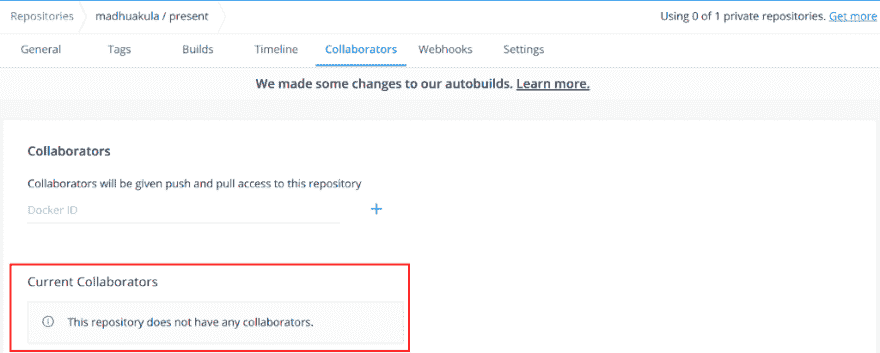
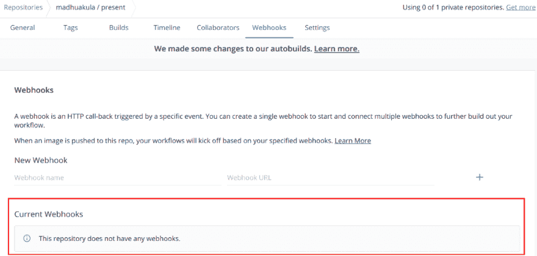
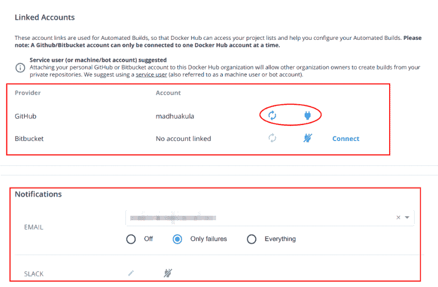
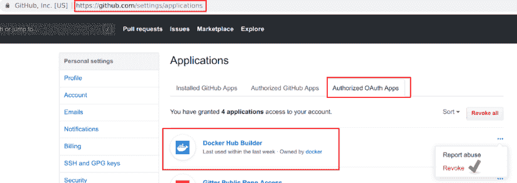
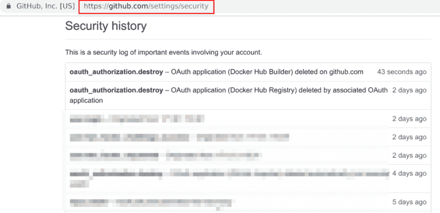
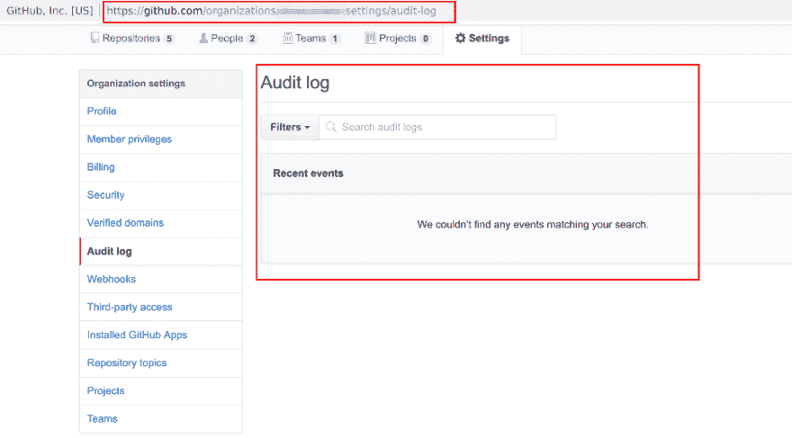

# 审查 Docker Hub Hack 19 万账户的一些技巧

> 原文：<https://dev.to/madhuakula/some-tips-to-review-docker-hub-hack-of-190k-accounts-6db>

<figure>

<figcaption>Docker Hub Hack 的 19 万个账户被攻陷，让所有人都处于危险之中！</figcaption>

</figure>

正如你们大多数人必须知道的那样，Docker Hub 最近已经被入侵，这次攻击已经使近 19 万用户处于危险之中。据我所知，这是最近历史上最疯狂的供应链攻击之一。我这样说，是因为要让自己对这种攻击万无一失并不容易。在我们感到安全之前，我们可能必须检查许多东西，但是我们仍然不能保证我们足够安全。

在[黑客新闻帖](https://news.ycombinator.com/item?id=19763413)中阅读更多关于这次攻击的信息

[Docker Hub 被黑- 19 万个账户，GitHub 令牌被撤销，构建被禁用|黑客新闻](https://news.ycombinator.com/item?id=19763413)

为了你的利益，我想出了一个清单，可以帮助你检查你的 Docker hub，Github 帐户等。下面列出了一些检查，可能会对您审查 Docker hub、Github 帐户有所帮助。所有这些都来自我的个人清单，它们可能会也可能不会保证你是完全安全的。

### 检查表

*   登录到您的 [Docker Hub](https://hub.docker.com) 并在账户设置页面中更改您的密码

*   检查每个存储库映像的最后构建时间，看看是否可以识别任何可疑的构建。此外，检查是否为图像创建了任何新标签，或者是否手动创建或推送了新图像

*   查看存储库设置，并检查是否在您不知情的情况下添加了任何新的协作者

*   查看所有外部 webhooks。检查可疑的 webhook 是否已添加到任何存储库中，或者现有的 webhook 是否已被可疑地修改

*   检查您组织的团队成员，确保没有添加任何未知用户

*   确保来自版本控制系统的自动化构建已经被撤销并重新连接。此外，检查可能被可疑添加的新连接或提供程序。最后，验证电子邮件是否被正确提及，并且没有添加新的或修改过的网页挂钩

*   导航到您的版本控制系统提供商，并确保您撤销了现有的应用程序集成和令牌。此外，检查是否添加了任何新的 GitHub 应用程序，或者是否删除了现有的应用程序

*   审查您和您的组织的 GitHub 安全活动，以验证随着时间的推移是否发生了任何可疑的变化

*   查看您的组织和个人帐户的审计日志。根据 Docker Hub 与 GitHub 集成的权限，查看所做的任何更改

*   可能要做的一些额外的检查包括，验证您的基本映像和现有映像，因为相应的所有者帐户也可能已经受损。使用一些开源的图像扫描仪，比如克莱尔、[和审计](https://vulners.com/audit)等。即使您不在 Docker Hub 中，并且使用的是私有注册表，这些检查也会适用。这是因为你可能已经使用了一些外部基础图像，如 nginx，alpine 等。
*   监控，再监控，你正在运行的所有东西(容器)。这是必需的，因为一些正在运行的容器可能已经被破坏了

> 这些是我想到的一些建议，我很想知道你可能会想到的其他一些对我们的社区有帮助的事情。请在这里留下你的评论和建议，我会把你的建议放到我的帖子里。

#### 贡献者

*   [Riddhi Shree](https://medium.com/u/a536602bb4c9)

> 请随时提供任何反馈、建议或改进。如果你喜欢这篇文章，请点击👏按钮并分享这篇文章，这样其他人也可以从这篇文章中受益。

* * *