# Java 程序员的阅读清单

> 原文：<https://dev.to/javinpaul/a-reading-list-for-java-programmers-4inp>

*披露:这篇文章包括附属链接；如果您从本文提供的不同链接购买产品或服务，我可能会收到报酬。*

[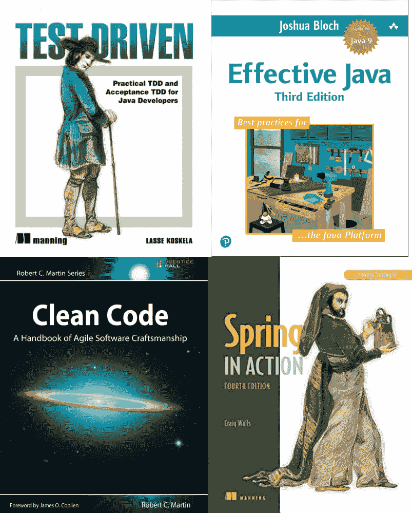](https://www.freecodecamp.org/news/must-read-books-to-learn-java-programming-327a3768ea2f/)

如果你是一名 Java 程序员，并且想知道阅读什么来提高你的 Java 知识或者[成为一名更好的 Java 开发人员](https://javarevisited.blogspot.com/2018/05/10-tips-to-become-better-java-developer.html)，那么你来对地方了。

在这篇文章中，我将分享一些曾经写过的最好的 Java 书籍。这些书经受住了时间的考验，随着时间的推移变得越来越有意义。

不管你是现在读还是打算以后读，你总会有很多东西要学，这就是为什么我认为它们是有史以来最伟大的 Java 书籍。

我个人是个爱看书的人。我的图书馆里有数百本书和电子书。如果你不知道，我还为想破解 java 面试的人写了一本 Java 书-[Grokking the Java Interview](https://gumroad.com/l/QqjGH)。如果你愿意，你也可以用我的特别折扣链接在 Gumroad 购买，只需 19.9 英镑。

当我年轻的时候，我看了很多漫画，包括超级突击队员 Dhruv T1，他是我最喜欢的角色之一，因为他的故事中有科学主题，以及他如何在没有任何超能力的情况下，仅凭他的智慧、敏锐和简单的科学知识击败更强大的敌人。

当我成为一名程序员时，我对书籍的热情继续着。我读的第一本 Java 书，除了大学的课本，就是 [Head First Design Pattern](http://www.amazon.com/dp/0596007124/?tag=javamysqlanta-20) 。这本书彻底改变了我对 Java 的认识和对面向对象编程的理解。

直到这时，我才明白接口的真正用途。对我来说，它们看起来毫无用处，因为你不能在那里写代码做任何事情。但是，读完这本书后，我意识到它们在减少程序不同部分之间的耦合方面是多么的棒。

从那以后，我看了很多[编程的书，](http://www.java67.com/2015/03/10-books-every-programmer-and-software-engineer-read.html)大多和 Java 有关。今天，我要分享 **10 本最好的 Java 书籍，每个 Java 开发人员都应该阅读**。

即使有些知识已经过时，你学到的大部分东西将有助于建立你的知识和一生的事业。顺便说一句，如果你买这些书或我推荐的课程，我会得到报酬。

## 每个 Java 程序员都应该读的 10 本书

事不宜迟，下面是我为 Java 程序员列出的一些最受欢迎和最重要的书籍。

如果你已经从事 Java 编程 2 到 3 年了，那么很有可能你已经读过这些书了。但是，如果你还没有，现在是阅读它们的最佳时机。

我 100%确定你不会后悔在这些书上投资你的时间和金钱，因为你将学到的东西比未来几年更有价值。

### [1。有效的 Java](https://www.amazon.com/Effective-Java-3rd-Joshua-Bloch/dp/0134685997/?tag=javamysqlanta-20)

这里不应该有任何惊喜。约书亚·布洛赫所著的 [*有效的 Java*](https://www.amazon.com/Effective-Java-3rd-Joshua-Bloch/dp/0134685997/?tag=javamysqlanta-20) 无疑是有史以来最好的 Java 书籍。对于任何经验水平的 Java 程序员来说，这绝对是一本必读的书。你将会学到比你想象的更多的关于 Java 和它的 API 的知识。

Joshua Bloch 本人是几个关键 Java 类和 API 的作者，如`java.lang`和 [Java Collection framework](https://pluralsight.pxf.io/c/1193463/424552/7490?u=https%3A%2F%2Fwww.pluralsight.com%2Fcourses%2Fjava-fundamentals-collections) ，这一事实足以成为阅读本书的理由。除此之外，他的写作风格也很棒。

[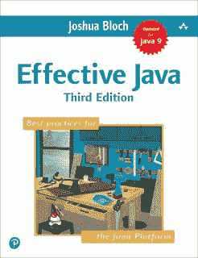](https://www.amazon.com/Effective-Java-3rd-Joshua-Bloch/dp/0134685997/?tag=javamysqlanta-20)

你可以在沙滩上、旅行中或者只是在办公桌前阅读这本书。太牛逼了。毫无疑问，读完这本书后，你会成为一名更好的 Java 程序员。

最棒的是，现在已经有了一个新版本的有效 Java,它涵盖了 Java 7、8 和 9。这是阅读这本书的最佳时机。

### [2。干净代码](http://www.amazon.com/Clean-Code-Handbook-Software-Craftsmanship/dp/0132350882?tag=javamysqlanta-20)

Java 程序员的另一个永恒经典是 [*干净的代码*](http://www.amazon.com/Clean-Code-Handbook-Software-Craftsmanship/dp/0132350882?tag=javamysqlanta-20) 。顾名思义，它教你写出更好的代码，这是一件很难学的事情。

老实说，学习 Java 很容易，但是很难写出使用强大的面向对象原则的更好的 Java 代码，这正是本书的帮助所在。

与 Joshua Bloch 类似，Robert C. Martin，也称为 Bob 叔叔，是一位优秀的作者，他分享了许多他作为软件开发人员的经验，教你各种编程技术和实践，这对你作为程序员的日常工作有很大帮助。

[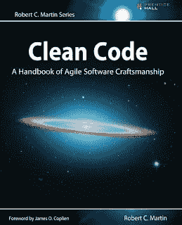](http://www.amazon.com/Clean-Code-Handbook-Software-Craftsmanship/dp/0132350882?tag=javamysqlanta-20)

如果你遵循 Clean Code，在 Pluralsight 上还有一门课程叫做[Clean Code:Writing Code for Humans](https://pluralsight.pxf.io/c/1193463/424552/7490?u=https%3A%2F%2Fwww.pluralsight.com%2Fcourses%2Fwriting-clean-code-humans)由 Cory House 编写，它有效地补充了这本书。

顺便说一句，你需要一个 Pluralsight 会员才能进入这个课程，费用大约是每月 29 美元或每年 299 美元( [14%的折扣](https://pluralsight.pxf.io/c/1193463/424552/7490?u=https%3A%2F%2Fwww.pluralsight.com%2Fpricing))。

如果你还没有 [Pluralsight 会员资格](https://pluralsight.pxf.io/c/1193463/424552/7490?u=https%3A%2F%2Fwww.pluralsight.com%2Fpricing)，我鼓励你申请一个，因为它可以让你访问他们的 5000 多个在线课程，涉及所有最新的主题，如前端和后端开发、机器学习等。

他们还提供 [10 天的免费试用](http://pluralsight.pxf.io/c/1193463/424552/7490?u=https%3A%2F%2Fwww.pluralsight.com%2Flearn)，无需任何承诺，这不仅是免费学习这门课程的好方法，也是在加入 Pluralsight 之前检查课程质量的好方法。

### [3。实践中的 Java 并发](http://www.amazon.com/dp/0321349601/?tag=javamysqlanta-20)

多线程和并发是 Java 编程的一个重要部分。没有比 Brian Goetz 的[*Java Concurrency in Practice*](http://www.amazon.com/dp/0321349601/?tag=javamysqlanta-20)更好的书来学习和掌握这个棘手的话题了。

尽管这本书只涵盖了 Java 5，但对于任何认真的 Java 开发人员来说，它仍然是一本相关的必读书籍。

你们中的一些人可能会发现有些部分有点难以理解，尤其是 3.5.1 到 3.5.6 部分，如果是这样的话，我建议你去看看 Heinz Kabutz 博士的 [**极限 Java -并发性能**](https://learning.javaspecialists.eu/courses/xjadvj8?affcode=92815_johrd7r8) 课程。这将有助于你更好地消化和理解这些话题。

[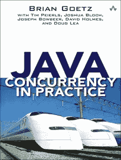](http://www.amazon.com/dp/0321349601/?tag=javamysqlanta-20)

### [4。头先设计图案](http://www.amazon.com/dp/0596007124/?tag=javamysqlanta-20)

良好的面向对象和设计模式知识对于编写任何 Java 应用程序都很重要。 [*头先设计图案*](http://javarevisited.blogspot.sg/2017/04/top-5-books-to-learn-object-oriented-programming.html) 是学习那样做的最好的书。

正如我以前说过的，除了教科书，这是我读过的第一本关于 Java 的书。看完这本书，印象非常深刻。

这本书教会了我[为什么复合比继承更好](http://javarevisited.blogspot.sg/2013/06/why-favor-composition-over-inheritance-java-oops-design.html)以及如何改变一个类的运行时行为而不触及已经测试过的代码。

你可能会认为这只是另一本旧书，但你不必担心，几年前发布了一本涵盖 [Java SE 8](https://pluralsight.pxf.io/c/1193463/424552/7490?u=https%3A%2F%2Fwww.pluralsight.com%2Fcourses%2Fjava-8-whats-new) 的更新版。

如果你真的想学习 Java 中的设计模式，这是你应该读的书！

[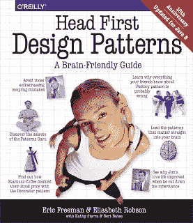](http://www.amazon.com/dp/0596007124/?tag=javamysqlanta-20)

Udemy 上的 Java 课程中的 [**设计模式也是一个很好的资源，可以让你熟悉 Java 和面向对象编程中基本设计模式的现代实现。你可以跟着这本书一起学习这门课程，这样可以两全其美。**](https://click.linksynergy.com/deeplink?id=JVFxdTr9V80&mid=39197&murl=https%3A%2F%2Fwww.udemy.com%2Fcourse%2Fdesign-patterns-java%2F)

### [5。弹簧动作](https://www.amazon.com/Spring-Action-Craig-Walls/dp/1617294942?tag=javamysqlanta-20)

抱歉，我不得不把一本 Spring 书籍 [*Spring in Action*](https://www.amazon.com/Spring-Action-Craig-Walls/dp/1935182358/?tag=javamysqlanta-20) 列入 Java 程序员的经典书籍清单。Spring 是有史以来最受欢迎的 Java 框架，这是学习关于 [Spring 框架](https://medium.com/javarevisited/10-best-online-courses-to-learn-spring-framework-in-2020-f7f73599c2fd)的最好的书，但是——说实话——这本书不仅仅是一本 Spring 的书。

读完这本书的第四版后，我对 Java 和编写更好的代码有了更多的了解，我无法解释。

这些书选择一个主题，比如 JDBC，并解释 JDK 在哪里出错了，以及 Spring 如何纠正这个错误，例如 SQLException，这是一个通用的异常，它说有些地方出错了，但不确切地说是什么错误或如何处理。

像 Josuha Bloch 和 Bob 叔叔一样，Craig Walls 是另一位伟大的作者，通过阅读这本书，你将学到比 Spring 更多的东西。

好消息是，现在《春天在行动》的第五版也可以买到了，这是我的阅读清单中的一本书。

[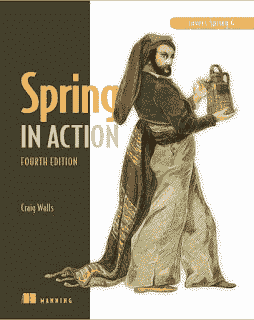](https://www.amazon.com/Spring-Action-Craig-Walls/dp/1617294942?tag=javamysqlanta-20)

顺便说一句，如果你的目标是学习 Spring，我也建议你和这本书一起加入一个很棒的在线课程，比如 [**Spring Framework 5:初学者到大师**](https://click.linksynergy.com/fs-bin/click?id=JVFxdTr9V80&subid=0&offerid=323058.1&type=10&tmpid=14538&RD_PARM1=https%3A%2F%2Fwww.udemy.com%2Fspring-framework-5-beginner-to-guru%2F) 。你会比许多试图自学的开发人员学得更快更好。

### [6。测试驱动](http://www.amazon.com/Test-Driven-Acceptance-Java-Developers/dp/1932394850?tag=javamysqlanta-20)

自动化测试是一项重要的技能。对于开发人员来说，一切都从单元测试开始。Java 从一开始就拥有 JUnit，但是仅仅了解这个库并不能让你成为一个能够编写测试的专业程序员。

这比了解一个单元测试库要复杂得多，比如 [JUnit](http://www.java67.com/2018/02/5-free-eclipse-and-junit-online-courses-java-developers.html) 或 [Mockito](https://javarevisited.blogspot.com/2018/01/10-unit-testing-and-integration-tools-for-java-programmers.html) ，这也是本书的帮助所在。如果你对代码质量和编写单元、集成和自动化测试很认真，那么 [*测试驱动*](http://www.amazon.com/Test-Driven-Acceptance-Java-Developers/dp/1932394850?tag=javamysqlanta-20) 是一本适合认真的 java 开发人员阅读的书。

[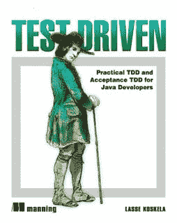](http://www.amazon.com/Test-Driven-Acceptance-Java-Developers/dp/1932394850?tag=javamysqlanta-20)

如果我们谈论库，JUnit 和 Mockito 是任何 Java 开发人员的必备品。如果你不熟悉它们，我建议你和上面的书一起阅读这个 [JUnit 和 Mockito 速成班](https://click.linksynergy.com/fs-bin/click?id=JVFxdTr9V80&subid=0&offerid=323058.1&type=10&tmpid=14538&RD_PARM1=https%3A%2F%2Fwww.udemy.com%2Fjunitandmockitocrashcourse%2F)来掌握 Java 中的单元测试艺术。

### [7。Java 性能权威指南](http://www.amazon.com/Java-Performance-The-Definitive-Guide/dp/1449358454?tag=javamysqlanta-20)

成为更好的 Java 开发人员的另一个方面是了解 JVM、垃圾收集和性能调优。

虽然已经有几本关于这个主题的好书，比如 Binu John 和 Charlie Hunt 的 [Java Performance](http://javarevisited.blogspot.sg/2014/07/top-5-java-performance-tuning-books.html) ，Scott Oaks 的[*Java Performance*](http://www.amazon.com/dp/0137142528/?tag=javamysqlanta-20)权威指南是我最喜欢的。

尽管这本书只涵盖到 JDK 7，但你会学到很多关于性能调优和 JVM 的知识，这完全证明你在这本书上花费的时间和金钱是值得的。

[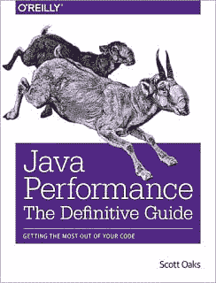](http://www.amazon.com/Java-Performance-The-Definitive-Guide/dp/1449358454?tag=javamysqlanta-20)

### [8。头先 Java](http://www.amazon.com/dp/0596009208/?tag=javamysqlanta-20)

你们中有多少人是通过阅读这本书开始学习 Java 的？好吧，我做到了。就在我开始了解*头先设计模式*之后，我也发现了这本书， [*头先 Java*](http://www.amazon.com/dp/0596009208/?tag=javamysqlanta-20) ，我真的很喜欢看。我学到了许多 Java 概念，我的许多误解也得到纠正。

尽管许多人认为这是一本过时的书，但我仍然认为这是一本适合任何刚开始学习 Java 的人的好书，因为它有独特的风格和内容。

通过阅读这本书，一旦你了解了 Java，你可以很容易地了解到其他版本上的 [Java 8](http://www.java67.com/2014/09/top-10-java-8-tutorials-best-of-lot.html) 、 [Java 9](http://www.java67.com/2018/01/top-10-java-9-tutorials-and-courses.html) 、 [Java 10](http://javarevisited.blogspot.sg/2018/03/java-10-released-10-new-features-java.html) 的变化。

[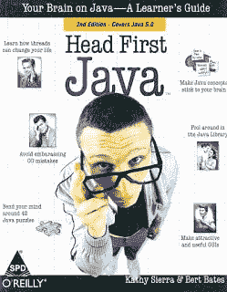](http://www.amazon.com/dp/0596009208/?tag=javamysqlanta-20)

顺便说一句，如果你喜欢在线课程，并且正在寻找一些最好的 Java 课程来开始你的旅程，那么 Udemy 上的**Java 大师班就是最新和最好的课程。**

 **### [9。头先面向对象的分析与设计](http://www.java67.com/2016/10/top-5-object-oriented-analysis-and-design-patterns-book-java.html)

这里是最伟大的 Java 书籍列表中的另一本“Head First”书籍。是的，他们简直太棒了。

[*头先面向对象分析与设计*](http://www.java67.com/2016/10/top-5-object-oriented-analysis-and-design-patterns-book-java.html) 形成了 Java 程序员“头先”书籍的三部曲，即 [*头先 Java*](http://javarevisited.blogspot.sg/2017/02/top-5-core-java-books-for-beginners.html)*头先设计模式**头先 OOAD* 。

通过解释面向对象编程和设计的技术，它实际上补充了*头先设计模式*。

我从这本书中学到的最重要的技术是为接口编码以及如何封装变化。这本书只是改变了我编写 Java 代码的方式。

[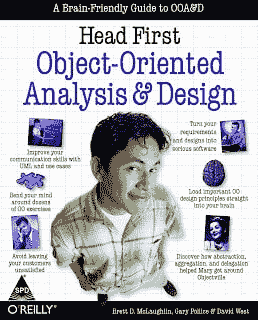](http://www.java67.com/2016/10/top-5-object-oriented-analysis-and-design-patterns-book-java.html)

如果你喜欢课程，Sujith George 在 Udemy 上写的[**SOLID Principles:Introducing Software Architecture&Design **](https://click.linksynergy.com/deeplink?id=JVFxdTr9V80&mid=39197&murl=https%3A%2F%2Fwww.udemy.com%2Fcourse%2Fsolid-design%2F)很棒，你可以跟着这本书更好地理解面向对象的设计原则。

### [10。Java:初学者指南](https://www.amazon.com/Java-Beginners-Seventh-Herbert-Schildt/dp/1259589315?tag=javamysqlanta-20)

如果你需要一本全面的 Java 书籍，这本书应该就是了。尽管标题写着 [*Java:初学者指南*](https://www.amazon.com/Java-Beginners-Seventh-Herbert-Schildt/dp/1259589315?tag=javamysqlanta-20) ，但这是学习 Java 最完整的书籍之一。

Herbert Schildt 爵士在保持这本书的更新方面也做了值得称赞的工作，比如这本书的第 7 版现在涵盖了 Java 9。

不过，我不知道他将如何让这本书保持最新，因为 Java 的新 6 个月发布周期是从 Java 10 开始的。

顺便说一句，他们已经发布了一个补充，涵盖 [JDK 10 个新功能](https://javarevisited.blogspot.com/2018/03/java-10-released-10-new-features-java.html)。我认为这将是前进的方向。

[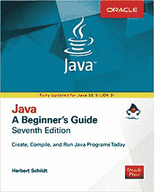](https://www.amazon.com/Java-Beginners-Seventh-Herbert-Schildt/dp/1259589315?tag=javamysqlanta-20)

这就对了。这些是 Java 程序员的最佳书籍。如果你是一个热情的 Java 程序员，很有可能你已经读过这些书的大部分了。

但是，如果你还没有，那么今年可能是阅读这些书的最佳时机。他们真的很棒。你可以尽可能选择最新版本的书，例如 [*有效的 Java 第三版*](http://javarevisited.blogspot.sg/2017/10/effective-java-3rd-edition-coming-soon.html) 或 *Java:初学者指南* *的[第七版。](https://www.amazon.com/Java-Beginners-Seventh-Herbert-Schildt/dp/1259589315?tag=javamysqlanta-20)*

您可能喜欢的其他**文章**探索
[完整的 DevOps 路线图](https://hackernoon.com/the-2018-devops-roadmap-31588d8670cb)
[Java 和 Web 开发人员 2021 年应该学习的 10 件事](http://javarevisited.blogspot.sg/2017/12/10-things-java-programmers-should-learn.html#axzz53ENLS1RB)
[Java 开发人员应该知道的 10 个测试工具](http://javarevisited.blogspot.sg/2018/01/10-unit-testing-and-integration-tools-for-java-programmers.html)
[5 个框架 Java 开发人员应该在 2021 年学习的 10 本书](http://javarevisited.blogspot.sg/2018/04/top-5-java-frameworks-to-learn-in-2018_27.html)
[每个 Java 程序员应该在 2021 年阅读的 10 本书](http://www.java67.com/2018/02/10-books-java-developers-should-read-in.html)
[Java 开发人员日常使用的 10 个工具 应读](http://javarevisited.blogspot.sg/2017/03/10-tools-used-by-java-programming-Developers.html#axzz55lrMRnNC)
[50+数据结构与算法题](https://hackernoon.com/50-data-structure-and-algorithms-interview-questions-for-programmers-b4b1ac61f5b0)
[2021 年 Java 程序员应读的 21 本书](https://medium.com/javarevisited/10-books-java-developers-should-read-in-2020-e6222f25cc72)

### 期末备注

谢谢，你坚持到了文章的结尾...祝您的 Java 编程之旅好运。这当然不会很容易，但是通过阅读这些书，你会获得一些有用的经验。

如果你喜欢这篇文章，那么请分享给你的朋友和同事，别忘了在 Twitter 上关注 [javinpaul](https://twitter.com/javinpaul) ！

> **附:如果你喜欢在线课程并寻找一些最好的 Java 课程来开始你的旅程，那么 Udemy 上的**[**Java 大师班**](https://click.linksynergy.com/fs-bin/click?id=JVFxdTr9V80&subid=0&offerid=323058.1&type=10&tmpid=14538&RD_PARM1=https%3A%2F%2Fwww.udemy.com%2Fjava-the-complete-java-developer-course%2F) **是最好的开始课程。****