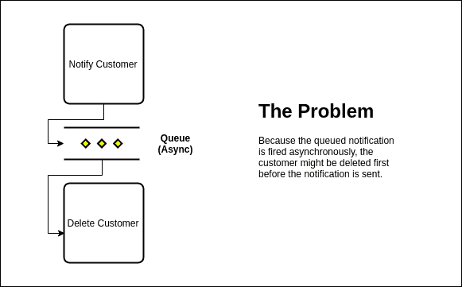

# Laravel:已删除用户或雄辩模型的排队通知

> 原文：<https://dev.to/alchermd/laravel-queued-notifications-for-a-deleted-user-or-eloquent-model-36fl>

<small>[被自由股覆盖](https://www.pexels.com/@freestocks)</small>

## 目录

*   [内容](#contents)
*   [简介](#introduction)
*   [我们手头的问题](#our-problem-at-hand)
*   [明显的症状](#the-obvious-symptom)
*   [解决方案](#solution)
*   不要忘记考试！
*   常规口才模特怎么样？
    *   [作为数组](#1-pass-an-array-representation-of-the-model)
    *   [仅相关字段](#2-pass-only-the-relevant-model-fields)
*   [结论](#conclusion)

## 简介

开箱即用， [Laravel](https://laravel.com/) 为利用[队列](https://laravel.com/docs/queues)和/或 [Redis](https://laravel.com/docs/redis) 支持您的排队作业、邮件或任何其他昂贵的(时间或资源方面的)操作提供了强大的工具。但是，当处理对象时，队列的异步特性可能会让您陷入困境，因为一旦执行了排队的操作，就很难看到对象的当前状态。在本文中，我们将研究两个可能出现这种情况的例子。

## 我们手头的问题

我们在 ACME 空调的朋友有一个购物车系统，客户可以在线购买他们想要的空调设备，只要他们在该系统中有一个帐户。现在，一个功能请求进来了，规格描述如下(在 [GWT](https://www.martinfowler.com/bliki/GivenWhenThen.html) 中):

```
Feature: Farewell Email Promotion for a Deleted Customer
    Scenario: Customer deletes their account
        Given I have my email verified

        When I delete my customer account

        Then I will receive an email containing ACME's farewell promo 
```

Enter fullscreen mode Exit fullscreen mode

现在我们如何实现这个特性呢？这看起来很简单:在删除他们的账户之前给用户发一封电子邮件:

```
// CustomerController.php

public function destroy(Customer $customer)
{
    $customer->notify(new FarewellPromotion());
    $customer->delete();

    // ...
}

// FarewellPromotion.php

class FarewellPromotion extends Notification implements ShouldQueue
{
    use Queueable;

    public function toMail($notifiable)
    {
        return (new MailMessage)
            ->line('We are sad to see you go.')
            ->line('How about a 2-for-1 special?')
            ->action(
                'Buy Now,
                '/farewell-promo'
            );
    }
} 
```

Enter fullscreen mode Exit fullscreen mode

但是令我们惊讶的是，`$customer`从来没有收到过这封邮件！为什么？让我们进一步检查一下。

## 明显的症状

嗯，再看一下程序流程。当您考虑到`$customer->notify(new FarewellPromotion());`将通知*推入队列*，从而异步通知用户**时，这一点就变得很明显了。简而言之，帐户删除发生在通知发送之前的**。这会导致通知失败，因为它的目标收件人已经被删除(或者更准确地说，`null`)。****

 **[](https://res.cloudinary.com/practicaldev/image/fetch/s--IjVfyYDD--/c_limit%2Cf_auto%2Cfl_progressive%2Cq_auto%2Cw_880/https://i.imgur.com/aKb4RlS.png)

## 解

您可以通过**而不是**对通知进行排队(UX 无法接受)或者通过存储客户的电子邮件地址并直接发送邮件(稍微好一点，但是放弃了通知的抽象)来解决这个问题。但是幸运的是，Laravel 支持[按需通知](https://laravel.com/docs/notifications#on-demand-notifications)，允许在没有`Notifiable`实例(在我们的例子中是客户)的情况下发送通知。

```
// CustomerController.php

public function destroy(Customer $customer)
{
    $customer->delete();

    // Doesn't matter if it's before or after deletion since 
    // the Customer instance still has its properties 
    // up until the request context expires.
     Notification::route('mail', $customer->email)
            ->notify(new FarewellPromotion());

    // ...
} 
```

Enter fullscreen mode Exit fullscreen mode

## 不要忘记考试！

一旦您将实现从简单的通知更改为按需通知，您就必须更改考虑到该特性的任何测试用例。一个测试用例可能看起来像这样:

```
/** @test */
public function customers_that_deletes_their_account_is_notified_of_the_farewell_promo()
{
    Notification::fake();

    $customer = factory(Customer::class)->create();

    $this->delete('/customers/' . $customer->id);

    Notification::assertSentTo(
        $customer,
        FarewellPromotion::class
    );
} 
```

Enter fullscreen mode Exit fullscreen mode

这个测试用例现在会失败，因为一旦断言完成，`$customer`就已经是`null`了。相反，我们应该使用`AnonymousNotifiable`类来代表我们的客户，就像使用 [`Notification::route`](https://laravel.com/docs/5.8/notifications#on-demand-notifications)
时的情况一样

```
use Illuminate\Notifications\AnonymousNotifiable;

Notification::assertSentTo(
    new AnonymousNotifiable,
    FarewellPromotion::class
); 
```

Enter fullscreen mode Exit fullscreen mode

## 正规口才模特怎么样？

这涵盖了如何通知一个使用了`Notifiable`特征的被删除的`Customer`模型。但是如果我们需要一个队列通知的删除模型呢？考虑以下情况:

```
Feature: Recommend another Product when a Customer's "liked" Product is Deleted
    Scenario: A Product is Deleted
        Given I have my email verified
            And I have "liked" a product

        When that product is deleted

        Then I will receive a notification that recommends me another product. 
```

Enter fullscreen mode Exit fullscreen mode

现在很明显，盲目地将`Product`模型传递到队列通知中会导致我们之前遇到的相同的异步问题:

```
// ProductsController.php

public function delete(Product $product)
{
    $product->delete();

    $product->likers->notify(new SimilarProductRecommendation($product));
}

// SimilarProductRecommendation.php
class SimilarProductRecommendation extends Notification implements ShouldQueue
{
    use Queueable;

    private $product;

    public function __construct(Product $product)
    {
        $this->product = $product;
    }

    public function toArray($notifiable)
    {
        return [
            'message' => $this->product->name . ' has been deleted. Try this other product....' 
        ];
    }
} 
```

Enter fullscreen mode Exit fullscreen mode

没有明确的解决方案，因为不像`Customer`，`Product`不是`Notifiable`，我们不能利用`Notification::route()`方法。当我面临这个问题时，我会使用以下解决方案之一:

### 1。传递模型的数组表示

```
// ProductsController.php
public function delete()
{    
    $product->delete();

    $product->likers->notify(new SimilarProductRecommendation($product->toArray()));
}

// SimilarProductRecommendation.php
class SimilarProductRecommendation extends Notification implements ShouldQueue
{
    use Queueable;

    private $product;

    public function __construct(array $product)
    {
        $this->product = $product;
    }

    public function toArray($notifiable)
    {
        return [
            'message' => $this->product['name'] . ' has been deleted. Try this other product....' 
        ];
    }
} 
```

Enter fullscreen mode Exit fullscreen mode

### 2。仅传递相关的模型字段

```
// ProductsController.php
public function delete()
{    
    $product->delete();

    $product->likers->notify(new SimilarProductRecommendation($product->name));
}

// SimilarProductRecommendation.php
class SimilarProductRecommendation extends Notification implements ShouldQueue
{
    use Queueable;

    private $productName;

    public function __construct(string $productName)
    {
        $this->productName = $productName;
    }

    public function toArray($notifiable)
    {
        return [
            'message' => $this->productName . ' has been deleted. Try this other product....' 
        ];
    }
} 
```

Enter fullscreen mode Exit fullscreen mode

这两种解决方案都通过传递单独的值*而不是对模型本身的引用*来绕过被删除模型的不可预测状态。

## 结论

在本文中，我们已经讨论了在处理被删除的实体时，排队通知可能出现的棘手问题。我们还介绍了如何通知一个被删除的`User`(或者任何实现`Notifiable`特征的模型，准确地说)并测试所述动作。最后，我们看了一下将删除的雄辩模型引用传递给排队的通知，并讨论了几个关于如何“访问”这些删除的模型的解决方案。**