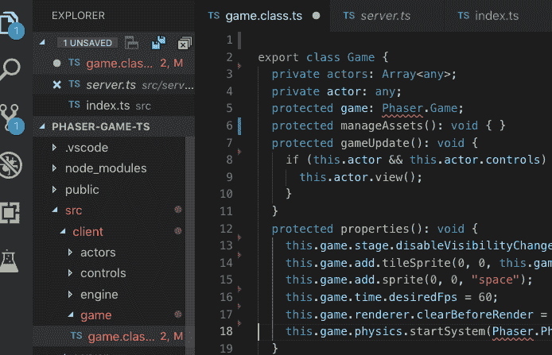

# 成员类型不正确的类型脚本库

> 原文：<https://dev.to/logicmason/typescript-libraries-with-incorrectly-typed-members-1ln7>

我最近报道了一个简单的方法，当处理第三方库丢失或不正确的类型时，这个方法可以让打字稿沉默。

《邮报》提出的另一个问题是:

> 如何修复 TypeScript“命名空间没有导出的成员”错误？

[](https://res.cloudinary.com/practicaldev/image/fetch/s--upBHVSCS--/c_limit%2Cf_auto%2Cfl_progressive%2Cq_auto%2Cw_880/https://thepracticaldev.s3.amazonaws.com/i/x2107udznzf4ypn6kqnz.png)

## 问题

假设您正在使用流行的 JavaScript 游戏框架 Phaser，它有多个复杂的深度嵌套对象。提供的类型实际上总是与库本身过时，因为 Phaser 很复杂，变化很快，并且主要由编写 JS 而不是 TS 的人使用。

对于现有的 TypeScript 项目，如果您一直在更新类型，就不会有问题。但是当您将一个项目从 JS 迁移到 TS 时，您将会遇到许多错误。即使是最新版本的框架上的新项目也可能是一个充满红色曲线和类型错误的编辑器。

更糟糕的是，代码的某些部分必须引用 Phaser 的成员。即使你在应用程序的顶部写下`declare const Phaser: any;`来消除导入或使用 Phaser 的所有 TS 错误，你仍然有两个问题。首先，这是多余的，你可能确实想让你的应用程序类型化，包括 Phaser 部分。第二，你可能要创建自己的类，它有一个类型为`Phaser.Game`的成员。由于`Phaser.Game`也非常复杂，并且通常附带不完整或过时的类型，您最终会得到“名称空间没有导出的成员错误”。

## 解

在第三方库的外部工作。通过在第三方库的名称空间中导出成员类型*来禁用对成员类型的警告。* 

```
namespace Phaser {
  export type Game = any;
}

export class MyGame {
    private actors: Array<MyActorType>; 
    private actor: <MyActorType>;
    protected game: Phaser.Game;  // TS errors are silenced here now!
    protected manageAssets(): void { };
    // ... the rest of the MyGame class
} 
```

现在，你将不再得到关于 Phaser.Game 的错误。在其他模块中，当你使用`Game`的成员时，如果有进一步的嵌套类型问题，你可以用相同的过程更深入地挖掘。最终，您将着手处理简单的对象，这些对象对于正确键入来说微不足道。

当你解决这些问题的时候，你会发现第三方库*中所有在你的应用*中使用的部分都将被正确输入，而其他部分将被屏蔽。对于不断变化的大型第三方库，如 Phaser 或 Materialize，这是一个合理的权衡。

*订阅更多内容来自[logicmason.com](http://eepurl.com/diFSaf)T3】*