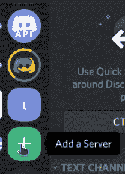
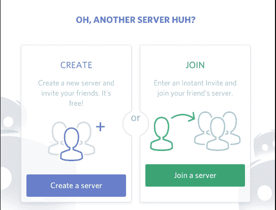
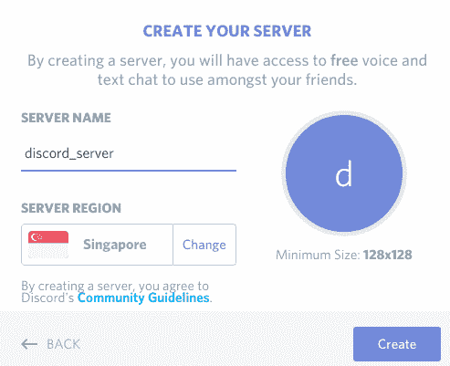
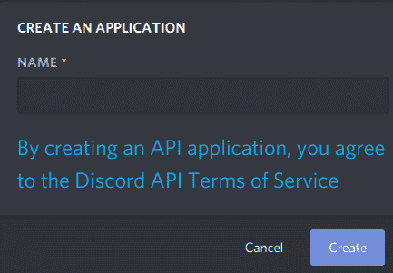
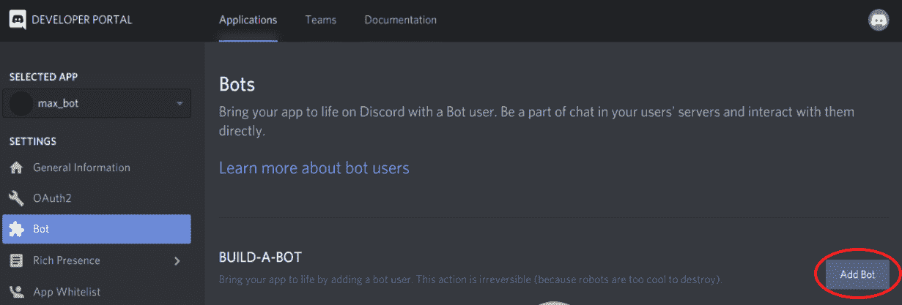
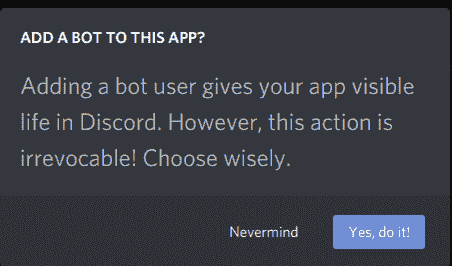
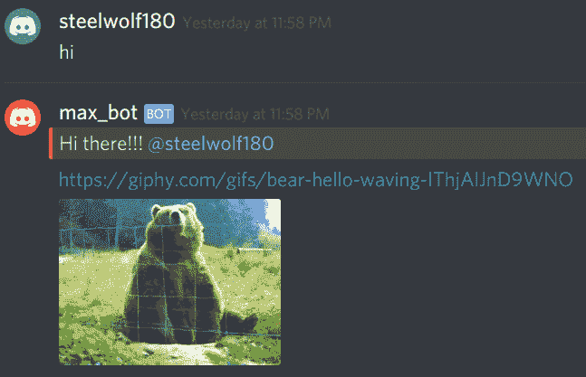
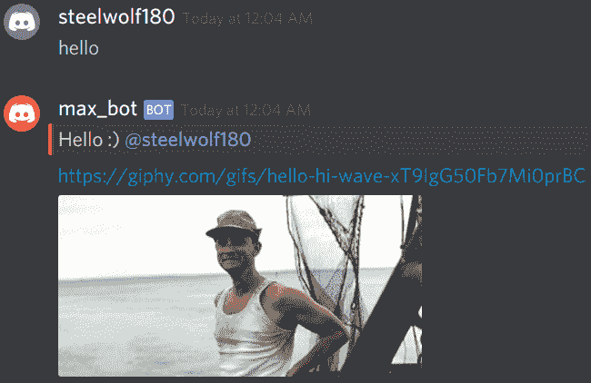

# 使用不和谐机器人提供 gif

> 原文：<https://dev.to/steelwolf180/serving-gifs-with-discord-bot-339n>

[](https://res.cloudinary.com/practicaldev/image/fetch/s--eHOucgBW--/c_limit%2Cf_auto%2Cfl_progressive%2Cq_auto%2Cw_880/https://thepracticaldev.s3.amazonaws.com/i/mrsm8z3obftfxxeryqhh.jpg)

# 简介

在本文中，我们的目标是对学习在 Discord 上构建自己的聊天机器人感兴趣的 Python 开发人员。

读者应该对 Python 有所了解。在 Python 中安装库和创建函数。

这是为了让读者利用现有的聊天工具来构建自己的机器人。

你有没有想过，你可以有自己的私人助理？帮你做家务或帮你完成任务？

当苹果首次公布其名为 **Siri** 的人工智能助手时。
在他们的苹果 iPhone 发布会上。

Siri 风靡全球，有大量关于有趣问题的文章或视频。人们问 Siri 的时候，就好像 Siri 是现实生活中的人一样。

今天我们将学习使用我们最喜欢的 Python 来创建我们自己的私人助理，用 gif 来回复你，而不仅仅是不和谐的话语！！！

## 什么是不和？

Discord 是一个 IP 语音(VoIP)应用程序，提供文本和语音通信。

这在喜欢使用服务器组织活动的游戏玩家或其他社区中很受欢迎。

这项服务就像 Telegram 或 Whatsapp 一样，提供了聊天语音通话和游戏功能的集成。

### 聊天机器人的兴起

随着越来越多的人开始使用 WhatsApp、Telegram、Facebook Messenger & Slack 等即时通讯客户端。

它引发了一股为各种目的创建聊天机器人的潮流，例如提高客户满意度和自动化流程。

### 聊天机器人的常见用法

寻找解决方案需要您访问 FAQ 页面或致电客户支持中心的日子已经一去不复返了。

取而代之的是一个闪亮的新机器人。

谁会给你讲笑话，给你提供解决方案，或者推荐适合你需求的产品或服务。

## 设置

好的，让我们开始着手设置我们的服务器。

我们应该在 [Discord](https://discordapp.com/) 上注册一个账户。

### 设置 Discord 服务器

创建帐户后，使用新创建的帐户登录。你将出现在`channels`页面。

这允许您添加一个*服务器→加上*图标来添加一个新的服务器，如下所示。

[](//images.ctfassets.net/ly2f59p4unnn/3hQ3SpCF7EIuk0KqRUXtEn/83c305f1431f1db63caa0b35897bb0ad/add_server.png)

点击**加**图标后，您将进入此页面，其中包含创建新服务器或加入现有服务器的选项。

[](//images.ctfassets.net/ly2f59p4unnn/50ZwIrklItaK90rUIUySy8/cc2f1f677efaff4ed88e4e8ab61dc1e4/create_server.png)

点击“创建服务器”按钮，然后填写您自己服务器的详细信息，并点击**创建**按钮。

[](//images.ctfassets.net/ly2f59p4unnn/5xCQV9ygLhgTqUP7VlrSbv/37cb93bf7cf3efc2e83745bba17b5c2a/discord_server_details.png)

恭喜你。！！您刚刚创建了您的第一台服务器。该服务器将用于本教程的剩余部分。与此同时，在继续工作之前先休息一下。

[](//images.ctfassets.net/ly2f59p4unnn/rdWev2lcITJqNpDhy94fV/77d56587546dc3236e2924e583103623/giphy.gif)

### 创建一个 App & Bot

好的，让我们去 Discord 的[开发者门户](https://discordapp.com/login?redirect_to=%2Fdevelopers)的，用你的账户登录。

一旦您进入开发人员门户，它看起来就像这样。

[](//images.ctfassets.net/ly2f59p4unnn/6DHG8Hf1saIBKc1P1QeIZe/0cfcd1fb654d0b43bddf6741512b9cdb/discord_developer_portal.png)

选择“新建应用程序”按钮创建新的应用程序。以便您的机器人能够使用令牌与您的服务器进行交互。

[](//images.ctfassets.net/ly2f59p4unnn/7ClOvsFf9H7NzTsamyqo6v/a5682219c15a21a881b9406231d94f44/Create_new_applications.png)

接下来，在侧边栏的**左侧**侧有一个名为`bot`的名字。点击`bot → Add Bot`按钮。

[](//images.ctfassets.net/ly2f59p4unnn/7kZ7ysr21sqjxEYG3REtaL/5ee9fdbb18f0efb82afbb4eb08806204/add_bot.png)

将显示一个提示，确认创建您的机器人。忽略它，继续点击“是，做”按钮。

[](//images.ctfassets.net/ly2f59p4unnn/1mbspRwSnmyJrOlCzo1usu/0de403ef2f175b814448940f9c3771b2/Yes_to_bot.png)

### 向您的服务器添加 Bot

现在，我们将继续向服务器添加新创建的机器人。

首先点击您创建的应用程序左侧的标签`General Information`。

然后点击客户端 id 下方的**复制**按钮，复制客户端 id。

这允许您从开发人员门户用应用程序的客户机 id 形成一个 URL，如下所示。

[](//images.ctfassets.net/ly2f59p4unnn/5Eee9o32qcaSdFYMLoYxOx/975ee8cc12e715f0a1a980d1a6103b27/application_client_id.png)T3】

```
https://discordapp.com/api/oauth2/authorize?scope=bot&client_id=bot_client_id 
```

Enter fullscreen mode Exit fullscreen mode

现在，在你的浏览器中打开一个新的标签，进入你刚刚创建的 URL。

你被重定向到一个网站，允许你批准你的机器人与服务器的连接。

[](//images.ctfassets.net/ly2f59p4unnn/722aT2c4Z2zVFbiQjBx04n/4613ceaf164ad60c4aa99336f0525aa1/add_bot_to_server.png)

恭喜你。！！现在你已经完成了你的机器人&服务器的**设置**过程。当你准备好开始编码时，请再次回到本教程。

[](//images.ctfassets.net/ly2f59p4unnn/2NMljh2d02BFylKTC9rXl5/761210bcb49cd357f371f95370c72d77/giphy.gif)

### 你好不和谐世界服务器

欢迎回来，让我们开始创建机器人。创建一个名为`discord`的文件夹。

接下来，在同一个文件夹中创建一个名为`venv`的虚拟环境。

```
$  virtualenv --python=python3 venv
$  source venv/bin/activate 
```

Enter fullscreen mode Exit fullscreen mode

对于您已经创建的虚拟环境，我们必须安装如下所示的库:

```
$  python3 -m pip install -U discord.py 
```

Enter fullscreen mode Exit fullscreen mode

使用您的 bot 令牌创建一个名为`bot.py`的文件，该文件位于开发人员门户的“Bot”选项卡下:

[](//images.ctfassets.net/ly2f59p4unnn/6itFDeIqcb6reP28PvkRfZ/30aedbe33528a24c3162a69204f00ded/copy_bot_token.png)T3】

```
import discord

token = 'your_discord_bot_token' 
```

Enter fullscreen mode Exit fullscreen mode

为了让你的机器人工作，你需要创建一个名为`DiscordClient`的 Python 类。

这个类必须至少包含两个函数，即`on_ready()` & `on_message()`，如下所示:

```
class DiscordClient(discord.Client):
    async def on_ready(self):
        pass

    async def on_message(self, message):
        pass 
```

Enter fullscreen mode Exit fullscreen mode

`on_ready()`函数用于使用您的 bot 令牌
建立到您的服务器的连接

```
async def on_ready():
    print("Login as")
    print(self.user)
    print("-------") 
```

Enter fullscreen mode Exit fullscreen mode

每当用户说“你好”时，`on_message()`函数就会响应一条 **Hello** 消息:

```
async def on_message(self, message):
    # Whenever a user other than bot says "hi"
    if message.author != self.user:
        if message.content == 'hi':
            await message.channel.send('Hello')

client = DiscordClient()
client.run(token) 
```

Enter fullscreen mode Exit fullscreen mode

在包含了两个`on_ready()` & `on_message()`函数的代码之后。你的第一个机器人程序的`bot.py`应该是这样的:

`bot.py`

```
import discord

token = 'your_discord_bot_token'

class DiscordClient(discord.Client):
    async def on_ready(self):
        print("Login as")
        print(self.user)
        print("-------")

    async def on_message(self, message):
        # Whenever a user other than bot says "hi"
        if message.author != self.user:
            if message.content == 'hi':
                await message.channel.send('Hello')

client = DiscordClient()
client.run(token) 
```

Enter fullscreen mode Exit fullscreen mode

现在让我们运行程序，到你的服务器在**通用频道** :
中输入“嗨”

```
 $  python bot.py 
```

Enter fullscreen mode Exit fullscreen mode

[](//images.ctfassets.net/ly2f59p4unnn/5503ui7UhRrhjQhtZdVcL7/805efd74e0733755f5fd5f9557f355f7/hello_response.png)

厉害！！！！既然你已经让你的机器人说“你好”。让我们转到命令，并使用它。

## 不和谐的命令

有一堆与用户相关的有用命令。我只讲最基本的。

关于这些命令的更多细节，你可以去查看一下 [API 参考指南](https://discordpy.readthedocs.io/en/latest/ext/commands/commands.html)。

### 魔法 8 球

应该用**从`bot2.py`调用命令。**前缀。

使用名为`8ball`的命令。每当您启动该命令时，它都会以一个预测作为响应:

`bot2.py`

```
from discord.ext.commands import Bot
import random

token = 'your_bot_token'
bot = Bot(command_prefix='?')

@bot.event
async def on_ready():
    print("Login as")
    print(bot.user.name)
    print("-------")

@bot.command(name='8ball')
async def magic_eight_ball(ctx):
    response =[
        'Without a doubt.', 
        'Outlook good.', 
        'Better not tell you now.', 
        'Cannot predict now.',
        'My reply is no.', 
        'Outlook not so good.',
    ]

    await ctx.send(random.choice(response))

bot.run(token) 
```

Enter fullscreen mode Exit fullscreen mode

让我们执行 Python 程序，通过输入'？8 球。

[](//images.ctfassets.net/ly2f59p4unnn/6q8PMtrnJIfAIIOWmZF75W/48e66a41d8742a410764baa13461f0a4/8ball_command.png)

### 什么是语境？

请注意，对于每个 bot 命令，都需要调用参数`ctx`。

其被称为[上下文](https://discordpy.readthedocs.io/en/latest/ext/commands/api.html#discord.ext.commands.Context)以启动各种与机器人相关的命令。

## 使用 GIPHY Python 客户端

现在我们将集成 Giphy Python 客户端，如下所示:

```
 $  pip install giphy_client 
```

Enter fullscreen mode Exit fullscreen mode

一旦您完成了 giphy 客户端的安装，让我们前往 [Giphy 开发者门户](https://developers.giphy.com/)注册并创建一个新的应用程序。这样你就可以得到 **Giphy API 密匙**。

### 获得前 5 名热门 gif

对于`giphy.py`，导入以下内容。帮助启动`DefaultApi`和`ApiException`的`giphy_client`，处理与 **Giphy** API 相关的各种异常。

`pprints()`用于以易于阅读的格式显示响应:

```
 import giphy_client
from giphy_client.rest import ApiException
from pprint import pprint 
```

Enter fullscreen mode Exit fullscreen mode

配置字典使用 3 个键，即 Giphy 的 API 键`api_key`。

`query`是您搜索 **Giphy** 的搜索词，最后`limit`是从搜索结果:
返回的 gif 的数量

```
# Create an instance of the API class api_instance = giphy_client.DefaultApi()
config = {
    'api_key': 'your_api_key',  # Giphy API Key,
    'limit': 1,
    'rating': 'g'
}

try:
    api_response = api_instance.gifs_trending_get(
        config['token'], limit=config['limit'], rating=config['rating'])
    pprint(api_response)

except ApiException as e:
    print("Exception when calling DefaultApi->gifs_trending_get: %s\n" % e) 
```

Enter fullscreen mode Exit fullscreen mode

### 按单词或短语搜索 gif

要按单词搜索 gif，您需要进行以下更改。

从`.gifs_search_get()`开始，在`config`变量和`api_response`中增加一个名为`query`的额外字段，如下所示:

```
config = {'api_key': 'your_api_key', 'q': 'cheese', 'limit': 1, 'rating': 'g'}

try:
    api_response = api_instance.gifs_search_get(config['api_key'], limit=config['limit'], rating=config['rating'],q=config['q'])

except ApiException as e:
    print("Exception when calling DefaultApi->gifs_search_get: %s\n" % e) 
```

Enter fullscreen mode Exit fullscreen mode

### 随机 Gif

要得到一个随机的 gif，你需要从`config`变量中删除`query` & `limit`字段。

除此之外，你还必须更换`.gifs_search_get()`才能使用`.gifs_random_get()`，如下图所示。

```
 config = {
    'token': 'your_giphy_token',  # Giphy API Key. }

try:
    api_response = api_instance.gifs_random_get(config['api_key']) 
```

Enter fullscreen mode Exit fullscreen mode

让我们休息一下，开始应用我们从机器人那里学到的东西来服务 gif。

## Python 中的机器人服务 gif

欢迎回来:)我们将从使用 Giphy 库搜索 gif 开始，并将其上传到您的服务器上，作为 Python 程序“bot2.py”中 bot 的响应。

### 在服务器上显示 gif

导入以下库:

```
import random
import giphy_client
from discord.ext.commands import Bot
from giphy_client.rest import ApiException 
```

Enter fullscreen mode Exit fullscreen mode

添加 giphy 客户端和`ApiException`之后。让我们重构我们的原始代码，以包含 giphy 令牌:

```
 discord_token = 'your_discord_token'
giphy_token = 'giphy_api_key'

bot = Bot(command_prefix='?')
api_instance = giphy_client.DefaultApi() 
```

Enter fullscreen mode Exit fullscreen mode

### 搜索 gif

现在让我们创建一个名为`search_gifs()`的函数，其中 giphy API 将搜索 gif。

一旦我们搜索了 3 张 gif，每当调用`8ball`命令:
时，它会随机选取一张 gif 并显示 **URL**

```
 async def search_gifs(query):
    try:
        response = api_instance.gifs_search_get(giphy_token, 
            query, limit=3, rating='g')
        lst = list(response.data)
        gif = random.choices(lst)

        return gif[0].url

    except ApiException as e:
        return "Exception when calling DefaultApi->gifs_search_get: %s\n" % e 
```

Enter fullscreen mode Exit fullscreen mode

### 增强不和谐的命令

我们现在将把`search_gifs()`函数添加到`magic_eight_ball()`函数中:

```
 @bot.command(name='8ball')
async def magic_eight_ball(ctx):
    response = [
        'Without a doubt.', 
        'Outlook good.', 
        'Better not tell you now.', 
        'Cannot predict now.',
        'My reply is no.', 
        'Outlook not so good.',
    ]

    gif = await search_gifs('cheese')

    await ctx.send(random.choice(response))
    await ctx.send('Gif URL : ' + gif) 
```

Enter fullscreen mode Exit fullscreen mode

一旦你用 gif 搜索库重构了你的`bot2.py`。它应该如下图所示:

`bot2.py`

```
 import random
import giphy_client
from discord.ext.commands import Bot
from giphy_client.rest import ApiException

discord_token = 'your_discord_token'
giphy_token = 'giphy_api_key'

bot = Bot(command_prefix='?')
api_instance = giphy_client.DefaultApi()

@bot.event
async def on_ready():
    print("Login as")
    print(bot.user.name)
    print("-------")

async def search_gifs(query):
    try:
        response = api_instance.gifs_search_get(giphy_token, query, limit=3, rating='g')
        lst = list(response.data)
        gif = random.choices(lst)

        return gif[0].url

    except ApiException as e:
        return "Exception when calling DefaultApi->gifs_search_get: %s\n" % e

@bot.command(name='8ball')
async def magic_eight_ball(ctx):
    response = [
        'Without a doubt.',
        'Outlook good.',
        'Better not tell you now.',
        'Cannot predict now.',
        'My reply is no.',
        'Outlook not so good.',
    ]

    gif = await search_gifs('cheese')

    await ctx.send(random.choice(response))
    await ctx.send('Gif URL : ' + gif)

bot.run(discord_token) 
```

Enter fullscreen mode Exit fullscreen mode

### 显示 Gif

让我们执行`bot2.py`来测试`8ball`命令，通过输入以下命令来执行您的 bot2.py:

```
 $  python bot2.py 
```

Enter fullscreen mode Exit fullscreen mode

[](//images.ctfassets.net/ly2f59p4unnn/3wnJZdf0URM5SJFigkLOez/42b33e814771836a89c6827005df2048/8ball_command_gif.png)

厉害！！！真的管用:)好吧。在我们开始创建 gif 反应命令的时候，让我们休息一下，来个 KitKat。

[](//images.ctfassets.net/ly2f59p4unnn/3u0Rx1C19y6p2MVuJVEj7r/2853d37b61535f6cadf1b8cb41b327e2/giphy.gif)

## 显示机器人的反应

到目前为止，我们已经学会了搜索 gif 并在任何人调用命令时显示我们的 gif。

让我们创建一个机器人，根据下面的“嗨”、“欢迎”、“再见”和“再见”来为我们提供 gif，这个机器人叫做`bot3.py` :

```
 import random
import discord
import giphy_client
from giphy_client.rest import ApiException

discord_token = 'your_discord_token'
giphy_token = 'your_giphy_api_key'

api_instance = giphy_client.DefaultApi() 
```

Enter fullscreen mode Exit fullscreen mode

让我们添加之前创建的`search_gifs()`函数。

我们将搜索的 gif 数量从 3 个增加到 5 个。它将用来产生一个更随机的 gif 响应:

```
 def search_gifs(query):
    try:
        return api_instance.gifs_search_get(giphy_token,
 query, limit=5, rating = 'g')

    except ApiException as e:
        return "Exception when calling DefaultApi->gifs_search_get: %s\n" % e 
```

Enter fullscreen mode Exit fullscreen mode

除了`search_gifs()`函数之外，我们还应该添加一个`gif_response()`，它是从`search_gifs()`中分解出来的一部分代码，这样更加清晰和易于理解:

```
 def gif_response(emotion):
    gifs = search_gifs(emotion)
    lst = list(gifs.data)
    gif = random.choices(lst)

    return gif[0].url 
```

Enter fullscreen mode Exit fullscreen mode

### 嗨

既然我们已经添加了`search_gifs()` & `gif_response()`功能。

我们必须包含如下所示的`DiscordClient` Python 类和`on_ready()`函数，用于 bot 的基本设置。

```
 class DiscordClient(discord.Client):
    async def on_ready(self):
        print("Login as")
        print(self.user)
        print("-------") 
```

Enter fullscreen mode Exit fullscreen mode

现在，让我们集中精力创建一个逻辑，每当用户对机器人说“嗨”或“你好”时，机器人就会做出响应:

```
 async def on_message(self, message):
    # Whenever a user other than bot says "hi"
    if message.author != self.user:
        if message.content == 'hi':
            await message.channel.send('Hi there!!! ' + message.author.mention)
            await message.channel.send(gif_response('hi'))

        elif message.content == 'hello':
            await message.channel.send('Hello :) ' + message.author.mention)
            await message.channel.send(gif_response('hello')) 
```

Enter fullscreen mode Exit fullscreen mode

`bot3.py`

```
 import random
import discord
import giphy_client
from giphy_client.rest import ApiException

discord_token = 'your_discord_token'
giphy_token = 'your_giphy_api_key'

api_instance = giphy_client.DefaultApi()

def search_gifs(query):
    try:
        return api_instance.gifs_search_get(giphy_token, query, limit=5, rating = 'g')

    except ApiException as e:
        return "Exception when calling DefaultApi->gifs_search_get: %s\n" % e

def gif_response(emotion):
    gifs = search_gifs(emotion)
    lst = list(gifs.data)
    gif = random.choices(lst)

    return gif[0].url

class DiscordClient(discord.Client):
    async def on_ready(self):
        print("Login as")
        print(self.user)
        print("-------")

    async def on_message(self, message):
        # Whenever a user other than bot says "hi"
        if message.author != self.user:
            if message.content == 'hi':
                await message.channel.send('Hi there!!! ' + message.author.mention)
                await message.channel.send(gif_response('hi'))

            elif message.content == 'hello':
                await message.channel.send('Hello :) ' + message.author.mention)
                await message.channel.send(gif_response('hello'))

client = DiscordClient()
client.run(discord_token) 
```

Enter fullscreen mode Exit fullscreen mode

[](//images.ctfassets.net/ly2f59p4unnn/7HSGlFsKABaWgqGUkMubA2/f5c9c573ce8c9ccbee44a9681d89c1c9/hi_response.png)

[](//images.ctfassets.net/ly2f59p4unnn/7gTe6atJdUClEg0FwstbYa/a5205db670e1fe8068d829ef008b0467/hello_response.png)

### 欢迎光临

通过增强`on_message()`功能，每当用户说“欢迎”时，包含“欢迎”响应:

```
 elif message.content == 'welcome':
    await message.channel.send(message.author.mention + 
        ' Welcome to the discord channel :)')
    await message.channel.send(gif_response('welcome')) 
```

Enter fullscreen mode Exit fullscreen mode

[](//images.ctfassets.net/ly2f59p4unnn/frtIII9e42FEjyaku0gq9/25b7388a5a8d44fa6174a62aacbdb1ea/welcome_response.png)

使用`message.author.mention`，机器人回复用户

### 再见

这是我们为机器人添加的最后一个响应，每当用户说“再见”或“再见”时，机器人就会说“再见”:

```
 elif message.content == 'bye':
    await message.channel.send(message.author.mention + 
        ' May the force be with you')
    await message.channel.send(gif_response('star wars bye'))

elif message.content == "good bye":
    await message.channel.send(message.author.mention + 
        ' Live long and prosper')
    await message.channel.send(gif_response('salute')) 
```

Enter fullscreen mode Exit fullscreen mode

[](//images.ctfassets.net/ly2f59p4unnn/5H1R9HGlNEXKH2fb2cTjvu/26cdbb5a3338b620bd981e52611b3242/bye_response.png)

[](//images.ctfassets.net/ly2f59p4unnn/2fw8uYZqM0BSx9dvlJFmfk/cccc4ecfd16cf6ee39041bc71ef9d81a/good_bye_response.png)

现在，如果你对多个 gif 回复感到困惑，不要担心，我已经包含了如下所示的`bot3.py`的代码块:

`bot3.py`

```
 import random
import discord
import giphy_client
from giphy_client.rest import ApiException

discord_token = 'your_discord_token'
giphy_token = 'your_giphy_api_key'

api_instance = giphy_client.DefaultApi()

def search_gifs(query):
    try:
        return api_instance.gifs_search_get(giphy_token, query, limit=5, rating = 'g')

    except ApiException as e:
        return "Exception when calling DefaultApi->gifs_search_get: %s\n" % e

def gif_response(emotion):
    gifs = search_gifs(emotion)
    lst = list(gifs.data)
    gif = random.choices(lst)

    return gif[0].url

class DiscordClient(discord.Client):
    async def on_ready(self):
        print("Login as")
        print(self.user)
        print("-------")

    async def on_message(self, message):
        # Whenever a user other than bot says "hi"
        if message.author != self.user:
            if message.content == 'hi':
                await message.channel.send('Hi there!!! ' + message.author.mention)
                await message.channel.send(gif_response('hi'))

            elif message.content == 'hello':
                await message.channel.send('Hello :) ' + message.author.mention)
                await message.channel.send(gif_response('hello'))

            elif message.content == 'welcome':
                await message.channel.send(message.author.mention + ' Welcome to the discord channel :)')
                await message.channel.send(gif_response('welcome'))

            elif message.content == 'bye':
                await message.channel.send(message.author.mention + ' May the force be with you')
                await message.channel.send(gif_response('star wars bye'))

            elif message.content == "good bye":
                await message.channel.send(message.author.mention + ' Live long and prosper')
                await message.channel.send(gif_response('salute'))

client = DiscordClient()
client.run(discord_token) 
```

Enter fullscreen mode Exit fullscreen mode

## 结论

哇，现在你已经熟悉了创建一个机器人和使用一个 Giphy 库，这已经是相当不错的了。

让我们总结一下你在本教程中学到了什么。

您现在对以下内容有了更多的了解:

*   什么是不和谐？
*   聊天机器人的兴起
*   使用 Giphy Python 客户端
*   提供 gif 的机器人
*   显示机器人的反应

通过创建一个向任何用户提供 gif 的工作机器人。你可以向你的朋友吹嘘它。别担心我不会评判:)

你的作业是想办法进一步提高它。通过使用其他 RESTful APIs，甚至用它来创建游戏。

我建议你看看各种聊天机器人，以获得**灵感**来帮助你创建直观有趣的机器人。我期待着在未来看到你的机器人创作。

## 进一步阅读

这里有一些文章和教程可以帮助你增强你的机器人。

在我研究如何创建这个教程的时候，让你的用户感到互动和直观。

*   [使用 asyncio 在 Python 中进行异步编程](https://dev.to/welldone2094/async-programming-in-python-with-asyncio-12dl)
*   [通过并发加速您的 Python 程序](https://realpython.com/python-concurrency/)
*   [用 Python 和 Repl.it 构建不和谐机器人](https://www.codementor.io/garethdwyer/building-a-discord-bot-with-python-and-repl-it-miblcwejz)
*   [用 Python 制作不和谐机器人](https://www.devdungeon.com/content/make-discord-bot-python)
*   [Giphy Python 客户端](https://github.com/Giphy/giphy-python-client)
*   [我为什么创造巴士叔叔](https://medium.com/@abhilashmurthy/why-i-created-bus-uncle-40beb665c197)

如果你喜欢我的文章，请**注册**Max[冒险家简讯](http://eepurl.com/dOUoUb)获取我每周在 **Python** 、**创业**和 **Web 开发**偶然发现的牛逼内容。

你也可以**关注**我来获取我在 **Dev** 上的文章的**最新**更新

这篇文章最初发表在 Max 的博客上，时间是[提供不和谐的 gif 机器人阅读时间:12 分钟](https://www.maxongzb.com/serving-gifs-with-discord-bot-reading-time-12-mins/)和安迪·凯利在 Unsplash 上的[照片](https://unsplash.com/photos/0E_vhMVqL9g)