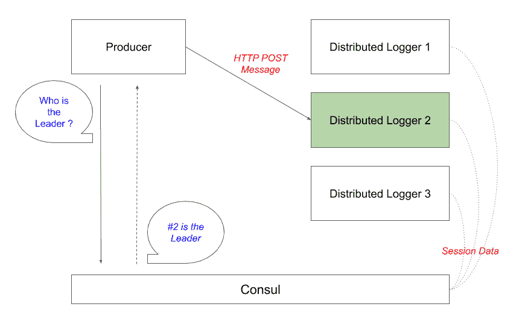
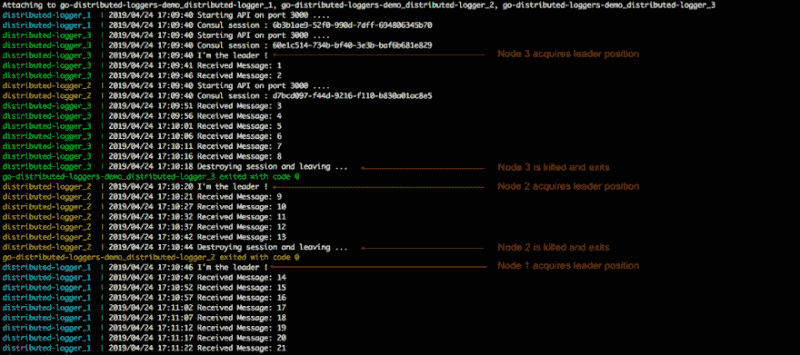

# 用 Go & Consul 构建一个简单的分布式系统

> 原文：<https://dev.to/didil/building-a-simple-distributed-system-with-go-consul-461e>

多年来，我一直在使用一些分布式系统，比如 Apache Kafka 和 Ethereum nodes，我想知道如何构建一个最小的系统。在这篇文章中，我们将使用 Go 和 Hashicorp Consul 构建一个微型的“类似卡夫卡”的分布式日志应用程序，它具有非常简单的功能。您可以使用这个 [github 库](https://github.com/didil/go-consul-distributed-loggers)来跟进。

[](https://res.cloudinary.com/practicaldev/image/fetch/s--wmONqTNd--/c_limit%2Cf_auto%2Cfl_progressive%2Cq_auto%2Cw_880/https://cdn-images-1.medium.com/max/743/1%2Az-KdPJS01RJP5vmu4cfOLg.png) 

<figcaption>Go + Consul:构建分布式系统的坚实组合</figcaption>

#### 什么是执政官？

看官方[网站](https://www.consul.io/intro/index.html)简介部分的定义:

> Consul 是一个服务网格解决方案，提供具有服务发现、配置和分段功能的全功能控制平面

这听起来可能有点可怕，但不要马上离开。我们将在本文中使用的主要 Consul 特性是**键/值存储**，它将支持我们简单的 [**领袖选举**](https://www.consul.io/docs/guides/leader-election.html) ** **系统**。**

#### 系统架构

下图显示了系统的架构:

[](https://res.cloudinary.com/practicaldev/image/fetch/s--K0jdMRtS--/c_limit%2Cf_auto%2Cfl_progressive%2Cq_auto%2Cw_880/https://cdn-images-1.medium.com/max/870/1%2AJLf894B4Pc7SU-8evfMd7A.png) 

<figcaption>分布式记录器 App 架构</figcaption>

该系统由 3 部分组成:

*   **consul** :为领导者选举和服务发现提供支持的 consul 实例。
*   **分布式记录器**:分布式记录器节点公开了一个 REST API，它将接收到的消息记录到 Stdout 中。在任何给定时间，只有集群领导者接受消息。在领导节点出现故障的情况下，一个新的节点接管。
*   **生产者**:生产者定期查询 Consul 以确定分布式记录器的领导者，并向其发送一个编号的消息。

#### 演示

您可以使用 [docker-compose](https://docs.docker.com/compose/) 运行演示，方法是拉动 [repo](https://github.com/didil/go-consul-distributed-loggers) 并运行:

```
$ docker-compose up -d --scale distributed-logger=3 
```

接下来发生的是:

*   咨询实例被启动。
*   启动 3 个分布式记录器实例，并向 Consul 注册一个[会话](https://www.consul.io/docs/internals/sessions.html)。
*   一个分布式日志记录者赢得了选举(在这种情况下，只是因为它从 Consul 获得锁的速度更快)并成为领导者。
*   制作人上线，然后每 5 秒钟向 Consul 查询一次领导者，并向其发送一条消息。
*   领导者接收消息并将其记录到 Stdout
*   如果领导者死亡或通过 SIGTERM 或 SIGINT 被杀死，一个新的分布式日志记录节点将接管领导者的工作，并开始接收来自生产者的消息

您可以看到下面的示例，其中节点 3 是领导者，然后是节点 2，然后是节点 1:

[](https://res.cloudinary.com/practicaldev/image/fetch/s--fKD_HyI_--/c_limit%2Cf_auto%2Cfl_progressive%2Cq_auto%2Cw_880/https://cdn-images-1.medium.com/max/1024/1%2Af_CwLC37BRPKyg7GeTbVgg.png) 

<figcaption>分布式记录器演示</figcaption>

#### 显示代码

完整的代码可以在 [repo](https://github.com/didil/go-consul-distributed-loggers) 中获得，但是让我们来看看这个应用程序的几个有趣的方面:

*   为了获得领导者状态，每个分布式记录器节点运行一个 goroutine，它定期尝试在 Consul 中获得一个锁: