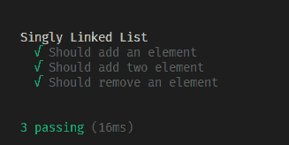

# 单链接列表——学习和实现 JS 中的数据结构:第 1 部分

> 原文：<https://dev.to/thamaraiselvam/singly-linkedlist-learn-and-implement-data-structure-in-js-part-1-21kh>

问题是，许多人试图学习数据结构，但没有实现它们。

人们开始担心数据结构。发生这种情况是因为每个人都听说过，良好的数据结构知识对技术面试很重要，所以人们痴迷于学习这些话题。他们没有意识到实施它们会比只是阅读它们更好。

所以我开始了这个系列来关注每个数据结构以及如何用 Javascript 实现它们。

在本文中，我们将用 Javascript 实现一个* *单向链接列表* *数据结构。

### 什么是单链表

> 链表是一种线性数据结构，我们可以在其中随意添加或删除元素，它甚至可以根据需要增长。就像数组一样，但是元素不是存储在连续的内存位置。链表中的元素使用指针进行链接。

[](https://res.cloudinary.com/practicaldev/image/fetch/s--9pQurJRI--/c_limit%2Cf_auto%2Cfl_progressive%2Cq_auto%2Cw_880/https://cdn.hashnode.com/res/hashnode/image/upload/v1556185078570/8dYXQPl7w.png)

### 实现单链表

```
class Node {
    constructor(element) {
        this.element = element;
        this.next = null;
    }
} 
```

Enter fullscreen mode Exit fullscreen mode

在上面的代码中，我们有两个属性`elements`保存当前节点的数据，而`next`保存下一个节点的指针(地址),该节点初始化为`null`。

```
class SinglyLinkedList {
    constructor() {
        this.head = null;
    }
} 
```

Enter fullscreen mode Exit fullscreen mode

上面的代码展示了一个带有构造函数的 SinglyLinkedList 类，链表有一个名为 **`head`的属性，它将保存链表的第一个节点** **。

#### 向列表中添加元素

```
add(element) {
    //create new node
    let node = new Node(element);

    let current = null;

    //If head is empty then insert at first item
    if (this.head == null) {
        this.head = node;
    } else {
        current = this.head;

        //iterate to end of list
        while (current.next) {
            current = current.next;
        }

        //Finally add new node
        current.next = node;
    }

    this.size++;
} 
```

Enter fullscreen mode Exit fullscreen mode

为了添加一个元素，最后，我们应该考虑以下几点:

*   如果列表为空，则添加一个元素，它将成为 head

*   如果列表不为空，则迭代到列表末尾，然后在列表末尾添加一个元素。

### 从列表中删除元素

```
removeElement(element) {
    if (this.head === null) {
        throw Error ('List is empty');
    }

    let current = this.head;
    let prev = null;

    //Iterate over the list
    while (current != null) {

        if (current.element === element) {
            //If prev node is null then first node is required element
            if (prev === null) {
                this.head = current.next;
            } else {
                //if prev node found then unset current node
                prev.next = current.next;
            }

            return current.element;
        }

        prev = current;

        //iterate to next node
        current = current.next;
    }
    return 'Element not found';
} 
```

Enter fullscreen mode Exit fullscreen mode

*   如果列表为空，则抛出一个错误
*   而(当前！= null)`迭代列表直到找到元素
*   `prev === null`如果`prev node`为空，则第一个节点是必需元素，因此将第二个节点作为头
*   如果找到前一个节点，那么`prev.next = current.next`从列表中分离当前节点

到此为止，我们已经介绍了单向链表的基本知识。

### 单元测试

```
var assert = require('assert');
const LinkedList = require('./single.linkedlist');

describe('Single Linked List', () =>{

    const linkedList = new LinkedList();
    it('Should add an element', () =>{
        linkedList.add(10);
        let result = linkedList.get('list');
        assert.equal(JSON.stringify(result), '{"element":10,"next":null}')
    })

    it('Should add two element', () =>{
        linkedList.add(20);
        linkedList.add(30);
        let result = linkedList.get('list');
        assert.equal(JSON.stringify(result), '{"element":10,"next":{"element":20,"next":{"element":30,"next":null}}}')
    })

    it('Should remove an element', () =>{
        linkedList.removeElement(20);
        let result = linkedList.get('list');
        assert.equal(JSON.stringify(result), '{"element":10,"next":{"element":30,"next":null}}')
    })
}) 
```

Enter fullscreen mode Exit fullscreen mode

[](https://res.cloudinary.com/practicaldev/image/fetch/s--0VVFuYX9--/c_limit%2Cf_auto%2Cfl_progressive%2Cq_auto%2Cw_880/https://cdn.hashnode.com/res/hashnode/image/upload/v1556187182742/dJmGVWgZ0.png)

查看 [Github Repo](https://github.com/thamaraiselvam/data-structures) 获取完整源代码。

请继续关注下一个故事。

这篇文章发表在 [Hashnode](https://thamaraiselvam.com/learn-and-implement-data-structure-in-js-part-1-singly-linkedlist-cjuwiew21000wyus1lxkr0lnk)