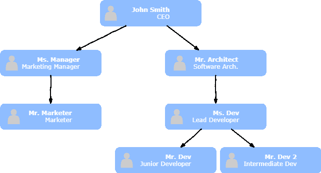
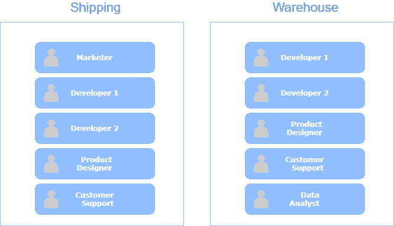

# 领导力和公司层级

> 原文：<https://dev.to/jamesmh/leadership-and-company-hierarchy-2fbm>

等级制度有什么有用的功能吗？

还是只是碍事？

扁平的等级制度难道不是当今的趋势吗？

# 扁平化层级

许多人认为公司应该有一个非常扁平的层级结构。

我听到一些人说，总体而言，等级制度是不“公平”的。每个人都应该感觉到他们在公司中的地位是平等的。

我还听到其他人给出了一个更实际的理由:沟通链应该非常扁平，以支持这样一种观点，即任何人都应该能够直接接触到他们需要与之交谈的任何人。

例如，如果一个开发人员需要和市场部的人通话，给他们一个直接的联系方式会更有效率。

# 平级层级

一种更“平”的层次结构似乎是企业层次结构的标准类型。你手下有经理和其他员工。

首席执行官将凌驾于软件架构师之上，而软件架构师又凌驾于首席开发人员之上，首席开发人员又凌驾于初级开发人员之上(例如)。

一些人认为等级制度是必需的，因为否则就会混乱。我们需要人们对业务的某些领域负责，并管理和委派所需的工作。

# 最好的型号是什么？

因此...哪个最好？

职场中等级制度是平等的敌人吗？是否妨碍高效沟通？

还是它带来了控制和健康的责任分配？

我认为这是一个伪困境。

*我觉得两者其实是兼容的！*

很多时候，我认为公司在一定程度上是两面经营的。

* * *

附:这篇文章最初来自[YourDevCareer.com](https://yourdevcareer.com)，在那里你可以找到更多的文章和资源来帮助你加速职业发展！

* * *

# 小公司允许轻松沟通

根据我的经验，我注意到小公司和团队(比如说 20 名员工以下)倾向于拥有一个任何人都可以自由地与任何人交流的环境。

例如，开发人员可以走进面向客户的支持室，就某个特性开始聊天。

这与现有的正式等级制度无关。

我认为这仅仅是因为在一个小团队中，你可以直接和任何人交流。就像小镇上的每个人都“认识每个人”

# 较大的公司会阻碍高效的沟通

另一方面，我在中型/大型公司工作过，并注意到与你希望的任何人交流的自由通常是不存在的。

这些公司通常有多个大型办公室。仅仅伸出手去和某个人说话并不容易——他们可能在另一个办公室！或者在不同的楼层！

在有等级制度的公司里，有一个清晰的指挥链。然而，事情需要更长的时间来沟通。

## 等级制度确实有助于维持秩序

我认为这种等级制度主要来自于维持秩序和控制的真正需要。

例如，试图组织 500 名员工是复杂而困难的。

我见过这种规模的公司声称拥有扁平的结构。但在实践中，员工有少数直接接触和沟通的渠道，感觉他们是“扁平的”。

# 解？

## 远程工装

对于如何最好地组织一家大公司，我绝不是超级博学的。

但我注意到，即使在我工作过的大公司，使用 Slack、谷歌的 G Suite、微软 Teams 等沟通工具。肯定会让事情变得简单很多。

鉴于越来越多的分布式公司(全远程)以及它们似乎取得的成功，我认为有意将组织中的沟通作为优先事项的公司，以及打破物理障碍的公司，将会避免“层级化”带来的许多问题。

## 更小的队伍

在小公司蓬勃发展的地方，大公司面临的一个问题是，员工通常只允许与比他们高一级、低一级的人直接沟通。

行业内有一种趋势，即组建专注于特定业务领域的小型跨职能团队。

如你所见，这种类型的组织可以让软件开发人员直接与产品经理沟通。

由清晰的指挥链解决的问题不在每个团队内部，而是存在于团队之间。

在这种情况下，运输团队的人很少需要与仓库团队的人交谈，因为他们关心的主要是他们关注的产品。

# 平等呢？

扁平的层级结构是否给了员工更多的平等？既然都被视为公司架构中的同一个“层级”？

不，我不这么认为。

这里是 G.K .切斯特顿的思想出现的地方(不是一字不差)。

层次结构可能有助于保持秩序、有效授权等。但是不管等级如何，这是对员工、*的*职能的定义，而不是他们的价值。**

事实上，很多时候，“较低”级别的员工会比“较高”级别的员工赚得更多。

例如，开发人员通常比非技术管理人员挣得多。

## 家庭类比

如果父母允许他们的孩子做任何他们想做的事情——因为他们希望他们是“平等的”?

3 岁的孩子想跑过马路去公园玩？当然可以！去吧！

5 岁的孩子想去垃圾场玩！没问题！

那是相当愚蠢的。

## 父母的角色

父母有责任教育和训练他们的孩子。

这是否意味着孩子是不平等的？他们是不是没那么人性了？少了一个社会成员？一点也不。

父母的角色是他们的职责。他们的职责是抚养和教育他们的孩子。但这与他们的价值或地位无关。

## 领导者的角色

在商业层级中也是如此。只是功能问题。

一个企业的领导是有责任的(或者应该是！)来指导他/她的下属。

一家公司的上级没有教导和帮助下属成长，这是一家非常不健康的公司。

(曾经在这种机器上工作过吗？)

有明确导师和学员的企业文化意味着实际上存在某种等级制度(即使企业认为不存在)。

# 我有什么好处？

在一天结束的时候，我想留给你们的主要观点是，我们不应该像平时那样过多地考虑等级制度。在某些情况下，它确实有助于控制和组织大量资源。

然而，一个健康的公司的主要标志不是他们是平的还是“平的”，而是是否有一个指导的环境。

让我们把这个带回家:

> 一家健康公司的主要标志不是它们是平的还是“平的”，而是是否有一个导师环境。

如果一个家庭中的孩子彼此没有任何关系，那就不是一个非常健康的情况。但是，如果年长的孩子帮助和教导年幼的孩子，那么这就形成了一个健康的环境，每个人都感到被包容和成长。

企业也是一样。人们只需要帮助和教导他们周围的人。

# 我向你挑战！

我对你的挑战是:

帮助你身边的人！谁在乎你的公司是平的还是什么的。寻求帮助你周围的人。

如果你处于领导的位置，比如说，一个高级职位，寻求建立一个环境，让每个人都有机会教他们周围的人。

如果文化不是你想要的，改变它是你的工作！

以下是一些让你开始的想法:

*   成对编程
*   暴民编程
*   两周一次的“午餐和学习”
*   在一个成功的项目之后，让那些开发人员正式分享他们学到的东西
*   代码审查

# 思想？

这是我第一篇花时间画了一些图的文章——你觉得它们有用吗？

你对这些问题有什么进一步的想法吗？

# 保持联系

不要忘记通过以下方式与我联系:

*   [推特](https://twitter.com/jamesmh_dev)
*   [LinkedIn](https://www.linkedin.com/in/jamesmhickey/)

你也可以在我的网站[www.jamesmichaelhickey.com](https://www.jamesmichaelhickey.com)找到我。

# 浏览您的软件开发职业简讯

一封电子邮件简讯，将帮助您提升软件开发人员的职业水平！有没有想过:

✔:软件开发人员的一般阶段是什么？✔:我怎么知道自己处于哪个阶段？我如何进入下一阶段？
✔什么是技术领导者，我如何成为一名技术领导者？✔，有人愿意和我一起走走，回答我的问题吗？

听起来有趣吗？加入社区吧！