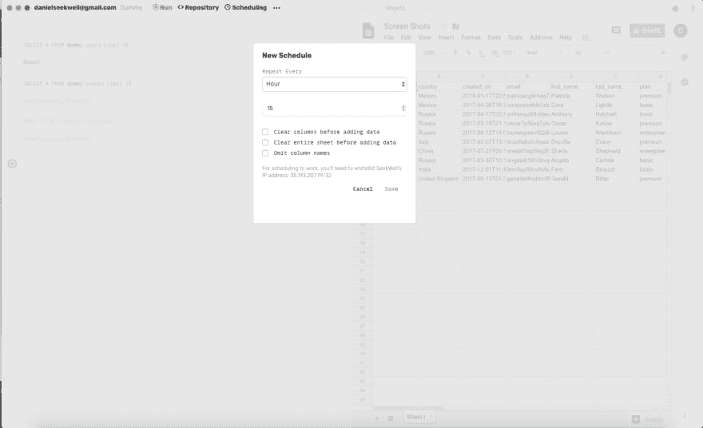

# 通过 jupiter notebook 自动化 python 脚本的三种方式

> 原文：<https://dev.to/fisherthabo/three-ways-to-automate-python-scripts-via-jupyter-notebook-205g>

[](https://res.cloudinary.com/practicaldev/image/fetch/s--Ek5igjf---/c_limit%2Cf_auto%2Cfl_progressive%2Cq_auto%2Cw_880/https://thepracticaldev.s3.amazonaws.com/i/6r8lypwhzsuizuletlno.png)

无论您是发送报告、执行长时间运行的任务还是更新仪表板，您都可能有一打左右的笔记本需要定期运行。你可以给自己设置提醒，确保团队中的每个人都有需要时运行的脚本(例如，你在度假)，并确保你在老板之前登录，这样你就可以更新仪表板，但在某些时候，你的时间成本会推动你走向自动化。我们将介绍三种实现这一目标的方法:

1.  在本地设置一个进程，在后台自动运行 Python 脚本
2.  使用 SeekWell 自动远程运行笔记本电脑
3.  设置您自己的服务器以远程运行笔记本电脑

### 1。本地(在您的计算机上)

**优点:**简单；没有额外费用
**缺点:**要求你的电脑 24/7 都保持清醒并连接互联网；设置非常耗时，具体取决于您的操作系统

**A .使用`nbconvert`将你的笔记本转换成. py 文件**
a .通过你的命令行导航到你的笔记本的目录
b .运行`jupyter nbconvert --to script 'my-notebook.ipynb'`
c .上面的命令将创建 my-notebook.py
d .运行 python `my-notebook.py`来测试它
e .关于`nbconvert`的更多信息可以在[这里找到](https://nbconvert.readthedocs.io/en/latest/usage.html#convert-script)

**B .按计划运行脚本**

*(Windows)通过任务调度器*
a .单击 Windows 开始菜单，单击控制面板>管理工具，然后单击任务调度器
b .在操作窗格上，单击创建基本任务操作
c .如果您的脚本位于“E:\testscript.py”中，请在任务调度器操作部分指定 C:\ path \ to \ python \ python . exe“E:\ My script . py”。如果你不知道你的 python 之路，看看这个视频
d .导航到触发器部分，用你想要的时间表创建一个新的触发器(例如每小时)[这个视频](https://www.youtube.com/watch?v=n2Cr_YRQk7o)很好地完成了这个部分

*(Mac)via LaunchControl(15 美元)*
a .打开 launch control，选择全局代理
b .找到你的脚本。它应该显示绿色，表明它是可执行的
c .在开始日历间隔下，选择您希望脚本运行的时间和频率
d .您可以在保持活动状态下设置附加规则
e .您可以在此处找到更多详细信息

### 2。使用 SeekWell

**优点:【Jupyter 笔记本或桌面应用程序内的三次点击自动化；轻松安全地访问 Google Sheets、Slack 和 SQL 数据库；桌面应用包括使用 SQL 和 Python
**的能力。缺点:**需要在 14 天免费试用后订阅(49 美元/月)**

SeekWell 的 Chrome 扩展和桌面应用程序允许你安排笔记本每天、每小时或每 5 分钟运行一次，只需点击几下鼠标。您还可以将数据直接发送到 Google Sheets 或 Slack，而不用以纯文本形式存储 API 键。这使得使用工作表或向 Slack 发送警报来自动刷新仪表板变得容易。

SeekWell 有两种自动化方式——使用 Jupyter 笔记本中的 Chrome 扩展或使用桌面应用程序。

*Chrome 扩展*
a .在这里添加 Chrome 扩展[，在这里](https://chrome.google.com/webstore/detail/seekwell/mefkdbekccdbdihhondepjimindlbpfg)创建一个 SeekWell 账户[。
b .打开 Jupyter 笔记本
c .点击 SeekWell Chrome 扩展，选择您希望笔记本运行的频率
d .点击保存，您就完成了！您可以从您的](https://seekwell.io/create/?ref=devto)[仪表盘](https://seekwell.io/profile)管理您的所有日程安排。
e .(可选)使用笔记本元数据在扩展中指定目的地(如 Google Sheets 或 Slack)。更多信息请参见此视频。

*SeekWell 桌面 app*
a .在此创建 SeekWell 账号
b .下载桌面 app 作为报名流程的一部分。如果您想将数据发送到 Slack，请确保也添加该集成。如果你需要帮助连接到你的数据库，看看这篇文章。左边的代码单元格默认为 SQL。在单元格中切换到 Python 类型`/python`并按下`enter`或`return`

[](https://res.cloudinary.com/practicaldev/image/fetch/s--u0c7ULTu--/c_limit%2Cf_auto%2Cfl_progressive%2Cq_auto%2Cw_880/https://thepracticaldev.s3.amazonaws.com/i/39znlgnwgijd30g7cs4w.png)

d.在单元格中编写代码，并指定数据的目的地。对于 Google Sheets，导航到右侧的“Sheets ”,选择一个工作簿，并在代码单元格正下方的字段中使用 A1 符号指定工作表和单元格位置(例如，Sheet2！B10)。对于松弛时间，请指定一个通道(例如#alerts)。
e .要创建日程表，点击应用程序中的时钟图标。选择您希望它运行的频率，以及一天中的时间(如果适用)。

这是它在应用程序中的样子:

[](https://res.cloudinary.com/practicaldev/image/fetch/s--RLBRIiNp--/c_limit%2Cf_auto%2Cfl_progressive%2Cq_auto%2Cw_880/https://thepracticaldev.s3.amazonaws.com/i/o41uxctaleysmwirbewf.png)

f.点击保存，你就完成了！您可以从您的[仪表盘](https://seekwell.io/profile)管理您的日程安排。

### 3。远程(在云端)

**优点:**只耗费计算能力；电脑关机/休假时不会中断
**缺点:**耗时且设置复杂；需要工程和开发运营资源来启动和维护；可能需要在服务器上以纯文本形式存储密码

您可以设置在服务器上运行的脚本，这样无论您是否登录到您的机器/连接到互联网，它们都可以刷新。我们将在这里使用谷歌云平台，但也可以在 AWS 或您选择的云上做类似的事情。以下是步骤:

a.设置一个 [Google 云存储桶](https://cloud.google.com/storage/docs/quickstart-console)
b .将您的笔记本加载到您的桶
c .安装 [glcoud CLI](https://cloud.google.com/sdk/)
d .根据您之前使用 Google Cloud 的情况，您将需要[启用某些 API 的](https://cloud.google.com/apis/docs/enable-disable-apis)(例如 Google 云存储)
e .在您的终端(bash)中运行以下命令，确保将 REPLACEWITHYOURBUCKET 更改为您在步骤 a 中创建的桶

```
# Compute Engine Instance parameters
export IMAGE_FAMILY="tf-latest-cu100" 
export ZONE="us-central1-b"
export INSTANCE_NAME="notebook-executor"
export INSTANCE_TYPE="n1-standard-8"
# Notebook parameters
export INPUT_NOTEBOOK_PATH="gs://REPLACEWITHYOURBUCKET/input.ipynb"
export OUTPUT_NOTEBOOK_PATH="gs://REPLACEWITHYOURBUCKET/output.ipynb"
export STARTUP_SCRIPT="papermill ${INPUT_NOTEBOOK_PATH} ${OUTPUT_NOTEBOOK_PATH}"

gcloud compute instances create $INSTANCE_NAME \
        --zone=$ZONE \
        --image-family=$IMAGE_FAMILY \
        --image-project=deeplearning-platform-release \
        --maintenance-policy=TERMINATE \
        --accelerator='type=nvidia-tesla-t4,count=2' \
        --machine-type=$INSTANCE_TYPE \
        --boot-disk-size=100GB \
        --scopes=https://www.googleapis.com/auth/cloud-platform \
        --metadata="install-nvidia-driver=True,startup-script=${STARTUP_SCRIPT}"

gcloud --quiet compute instances delete $INSTANCE_NAME --zone $ZONE] 
```

f.这将运行笔记本一次，并将结果作为输出放入您的存储桶中

g.接下来，我们需要一种方法来触发这个脚本自动运行，这可以通过一个[应用引擎 cron 作业](https://cloud.google.com/appengine/docs/standard/python3/scheduling-jobs-with-cron-yaml)
h 来完成。这是一个[烧瓶](http://flask.pocoo.org/)网络应用。
i .添加一个端点来执行上面的 bash 脚本(确保导入子流程)，例如

```
def run_notebook():
   cmd = 'LONG BASH SCRIPT ABOVE'
   response = subprocess.run(cmd, stderr=subprocess.PIPE, stdout=subprocess.PIPE, shell = True)
   return 'Success!' 
```

j.使用 gcloud app deploy 部署您的 web 应用

预先做一点跑腿工作可以让你和你的团队拥有稳定的数据流，而不用担心每小时按一次按钮。如果你遇到麻烦，请在评论中告诉我！