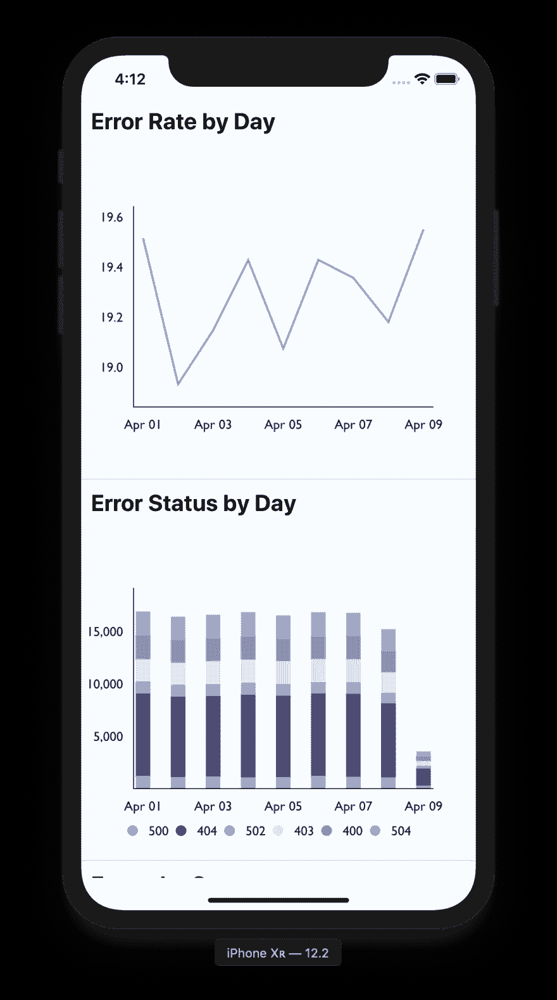
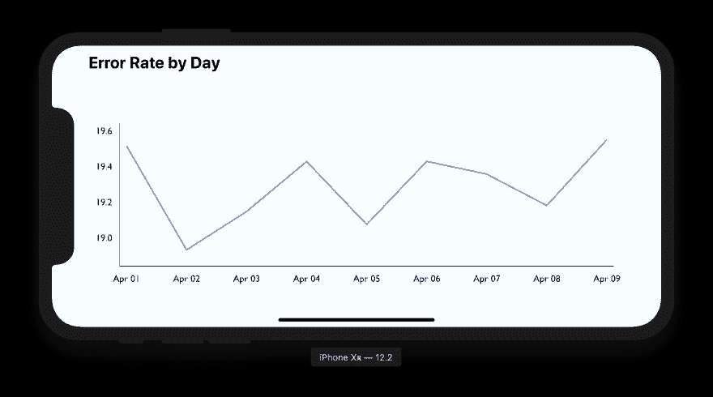
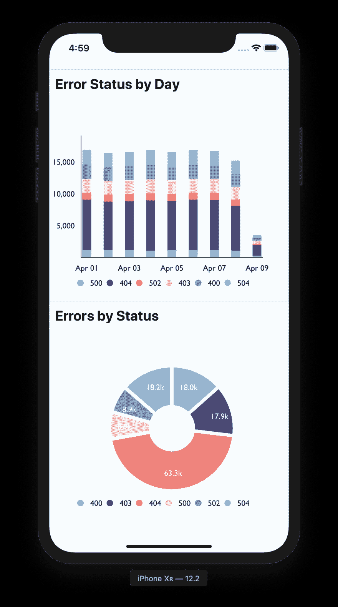

# 用 Cube.js 和 Victory 反应原生图表

> 原文：<https://dev.to/cubejs/react-native-charts-with-cube-js-and-victory-mj0>

让移动用户访问分析数据始终是一个难以解决的问题。在小屏幕上浏览沉重的网站通常不是最好的用户体验。构建原生移动应用是一个很好的解决方案，但通常需要付出很多努力。

React-Native 让构建和维护原生应用变得更加容易。通过将它与 [Cube.js](https://cube.dev) 和 [Victory-Native](https://formidable.com/open-source/victory/docs/native/) 耦合，我将向您展示如何构建嵌入到原生移动应用程序中的分析仪表板。由此产生的应用程序可以在 iOS 和 Android 上运行；您可以在自己的设备上使用 Expo 应用程序进行尝试。

下面是最终 app 的截图。这是 Expo 上的应用点心——你可以在线运行它，也可以在你的设备上启动它。此外，在那里您可以找到本教程的所有源代码。

[](https://res.cloudinary.com/practicaldev/image/fetch/s--Eq_rEWun--/c_limit%2Cf_auto%2Cfl_progressive%2Cq_auto%2Cw_880/https://thepracticaldev.s3.amazonaws.com/i/6ynf91h3trxbutbrdp3c.png)

## 数据

我们将使用带有 Nginx 日志样本数据的 [Cube.js](https://cube.dev) 后端。我已经在[这篇教程](https://dev.to/cubejs/nginx-log-analytics-with-aws-athena-and-cube-js-4b33)中介绍了如何收集 Nginx 日志，并使用 AWS Athena 和 Cube.js 对其进行分析。
让我们回顾一下我们将要查询的数据模式:

```
cube(`Logs`, {
  measures: {
    count: {
      type: `count`,
    },

    errorCount: {
      type: `count`,
      filters: [
        { sql: `${CUBE.isError} = 'Yes'` }
      ]
    },

    errorRate: {
      type: `number`,
      sql: `100.0 * ${errorCount} / ${count}`,
      format: `percent`
    }
  },

  dimensions: {
    status: {
      sql: `status`,
      type: `number`
    },

    isError: {
      type: `string`,
      case: {
        when: [{
          sql: `${CUBE}.status >= 400`, label: `Yes`
        }],
        else: { label: `No` }
      }
    },

    createdAt: {
      sql: `from_unixtime(created_at)`,
      type: `time`
    }
  }
}); 
```

Cube.js 使用类似上面的数据模式来生成 SQL 并对数据库执行它。如果你是第一次接触 Cube.js，我推荐你看看这个 [Cube.js 101 教程](https://cube.dev/blog/cubejs-open-source-dashboard-framework-ultimate-guide/)。

## React-Native

为了构建一个 react-native 应用程序，我们将使用`react-native-cli`包。
继续安装:

```
npm install -g react-native-cli
# or
yarn global add react-native-cli 
```

现在你可以创建一个新的应用:

```
react-native init cubejs-rn-demo
cd cubejs-rn-demo 
```

这将创建一个准系统 react-native 应用程序。

## Cube.js

Cube.js 提供了从后端加载数据的客户端包:

```
npm install -s @cubejs-client/core
# or
yarn add @cubejs-client/core 
```

它适用于网络和本地应用程序。另外，Cube.js 有一个 [React 组件](https://cube.dev/docs/@cubejs-client-react)，它更容易使用:

```
npm install -s @cubejs-client/react
# or
yarn add @cubejs-client/react 
```

Cube.js React 客户端也可以很好地与 React-Native 配合使用。客户端本身不提供任何可视化功能，它被设计为与现有的图表库一起工作。它提供了一组访问 Cube.js API 和处理查询结果的方法。

## 胜利

对于图表，我们将使用`victory-native`库。

```
npm install -s victory-native
# or
yarn add victory-native 
```

现在，我们可以创建一个简单的饼图，就像在演示仪表板上一样。下面是代码:

```
<VictoryChart width={this.state.width}>
  <VictoryPie
    data={data.chartPivot()}
    y="Logs.count"
    labels={item => numberFormatter(item[data.seriesNames()[0].key])}
  /> </VictoryChart> 
```

## 构建仪表板

我们将构建一个只有几个磁贴的简单仪表板，所以我们将使用一个 [ScrollView](https://facebook.github.io/react-native/docs/scrollview.html) 。如果你打算在一个仪表板上有许多平铺窗口，由于潜在的性能问题，最好切换到一个[平面列表](https://facebook.github.io/react-native/docs/flatlist)。因此，让我们创建一个简单的仪表板。首先，我们将创建一个图表组件，我们将在其中定义所有必需的数据。

```
const Empty = () => <Text>No component for that yet</Text>; 
const chartElement = (type, data) => {
  switch (type) {
    case 'line':
      return <LineChart data={data} />;
    case 'pie':
      return <PieChart data={data} />;
    case 'bar':
      return <BarChart data={data} />;
    default:
      return <Empty />;
  }
};

const Chart = ({ type }) => (
  <QueryRenderer
    query={queries[type]}
    cubejsApi={cubejsApi}
    render={({ resultSet }) => {
      if (!resultSet) {
        return <ActivityIndicator size="large" color="#0000ff" />;
      }

      return chartElement(type, resultSet);
    }}
  /> ); 
```

此外，我们将使用 Victory 的`zoomContainer`来允许用户放大数据。我们还将保存当前设备方向，以便在横向模式下添加更多数据，并更改填充:

```
const padding = {
    portrait: { left: 55, top: 40, right: 45, bottom: 50 },
    landscape: { left: 100, top: 40, right: 70, bottom: 50 }
};

const tickCount = {
  portrait: 4,
  landscape: 9
};

export const colors = [
  "#7DB3FF",
  "#49457B",
  "#FF7C78",
  "#FED3D0",
  "#6F76D9",
  "#9ADFB4",
  "#2E7987"
];

class ChartWrapper extends React.Component {
  constructor() {
    super();
    this.state = { orientation: 'portrait', ...Dimensions.get('window')};
    this.updateDimensions = this.updateDimensions.bind(this);
  }

  componentDidMount() {
    this.updateDimensions();
  }

  handleZoom(domain) {
    this.setState({ selectedDomain: domain });
  }

  updateDimensions() {
    const windowSize = Dimensions.get('window');
    const orientation = windowSize.width < windowSize.height ? 'portrait' : 'landscape';
    this.setState({ orientation, ...windowSize });
  }

  render() {
    return (
      <View style={vStyles.container} onLayout={this.updateDimensions}>
        <VictoryChart
          width={this.state.width}
          padding={padding[this.state.orientation]}
          domainPadding={{x: 10, y: 25}}
          colorScale={colors}
          tickCount={4}
          containerComponent={
            <VictoryZoomContainer responsive={true}
              zoomDimension="x"
              zoomDomain={this.state.zoomDomain}
              onZoomDomainChange={this.handleZoom.bind(this)}
            />
          }
        >
          {this.props.children}
          {!this.props.hideAxis &&
            <VictoryAxis tickCount={tickCount[this.state.orientation]} />
          }
          {!this.props.hideAxis &&
            <VictoryAxis dependentAxis />
          }
        </VictoryChart>
      </View>
    );
  }
} 
```

请注意，默认的 app.json 配置已经锁定了纵向屏幕方向。要允许设备旋转，请将“方向”设置为“默认”，这将允许除上下颠倒之外的所有方向。此代码在设备旋转时缩放图表:

[](https://res.cloudinary.com/practicaldev/image/fetch/s--LGgQOXGE--/c_limit%2Cf_auto%2Cfl_progressive%2Cq_auto%2Cw_880/https://thepracticaldev.s3.amazonaws.com/i/f6hhaco4zv5yftprvstl.png)

先说折线图。首先，我们需要在 Chart.js 中定义一个基本的 Cube.js 查询来获取数据:

```
{
  measures: ["Logs.errorRate"],
  timeDimensions: [
    {
      dimension: "Logs.createdAt",
      dateRange: ["2019-04-01", "2019-04-09"],
      granularity: "day"
    }
  ]
} 
```

现在我们可以创建一个折线图组件。这是一个带有一点风格的基本胜利图表:

```
const LineChart = ({ data }) => (
  <ChartWrapper>
    <VictoryLine
      data={data.chartPivot()}
      x={dateFormatter}
      labels={null}
      y={data.seriesNames()[0].key}
      style={{
        data: { stroke: "#6a6ee5" },
        parent: { border: "1px solid #ccc"}
      }}
    />
  </ChartWrapper> ); 
```

我们可以将这个组件包含在`Chart.js`文件中，并在`Dashboard.js`屏幕中呈现:

```
const Dashboard = () => {
  return (
    <ScrollView>
      <View style={styles.item}>
        <Text style={styles.text}>Error Rate by Day</Text>
        <Chart type="line" />
      </View>
    </ScrollView>
  );
}; 
```

这同样适用于堆积条形图。唯一复杂的是它由多个系列组成，所以我们为每个系列添加一个条，并制作一个图例:

```
const BarChart = ({ data }) => (
  <ChartWrapper>
    <VictoryStack colorScale={colors}>
      {data.seriesNames().map((series, i) => (
        <VictoryBar
          key={i}
          x={dateFormatter}
          y={series.key.replace(":", ", ")}
          data={data.chartPivot()}
          labels={null}
          style={{
            parent: { border: "1px solid #ccc"}
          }}
        />
      ))}
    </VictoryStack>
    <VictoryLegend x={40} y={280}
      orientation="horizontal"
      colorScale={colors}
      data={data.seriesNames().map(({ title }) => ({ name: title.substring(0, 3) }))}
    />
  </ChartWrapper> ); 
```

现在我们来看看饼状图。有一个隐藏轴的技巧——我们在这里添加一个空的 VictoryAxis】

```
const PieChart = ({ data }) => (
  <ChartWrapper hideAxis>
    <VictoryPie
      data={data.chartPivot()}
      y="Logs.count"
      labels={item => numberFormatter(item[data.seriesNames()[0].key])}
      padAngle={3}
      innerRadius={40}
      labelRadius={70}
      style={{ labels: { fill: "white", fontSize: 14 } }}
      colorScale={colors}
    />
    <VictoryAxis style={{ axis: { stroke: "none" }, tickLabels: { fill: "none" } }} />
    <VictoryLegend x={40} y={260}
      orientation="horizontal"
      colorScale={colors}
      data={data.chartPivot().map(({ x }) => ({ name: x }))}
    />
  </ChartWrapper> ); 
```

以下是仪表板上饼图的屏幕截图:

[](https://res.cloudinary.com/practicaldev/image/fetch/s--H6Um9l-S--/c_limit%2Cf_auto%2Cfl_progressive%2Cq_auto%2Cw_880/https://thepracticaldev.s3.amazonaws.com/i/jwy2davwdkvhhn9kityb.png)

我们的仪表板完成了！你可以在 [Expo](https://snack.expo.io/@9teen90nine/cube.js-dashboard-using-victory) 上找到所有的代码和 app。您可以在线运行此应用程序，也可以通过 Expo 应用程序在您的设备上启动它。它的运行速度相对较慢，因为它不是用特定平台的本机代码编译的，但你可以随时下载源代码，并通过 Xcode 或 Android Studio 为你的平台构建一个本机应用程序。

我希望这篇教程能帮助你构建伟大的应用程序！