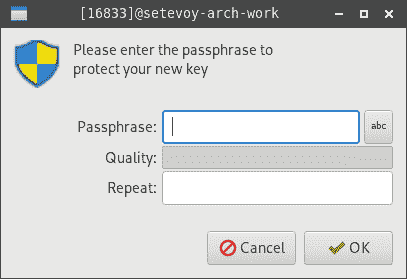
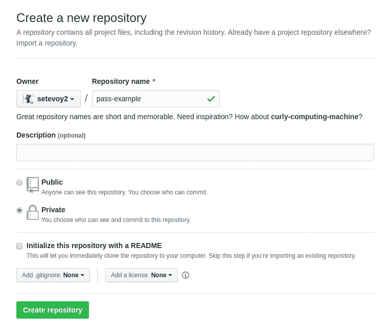
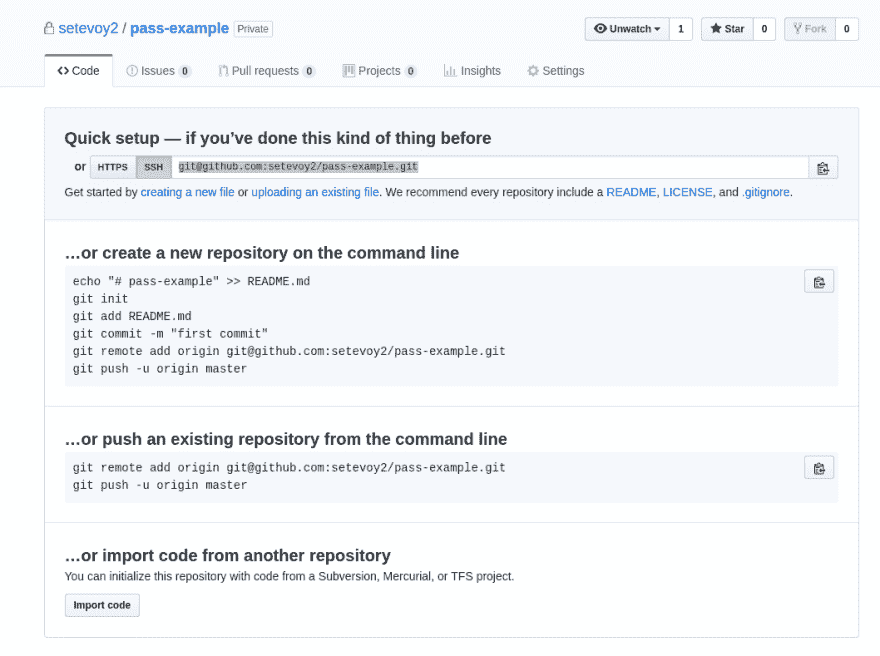
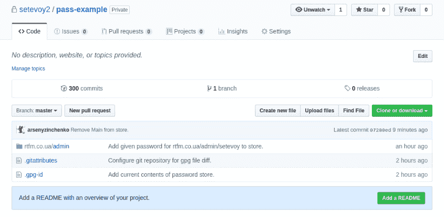
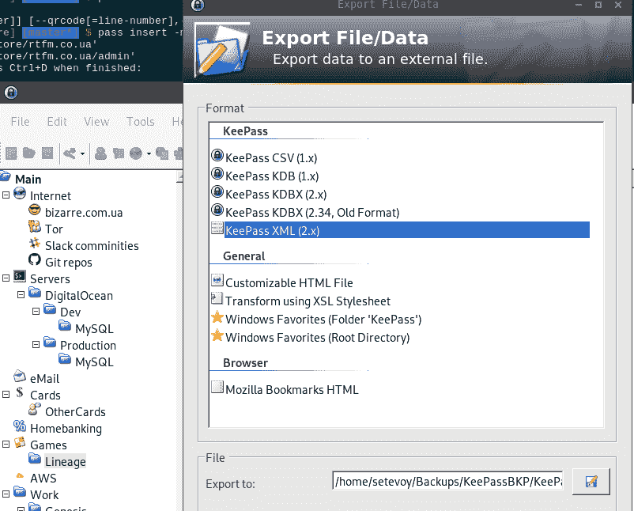
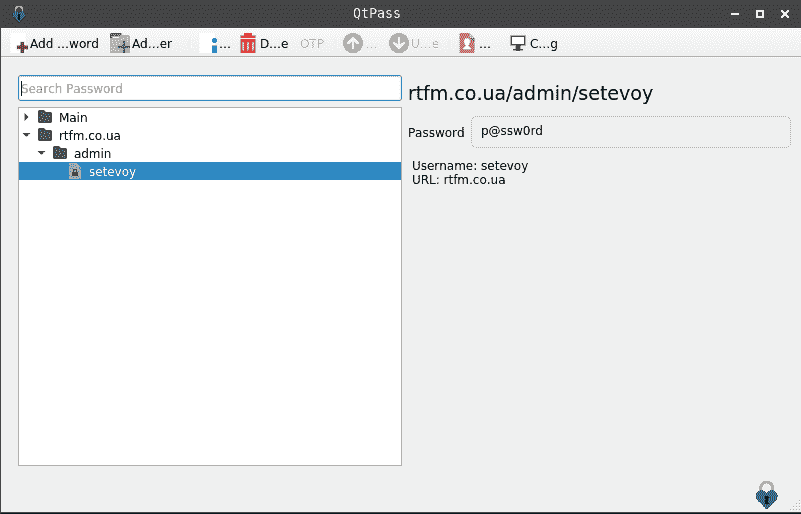

# Linux: GPG 密钥、Pass 密码管理器和从 KeePass 数据库导入密码

> 原文：<https://dev.to/setevoy/linux-gpg-keys-the-pass-passwords-manager-and-passwords-import-from-the-keepass-database-1j8f>

[](https://res.cloudinary.com/practicaldev/image/fetch/s--wAEpV_g9--/c_limit%2Cf_auto%2Cfl_progressive%2Cq_auto%2Cw_880/https://rtfm.co.ua/wp-content/uploads/2014/12/Linux-Secure-e1417804218533-1.png)[`pass`](https://www.passwordstore.org/)–Linux/UNIX 的密码管理器。

将数据存储在基于树的目录/文件结构中，并用 GPG 密钥加密文件。

在 Arch Linux 中默认存在，在 Debian 中可以使用`apt`从默认库:
安装

```
$ sudo apt install pass 
```

对于 macOS 可以用自制软件安装:

```
$ brew install pass 
```

`pass`本身只是一个 bash 脚本:

```
$ head /usr/bin/pass
# !/usr/bin/env bash
Copyright (C) 2012 - 2018 Jason A. Donenfeld <Jason@zx2c4.com>. All Rights Reserved.
# This file is licensed under the GPLv2+. Please see COPYING for more information.

umask "${PASSWORD_STORE_UMASK:-077}"
set -o pipefail

GPG_OPTS=( $PASSWORD_STORE_GPG_OPTS "--quiet" "--yes" "--compress-algo=none" "--no-encrypt-to" )
GPG="gpg" 
```

### GPG 钥匙管理

#### 创建 GPG 键

`pass`需要一个 GPG 密钥来加密和解密文件，所以让我们先创建它:

```
$ gpg --full-gen-key
...

Please select what kind of key you want:

(1) RSA and RSA (default) // leave default RSA and RSA
(2) DSA and Elgamal
(3) DSA (sign only)
(4) RSA (sign only)

Your selection?

RSA keys may be between 1024 and 4096 bits long.
What keysize do you want? (2048)  // leave default  2048
Requested keysize is 2048 bits

Please specify how long the key should be valid.
0 = key does not expire
<n>  = key expires in n days
<n>w = key expires in n weeks
<n>m = key expires in n months
<n>y = key expires in n years

Key is valid for? (0)  // leave default  0 - valide forever
Key does not expire at all

Is this correct? (y/N) y

GnuPG needs to construct a user ID to identify your key.

Real name: example
Email address: example@example.com
Comment:

You selected this USER-ID:
"example <example@example.com>"

Change (N)ame, (C)omment, (E)mail or (O)kay/(Q)uit? o

We need to generate a lot of random bytes. It is a good idea to perform
some other action (type on the keyboard, move the mouse, utilize the
disks) during the prime generation; this gives the random number
generator a better chance to gain enough entropy.
... 
```

然后会出现一个窗口，要求为您的 GPG 键设置密码:

[](https://rtfm.co.ua/wp-content/uploads/2019/04/Screenshot_20190425_095820-1.png)

输入所需密码，完成密钥生成:

```
...
We need to generate a lot of random bytes. It is a good idea to perform
some other action (type on the keyboard, move the mouse, utilize the
disks) during the prime generation; this gives the random number
generator a better chance to gain enough entropy.

gpg: key 714F9CBFDA191430 marked as ultimately trusted

gpg: revocation certificate stored as '/home/setevoy/.gnupg/openpgp-revocs.d/E130BB49AAA234F2BE2A7F96714F9CBFDA191430.rev'

public and secret key created and signed.
pub   rsa2048 2019-04-25 [SC]
E130BB49AAA234F2BE2A7F96714F9CBFDA191430
uid                      example <example@example.com>
sub   rsa2048 2019-04-25 [E] 
```

检查存储器中的公钥:

```
$ gpg --list-keys
gpg: checking the trustdb
gpg: marginals needed: 3  completes needed: 1  trust model: pgp
gpg: depth: 0  valid:   2  signed:   0  trust: 0-, 0q, 0n, 0m, 0f, 2u
/home/setevoy/.gnupg/pubring.kbx
--------------------------------
pub   rsa2048 2010-02-11 [SC]
1C61A2656FB57B7E4DE0F4C1FC918B335044912E
uid           [ unknown] Dropbox Automatic Signing Key <linux@dropbox.com>

pub   rsa2048 2011-04-26 [SC]
FCF986EA15E6E293A5644F10B4322F04D67658D8
uid           [ unknown] FFmpeg release signing key <ffmpeg-devel@ffmpeg.org>
sub   rsa2048 2011-04-26 [E]

pub   rsa4096 2018-04-02 [SC]
ABBAD1CB484F53024CF5868B69332F9203F21F5C
uid           [ unknown] Andrew Richards (cancel) <cancel@cancel.fm>
sub   rsa2048 2019-01-28 [S]
sub   rsa4096 2018-04-02 [E]

pub   rsa2048 2019-04-25 [SC]
DEB0D4AD41CC2612B1944D448D22D6610B2F6067
uid           [ultimate] setevoy (my main) <reg@domain.kiev.ua>
sub   rsa2048 2019-04-25 [E]

pub   rsa2048 2019-04-25 [SC]
E130BB49AAA234F2BE2A7F96714F9CBFDA191430
uid           [ultimate] example <example@example.com>
sub   rsa2048 2019-04-25 [E] 
```

还有你的私钥:

```
$ gpg --list-secret-keys
/home/setevoy/.gnupg/pubring.kbx
--------------------------------
sec   rsa2048 2019-04-25 [SC]
DEB0D4AD41CC2612B1944D448D22D6610B2F6067
uid           [ultimate] setevoy (my main) <reg@domain.kiev.ua>
ssb   rsa2048 2019-04-25 [E] 
```

#### 删除键

要删除一个密钥，首先需要删除它的私有部分，然后是它的公共部分。

删除私钥:

```
$ gpg --delete-secret-key E130BB49AAA234F2BE2A7F96714F9CBFDA191430
gpg (GnuPG) 2.2.15; Copyright (C) 2019 Free Software Foundation, Inc.
This is free software: you are free to change and redistribute it.
There is NO WARRANTY, to the extent permitted by law.
sec  rsa2048/714F9CBFDA191430 2019-04-25 example <example@example.com>

Delete this key from the keyring? (y/N) y
This is a secret key! - really delete? (y/N) y 
```

作为`--delete-secret-key`选项的一个参数，可以传递一个键的指纹或 ID(名称)，这里是“*示例*”。

[](https://rtfm.co.ua/wp-content/uploads/2019/04/Screenshot_20190425_101049.png)

[](https://rtfm.co.ua/wp-content/uploads/2019/04/Screenshot_20190425_101107.png)

现在可以使用`--delete-key`选项删除公钥:

```
$ gpg --delete-key E130BB49AAA234F2BE2A7F96714F9CBFDA191430
gpg (GnuPG) 2.2.15; Copyright (C) 2019 Free Software Foundation, Inc.
This is free software: you are free to change and redistribute it.
There is NO WARRANTY, to the extent permitted by law.

pub  rsa2048/714F9CBFDA191430 2019-04-25 example <example@example.com>

Delete this key from the keyring? (y/N) y 
```

#### 备份 GPG 键

由于此密钥将用于解密数据，我们不想丢失它。

您可以通过复制整个`~/.gnupg`目录来创建备份(如果使用 GnuPG 包的话):

```
$ ll .gnupg/
total 52
drwx------ 2 setevoy setevoy  4096 Jan 22 12:44 crls.d
drwx------ 2 setevoy setevoy  4096 Apr 25 10:04 openpgp-revocs.d
drwx------ 2 setevoy setevoy  4096 Apr 25 10:11 private-keys-v1.d
-rw-r--r-- 1 setevoy setevoy 13732 Apr 25 10:14 pubring.kbx
-rw-r--r-- 1 setevoy setevoy 12317 Apr 25 09:58 pubring.kbx~
-rw-r----- 1 setevoy setevoy   676 Apr 25 09:54 sshcontrol
-rw------- 1 setevoy setevoy  1440 Apr 25 10:14 trustdb.gpg 
```

或者通过将私钥导出到专用存储器:

```
$ gpg --export-secret-keys > ~/Dropbox/Backups/gpg-setevoy-arch-work-secret-backup.gpg 
```

在导出操作期间，将询问密码:

[](https://rtfm.co.ua/wp-content/uploads/2019/04/Screenshot_20190425_101942.png)

稍后，您可以使用`--import`选项恢复密钥。

移除现有的密钥:

```
$ gpg --delete-secret-key setevoy 
```

并从备份中恢复它:

[](https://rtfm.co.ua/wp-content/uploads/2019/04/Screenshot_20190425_102625.png)T3】

```
$ gpg --import ~/Dropbox/Backups/gpg-setevoy-arch-work-secret-backup.gpg
gpg: key 8D22D6610B2F6067: "setevoy (my main) <reg@domain.kiev.ua>" not changed
gpg: key 8D22D6610B2F6067: secret key imported
gpg: Total number processed: 1
gpg:              unchanged: 1
gpg:       secret keys read: 1
gpg:   secret keys imported: 1 
```

现在检查:

```
$ gpg --list-secret-keys
/home/setevoy/.gnupg/pubring.kbx

--------------------------------

sec   rsa2048 2019-04-25 [SC]
DEB0D4AD41CC2612B1944D448D22D6610B2F6067
uid           [ultimate] setevoy (my main) <reg@domain.kiev.ua>
ssb   rsa2048 2019-04-25 [E] 
```

### `pass`

#### 数据库初始化

使用 GPG 密钥创建期间使用的 ID(名称)或电子邮件来初始化新存储:

```
$ pass init setevoy 
```

为 setevoy 初始化密码存储

`pass`将创建一个身份文件`~/.password-store/.gpg-id` :

```
$ cat .password-store/.gpg-id
setevoy 
```

#### `pass` Git 和 Github

此外，一个普通的本地存储器`pass`可以把它作为一个 git-repository 来保存所有的修改历史。

如果您没有进行全局 Git 设置，现在添加它们:

```
$ git config --global user.email reg@domain.kiev.ua
git config --global user.name "setevoy" 
```

并在您现有的`pass`的存储:
中创建本地 git-repository

```
$ pass git init
Initialized empty Git repository in /home/setevoy/.password-store/.git/
[master (root-commit) 7e19ab0] Add current contents of password store.
1 file changed, 1 insertion(+)
create mode 100644 .gpg-id
[master 19aaf2c] Configure git repository for gpg file diff.
1 file changed, 1 insertion(+)
create mode 100644 .gitattributes 
```

现在你可以在一个普通的 Git:
中查看历史

```
$ cd .password-store/
git log
commit d8f791453fd1e8be7cf6126cde7f32df3bd351cc (HEAD -> master)
Author: setevoy <reg@domain.kiev.ua>
Date:   Thu Apr 25 11:08:19 2019 +0300
Configure git repository for gpg file diff.
commit d49c886510221f31268f22cd74d0859965bafb7b
Author: setevoy <reg@domain.kiev.ua>
Date:   Thu Apr 25 11:08:19 2019 +0300 
```

添加密码存储的当前内容。

然后，您可以在 Github 或 Bitbucket 中创建一个私有存储库，并将您的`pass`的数据库导入其中，以便在多种类型的计算机之间进行同步。

尽管把你所有的密码保存在一个甚至是私人的存储库中，甚至是一个 GPG 加密的文件中的想法可能不太好。

另一个解决方案是创建自己的 git-server 并使用它。

不过，只是举例来说，让我们创建一个私有的 Github 存储库:

[](https://rtfm.co.ua/wp-content/uploads/2019/04/Screenshot_20190425_123520.png)

复制它的地址，这里是*[git@github.com](mailto:git@github.com):setevoy 2/pass-example . git*:

[](https://rtfm.co.ua/wp-content/uploads/2019/04/Screenshot_20190425_123557.png)

转到您的本地目录:

```
$ cd ~/.password-store/ 
```

更新其存储库设置–添加`remote` :

```
$ git remote add origin git@github.com:setevoy2/pass-example.git 
```

检查一下:

```
$ cat .git/config
[core]
repositoryformatversion = 0
filemode = true
bare = false
logallrefupdates = true

[diff "gpg"]
binary = true
textconv = gpg2 -d --quiet --yes --compress-algo=none --no-encrypt-to --batch --use-agent

[remote "origin"]
url = git@github.com:setevoy2/pass-example.git
fetch = +refs/heads/*:refs/remotes/origin/* 
```

并推送到 Github:

```
$ git push origin master
To github.com:setevoy2/pass-example.git
* [new branch]      master -> master 
```

检查:

[](https://rtfm.co.ua/wp-content/uploads/2019/04/Screenshot_20190425_123934.png)

#### 添加密码

要添加新密码，请使用带有目录/文件路径的`insert`:

例如，RTFM 的密码可以这样添加:

```
$ pass insert rtfm.co.ua/admin/setevoy
mkdir: created directory '/home/setevoy/.password-store/rtfm.co.ua'
mkdir: created directory '/home/setevoy/.password-store/rtfm.co.ua/admin'
Enter password for rtfm.co.ua/admin/setevoy:
Retype password for rtfm.co.ua/admin/setevoy:
[master 7ae47c9] Add given password for rtfm.co.ua/admin/setevoy to store.
1 file changed, 0 insertions(+), 0 deletions(-)
create mode 100644 rtfm.co.ua/admin/setevoy.gpg 
```

#### 找回秘密

现在存储的结构如下:

```
$ pass
Password Store
└── rtfm.co.ua
 └── admin
  └── setevoy 
```

检索密码–指定文件路径，并输入您的 GPG 键密码:

```
$ pass rtfm.co.ua/admin/setevoy
p@ssw0rd 
```

[](https://rtfm.co.ua/wp-content/uploads/2019/04/Screenshot_20190425_111400.png)

可以使用`-c`选项:
将其复制到剪贴板

```
$ pass -c rtfm.co.ua/admin/setevoy
Copied rtfm.co.ua/admin/setevoy to clipboard. Will clear in 45 seconds. 
```

还有`git`历史现在:

```
$ git log
commit 7ae47c9535eabddc64c89df39c7db720a2cd5244 (HEAD -> master)
Author: setevoy <reg@domain.kiev.ua>
Date:   Thu Apr 25 11:12:16 2019 +0300
Add given password for rtfm.co.ua/admin/setevoy to store.
... 
```

#### Multiline records

您可以指定一些附加字段，而不是只添加密码。

使用`-m`向密码文件添加多种类型的行。在第一行设置一个密码本身:`-c`会用它复制一个密码到缓冲区:

```
$ pass insert -m rtfm.co.ua/admin/setevoy
An entry already exists for rtfm.co.ua/admin/setevoy. Overwrite it? [y/N] y
Enter contents of rtfm.co.ua/admin/setevoy and press Ctrl+D when finished:
p@ssw0rd
Username: setevoy
URL: rtfm.co.ua
[master fc43a4c] Add given password for rtfm.co.ua/admin/setevoy to store.
1 file changed, 0 insertions(+), 0 deletions(-)
create mode 100644 rtfm.co.ua/admin/setevoy.gpg 
```

检查:

```
$ pass show rtfm.co.ua/admin/setevoy
p@ssw0rd
Username: setevoy
URL: rtfm.co.ua 
```

#### 寻找记录和密码

用于搜索的`pass`有两个选项——`find`和`grep`。

`find`将通过目录/文件名称:
进行快速搜索

```
$ pass find setevoy
Search Terms: setevoy
├── rtfm.co.ua
 └── admin
  └── setevoy 
```

和`grep`将搜索所有文件文本:

```
$ pass grep rtfm.
rtfm.co.ua/admin/setevoy:
URL: rtfm.co.ua
... 
```

[](https://rtfm.co.ua/wp-content/uploads/2019/04/Screenshot_20190425_113827.png)

#### 删除密码

用`rm`选项调用`pass`:

```
$ pass rm rtfm.co.ua/admin/setevoy
Are you sure you would like to delete rtfm.co.ua/admin/setevoy? [y/N] y
removed '/home/setevoy/.password-store/rtfm.co.ua/admin/setevoy.gpg'
[master 7a23ede] Remove rtfm.co.ua/admin/setevoy from store.
1 file changed, 0 insertions(+), 0 deletions(-)
delete mode 100644 rtfm.co.ua/admin/setevoy.gpg 
```

要删除目录–使用`rm -r` :

```
$ pass rm -r Main
Are you sure you would like to delete Main? [y/N] y
removed '/home/setevoy/.password-store/Main/Work/blabla.com.gpg'
... 
```

### 从 KeePass 数据库导入

其实我是用`pass`作为备份存储。

一般来说，我使用的是 KeePass ( [KeePassXC](https://keepassxc.org/) )，它的数据库存储在一个 Dropbox 帐户中，并在多台计算机之间同步 KeePass 的实例。

万一这个数据库会在某个时候崩溃——我想要它的备份，所以让我们把它导入到`pass`中。

这里可以使用 [`pass-import`](https://github.com/roddhjav/pass-import) 实用程序，它可以从各种管理器和 KeePass 的 XML 文件导入数据。

可以安装在 AUR 的 Arch Linux 上:

```
$ yaourt -S pass-import 
```

现在创建一个数据库的副本(使用 KeePass–KeePassXC 不能导入到 XML):

[](https://rtfm.co.ua/wp-content/uploads/2019/04/Screenshot_20190425_112743.png)

并通过一个源类型(这里是-*keepass*)和一个文件路径:
运行到`pass`的存储的导入

```
$ pass import keepass ~/Backups/KeePassBKP/KeePass-Main-25-04-2019-bkp.xml
(*) Importing passwords from keepass
.  File: /home/setevoy/Backups/KeePassBKP/KeePass-Main-25-04-2019-bkp.xml
.  Number of password imported: 294
.  Passwords imported:
Main/AWS/AWS root user
Main/AWS/AWS setevoy
Main/Cards/Aval Credit
... 
```

现在检查`pass`的数据库:

```
$ pass
Password Store
├── Main
│   ├── AWS
│   │   ├── AWS root user
│   │   └── AWS setevoy
│   ├── Cards
│   │   ├── Aval Credit
│   │   ├── OtherCards
│   │   │   ├── Masha
│   │   │   ├── Stromenko etabak
... 
```

### QtPass

终端很棒，但是使用一些用户界面会更好。

对于`pass`，有一个 [QtPass](https://qtpass.org/) 实用程序。

在 Arch 中，可以从公共存储库安装 Linux:

```
$ sudo pacman -S qtpass 
```

运行它:

[](https://rtfm.co.ua/wp-content/uploads/2019/04/Screenshot_20190425_114035.png)

完成了。

### 类似的帖子

*   <small>03/28/2017</small>[Arch:Git–github.com errno =连接被拒绝](https://rtfm.co.ua/arch-git-github-com-errnoconnection-refused/) <small>(0)</small>
*   <small>01/27/2017</small>[Debian:apt–GPG 错误:以下签名无效:KEYEXPIRED](https://rtfm.co.ua/debian-apt-gpg-error-the-following-signatures-were-invalid-keyexpired/) <small>(0)</small>
*   <small>05/08/2017</small>[arch Linux:key server 接收失败:没有可用的 key serverиручнойимпортключа](https://rtfm.co.ua/arch-linux-keyserver-receive-failed-no-keyserver-available-i-ruchnoj-import-klyucha/)<small>(0)</small>
*   T005/31/2016 t1t 2 千兆:T3t 4 密钥的 SSH 授权