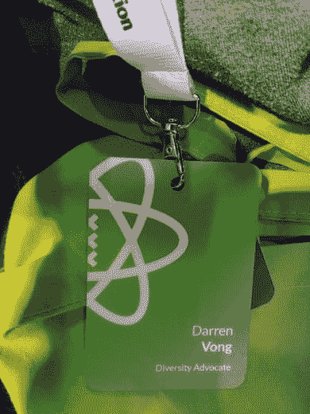
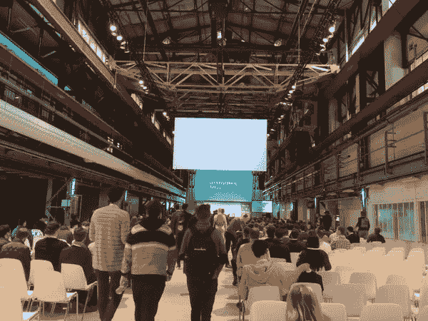
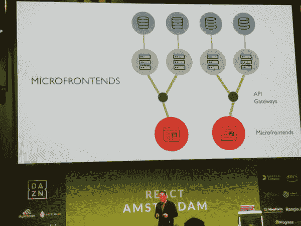
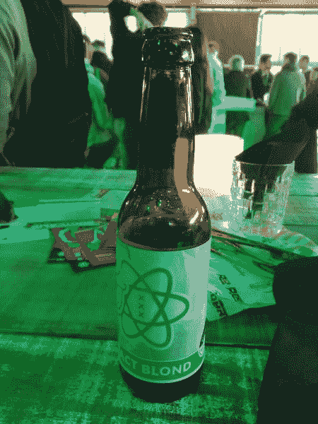
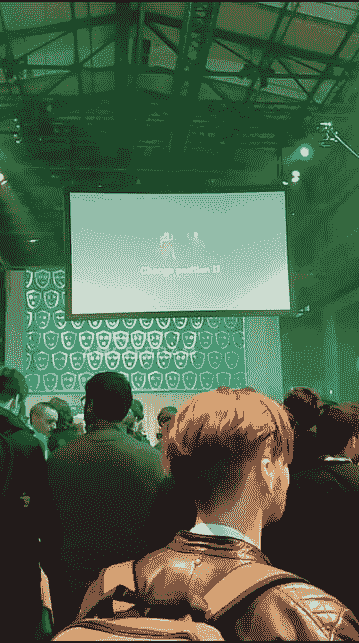

# 我第一次单独参加 React Amsterdam

> 原文：<https://dev.to/darrenvong/my-first-react-amsterdam-experience-as-a-solo-attendee-2d14>

第一次参加会议，尤其是独自参加，可能会是一次令人生畏的经历。但是，如果你想提升专业和技术水平，参加这种课程的好处是值得的，比如从你所在领域的领导者那里找到新的想法和灵感，以及本文中详细介绍的其他内容。

通常，参加会议的主要障碍是昂贵的门票。然而，由于成功申请了 React Amsterdam 提供的[多样性奖学金](https://medium.com/@ReactAmsterdam/apply-for-a-diversity-scholarship-attend-react-amsterdam-2019-for-free-65cd27d17a33)，我得以免费参加活动本身！

申请奖学金无疑是我今年做出的最好的决定之一，所以如果你有资格参加他们即将举行的姐妹会议之一，我强烈建议你去申请，因为这个过程只需要填写一份简短的申请表。

以下是我第一次参加 React Amsterdam 的经历，以一个单独参加者的角度。在会议的每个方面，我都留下了我从这次经历中学到的一些小技巧。

我希望这将有助于如果你想在未来几年去，并鼓励你这样做，即使你不得不自己去！

# 松弛的渠道

作为第一次单独出席会议，官方 React Amsterdam Slack 是了解活动最新情况和与其他与会者联系的宝贵方式。活动的实时更新自始至终都在那里提供，官方组织者会迅速回答人们的任何问题。

它的采用似乎很自然，因为大多数开发人员可能已经在工作中使用该平台进行日常交流了。这是显而易见的，因为在整个活动期间，每天都有消息发送，参与者组织非正式的聚会和会面。

就我个人而言，我能够见到来自澳大利亚和丹麦的开发人员，只是通过给其他独自参加的人留下邀请信息，让他们在午餐时出去玩。在另一个场合，我和几个来自加拿大的开发人员和招聘人员共进晚餐，寻找与我发送的信息相同的信息。

总的来说，我认为这使得会见其他与会者更容易，这意味着自己去的想法少了很多令人生畏。这让我的经历变得更加有趣！

提示 1:如果你是独自参加下一个，加入官方的 Slack，积极参与！这可以是安排一些事情，也可以是回应别人提出的想法。

# 参加会议

阿姆斯特丹反应堆(React Amsterdam)所在地 Krom southal 位于阿姆斯特丹北部，紧挨着 IJ 河。这个位置很容易到达——对我来说，离我住的附近的一家旅馆步行 20 分钟就到了。

由于会议组织了专门的摆渡班车服务(往返于阿姆斯特丹中央车站和会场之间)，只要您靠近地铁或电车站，就可以很容易地到达会场，这要归功于城市中出色的公共交通网络。如果你是一个自信的自行车手，你甚至可以骑自行车去那里，因为那里有现成的自行车出租。

话虽如此，我记得在会议间隙读到，由于一些渡船已满，出现了延误。另一件要记住的事情是队列的长度:

液体错误:内部

尽管我在会议开始前 30 分钟就到了，但我还是要等大约 10 分钟才能到达登记处。我相信裁谈会今后会在这方面有所改进。

**提示 2:乘坐更早的班车，或使用[免费公共渡轮服务](https://en.gvb.nl/veerpont-over-het-ij)，从 Veer Buiksloterweg 渡轮码头步行约 20 分钟，以确保你能准时参加第一次会谈。**

# 会议日程

完成注册后，我得到了一个胸卡，坦白地说，我忘记了我告诉大会在描述我是谁时要写什么:

<figure>

<figcaption>I’m apparently a Diversity Advocate now. 😎</figcaption>

</figure>

除了姓名徽章，我还收到了当天的节目指南，以及一个 React Amsterdam 品牌的礼品袋，里面装满了 React 风格的礼品，其中包括这个闪闪发光的绿色马克杯:

液体错误:内部

个人声明:我非常喜欢这个杯子，它现在已经成为我办公室的杯子，而不是我办公室的品牌杯子了！

当我走过登记处时，大楼的内部逐渐显露出来。很明显，这座建筑是为像会议这样的活动重新设计的，但同时也保持了它以前仓库的魅力。

<figure>

<figcaption>The main conference hall filling up!</figcaption>

</figure>

两个平行轨道(通用和反应本地轨道)的精彩谈话同时发生，有时很难选择去哪一个！在整个会议期间，我不断地在两个轨道之间切换，试图获得两个世界的最佳效果。以下是我去过的地方中我最喜欢的一些:

## [肯特·c·多兹](https://kentcdodds.com/)——压惊反应

如果有人想找一个好的理由来感受阿姆斯特丹，这个开场白就是一个非常强烈的回应。在这个演讲中，Kent 经历了一个提升 React 开发人员(或者只是一般)的关键方法——更好地理解我们日常使用的抽象概念！

从一个他通过理解下面发生的事情来固定他的 tap 的个人例子，到实现类似于在进行中的工作的悬念特性的抽象下的代码，它很好地演示了我们如何通过更好地掌握幕后的事情来减少我们的代码。

他提到的我最喜欢的事情是:

液体错误:内部

事后看来，控制台日志 JSX 似乎是一件显而易见的事情，但这绝对是我在学习 React 时忽略的事情！在不破坏演讲太多的情况下，通过这样做并遵循他后来解释的一些其他抽象，它*立即变得如此有意义*为什么像 if 语句这样的构造不允许在 JSX 插值中使用。

## [西达尔特](https://sid.studio/) -重构反应

对于那些正在寻找如何在他们现有的 React 代码库中发现代码味道的可靠提示的人来说，Sid 为您提供了这 30 分钟的纯现场编码精彩内容。涵盖的技巧包括:

*   有一个最小的 API 表面积，这样开发者只需要学习众所周知的行为就可以使用一个组件；
*   遵循单一责任原则，其中一个组件应该做好它的一项工作，并将其余工作委托给其他组件；
*   避免特性嫉妒——例如，当父组件对应该写在子组件中的特性太感兴趣时…

…还有更多！特别是对于那些纯粹对代码感兴趣，而对传统演示不太感兴趣的人，我强烈推荐给这个一个手表！

## [麦克斯·斯托伊伯](https://mxstbr.com/) -理工大感慨看谱

这是一个反思性的谈话，关于 Max 在构建 Spectrum(一个面向开发者社区的实时消息应用)时对一些技术选择的遗憾。在一天结束时，我们都会犯错误，在我看来，他分享经验教训的残酷诚实的方式令人耳目一新。

我个人最喜欢他分享的遗憾是没有使用 [Next.js](https://nextjs.org/) ，因为他以“服务器端渲染”开始。这能有多难？我要建自己的服务器端渲染(SSR)服务器！”。他很快发现做好这件事对 T2 来说极其困难，事实上，他已经为拥有一个可靠的服务器环境奋斗了两年。

马克斯接着说，他保证没有人比蒂姆·诺特肯斯更了解 SSR，所以他建议任何需要 SSR 的人使用它，而不是(糟糕地)重新发明轮子。我是一名成功的初创公司创始人，已经被 GitHub 收购，在未来可能需要 SSR 的项目中，我肯定会三思而行，如果有人认为构建自己的 SSR 解决方案很容易，我会让他们参考 Max 的演讲！

## [马克斯·加洛](https://twitter.com/_maxgallo) -用微前端扩展应用

在这个充满活力的演讲中，Max 谈到了一个有趣的概念，即后端的微服务概念被应用到前端，以避免 DAZN 的 web 应用程序中出现一个整体。每个微前端都是一个单页面应用程序(SPA ),根据 Max 的说法，这被证明是一个让开发人员快速启动和运行的好方法，因为 HTML、CSS 和 JavaScript 的知识足以开始构建。

这个概念似乎还允许他们的团队适当地分担工作负载，避免过多的通信开销，因为他们必须同意的唯一公共接口是引导层。这反过来导致了自主性，并使开发人员能够尝试新事物和创新。马克斯说，这样做，他们可能会更快乐，从而留下来。我完全同意！

尽管之前听说过微服务，但 microfrontends 曾经是(现在仍然是！)对我来说是一个全新的概念。你想参加的会议正是这种类型的谈话，以激发新的想法，并跟上最新的趋势。

* * *

要了解更多关于一般专题讲座(以及整个活动)的详细描述，请查看 Eric Bishard 撰写的这篇[博客文章，他也是与会者之一，也是 Progress 展台的负责人。要获得完整体验，您可以使用以下链接观看两个讲座:](https://www.telerik.com/blogs/a-look-back-at-react-amsterdam-2019)

普通曲目:[https://www.youtube.com/watch?v=4KfAS3zrvX8](https://www.youtube.com/watch?v=4KfAS3zrvX8)

反应原生轨迹:[https://www.youtube.com/watch?v=NCLkLCvpwm4](https://www.youtube.com/watch?v=NCLkLCvpwm4)

总的来说，我很喜欢讲座的安排方式，因为每两次讲座后都有一次喝咖啡的休息时间，这给了与会者足够的时间来吸收信息。它还提供了建立关系网的机会，查看赞助商的展位以赢得更多的奖品(如从 Skyscanner 获得的有趣的沙滩球)，甚至有机会从 React 特定领域的专家那里获得关于您项目的建议。

# 食物

作为一个从早上 6:30 就醒了的夜猫子，我立刻去买了面前的咖啡来储存急需的咖啡因。就早餐的食物而言，有很多糕点小吃可供选择，但我选择了更丰盛的燕麦和酸奶罐，这为我一天的第一次谈话提供了充足的燃料。

午餐也组织得很好，因为食物被分配到多张桌子上，以避免进一步增加已经很长的队伍。素食者、杂食者和任何有特殊饮食要求的人都可以选择咖喱饭。

唯一的缺点可能是晚上的食品车，因为当我排到队伍前面的时候，他们很快就用完了食物；更令人沮丧的是，我已经白排队 30 多分钟了。

请记住，食品车的大小是有限的，因此他们可以储存多少食物，希望会议可以通过在未来安排更多的食品车来解决这个问题。

技巧 3:在最后一次喝咖啡休息时去食品车，而不是等到最后，去打败排队的饥饿人群！

# 后党

从这一点开始，这是会议的可选部分。反正我晚上也没打算做什么，目的是让我们在一天学习新东西(或工作，即促进工作和娱乐的平衡)后玩得开心，所以我决定留下来看看这是怎么回事。

派对以电子和电子音乐的混合开始，伴随着小吃和当地的 React 主题金发啤酒:

这使得每个人都更加放松，小吃可能足以让我们这些没有从快餐车上得到任何东西的人开心！

派对结束后的节目亮点应该是“智能手机乐队——社会分类实验”游戏。由于场地有限，只有大约 100 人能参加。

这款游戏名副其实，是一项社会实验。参与者必须使用手机登录一个专门的网站，并按照屏幕上的指示进行操作。这些说明显然旨在鼓励我们相互交流，从与你的邻居交谈，到凝视和评价你邻居耳朵的吸引力！

当参与者彼此不说话时，他们必须填写一些问卷，最终将数据输入游戏的机器学习算法。鉴于只问了一组简短的问题，最后的结果，比如按顺序确定参与者的身高，却出奇的准确！

<figure>

<figcaption>The Social Sorting Experiment in action!</figcaption>

</figure>

由于游戏开始前由 DJ 介绍的神秘而奇怪的方式，我(和许多其他人)最终站在周围看着游戏发生。我很低调，真希望我也参加了，因为这看起来是一种打破沉默和与新朋友交谈的有趣方式。

活动一直持续到晚上 9 点 30 分，尼克·弗斯坦德和鲍里斯·阿科特带来了一些很酷的激光视听表演，随后是更多的现场编码音乐。这创造了一个友好和寒冷的气氛。

几个小组站成了吃豆人规则的形状，这鼓励像我这样的单独参与者走上前去开始交谈，如果他们不是，大多数人通常会接受聊天。所以，如果你要参加下一次聚会，没必要害怕自己来。

# 巡日

对我来说，这就是 React Amsterdam 的独特之处，因为我不记得读过许多其他会议(当我在研究要参加的会议时)，包括帮助你探索你所在的城市并与其他与会者社交的扩展计划。会议投入的这些额外努力有助于培养一个伟大的社区。

一天中有两种选择，有多个时间段:与会者可以在导游的带领下徒步探索阿姆斯特丹，或者利用运河，在导游的带领下乘船游览这座城市。

这两个选项都持续 90 分钟左右，但由于我以前步行游览过阿姆斯特丹，独自乘船游览并不便宜，所以我抓住机会加入了其中一个。虽然那天天气不太暖和，但这仍然是一个伟大的决定，因为那天的天空基本上是晴朗的。这是我设法捕捉到的:

液体错误:内部

# 个人感慨

参加 React Amsterdam 是一次非常棒的经历！这次会议无疑让我充满活力，并受到新想法的启发——我迫不及待地想在我当前和未来的项目中尝试它们！

话虽如此，总有一些事情我希望我已经做了，包括:

*   记住，更重要的是，多鼓起勇气和新认识的人自拍。对于一个似乎回避镜头的人来说，这对我来说是一个棘手的问题，但绝对是一个需要努力的问题！像这样回顾事件时的记忆会是值得的！
*   在演讲者演讲后与他们交谈！他们中的大多数人都很友好地与我联系和聊天，所以这将是一个很好的机会来跟进他们的谈话中可能与我当前项目相关的问题。
*   这有点超出我的控制——因为我自己真的买不起票——但是参加一个会前研讨会！也许这是多样性奖学金将来可以帮助的事情。

# 反应阿姆斯特丹 2020

该活动将于 2020 年 4 月 16 日和 17 日回归，这意味着这将是首次为期两天的会议！到目前为止，我真的很喜欢与 React 合作，随着核心团队继续通过 React 悬念等功能改进框架，我很高兴看到今年的其他计划。所以我当然希望我明年能回来，也许是在另一个多元化奖学金的帮助下。