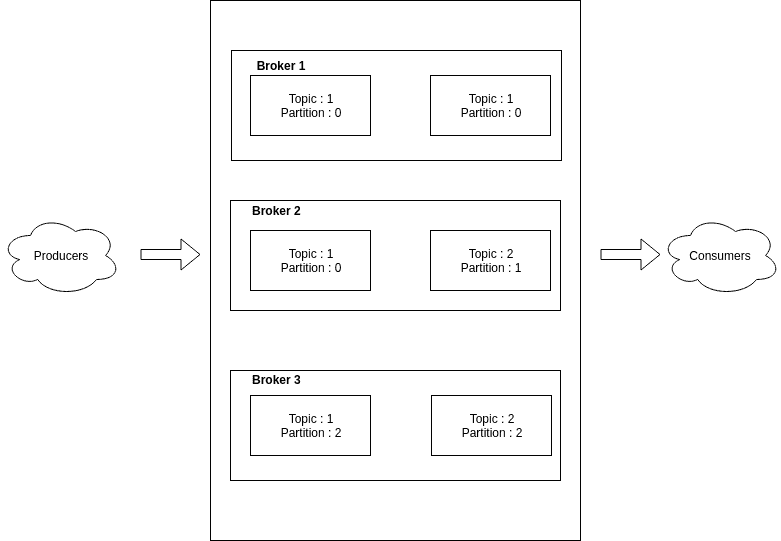
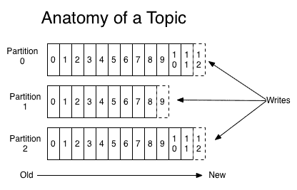
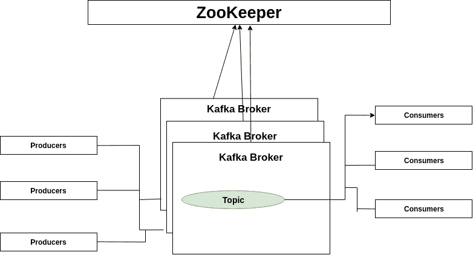

# 阿帕奇卡夫卡是如何工作的？卡夫卡系列-第一部分

> 原文：<https://dev.to/ganeshmani/how-apache-kafka-works-kafka-series-part-1-10ld>

在本地机器上配置 Apache Kafka 并运行服务器。[卡夫卡系列第二部](https://cloudnweb.dev/2019/04/kafka-getting-started-kafka-series-part-2/)

### 卡夫卡是什么？

首先，Kafka 是一个流平台，它遵循发布/订阅模式来发送消息/监控事件

### 卡夫卡的用例

Kafka 通常用于两大类应用:

*   构建实时流数据管道，在系统或应用程序之间可靠地获取数据
*   构建实时流应用程序，对数据流进行转换或做出反应

#### Kafka 核心 API:

*   [**生产者 API**](https://kafka.apache.org/documentation.html#producerapi) :允许应用程序发布一个特定主题的记录流。我们将在本文的后面部分看到什么主题。
*   **[消费者 API](https://kafka.apache.org/documentation.html#consumerapi)** :它允许应用程序订阅一个或多个主题，并处理产生给它们的记录流
*   **[Streams API](https://kafka.apache.org/documentation/streams/)** :允许应用程序充当*流处理器*，从一个或多个主题消费输入流，并向一个或多个输出主题产生输出流。
*   **[连接器 API](https://kafka.apache.org/documentation.html#connect)** :允许构建和运行可重用的生产者或消费者，将 Kafka 主题连接到现有的应用程序或数据系统。

### 卡夫卡是如何工作的？

通俗地说，制作者将记录推送到 Kafka broker，在那里消费者获取这些记录并根据该消息/事件采取行动。

 

<figcaption>卡夫卡建筑概述</figcaption>

### 什么是主题和分区？

卡夫卡中的主题只不过是一个提要，生产者可以推送记录，消费者可以获得记录。卡夫卡的主题总是多订户的；也就是说，一个主题可以有零个、一个或多个消费者订阅写入其中的数据。

为了使主题具有容错性和处理吞吐量，主题被维护在不同的分区中。分区可以在同一个磁盘上，也可以在不同的磁盘上。

### 卡夫卡经纪人是什么？

Kafka Broker 包含集群。每个 Kafka 代理都包含主题日志分区。连接到一个代理会启动整个 Kafka 集群的客户端。对于故障转移，您希望从至少三到五个代理开始。如果需要，Kafka 集群可以包含 10、100 或 1，000 个代理。

 

<figcaption>卡夫卡经纪人概述</figcaption>

在本地机器上配置 Apache Kafka 并运行服务器。[卡夫卡系列第二部](https://cloudnweb.dev/2019/04/kafka-getting-started-kafka-series-part-2/)