# 用 Azure Functions、Particle.io 和 Azure IoT Hub 为 Nest 恒温器构建家庭自动化 auto-away assist

> 原文：<https://dev.to/azure/auto-away-assist-for-nest-thermostat-1b2m>

*我们选择了由[迈克尔·克伦普](https://twitter.com/mbcrump)创造的我们最喜欢的技巧和诀窍，并在整个四月在 Azure 上提供新的技术内容！错过一天(或更多)？[赶上系列](https://dev.to/t/azureapril/latest)。*

**没有天蓝色？** [抢免费订阅](https://azure.microsoft.com/en-us/free?&WT.mc_id=azureapril_devto-blog-cxa)。

[https://www.youtube.com/embed/WaNvKtDCHA4](https://www.youtube.com/embed/WaNvKtDCHA4)

| 材料清单 |
| --- |
| 1x [粒子核心/光子/氩](https://store.particle.io/collections/wifi) |
| 1x [PIR 运动传感器](https://www.amazon.com/DIYmall-HC-SR501-Motion-Infrared-Arduino/dp/B012ZZ4LPM) |
| 1x [免费 Azure 订阅](https://azure.microsoft.com/en-us/free?&WT.mc_id=azureapril_devto-blog-cxa) |

# 简介

Nest 恒温器是一种支持 Wi-Fi 的设备，可以利用天气信息和本地传感器数据优化加热和冷却系统的使用。这款设备还可以远程控制，因此您可以在下班开车回家的路上做一些很酷的事情，例如设置房间的供暖/制冷。不过，这款设备有点像一个黑匣子，它使用一些底层的机器学习机制(据我所知)来创建一个你特定使用习惯的模型，并试图确定你是否在家。

问题是鸟巢并不总是正确地决定主场/客场。例如，我有两个 Nest 单元控制家里的两个 HVAC 单元(一个在楼上控制我房子的左侧，另一个在楼下控制右侧)。我经常发现自己在楼上的办公室(位于房子的右侧)工作，空调因为认为我不在家而关闭。这是一个问题，通常涉及通过移动/网络应用程序手动启动 Nest 控制器，或者跑出办公室，触动我的其他 Nest 设备上的运动传感器。

Nest 是一个支持 Wi-Fi 的设备，所以为什么不在你在家的时候使用动作感应或类似的东西告诉它呢？Nest 意识到了这个问题，并出售了一个 T2 运动传感器 T3 和一个 T4 监控恒温器 T5，用于控制 Nest 控制器位置之外的房间温度。这些传感器非常昂贵，而且它们只与 Nest v3 恒温器兼容(我们中的许多人都有 v2 型号)。Nest v2 支持 Wi-Fi，所以你可能会认为基于 Wi-Fi 的设备可以解决这个问题，但事实并非如此。

# 解

我们真正需要的是使用某种形式的基于硬件的触发器(PIR 运动/簧片开关/更复杂的东西)来通知 Nest 我们到家了。有人会想，如果这样的话，那么他们的 Nest 集成将支持这一特性，但此时没有任何特定的东西来设置 Nest 的主/从状态。这不是一个交易破坏者，我们可以只推出自己的。

要创建我们自己的更新 Nest Home / Away 状态的机制，我们只需要几个要素:

*   一个有效的 Oauth 令牌，允许我们通过 Nest 的开发人员 API 发出更新主/从状态的 API 请求
*   可以检测存在并发送事件来触发此 API 调用的设备。我们将使用粒子核心/光子和 PIR 运动传感器以及集成来将消息转发到 Azure 物联网中心。
*   实际调用嵌套 API 的服务。我们将使用一个无服务器的 Azure 函数来调用 Nest API，当事件通过前面提到的 Azure IoT Hub 到达时，该函数将被触发。下面提供了概述整体架构的图表: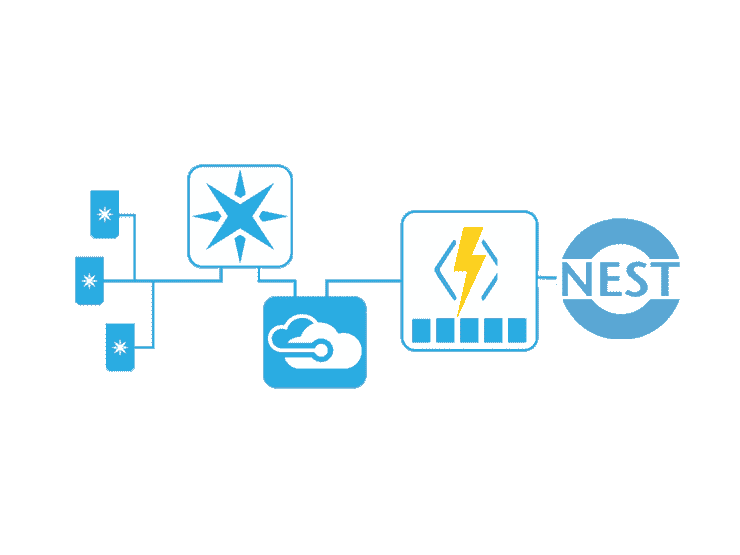*Hardware =>particle . io =>Azure IoT HuB =>Azure Function =>Nest API*

## 获取 Oauth 令牌以访问嵌套 API

1.  您需要在-[https://developer.nest.com](https://developer.nest.com)创建一个活跃的 Nest 开发者账户
2.  在-[https://console.developers.nest.com/products/new](https://console.developers.nest.com/products/new)创建新的 OAuth 客户端

确保启用“远程读/写”设置！

3.从下面的屏幕中获取 OAuth 客户端的授权 URL 值，然后选择“允许”。在允许你的申请后，你会收到一个个人识别码，请务必将它复制下来。授权 URL 可以从 OAuth 客户端的概览屏幕中获得，如下所示。

[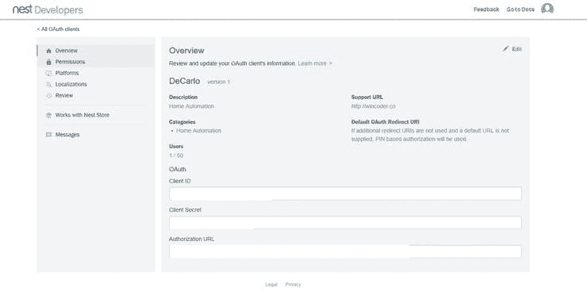](https://res.cloudinary.com/practicaldev/image/fetch/s--ArR5kBYf--/c_limit%2Cf_auto%2Cfl_progressive%2Cq_auto%2Cw_880/https://thepracticaldev.s3.amazonaws.com/i/j1qi0pgoeylem764x0h2.jpg)

4.在您获取授权 URL 的概览屏幕中，记下“客户端 ID”和“客户端密码”的值。接下来，在安装了“curl”的合适的命令提示符下，执行以下命令来获取您的 AUTH_TOKEN:

`curl -X POST "https://api.home.nest.com/oauth2/access_token?client_id=<YOUR_CLIENT_ID>&code=<YOUR_PIN_CODE>&client_secret=<YOUR_CLIENT_SECRET>&grant_type=authorization_code"`

1.  最后，我们需要获得您想要的 STRUCTURE_ID，它是您的家的表示，与特定的嵌套设备相关联。下面将返回一个 json 有效负载。您将需要注意 structure_id 属性的值。

`curl --location-trusted \ -H "Content-Type: application/json" \ -H "Authorization: Bearer <YOUR_ACCESS_TOKEN>" \ -X GET "https://developer-api.nest.com/`

## 构造硬件

我们将使用可从 http://particle.io 获得的粒子光子或粒子核心设备以及数字 PIR 传感器来创建一个设备，该设备可以监控运动并能够将事件发布到 particle.io。

1.  首先获得一个数字 PIR 传感器，并根据以下原理图连接到一个可用的粒子设备:

[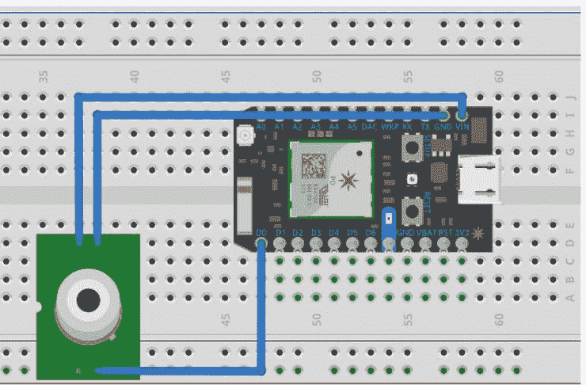](https://res.cloudinary.com/practicaldev/image/fetch/s--i8wrpeQA--/c_limit%2Cf_auto%2Cfl_progressive%2Cq_auto%2Cw_880/https://thepracticaldev.s3.amazonaws.com/i/u156vidutumdtlmisz48.jpg)
[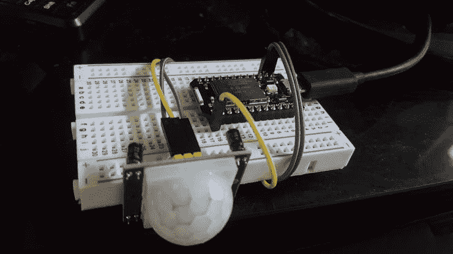T6】](https://res.cloudinary.com/practicaldev/image/fetch/s--KlUhDPaU--/c_limit%2Cf_auto%2Cfl_progressive%2Cq_auto%2Cw_880/https://thepracticaldev.s3.amazonaws.com/i/gpq97unuz03gozopm65e.jpg)

1.  在[https://build.particle.io/build](https://build.particle.io/build)的粒子网络集成开发环境中创建一个新程序，你需要刷新附带的 [nest-motion.ino](http://nest-motion.ino/) 并确保包含相关的循环缓冲区。该程序使用循环缓冲区来监控样本窗口上的传感器读数。这允许我们从硬件非常精确地控制运动触发事件的灵敏度。通常，PIR 传感器很容易产生假阳性事件，而没有根据调控器评估样本读数的机制。要获得更高的灵敏度，请减小“PostiveSamplesToTriggerMotion”变量。如果需要更长的触发运动窗口，可以调整“SampleWindowSize”。 [nest-motion.ino](https://github.com/toolboc/Auto-Away-Assist-for-NEST-Thermostat/blob/master/Particle/nest-motion/src/nest-motion.ino) 可在以下报告的`nest-motion/src`中找到:

##  [ toolboc ](https://github.com/toolboc) / [自动离巢辅助恒温器](https://github.com/toolboc/Auto-Away-Assist-for-NEST-Thermostat)

### 让 Nest 知道你何时在另一个房间，以协助 Auto-Away 在你在家时启用运动传感器、粒子和 Azure！

<article class="markdown-body entry-content container-lg" itemprop="text">

# 自动离开辅助嵌套恒温器

让 Nest 知道你何时在另一个房间，以协助 Auto-Away 在你在家时启用运动传感器、粒子和 Azure！

@ [Hackster.io](https://www.hackster.io/pjdecarlo/auto-away-assist-for-nest-thermostat-8ad566) 提供完整说明和演练指南

[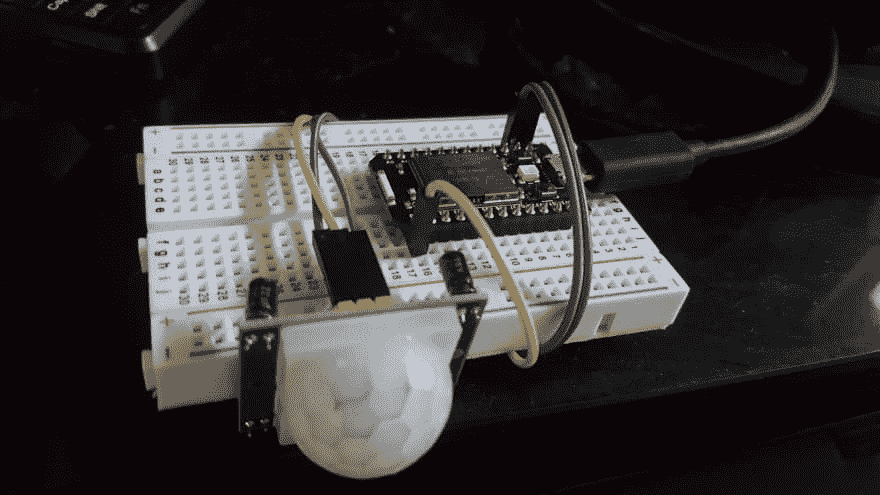](https://raw.githubusercontent.com/toolboc/Auto-Away-Assist-for-NEST-Thermostat/master//Assets/prototype.png)

</article>

[View on GitHub](https://github.com/toolboc/Auto-Away-Assist-for-NEST-Thermostat)

## 设置粒子集成，将事件转发到 Azure 物联网中心

这一步需要一个有效的 Azure 帐户。我们将创建的服务将是免费的，或者几乎不需要任何运营成本。

1.  在[http://azure.com](https://azure.microsoft.com/en-us/free?&WT.mc_id=azureapril_devto-blog-cxa)创建 Azure 物联网中心

[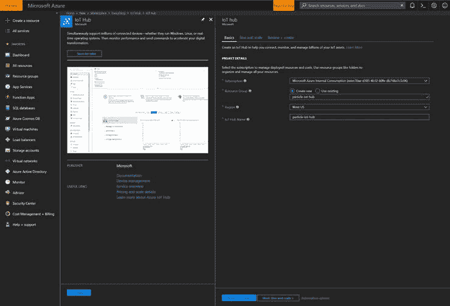](https://res.cloudinary.com/practicaldev/image/fetch/s--uHlugMhb--/c_limit%2Cf_auto%2Cfl_progressive%2Cq_auto%2Cw_880/https://thepracticaldev.s3.amazonaws.com/i/rjnt1i07wvtp9eiy4wtp.jpg)

2.创建粒子集成
在[https://console . Particle . io/integrations/azure-IOT-hub/Create](https://console.particle.io/integrations/azure-iot-hub/create)创建一个新的粒子集成。请务必遵循所有说明，并特别注意关于创建“共享访问策略”的部分。在出现的设置页面上，使用值“运动”作为事件名称。

当您填写了适当的信息后，启用集成。

[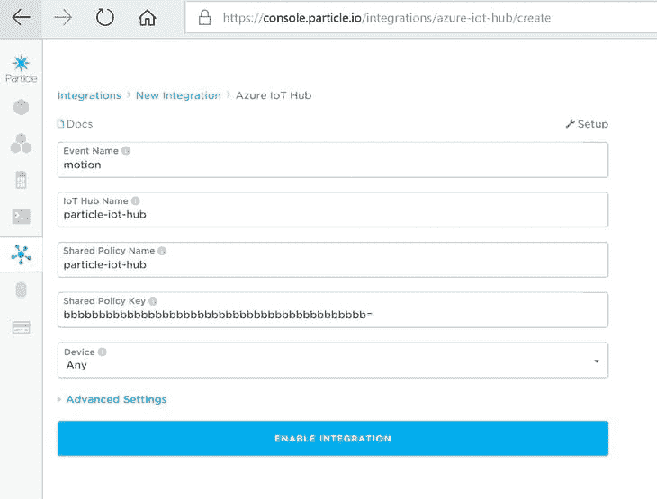](https://res.cloudinary.com/practicaldev/image/fetch/s--bNIVCefE--/c_limit%2Cf_auto%2Cfl_progressive%2Cq_auto%2Cw_880/https://thepracticaldev.s3.amazonaws.com/i/5p6o9oqio0tnddg4f4z1.png)

现在在 nestmotion.ino 中调用`Particle.publish("motion", "true", PRIVATE);`时，事件会被发送到 Particle.io，然后转发到你的 Azure Iot Hub。

## 用 Azure 函数设置 Nest 'Away '状态

我们差不多完成了，我们只需要触发对 Nest 的 API 的调用，以便在检测到运动时将 Nest 的‘离开’状态设置为 home。

我已经尽了最大的努力，用一个预制的 Azure 函数来执行这个任务，让这个任务尽可能简单。

1.  在[https://ms.portal.azure.com/#create/Microsoft.FunctionApp](https://ms.portal.azure.com/#create/Microsoft.FunctionApp)创建一个新的 Azure 功能应用

2.  在 Visual Studio 代码中，打开位于[https://github . com/tool BOC/Auto-Away-Assist-for-Nest-Thermostat](https://github.com/toolboc/Auto-Away-Assist-for-NEST-Thermostat)的源 repo 中包含的 Nest-Controller 文件夹

您需要编辑 local.settings.json 配置文件:

ACCESS_TOKEN 和 STRUCTURE_ID 应该设置为在“获取 Oauth 令牌以访问嵌套 API”的步骤 4 和 5 中获得的值

在 azure 门户中，导航到您的物联网中心，并选择“设置”下的“内置端点”部分。

应更改为“事件中心兼容端点”的值。

[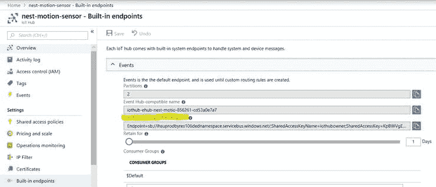](https://res.cloudinary.com/practicaldev/image/fetch/s--yemX_9xh--/c_limit%2Cf_auto%2Cfl_progressive%2Cq_auto%2Cw_880/https://thepracticaldev.s3.amazonaws.com/i/hobp7leqrms5v7nbcvgk.png)

您现在可以调试和测试 Azure 功能了。当粒子设备发送运动事件时，您应该会看到函数触发。

当您能够验证该函数是否按预期运行时，您可以在 Visual Studio 中将该函数发布到 Azure，方法是右键单击该项目并选择“部署到函数应用程序”。

**可选:**如果你知道你在做什么，你可以使用下面提供的代码完全在 Azure 门户中创建这个功能。请注意，您必须在 kudu cli 中安装“request”依赖项，方法是访问`http://<YOUR_FUNCTION_SITENAME>.scm.azurewebsites.net`，导航到“wwwroot”，并发出命令“npm install azure-cli -g”来满足“request.js”的依赖项。

`module.exports = function (context, eventInput) {
context.log('Triggered!');
if(eventInput.event === "motion" && eventInput.data === "true");
{
var url = 'https://developer-api.nest.com/structures/' + process.env.STRUCTURE_ID + '/away?auth=' + process.env.ACCESS_TOKEN;
var request = require('request');
request({ method: 'PUT', url: url, followAllRedirects : true, 'content-type': 'application/json', body: '"home"' }, function (err, res, body) {
context.log('Away status set to: ' + JSON.parse(body));
context.done();
});
}
}`

3.更新函数 AppSettings 以使用您的值为
ACCESS_TOKEN、STRUCTURE_ID 和 particle-iot-hub_events_IOTHUB 应设置为您的 local.settings.json 配置文件的值，这些值在“**Set Nest‘Away’status with Azure Function**”的步骤 2 中配置。

[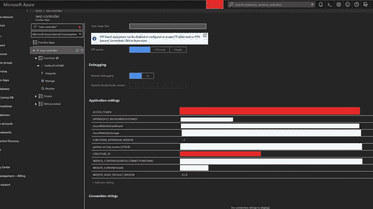](https://res.cloudinary.com/practicaldev/image/fetch/s---oxVmaMC--/c_limit%2Cf_auto%2Cfl_progressive%2Cq_auto%2Cw_880/https://thepracticaldev.s3.amazonaws.com/i/8nm6r061c9aanzuyv37z.png)

您可以在 Azure 门户中使用 [sample.dat](https://github.com/toolboc/Auto-Away-Assist-for-NEST-Thermostat/blob/master/Azure/Nest-Controller/SetNestToHOME/sample.dat) 的内容来测试该功能:

[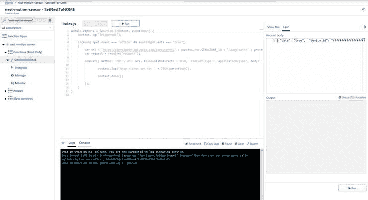](https://res.cloudinary.com/practicaldev/image/fetch/s--KMQJ5rhX--/c_limit%2Cf_auto%2Cfl_progressive%2Cq_auto%2Cw_880/https://thepracticaldev.s3.amazonaws.com/i/78hs7cpt15g8ue3zr3k3.png)

现在你知道了！你现在应该在 Azure 中有一个完整的管道来处理来自 Hardware = > particle . io = > Azure IoT HuB = > Azure Function = > Nest API 的消息。

您可以在[https://console.particle.io/integrations/](https://console.particle.io/integrations/)监测到粒子整合点的运动事件，然后选择您的整合并向下滚动到历史。请务必检查此区域，以确保您没有发送假阳性运动事件:

[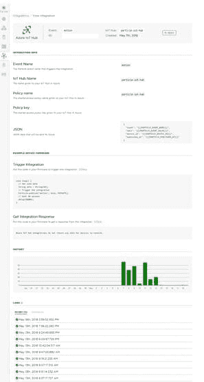](https://res.cloudinary.com/practicaldev/image/fetch/s--FoWSOsCd--/c_limit%2Cf_auto%2Cfl_progressive%2Cq_auto%2Cw_880/https://thepracticaldev.s3.amazonaws.com/i/7biw3k2tc8qilnttohf7.png)

# 结论

Nest 拥有相当不错的产品线，然而，我们已经展示了通过访问他们的开发者 API，我们可以让他们变得更好！我再也不用担心在楼上工作时空调会关闭。我可以简单地将 nest-motion.ino 代码闪存到多个粒子设备中，并提醒 nest 房子中的多个房间有人居住。目前，我有一个设备连接到我办公室打印机的 usb 端口(始终打开)，另一个在我哥哥的房间里，插在墙上，还有一个连接到我楼下电视的 usb 端口，只有在电视打开时才会打开。这种设置让鸟巢真正知道我们是否在家。

我们使用的服务都是免费的，每台大约 22 美元，你可以根据需要制造任意多的设备。硬件是节能的，因为它在运动检测事件发生后默认进入深度睡眠模式 10 分钟，仅消耗 200uA 。此外，我们可以通过采用各种附加传感器来扩展这些功能。我们甚至可以通过使用温度传感器和显示器来创建我们自己的嵌套恒温器。

请在评论中告诉我们你的想法，并随时分享你的想法来改进设计！

* * *

我们将在 4 月份每天发布文章，所以请继续关注或提前查看更多提示和技巧[现在](http://azuredev.tips)。