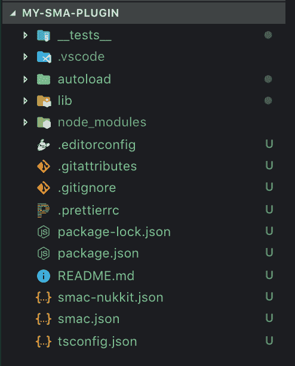
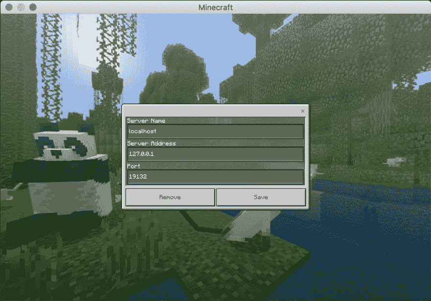

# 如何在没有 Java 的情况下 Mod《我的世界》(使用 TypeScript)

> 原文：<https://dev.to/jwulf/how-to-mod-minecraft-without-java-using-typescript-2afj>

通常修改《我的世界》需要用 Java 编码，以及大量的搭建。ScriptCraft 是一个 JavaScript modding 库，我们已经编写了对 TypeScript transpilation 的支持和一系列工具，为来自 JavaScript 领域的人创建一个熟悉的开发人员体验。

[https://www.youtube.com/embed/RqohEXw9yvw](https://www.youtube.com/embed/RqohEXw9yvw)

在这个视频中，我向你展示了如何使用 TypeScript 编写一个基本的《我的世界》模式，并在你的本地计算机上运行它，包括一个桌面和一个移动《我的世界》服务器。

## 先决条件

你需要在电脑上安装一些软件，来运行《我的世界》服务器和编写插件的工具。安装以下所有四个组件:

*   [Docker](https://www.docker.com/get-started) —集装箱化解决方案。
*   [Node.js](https://nodejs.org/en/) —一个 JavaScript 执行引擎和库。
*   [Portainer](https://www.portainer.io/) —用于管理 Docker 容器的基于 web 的 GUI。
*   [Visual Studio 代码](https://code.visualstudio.com/) —一个代码编辑器。

## 《我的世界》客户端

你需要一个《我的世界》客户端来测试你的插件。

至少安装以下软件之一:

*   [《我的世界》Java 版](https://www.minecraft.net/en-us/) —桌面客户端，如果你想测试 Bukkit 服务器的话。
*   [《我的世界》口袋版](https://play.google.com/store/apps/details?id=com.mojang.minecraftpe) —一个移动客户端，如果你想对 Nukkit 服务器(手机/平板电脑/Xbox)进行测试。如果你使用这个，你可以使用[《我的世界》袖珍版基岩发射器](https://mcpelauncher.readthedocs.io/en/latest/)在你的电脑上运行移动客户端。

## 安装

既然已经安装了先决条件，那么是时候为服务器和插件开发安装工具了。

运行以下命令:

```
npm i -g smac yo generator-sma-plugin typescript 
```

Enter fullscreen mode Exit fullscreen mode

这将在您的计算机上安装四样东西:

*   `smac` — Scriptcraft 模块化架构控制器，一个为你的插件运行《我的世界》服务器的程序。
*   `yo` —脚手架工具 Yeoman。
*   使用 Scriptcraft 模块化架构生成新《我的世界》插件的 Yeoman 插件。
*   `typescript`—TypeScript trans piler，用于将 TypeScript 代码转换成可以在《我的世界》运行的 ES5 JavaScript。

## 创建新插件

现在您已经安装了工具集，通过运行以下命令创建一个新的插件:

```
yo sma-plugin 
```

Enter fullscreen mode Exit fullscreen mode

这将启动插件向导:

```
➜ yo sma-plugin
     _-----_     ╭──────────────────────────╮
    |       |    │      Welcome to the      │
    |--(o)--|    │  Scriptcraft SMA Plugin  │
   `---------´   │       generator by       │
    ( _´U`_ )    │      Magikcraft.io!      │
    /___A___\   /╰──────────────────────────╯
     |  ~  |
   __'.___.'__
 ´   `  |° ´ Y `
? Your package name (workspace) 
```

Enter fullscreen mode Exit fullscreen mode

这里你只需要回答一个问题——你的插件的名字。向导将用插件的名称创建一个新文件夹，并将新插件的文件放在其中。

[这个截屏](https://asciinema.org/a/242028)向你展示了这个过程。

一旦向导完成，它会发出一条类似如下的消息(在本例中我选择了名称`my-sma-plugin`):

[](https://res.cloudinary.com/practicaldev/image/fetch/s--WqRh7nB5--/c_limit%2Cf_auto%2Cfl_progressive%2Cq_auto%2Cw_880/https://thepracticaldev.s3.amazonaws.com/i/d913tlr82xmvt4px0wss.png)

## 编辑你的新插件

启动 Visual Studio 代码并打开包含新插件的目录。

[](https://res.cloudinary.com/practicaldev/image/fetch/s--Lx-Gq8KG--/c_limit%2Cf_auto%2Cfl_progressive%2Cq_auto%2Cw_880/https://thepracticaldev.s3.amazonaws.com/i/msyoaki9jzlg70l169bs.png)

以下是对新插件中文件的描述:

*   `__tests__` —包含插件单元测试的目录。这些是用茉莉做的。当你开发你的插件时，在这里添加更多的测试。
*   `.vscode`—Visual Studio 代码的设置。
*   `autoload` —当您的插件在《我的世界》服务器中启用时，这里的任何文件都会自动执行。将它用于初始化任务、注册事件处理程序等等。
*   `lib ` —放置不应自动加载的文件(或自动加载文件所需的文件)的地方。如果你的插件为其他插件提供功能，那么你可以通过 lib/index.ts 导出它。
*   `node_modules`—NPM 的模块安装在这里。您不能使用 npm 中使用 V8 APIs(如 fs 或 http)的模块。你需要的许多特性都由 [Scriptcraft API](https://github.com/walterhiggins/ScriptCraft) 和 [`@magikcraft/core`](https://github.com/Magikcraft/magikcraft-core) 包提供。
*   `.editorconfig` —编辑器的设置。
*   `.gitattributes`—git 的设置。
*   `.gitignore `—git 要忽略的文件。
*   `.prettierrc ` —代码格式设置。
*   `package-lock.json` —已安装依赖项的版本。
*   `package.json` —此插件的配置，包括依赖项和脚本。
*   `README.md` —开发和测试插件的说明。
*   `smac-nukkit.json` —运行加载了插件的 Nukkit 服务器的配置。
*   `smac.json` —加载插件后运行 Bukkit 服务器的配置。
*   `tsconfig.json ` —将插件转换成 JavaScript 的类型脚本配置。

打开自动加载/索引. ts:

[](https://res.cloudinary.com/practicaldev/image/fetch/s--JWNaNPAk--/c_limit%2Cf_auto%2Cfl_progressive%2Cq_auto%2Cw_880/https://thepracticaldev.s3.amazonaws.com/i/hn5vktfwgx1qy5pat4vz.png)

这个文件在插件加载时自动执行。当你(重新)加载插件时，你在这里所做的更改将会可见。

## 启动开发服务器

您可以在开发服务器中加载您的插件。您可以使用两个服务器—一个用于桌面 Java 客户端，另一个用于移动 Pocket Edition 客户端。

### 启动桌面服务器

运行此命令启动桌面服务器:

```
npm run start:bukkit 
```

Enter fullscreen mode Exit fullscreen mode

这将:

*   从 Docker Hub 获取 Bukkit 服务器映像。
*   启动 Bukkit 服务器并加载插件。
*   启动 TypeScript transpiler 将您的代码转换到 ES5。

现在，您可以使用桌面客户端连接到服务器。点击`Multiplayer`然后`Direct Connect`，然后使用服务器地址`127.0.0.1`:

[](https://res.cloudinary.com/practicaldev/image/fetch/s--JWNaNPAk--/c_limit%2Cf_auto%2Cfl_progressive%2Cq_auto%2Cw_880/https://thepracticaldev.s3.amazonaws.com/i/hn5vktfwgx1qy5pat4vz.png)

### 启动移动服务器

运行此命令启动移动服务器:

```
npm run start:nukkit 
```

Enter fullscreen mode Exit fullscreen mode

这将:

*   从 Docker Hub 中提取 Nukkit 服务器映像。
*   加载插件，启动 Nukkit 服务器。
*   启动 TypeScript transpiler 将您的代码转换到 ES5。
*   现在，您可以使用 pocket edition 客户端连接到服务器。点击`Play`然后`Servers`，然后添加一个地址为`127.0.0.1`的服务器:

[](https://res.cloudinary.com/practicaldev/image/fetch/s--NtZ7VEIG--/c_limit%2Cf_auto%2Cfl_progressive%2Cq_auto%2Cw_880/https://thepracticaldev.s3.amazonaws.com/i/j2bnuisfnnjrqu9r844y.png)

## 将更改重新加载到您的插件中

当您更改插件并保存更改后的类型脚本时，它会自动转换为 JavaScript。

要在开发服务器中重新加载更改，请在服务器控制台中键入以下内容:

```
ts on
refresh() 
```

Enter fullscreen mode Exit fullscreen mode

请看[这个截屏](https://asciinema.org/a/242023)看看这是什么样子。

## 停止服务器

要停止服务器，请在服务器控制台键入以下命令:

```
smac stop 
```

Enter fullscreen mode Exit fullscreen mode

请看[这个截屏图](https://asciinema.org/a/242023)来看看当你运行这个命令时会是什么样子。

## 截屏:开始、重新加载和停止

[截屏](https://asciinema.org/a/242023)显示您启动桌面服务器，重新加载插件代码，以及停止开发服务器。

## 进一步资源

*   [GitHub 上的 magic craft](https://github.com/Magikcraft)
*   [YouTube 上的 magic craft](https://www.youtube.com/channel/UC9cEOcTkQEyiKr2nCZDBYeg)
*   [MCT1 源代码(示例插件)](https://github.com/Magikcraft/mct1)
*   [GitHub 上的 script craft](https://github.com/walterhiggins/ScriptCraft)
*   [bukit API docs](https://bukkit.magikcraft.io/)