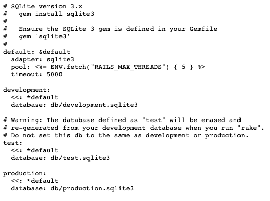
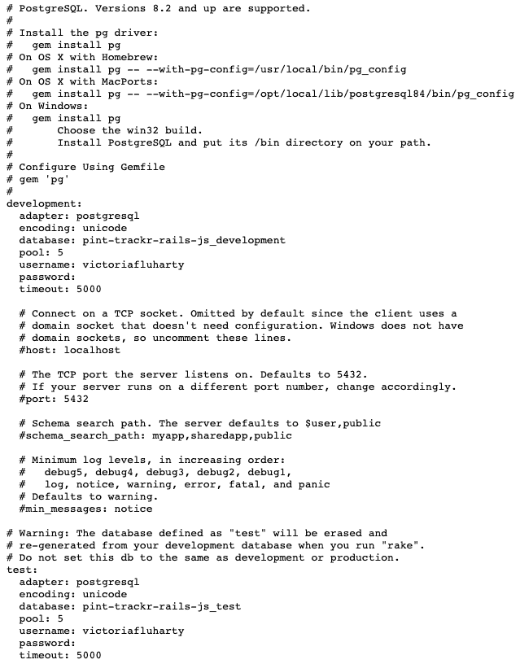

# 从 SQLite3 到 PostgreSQL - Ruby on Rails 的转变

> 原文：<https://dev.to/torianne02/making-the-change-from-sqlite3-to-postgresql-ruby-on-rails-2m0p>

在训练营的时候，我总是在 Slack 上注意到至少一周会有人提到在 Heroku 部署他们的项目时遇到了问题。这无疑让我将一个项目部署到 Heroku 的行动看起来非常令人生畏。我拖延了这么久，但今天早上我决定要克服恐惧，把它完成。

你可能会问，这些人在处理什么问题？嗯，我在 Slack 上反复看到的问题是关于将项目数据库从 SQLite3 切换到 PostgreSQL。为了部署到 Heroku，这是必须要做的事情，至少对我来说，完全改变我的数据库的想法是令人生畏的。

嗯，我现在要告诉你，我的担心完全是毫无根据的，因为在我的 Ruby on Rails 项目中更改数据库非常简单，非常 T2。

我将继续给你们一个快速的一步一步的教程，告诉你们如何完成数据库的切换。出于本教程的目的，您应该已经有了一个想要将数据库从 SQLite3 切换到 PostgreSQL 的预先存在的项目，所以我将跳过创建一个新的 RoR 应用程序的步骤。

## 安装 PostgreSQL

切换数据库的第一步是确保您的机器上安装了 [Postgres.app](https://postgresapp.com/) 。一旦你安装了这个，你就可以继续读下去。

## 准备 Gemfile

既然你正在看这个教程，我假设你的 gem 文件中已经有了`sqlite3`宝石。为了切换您的数据库，您需要删除行

```
gem 'sqlite3' 
```

你需要用
来替换它

```
gem 'pg' 
```

一旦你完成了这些，确保通过在终端中运行`$ bundle install`来重新安装你的依赖项。

## 更新配置/数据库. yml

不幸的是，更改 Gemfile 不足以切换数据库。完成这个的下一步是确保你的`config/database.yml`文件使用的是`postgresql`适配器而不是`sqlite3`适配器。

你原来的`config/database.yml`应该是这样的:

[](https://res.cloudinary.com/practicaldev/image/fetch/s--2-knqA3R--/c_limit%2Cf_auto%2Cfl_progressive%2Cq_auto%2Cw_880/https://thepracticaldev.s3.amazonaws.com/i/oksu7pvm8k0rdbf0p9mh.png)

您需要更改该文档，如下所示:

[](https://res.cloudinary.com/practicaldev/image/fetch/s--YyoYunBe--/c_limit%2Cf_auto%2Cfl_progressive%2Cq_auto%2Cw_880/https://thepracticaldev.s3.amazonaws.com/i/qhmz4udb5rdupl0igkqa.png)

请注意，数据库应该是您的应用程序名称，在我的例子中是`pint-trackr-rails-js_development`。为了测试，我没有在我的应用程序名称后面添加`_development`，而是添加了`_test`。我还将我的 Mac 用户名添加到了`postgresql`适配器中，因为我在另一个教程中见过它(链接在本文的底部),它对我有效。

## 设置和迁移

现在，为了让 PostgreSQL 数据库在您的应用程序中启动并运行，您需要运行以下命令

```
$ rake db:setup
...
...
$ rake db:migrate 
```

请注意，此时您可以从项目目录中删除 SQLite3 数据库文件。

现在，您应该通过启动 rails 服务器来检查以确保数据库已经启动并正在运行。您可以通过在终端中运行命令`$ rails s`来做到这一点。

## 提交到 Git/Github

当我尝试部署到 Heroku 时，给我造成问题的一件事是我忘记将我的代码推送到 Github 上的主分支。我一直收到一个错误，说我试图使用 SQLite3 部署一个项目。我很困惑，不明白发生了什么，直到我谷歌并很容易地找到了错过的步骤。

所以，一旦你知道你的数据库已经启动并运行，做一个好的开发者，然后**提交，提交，提交**。显然，在这一点上，一旦你对你的代码感到满意，就把它推到主分支。

## 最终评论

至此，您已经准备好开始使用 [Heroku](https://devcenter.heroku.com/articles/getting-started-with-rails5#deploy-your-application-to-heroku) 部署您的项目了。关于这一点还有几个步骤，但是我将在另一个专门针对 Heroku 部署的教程中详细介绍。如果你是在我把它拿出来之前读到这篇文章的，请随意点击上面的链接，查看 Heroku 关于部署 Ruby on Rails 项目的官方教程。

编码快乐！！

#### 来源

[Heroku with Rails 5 . x 入门](https://devcenter.heroku.com/articles/getting-started-with-rails5#deploy-your-application-to-heroku)
[Ruby on Rails 从 SQLite3 切换到 Postgres](https://www.daveferrara1.com/ruby-in-rails-switch-from-sqlite3-to-postgres/)