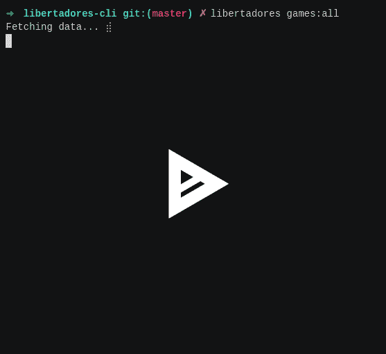

# 用 JavaScript 和 Oclif 构建一流的 CLI

> 原文：<https://dev.to/fedekau/building-awesome-clis-with-javascript-and-oclif-291o>

*最初发表于[斯特里弗的博客](https://www.streaver.com/blog/posts/building-CLIs-with-javascript-and-oclif.html)。*

## 我们先来定义一个 CLI

当然，在谷歌上快速搜索会得到一篇带有 CLI 定义的[维基百科文章](https://en.wikipedia.org/wiki/Command-line_interface):

> 命令行界面或命令语言解释器(CLI)，也称为命令行用户界面、控制台用户界面和字符用户界面(CUI)，是一种与计算机程序交互的方式，其中用户(或客户端)以连续文本行(命令行)的形式向程序发出命令。处理接口的程序称为命令语言解释程序或 shell(计算)。

因此，简而言之，CLI 是一种程序，它可以理解用户以文本形式发出的请求，然后做出响应并执行代码。

这种程序对于许多不同的用例非常有用，从显示当前月份的简单 CLI(如`cal` Bash 工具)到管理 Kubernetes 集群的极其复杂的 CLI(如`kubectl`)。

即使你不是每天都直接使用 CLI(这是非常不可能的)，你也很可能正受到它们的间接影响，例如，`git`是 CLI，`gcc`GNU 编译器，`create-react-app`用于生成 React 应用的脚手架 CLI，等等。

## 如何打造自己的 CLI

就像科技界的许多事情一样，答案是:“视情况而定”。有许多方法可以构建它们，并且所有这些方法在不同的上下文中都可能是有效的。在这种情况下，我将探索如何用 JavaScript 和 [Oclif: a Node 构建一个。JS Open CLI Framework(由 Heroku 开发)](https://github.com/oclif/oclif)，其中包括一个用于构建 CLI 的 CLI🤔。

**危险**

从现在开始，我将假设你对 JavaScript 和 NPM 生态系统很熟悉，如果你不熟悉，你可能会有一个大概的概念，但是我建议你在开始之前阅读一些相关的内容😃。

### Oclif 入门

在我看来，构建一些东西通常是一种很好的学习方式，所以在这种情况下，我和 [@flarraa](https://twitter.com/flarraa) 做了一些头脑风暴，决定构建一个“Copa Libertadores”CLI([见维基百科](https://en.wikipedia.org/wiki/Copa_Libertadores))。

这个想法是提供一组命令，可以检索和显示关于“Copa Libertadores”锦标赛已经进行的比赛和即将进行的比赛的信息。

让我们开始吃吧！

Oclif CLI 有两种可能的方式生成 CLI 项目，一种是`npx oclif single mynewcli`，另一种是`npx oclif multi mynewcli`，在这种情况下，我们将生成一个多命令 CLI。

我们希望我们的命令看起来像`libertadores games:all`、`libertadores games:past`、`libertadores games:upcoming`，这与 Oclif 的多命令 CLI 生成是一致的。

#### 初始化项目

首先，我们通过做以下事情来初始化项目:

```
npx oclif multi libertadores-cli 
```

这将询问一些问题，之后，它将安装你需要开始编码的一切！

```
$ npx oclif multi libertadores
npx: installed 442 in 32.454s

     _-----_     ╭──────────────────────────╮
    |       |    │      Time to build a     │
    |--(o)--|    │  multi-command CLI with  │
   `---------´   │  oclif! Version: 1.13.1  │
    ( _´U`_ )    ╰──────────────────────────╯
    /___A___\   /
     |  ~  |
   __'.___.'__
 ´   `  |° ´ Y `

? npm package name libertadores-cli
? command bin name the CLI will export libertadores
? description A simple CLI to get information about "Copa Libertadores" right in your terminal
? author Federico Kauffman
? version 0.0.0
? license MIT
? Who is the GitHub owner of repository (https://github.com/OWNER/repo) streaver
? What is the GitHub name of repository (https://github.com/owner/REPO) libertadores-cli
? Select a package manager yarn
? TypeScript No
? Use eslint (linter for JavaScript) Yes
? Use mocha (testing framework) Yes
? Add CI service config circleci (continuous integration/delivery service) 
```

我已经选择了一些我喜欢的默认设置，现在你已经有了一堆文件和文件夹，它们将是我们这个项目的主要结构。接下来用`cd libertadores-cli`进入目录。

我将简单解释一下 Oclif 为我们带来了什么:

```
.
├── README.md
├── bin
│   ├── run
│   └── run.cmd
├── package.json
├── src
│   ├── commands
│   │   └── hello.js
│   └── index.js
├── test
│   ├── commands
│   │   └── hello.test.js
│   └── mocha.opts
└── yarn.lock

5 directories, 9 files 
```

查看文件树，您可以看到`bin`目录，其中包含在每个平台(Unix/Windows)上运行命令的二进制文件。

您会看到带有一个`index.js`文件的`src`文件夹，该文件简单地导出一个内部 Oclif 包，该包将加载可用的命令，这些命令在放置于`src/commands`文件夹中的文件中定义。默认情况下，Oclif 生成一个`hello`命令，让我们运行它，看看我们有什么:

```
$ ./bin/run

A simple CLI to get information about "Copa Libertadores" right in your terminal

VERSION
  libertadores-cli/0.0.0 darwin-x64 node-v11.13.0

USAGE
  $ libertadores [COMMAND]

COMMANDS
  hello  Describe the command here
  help   display help for libertadores 
```

如果您运行`hello`子命令，您会得到:

```
$ ./bin/run hello

hello world from ./src/commands/hello.js 
```

最后但同样重要的是，您有一个`tests`文件夹，您将在其中放置所有的测试，事实上，Oclif 已经创建了一些测试，我们可以用`npm run test`或`yarn test`来运行它们。

#### 创建第一个命令

首先，我们可以删除`hello`命令，因为我们不打算使用它，简单地删除`src/command/hello.js`和`tests/commands/hello.test.js`。

现在我们可以使用 Oclif CLI 生成器命令，让我们用
创建`games:all`命令

```
npx oclif command games:all 
```

这将创建命令所需的所有文件(包括测试),并且自动更新`README.md`文件以包含新命令。

我们将从[http://www.conmebol.com/es/copa-libertadores-2019/fixture](http://www.conmebol.com/es/copa-libertadores-2019/fixture)获得“Copa Libertadores”的详细信息，我们将使用[木偶师](https://github.com/GoogleChrome/puppeteer)进入网站并获取数据。

```
$ yarn add puppeteer --save 
```

```
const puppeteer = require("puppeteer");
...
class AllCommand extends Command {
  async run() {
    ...
    const browser = await puppeteer.launch();
    const page = await browser.newPage();
    await page.goto(
      "http://www.conmebol.com/es/copa-libertadores-2019/fixture",
      { waitUntil: "load", timeout: 0 }
    );

    // Insert some really crazy code to parse the HTML
    // you can find this at https://github.com/streaver/libertadores-cli

    this.log(results);
  }
} 
```

现在我们可以执行`libertadores games:all`，我们将在终端上得到结果:

[](https://asciinema.org/a/mW5uSGbLT4ItkungqKzTkFeBd)

你可能已经注意到了，我还添加了一个“加载”特性来给用户一些视觉反馈。为了增加这一点，您只需安装包`cli-ux`，然后将代码的“慢”部分包装在一些开始/停止调用中:

这样安装:

```
yarn add cli-ux --save 
```

添加类似于
的微调器

```
const { cli } = require('cli-ux');
...

cli.action.start('Fetching data');
//Do something that takes time
cli.action.stop();
... 
```

现在，我们有了 CLI，我们可以为它编写测试了！Oclif 为测试这种 CLI 提供了一些不错的默认值。在这个特殊的例子中，您只想测试终端的输出是否是您所期望的。幸运的是，这正是自动生成的命令测试所做的，您只需要修改代码！

我将把这个任务留给你(读者，就像数学书一样)🙄...或者，您可以在“Copa Libertadores”CLI 的[官方知识库](https://www.github.com/streaver/libertadores-cli)中查看它们。

安装命令行界面，保持最新状态，不要再错过比赛了，❤️⚽！