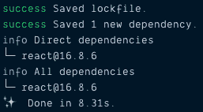
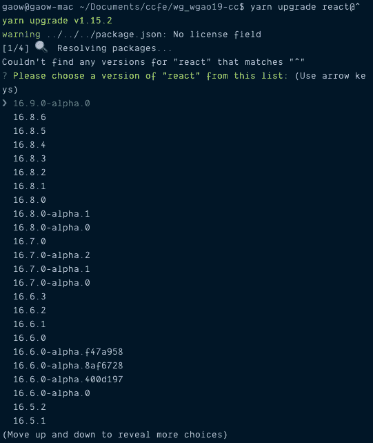

# 为什么运行“yarn upgrade”不能更新我的“package.json”

> 原文：<https://dev.to/wgao19/why-running-yarn-upgrade-does-not-update-my-package-json-3mon>

# 为什么运行`yarn upgrade`不更新我的`package.json`

今天我想升级我的一个项目对 React 的依赖。所以我跑了

```
yarn upgrade react 
```

Enter fullscreen mode Exit fullscreen mode

似乎每个人都很开心。

[](https://res.cloudinary.com/practicaldev/image/fetch/s--8O91YPfI--/c_limit%2Cf_auto%2Cfl_progressive%2Cq_auto%2Cw_880/https://i.imgur.com/tlJH8KR.png)

然后我查了一下我的`package.json`，什么都没变。

```
"react" "^16.5.1",
"react-dom": "^16.5.1", 
```

Enter fullscreen mode Exit fullscreen mode

我的第一个谷歌查询是 [yarn 升级不更新 package.json](https://www.google.com/search?q=yarn+upgrade+does+not+update+package.json) 。一些结果似乎表明了早期版本的 Yarn 中的错误。但它似乎不会去任何地方。

Yarn 的官方文档明确指出运行这样的命令应该更新这里的依赖关系。

然后我检查了我的`yarn.lock`，发现我的升级包的最新版本已经安装好了。

[](https://res.cloudinary.com/practicaldev/image/fetch/s--Tqb612yw--/c_limit%2Cf_auto%2Cfl_progressive%2Cq_auto%2Cw_880/https://i.imgur.com/ekEn1dG.png)

为什么，为什么，为什么🤷🏻‍♀️

我对这里可能发生的事情有了一个粗略的了解。当前`react@^16.5.1`接受升级版本`16.8.6`，如`yarn.lock`所示。

但是对于我来说，在这种语义情况下，升级依赖关系的适当方式是什么呢？也就是说，将依赖关系升级到最新的包*和*，表明我的应用程序现在依赖于那个版本？

我的意思是，除了手动更改`package.json`？

我四处游玩了几件事。有些显然不是正确的方向，但它们有助于对情况有所了解。

## 了解语义版本范围

我们的`node_modules`中安装的版本可能不是我们在`package.json`中看到的字面数字。这是因为我们指出的版本可以是一个范围。

例如，[插入符号范围](https://yarnpkg.com/en/docs/dependency-versions#toc-caret-ranges)指定如下:

> 允许不修改版本中第一个非零数字的更改，3.1.4 中的 3 或 0.4.2 中的 4。

通过运行
添加包时，缺省情况下使用插入符号范围

```
$ yarn add package-name 
```

Enter fullscreen mode Exit fullscreen mode

这将安装带有最新稳定版本的包，Yarn 用插入符号范围编写我们的那个版本的`package.json`。

如果我理解正确的话，似乎如果我将来运行`yarn`我的包，或者其他某个包依赖于一个更高的版本，只要满足范围，它就会使用更高的版本。

语义版本控制有更多的范围:

*   [插入符号范围](https://yarnpkg.com/en/docs/dependency-versions#toc-caret-ranges)
*   [波浪号范围](https://yarnpkg.com/en/docs/dependency-versions#toc-tilde-ranges)
*   [连字符范围](https://yarnpkg.com/en/docs/dependency-versions#toc-hyphen-ranges)
*   [x 范围](https://yarnpkg.com/en/docs/dependency-versions#toc-x-ranges)

你可以在这里阅读纱线的文件[，或者在这里](https://yarnpkg.com/en/docs/dependency-versions)阅读 NPM 的文件[。](https://docs.npmjs.com/files/package.json#dependencies)

## 理解命令`yarn upgrade`

所以我今天学到的是，运行`yarn upgrade`不一定会像我想象的那样更新`package.json`。

### `yarn upgrade`(不带修饰语)

不带任何修改器运行`yarn upgrade`不会更新`package.json`。

如果我们不带任何标志运行`yarn upgrade`，它将安装与指示的版本模式相匹配的最新版本*。并且它会*而不是*更新`package.json`。*

*   `yarn upgrade`依赖`"react": "~16.5.1"`:在*波浪号范围*上安装最新版本`~16.5.1`为`16.5.2`
*   `yarn upgrade`依赖`"react": "^16.5.1"`:在*插入符号范围*上安装最新版本`~16.5.1`，从今天起为`16.8.6`
*   `yarn upgrade` on *确切的说*依赖`"react": "16.5.1"`根本不会安装任何新的🧐

### `yarn upgrade --latest`

运行`yarn upgrade` *可能*更新`package.json`，当最新的稳定版本不再匹配当前范围。

但它仍然*可能不会*更新`package.json`。具体地，当最新版本与`package.json`中指示的语义版本范围相匹配时。

*   `yarn upgrade --latest`依赖`"react": "~16.5.1"`:安装到今天为止的最新版本`16.8.6`，更新`package.json`到`"react": ~16.8.6"`
*   `yarn upgrade --latest`依赖`"react": "^16.5.1"`:安装到今天为止的最新版本`16.8.6`，更新`package.json`到`"react": ^16.8.6"`
*   `yarn upgrade --latest`于*确切的*依赖`"react": "16.5.1"`安装到今天为止的最新版本`16.8.6`，更新`package.json`到`"react": 16.8.6"`

## 想升级一个版本*更新`package.json`该怎么做*

 *如果处理一个即使是次要版本也很敏感的库，最好指明一个更严格的版本范围，甚至是一个精确的版本范围。并且用`--latest`升级。

除此之外，在使用了几个命令之后，我发现这个命令很有趣，并且在这种情况下最简单:

```
$ yarn upgrade react@^ 
```

Enter fullscreen mode Exit fullscreen mode

这将弹出一个交互式版本列表供您选择。并且安装后，它会再次用脱字符号范围将`package.json`更新到所选版本。

[](https://res.cloudinary.com/practicaldev/image/fetch/s--ZjuoTUCP--/c_limit%2Cf_auto%2Cfl_progressive%2Cq_auto%2Cw_880/https://i.imgur.com/v1kub69.png)

## 包装完毕

对于版本敏感库(比如 Flow？？？🙈)，表示没有任何范围的版本依赖关系。

使用`yarn upgrade package@[version]`可能是升级软件包的实际操作中最直观的方式。

## 参考文献

*   [Yarn 文档:依赖关系的版本](https://yarnpkg.com/en/docs/dependency-versions)
*   [yarn upgrade.js 源代码](https://github.com/yarnpkg/yarn/blob/82d5891f3726abf275c9753b97bdcc54e85637f3/src/cli/commands/upgrade.js)
*   [npm-package.json](https://docs.npmjs.com/files/package.json)*