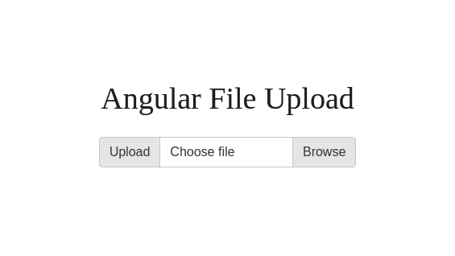

# 使用 Node 和 Angular 实现文件上传

> 原文：<https://dev.to/jscrambler/implementing-file-upload-using-node-and-angular-3m59>

在本教程中，您将学习如何使用 Angular 和 Node.js 实现文件上传。使用 Express Node，您将创建文件上传请求处理程序，该程序将文件上传到服务器。您将使用 Angular 实现文件上传用户界面。

本教程的源代码可以在 [GitHub](https://github.com/JscramblerBlog/FileUpload) 获得。

## 创建 Angular App

要开始学习本教程，您需要在系统中安装 Angular CLI。让我们开始使用节点程序包管理器(npm)安装 Angular CLI。

```
npm install -g @angular/cli 
```

安装 Angular CLI 后，使用命令行工具创建 Angular 应用程序。

```
ng new angular-file-upload 
```

以上命令将创建 Angular 项目样板文件。导航到项目目录并启动 Angular 应用程序。

```
cd angular-file-upload
npm start 
```

将您的浏览器指向`http://localhost:4200`，您将运行默认应用程序。

## 创建文件上传界面

默认的角度样板代码在`src/app/`文件夹中创建一个名为`AppComponent`的角度组件。一个组件有一个 HTML 文件、一个控制器文件和一个 CSS 文件。

从`src/app/app.component.html`中删除 HTML 代码，并添加以下代码:

```
<div class="mainContainer">
    <div class="content">
        <div class="header">
            <h1>Angular File Upload</h1>
        </div>
        <div class="row margin25">

            <div class="col-md-4">

            </div>
            <div class="col-md-4">
                <div class="input-group">
                    <div class="input-group-prepend">
                        <span class="input-group-text upload" id="btnUpload">Upload</span>
                    </div>
                    <div class="custom-file">
                        <form action="/api/upload" method="post" enctype="multipart/form-data">
                            <input type="file" class="custom-file-input" id="inputGroupFile01" aria-describedby="inputGroupFileAddon01">
                        </form>
                        <label class="custom-file-label" for="inputGroupFile01">Choose file</label>
                    </div>
                </div>
            </div>
            <div class="col-md-4">

            </div>
        </div>
    </div>
</div> 
```

将以下 CSS 样式添加到`src/app/app.component.css`文件中。

```
.header {
    text-align: center;
}

.header h1 {
    font-family: serif;
    font-size: 38px;
    font-family: 'Times New Roman';
}

.content {
    margin: 100px;
}

.margin25 {
    margin: 25px;
}

.upload {
    cursor: pointer;
} 
```

你将使用`bootstrap`来设计有角度的用户界面。所以，使用 npm 在 Angular project 内部安装`bootstrap`。

```
npm install --save bootstrap 
```

一旦安装了`bootstrap`，在构建配置下的`angular.json`文件中包含引导样式。

```
"styles":  [  "src/styles.css",  "node_modules/bootstrap/dist/css/bootstrap.min.css"  ] 
```

保存应用程序，您将能够看到文件上传的 Angular 用户界面。

<center></center>

## 创建 Node.js 文件上传处理程序

您需要一个文件上传处理器来处理 Angular 应用程序发送的请求。您将利用 Express 框架来创建节点处理程序。

创建一个名为`file-upload-server`的文件夹，并初始化其中的节点项目。

```
mkdir file-upload-folder
cd file-upload-folder
npm init 
```

初始化节点项目后，使用 npm 安装`express`框架。

```
npm install --save express 
```

在项目文件夹中创建一个名为`app.js`的文件。您将利用`body-parser`来解析请求处理程序的 post 参数。现在安装:

```
npm install --save body-parser 
```

您还将使用`connect-multiparty`模块上传文件。

```
npm install --save connect-multiparty 
```

一旦您有了编写文件上传处理程序所需的依赖项，让我们从创建 Express 应用程序开始。将以下代码添加到`app.js`文件中:

```
const  express  =  require('express')
const  app  =  express()
const  port  =  3000

app.get('/api/upload', (req, res) => {
    res.json({
        'message': 'hello'
    });
});

app.listen(port, () => console.log(`Example app listening on port ${port}!`)) 
```

如上面的代码所示，您使用`express`模块创建了 Express 应用程序。创建应用程序后，您定义了返回 JSON 消息的快速路由`/api/upload`。

保存以上更改并启动 Express 应用程序。

```
node app.js 
```

将您的浏览器指向`http://localhost:3000/api/upload`，您将在浏览器中呈现 JSON 响应。

为了编写文件上传请求处理程序，您需要一个处理 POST 请求的路由。因此，将现有路由修改为 POST 路由。

您将使用`connect-multiparty`模块来处理文件上传，因此需要该模块并定义文件上传文件夹。确保在项目目录中创建一个名为`uploads`的文件夹。

```
const  multipart  =  require('connect-multiparty');
const  multipartMiddleware  =  multipart({ uploadDir:  './uploads' }); 
```

将`connect-mutiparty`中间件添加到 POST 文件上传路径中。

```
app.post('/api/upload', multipartMiddleware, (req, res) => {
    res.json({
        'message': 'File uploaded successfully'
    });
}); 
```

为了解析发送到文件处理程序路径的文件上传请求，您需要使用`body-parser`模块。因此，需要`body-parser`模块并在应用程序中使用它。

```
const bodyParser = require("body-parser");
app.use(bodyParser.json());
app.use(bodyParser.urlencoded({
    extended: true
})); 
```

app.js 文件如下:

```
const express = require('express')
const app = express()
const port = 3000
const bodyParser = require("body-parser");
const multipart = require('connect-multiparty');
const multipartMiddleware = multipart({
    uploadDir: './uploads'
});

app.use(bodyParser.json());
app.use(bodyParser.urlencoded({
    extended: true
}));

app.post('/api/upload', multipartMiddleware, (req, res) => {
    res.json({
        'message': 'File uploaded succesfully.'
    });
});

app.listen(port, () => console.log(`Example app listening on port ${port}!`)) 
```

保存更改并运行节点应用程序。

```
node app.js 
```

您将在`http://localhost:3000`运行快速应用程序。

## 文件上传自 Angular

要将文件上传请求从 Angular 路由到节点服务器，您需要在 Angular 应用程序中设置一个代理。在 Angular app 目录中，创建一个`proxy.conf.json`文件，并添加以下代码来设置节点服务器的代理。

```
{  "/api/*":  {  "target":  "http://localhost:3000/",  "secure":  false  }  } 
```

从`package.json`文件中，使用代理修改`start`脚本来服务 Angular 应用程序。

```
ng serve --proxy-config proxy.conf.json 
```

现在，向`app.component.html`文件中的输入类型文件元素添加一个文件更改事件。

```
<input  (change)="fileChange($event)"  type="file"  class="custom-file-input"  id="inputGroupFile01"  aria-describedby="inputGroupFileAddon01"> 
```

在`app.component.ts`文件中定义`fileChange`方法。

```
 fileChange(element) {
      this.uploadedFiles = element.target.files;
  } 
```

在文件改变时，`uploadedFiles`数组用上传的文件更新，这些文件可以通过点击按钮发送到文件上传路径。将`upload` click 事件添加到上传按钮。

```
<span  class="input-group-text upload"  (click)="upload()"  id="btnUpload">Upload</span> 
```

在`app.component.ts`文件中定义`upload`方法。

```
upload() {
    let formData = new FormData();
    for (var i = 0; i < this.uploadedFiles.length; i++) {
        formData.append("uploads[]", this.uploadedFiles[i], this.uploadedFiles[i].name);
    }
    this.http.post('/api/upload', formData)
    .subscribe((response) => {
         console.log('response received is ', response);
    })
} 
```

迭代`uploadedFiles`数组，创建`formData`并将其发送到快速文件处理程序`/api/upload`。

下面是`app.component.ts`文件的样子:

```
import { Component, OnInit } from '@angular/core';
import { HttpClient } from '@angular/common/http';

@Component({
    selector: 'app-root',
    templateUrl: './app.component.html',
    styleUrls: ['./app.component.css']
})
export class AppComponent implements OnInit {

    uploadedFiles: Array < File > ;

    constructor(private http: HttpClient) {

    }

    ngOnInit() {

    }

    fileChange(element) {
        this.uploadedFiles = element.target.files;
    }

    upload() {
        let formData = new FormData();
        for (var i = 0; i < this.uploadedFiles.length; i++) {
            formData.append("uploads[]", this.uploadedFiles[i], this.uploadedFiles[i].name);
        }
        this.http.post('/api/upload', formData)
            .subscribe((response) => {
                console.log('response received is ', response);
            })
    }

} 
```

[](https://blog.jscrambler.com/how-to-protect-angular-code-against-theft-and-reverse-engineering/?utm_source=dev.to&utm_medium=referral)

保存以上更改并浏览文件，然后单击上传按钮。成功上传文件后，浏览器控制台中会记录一条成功消息。

您可以在节点服务器应用程序内的`uploads`文件夹中找到上传的文件。

## 结论

在本教程中，您学习了如何使用 Angular 和 Node.js 实现文件上传。

**此外，如果你正在用敏感的逻辑构建 Angular 应用程序，一定要遵循[这个指南](https://blog.jscrambler.com/how-to-protect-angular-code-against-theft-and-reverse-engineering/?utm_source=dev.to&utm_medium=referral)来保护它们免受代码窃取和逆向工程。**

最初发布在 Jay Raj 的 Jscrambler 博客上。