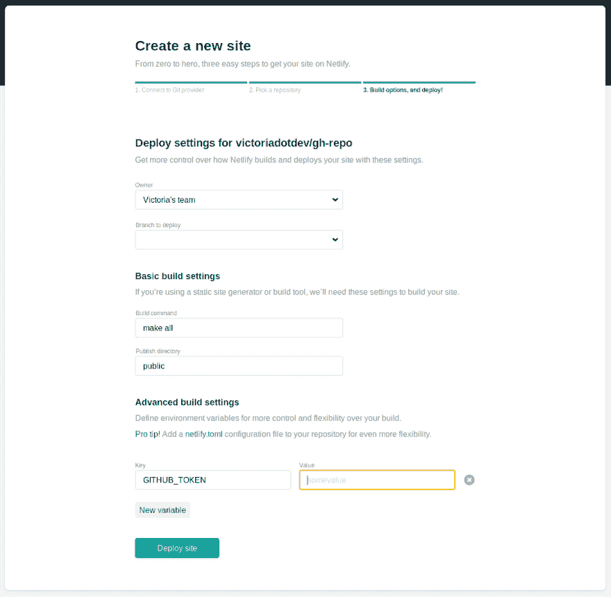

# 从私有 Hugo 库部署公共 GitHub Pages 站点的两种方法

> 原文：<https://dev.to/victoria/two-ways-to-deploy-a-public-github-pages-site-from-a-private-hugo-repository-2ob4>

[](https://res.cloudinary.com/practicaldev/image/fetch/s--l9S0_4-y--/c_limit%2Cf_auto%2Cfl_progressive%2Cq_auto%2Cw_880/https://victoria.dev/verbose/two-ways-to-deploy-a-public-github-pages-site-from-a-private-hugo-repository/cover_hu1664dea80ddda6cad8243ace1910f619_558187_640x0_resize_q75_box.jpg)

像 Travis CI 和 Netlify 这样的工具提供了一些非常漂亮的特性，比如当更改被推送到它的存储库时，可以无缝地部署 GitHub Pages 站点。有了 Hugo 这样的静态站点生成器，更新博客变得相当容易。

我用 Hugo 建立我的网站已经很多年了，但是直到上周，我还没有把我的页面库连接到任何部署服务上。为什么？因为使用一个在部署之前构建我的站点的工具似乎需要在一个地方拥有整个方法——如果你使用 GitHub 页面和 GitHub 的免费版本，[那个地方是公共的](https://help.github.com/en/articles/configuring-a-publishing-source-for-github-pages)。这意味着我所有的凌晨三点的好主意和凌乱的未完成(也不好笑)的草稿都将被公开——再多的便利也无法说服我这么做。

所以我把事情分开，Hugo 的幕后乱七八糟的东西放在本地 Git 存储库中，生成的`public/`文件夹推到我的 GitHub Pages 远程存储库中。每次我想部署我的网站，我都必须带上我的笔记本电脑和`hugo`来建立我的网站，然后是`cd public/ && git add . && git commit` …等等。一切都很好，除了总觉得有更好的方法来做这件事。

不久前，我写了另一篇文章，是关于每当我外出走动时，使用 GitHub 和工作副本对我的 iPad 上的库进行修改。在我看来，除了从我的 iPad 上部署我的网站，我可以做任何事情，所以我开始改变这一点。

几个凌晨三点的好主意和后来被撤销的访问令牌(哎呀)，我现在有两种方法从一个完全独立的私有 GitHub 库部署到我的公共 GitHub Pages 库。在这篇文章中，我将带你通过使用 [Travis CI](https://travis-ci.com/) 或者使用 [Netlify](http://netlify.com/) 和 [Make](https://www.gnu.org/software/make/) 来实现这一点。

这没有什么不好——我的公共 GitHub Pages 存储库看起来仍然和我从终端本地推送到那里时一样。直到现在，我才能够利用几个很棒的部署工具，每当我推送我的私人回购时，无论是在我的笔记本电脑上还是带着我的 iPad 外出，都可以更新网站。

[](https://res.cloudinary.com/practicaldev/image/fetch/s--NPZ0X5h9--/c_limit%2Cf_auto%2Cfl_progressive%2Cq_auto%2Cw_880/https://thepracticaldev.s3.amazonaws.com/i/jaieeayn11onl258fua4.jpg)

标签:# YouDidNotPushFromThere

本文假设您具备 Git 和 GitHub 页面的工作知识。如果没有，你可能想从我在[上的文章中分离出一些浏览器标签，先使用 GitHub 和工作副本](https://dev.to/victoria/a-remote-sync-solution-for-ios-and-linux-git-and-working-copy-19cl)和[用 Hugo 和 GitHub 页面](https://victoria.dev/verbose/how-i-ditched-wordpress-and-set-up-my-custom-domain-https-site-for-almost-free/)建立一个站点。

我们开始吧！

# 私有到公有 GitHub 页面部署与 Travis CI

Travis CI 具有内置的能力(？)在成功构建之后将[部署到 GitHub 页面](https://docs.travis-ci.com/user/deployment/pages/)。他们在文档中很好地解释了如何添加这个特性，尤其是如果你以前使用过 Travis CI，而我没有。别担心，我帮你解决了大部分问题。

*   Travis CI 从存储库根目录下名为`.travis.yml`的配置文件中获得所有指令
*   您需要提供一个 [GitHub 个人访问令牌](https://help.github.com/en/articles/creating-a-personal-access-token-for-the-command-line)作为安全的加密变量，您可以在命令行上使用`travis`生成这个变量
*   一旦你的脚本成功地完成了你让它做的事情(不一定是你*想要*它做的事情，但那完全是另外一篇博文)，Travis 将把你的构建目录部署到一个你可以用`repo`配置变量指定的存储库。

## 设置 Travis 配置文件

用文件名`.travis.yml`为 Travis 创建一个新的配置文件(注意前面的“.”).这些脚本是非常可定制的，我很难找到一个相关的例子作为起点——幸运的是，你没有这个问题！

下面是我的基本`.travis.yml` :

```
git:
 depth: false

env:
 global:
 - HUGO_VERSION="0.54.0"
 matrix:
 - YOUR_ENCRYPTED_VARIABLE

install:
 - wget -q https://github.com/gohugoio/hugo/releases/download/v${HUGO_VERSION}/hugo_${HUGO_VERSION}_Linux-64bit.tar.gz
 - tar xf hugo_${HUGO_VERSION}_Linux-64bit.tar.gz
 - mv hugo ~/bin/

script:
 - hugo --gc --minify

deploy:
 provider: pages
 skip-cleanup: true
 github-token: $GITHUB_TOKEN
 keep-history: true
 local-dir: public
 repo: gh-username/gh-username.github.io
 target-branch: master
 verbose: true
 on:
 branch: master 
```

Enter fullscreen mode Exit fullscreen mode

该脚本下载并安装 Hugo，构建带有垃圾收集和 minify [标志](https://gohugo.io/commands/hugo/#synopsis)的站点，然后将`public/`目录部署到指定的`repo`——在本例中，是您的公共 GitHub 页面存储库。你可以在这里阅读每一个`deploy`配置选项。

要[添加 GitHub 个人访问令牌作为加密变量](https://docs.travis-ci.com/user/environment-variables#defining-encrypted-variables-in-travisyml)，你不需要手动编辑你的`.travis.yml`。当您在存储库目录中运行下面的`travis` gem 命令时，它们会为您加密并添加变量。

首先，用`sudo gem install travis`安装`travis`。

然后[生成你的 GitHub 个人访问令牌](https://help.github.com/en/articles/creating-a-personal-access-token-for-the-command-line)，复制它(它只出现一次！)并在您的存储库根目录下运行下面的命令，用您的令牌代替亲吻:

```
travis login --pro --github-token xxxxxxxxxxxxxxxxxxxxxxxxxxx
travis encrypt GITHUB_TOKEN=xxxxxxxxxxxxxxxxxxxxxxxxxxx --add env.matrix 
```

Enter fullscreen mode Exit fullscreen mode

您的加密令牌神奇地出现在文件中。一旦您将`.travis.yml`提交到您的私有 Hugo 存储库，Travis CI 将运行脚本，如果构建成功，将把您的站点部署到您的公共 GitHub Pages repo。神奇！

Travis 总是会在您每次推送私有存储库时运行一次构建。如果您不想用特定的提交来触发这种行为，[将`skip`命令添加到您的提交消息](https://docs.travis-ci.com/user/customizing-the-build/#skipping-a-build)中。

那很酷，但是我喜欢网络生活。

好吧。

# 使用 Netlify 和 Make 部署到单独的存储库

我们可以通过使用 Makefile 让 Netlify 执行我们的命令，我们将使用 Netlify 的 build 命令运行该 Makefile。

下面是我们的`Makefile`的样子:

```
SHELL:=/bin/bash
BASEDIR=$(CURDIR)
OUTPUTDIR=public
.PHONY: all
all: clean get_repository build deploy
.PHONY: clean
clean:
@echo "Removing public directory"
rm -rf $(BASEDIR)/$(OUTPUTDIR)
.PHONY: get_repository
get_repository:
@echo "Getting public repository"
git clone https://github.com/gh-username/gh-username.github.io.git public
.PHONY: build
build:
@echo "Generating site"
hugo --gc --minify
.PHONY: deploy
deploy:
@echo "Preparing commit"
@cd $(OUTPUTDIR) \
 && git config user.email "you@youremail.com" \
 && git config user.name "Your Name" \
 && git add . \
 && git status \
 && git commit -m "Deploy via Makefile" \
 && git push -f -q https://$(GITHUB_TOKEN)@github.com/gh-username/gh-username.github.io.git master
@echo "Pushed to remote" 
```

Enter fullscreen mode Exit fullscreen mode

为了保存我们单独的 GitHub Pages 存储库的 Git 历史，我们将首先克隆它，为它构建新的 Hugo 站点，然后将它推回到 Pages 存储库。该脚本首先删除任何可能包含文件或 Git 历史的现有`public/`文件夹。然后，它将我们的页面存储库克隆到`public/`，构建我们的 Hugo 站点(本质上是更新`public/`中的文件)，然后负责将新站点提交到页面存储库。

在`deploy`部分，您会注意到以`&&`开头的行。这些是连锁命令。因为 Make [为每一行](https://www.gnu.org/software/make/manual/html_node/Execution.html#Execution)调用一个新的子 shell，所以它从根目录的每一个新行开始。为了让我们的`cd`保持不变，避免在项目根目录下运行我们的 Git 命令，我们将命令链接起来，并使用反斜杠字符[来分隔长行](http://clarkgrubb.com/makefile-style-guide#breaking-long-lines)以提高可读性。

通过链接我们的命令，我们能够[配置我们的 Git 身份](https://stackoverflow.com/questions/6116548/how-to-tell-git-to-use-the-correct-identity-name-and-email-for-a-given-project)，添加我们所有更新的文件，并为我们的 Pages 存储库创建一个 commit。

与使用 Travis CI 类似，我们需要传入一个 [GitHub 个人访问令牌](https://github.com/settings/tokens)以推送到我们的公共 GitHub 页面存储库——只是 Netlify 没有提供一种直接的方法来加密 Makefile 中的令牌。

相反，我们将使用 Netlify 的[构建环境变量](https://www.netlify.com/docs/continuous-deployment/#build-environment-variables)，它们安全地存在于 Netlify 应用程序的站点设置中。然后，我们可以在 Makefile 中调用我们的令牌变量。我们使用它通过[在远程 URL](https://stackoverflow.com/questions/44773415/how-to-push-a-commit-to-github-from-a-circleci-build-using-a-personal-access-tok) 中传递它来将令牌推送到我们的页面存储库(悄悄地，以避免在日志中打印令牌)。

为了避免在 Netlify 的日志中打印令牌，我们取消了带有前导字符`@`的那一行的[配方回显](https://www.gnu.org/software/make/manual/html_node/Echoing.html#Echoing)。

将 Makefile 放在您的私有 GitHub 库的根目录下，您可以设置 Netlify 来运行它。

## 设置网络寿命

通过 [web UI](https://app.netlify.com/) 设置 Netlify 非常简单。一旦你登录 GitHub，选择你的 Hugo 站点所在的私有 GitHub 库。Netlify 带您进入的下一页允许您输入部署设置:

[](https://res.cloudinary.com/practicaldev/image/fetch/s--_d-NpUbV--/c_limit%2Cf_auto%2Cfl_progressive%2Cq_auto%2Cw_880/https://thepracticaldev.s3.amazonaws.com/i/tdhpjbzzshd8oy16cypn.png)

您可以指定运行 Makefile 的构建命令(在本例中为`make all`)。在我们的特定情况下，要部署的分支和发布目录并不太重要，因为我们只关心推进到一个单独的存储库。你可以进入典型的`master`部署分支和`public`发布目录。

在“高级构建设置”下，单击“新建变量”将您的 GitHub 个人访问令牌添加为构建环境变量。在我们的例子中，变量名是`GITHUB_TOKEN`。点击“部署网站”,让奇迹发生。

如果您之前已经使用 Netlify 设置了存储库，请在“设置”>“构建和部署”下找到持续部署的设置。

Netlify 将在您每次推送私有存储库时构建您的站点。如果您不希望特定的提交触发构建，[在您的 Git 提交消息](https://www.netlify.com/docs/continuous-deployment/#skipping-a-deploy)中添加`[skip ci]`。

## 同中有异

以这种方式使用 Netlify 的一个效果是，您的站点将在两个地方构建:一个是 Makefile 推送到的单独的公共 GitHub 页面库，另一个是您的 Netlify 站点，它从您链接的私有 GitHub 库部署到他们的 CDN 上。如果你打算使用[部署预览](https://www.netlify.com/blog/2016/07/20/introducing-deploy-previews-in-netlify/)和其他 Netlify 特性，后者是有用的，但是这些超出了本文的范围。

要点是你的 GitHub Pages 站点现在在你的公开回购中更新了。耶！

# 勇往直前，部署无惧

我希望这一新信息的效果是，无论你身在何处，你都更有能力更新你的网站。可能性是无穷无尽的——在家里的沙发上用你的笔记本电脑，在咖啡馆里用你的 iPad，或者在第一次约会中用你的手机。没完没了！

[](https://res.cloudinary.com/practicaldev/image/fetch/s--YT55VFiv--/c_limit%2Cf_auto%2Cfl_progressive%2Cq_auto%2Cw_880/https://thepracticaldev.s3.amazonaws.com/i/hazryc2hzr50a8u24son.jpg)

(约会的时候不要在手机上做事情。如果你想要第二个就不会了。)