# 使用 Amplify CLI 向您的 Hasura GraphQL 引擎添加 Auth

> 原文：<https://dev.to/hasurahq/using-amplify-cli-for-adding-auth-to-your-hasura-graphql-engine-23f9>

[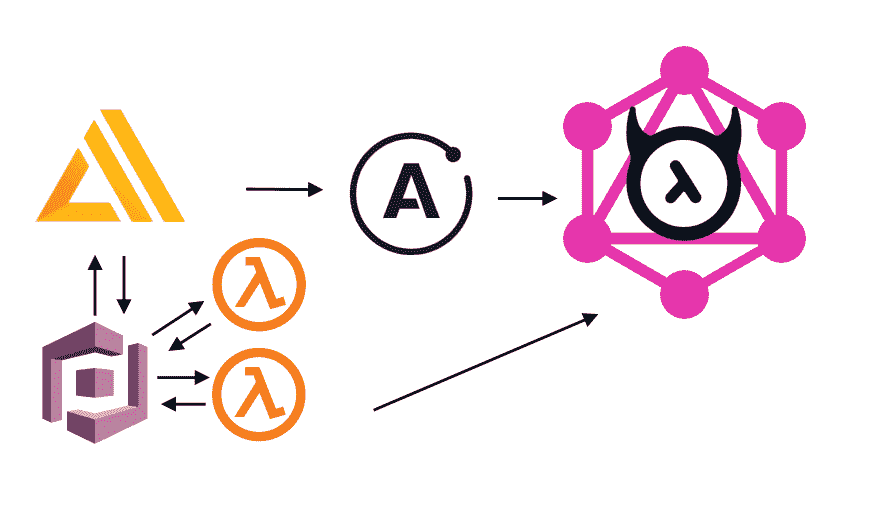](https://res.cloudinary.com/practicaldev/image/fetch/s--fBhvhj7U--/c_limit%2Cf_auto%2Cfl_progressive%2Cq_auto%2Cw_880/https://thepracticaldev.s3.amazonaws.com/i/u629ietrbn5h7bfbhuyd.png)

让我们假设您已经使用了 [Hasura](//hasura.io) 开源 GraphQL 引擎，并且您想知道如何使用 AWS Cognito 添加一个认证层。如果你不熟悉的话，说几句关于哈苏拉的话。Hasura 是一个免费的开源引擎，它可以在新的或**现有的** Postgres 数据库上自动生成 GraphQL API。如果这是你第一次听说它，我建议在这里查看我的介绍文章:

> 弗拉迪米尔·诺维克[@弗拉迪米尔诺维克](https://dev.to/vladimirnovick)我刚刚发布了毫不费力的实时 GraphQL API 与无服务器业务逻辑运行在任何云[link.medium.com/DET666lI3T](https://t.co/qr5UNZTGYJ)上午 11:47-05 2019 年 2 月[](https://twitter.com/intent/tweet?in_reply_to=1092751461824585728)[](https://twitter.com/intent/retweet?tweet_id=1092751461824585728)[](https://twitter.com/intent/like?tweet_id=1092751461824585728)

如果您想知道如何在 Hasura 中使用身份验证，您可以在这里阅读:

> 弗拉迪米尔·诺维克[@弗拉迪米尔诺维克](https://dev.to/vladimirnovick)刚刚发表博文解释了 [@HasuraHQ](https://twitter.com/HasuraHQ) 认证选项包括 [@awscloud](https://twitter.com/awscloud) Cognito、 [@auth0](https://twitter.com/auth0) 、 [@Firebase](https://twitter.com/Firebase) 、自定义认证服务器或自定义认证 webhooks。看看这个。
> 2019 年 04 月 08 日上午 06:38[](https://twitter.com/intent/tweet?in_reply_to=1115141766003470336)[](https://twitter.com/intent/retweet?tweet_id=1115141766003470336)[](https://twitter.com/intent/like?tweet_id=1115141766003470336)

在上一篇文章中，我展示了 AWS Cognito 作为解决方案之一，如何为您的应用程序创建身份验证，并将 Auth token 传递给 Hasura。在本文中，我想解释如何使用`aws-amplify` CLI 实现这一点，以及如何将您的用户连接到实际的 cognito 用户池用户。

简而言之，我们将涵盖

1.  如何部署 Hasura
2.  如何使用 aws cognito 设置 aws 放大器
3.  如何在 cognito 中创建用户后设置 AWS lambda 来更新我们的数据库
4.  自定义 cognito JWT 创建以启用 hasura 权限规则

### 目录

*   [创建和部署我们的引擎](#deploy)
*   [设置 Hasura CLI](#cli)
*   [设置我们的数据库结构](#db)
*   [使用 Amplify CLI 设置我们的授权](#amplify)
*   [创建您的前端](#frontend)
*   [在 Hasura 中添加一个新的用户池用户](#aws-hasura)
    *   [预注册λ](#signup)
    *   [预令牌生成λ](#token)
    *   [在 Hasura 权限系统中创建角色](#roles)

# 创建和部署我们的引擎

让我们从常规的[部署到 Heroku](https://heroku.com/deploy?template=https://github.com/hasura/graphql-engine-heroku) 开始

[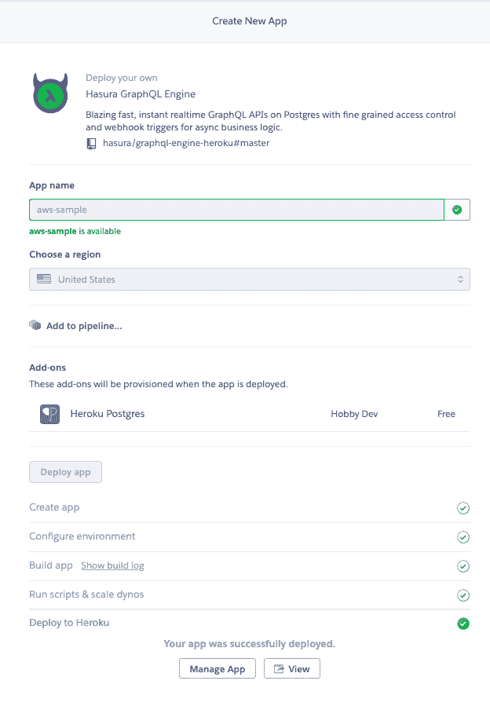](https://res.cloudinary.com/practicaldev/image/fetch/s--JF8MGbBv--/c_limit%2Cf_auto%2Cfl_progressive%2Cq_auto%2Cw_880/https://thepracticaldev.s3.amazonaws.com/i/y0pjwywxbfkmxyk670s4.png)

> 我们还可以使用 AWS RDS 来部署我们的引擎，这将在[这里](https://dev.to/lineup-ninja/deploying-hasura-on-aws-with-fargate-rds-and-terraform-4gk7)详细描述

现在，在我们设置任何 auth 或 continue 之前，我们将通过设置`HASURA_GRAPHQL_ADMIN_SECRET`来保护我们的端点

[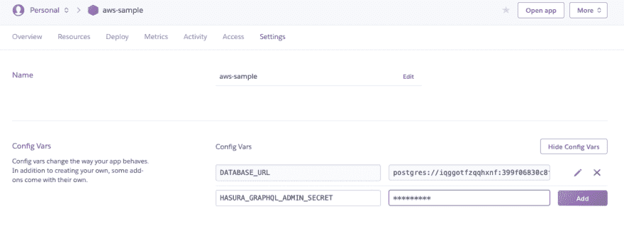](https://res.cloudinary.com/practicaldev/image/fetch/s--bCsP_3SZ--/c_limit%2Cf_auto%2Cfl_progressive%2Cq_auto%2Cw_880/https://thepracticaldev.s3.amazonaws.com/i/iktqe8d1ti4zqewg3wew.png)

# 设置 Hasura CLI

我们希望在我们的控制台中所做的更改反映为迁移文件，并存储在源代码控制中，详细解释如下[此处](https://www.youtube.com/watch?v=fRHZQAEd-Q0)

我们要做的是在 heroku 配置变量中将`HASURA_GRAPHQL_ENABLE_CONSOLE`设置为`false`

[](https://res.cloudinary.com/practicaldev/image/fetch/s--x_crSXdt--/c_limit%2Cf_auto%2Cfl_progressive%2Cq_auto%2Cw_880/https://thepracticaldev.s3.amazonaws.com/i/2c9gzimsvtklpe5rv3hz.png)

现在是时候通过 [hasura CLI](https://docs.hasura.io/1.0/graphql/manual/hasura-cli/install-hasura-cli.html#install-hasura-cli) 初始化我们的 Hasura 项目了

`hasura init --endpoint https://aws-sample.herokuapp.com`

然后

```
cd hasura
hasura console --admin-secret=<your admin secret> 
```

Enter fullscreen mode Exit fullscreen mode

控制台将在 localhost 上打开，您在控制台中所做的一切都将保存在本地迁移文件中，您可以将这些文件存储在源代码控制中。

# 设置我们的数据库结构

现在，当我们设置好引擎后，我们需要创建数据库结构。我们将创建简单的博客 cms，所以我们将只有`posts`和`users`表。重要的是`users`表`id`必须是文本格式，这样我们就可以正确地将它与 AWS 用户池连接起来。

帖子表会是这样的:
[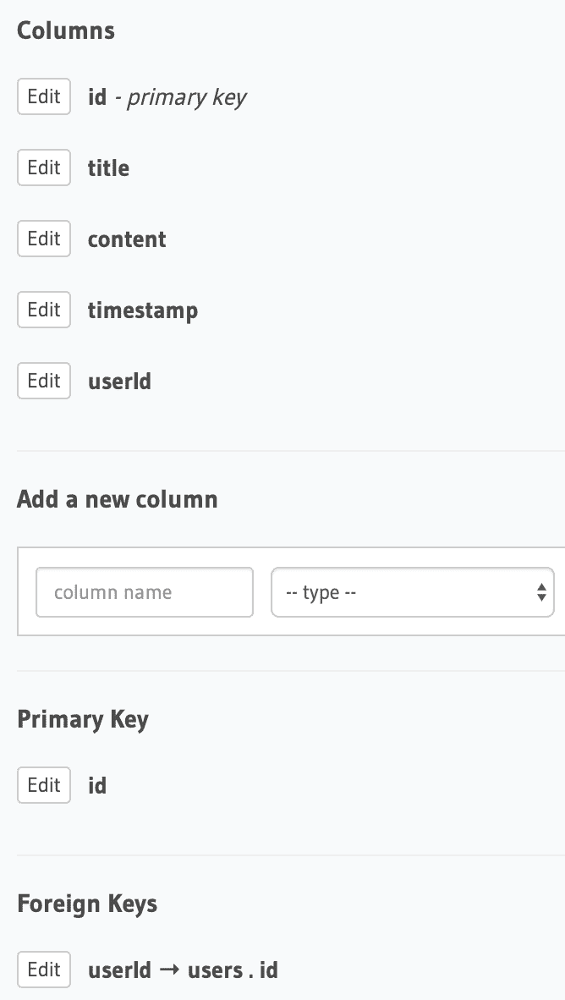](https://res.cloudinary.com/practicaldev/image/fetch/s--sSfEdSOU--/c_limit%2Cf_auto%2Cfl_progressive%2Cq_auto%2Cw_880/https://thepracticaldev.s3.amazonaws.com/i/f4jp8k1b70dwhrnwebfb.png)

用户表会是这样的:
[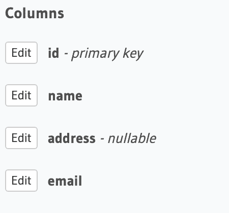](https://res.cloudinary.com/practicaldev/image/fetch/s--abgjq-76--/c_limit%2Cf_auto%2Cfl_progressive%2Cq_auto%2Cw_880/https://thepracticaldev.s3.amazonaws.com/i/gvwwap9xwx1cquibsq91.png)

我还添加了从 posts userId 到用户对象的对象关系

[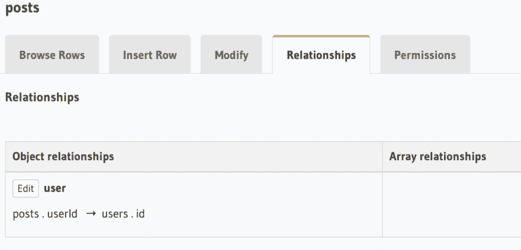](https://res.cloudinary.com/practicaldev/image/fetch/s--7PMBBoKV--/c_limit%2Cf_auto%2Cfl_progressive%2Cq_auto%2Cw_880/https://thepracticaldev.s3.amazonaws.com/i/car8i8gc0se9n94e9bs0.png)

所以我们可以从帖子查询中查询我们的用户，就像这样

```
query  {  posts  {  title  content  user  {  name  }  }  } 
```

Enter fullscreen mode Exit fullscreen mode

现在，当我们的后端准备好了，是时候设置我们的前端和认证。
现在不知道你用的是什么前端框架，这个例子我就用 React 吧，不过在 Vue 和 Angular 上过程差不多。我在这里几乎不会碰到前端。我的主要目标是让你理解流程。

# 用 Amplify CLI 设置我们的授权

```
npm install -g @aws-amplify/cli
amplify configure 
```

Enter fullscreen mode Exit fullscreen mode

这将打开 AWS 控制台。登录到控制台后，您可以跳回命令行。然后我们需要指定 AWS 区域。

在下一步中，我们需要指定将要创建的新 AWS IAM 用户。
它将打开 IAM 控制面板，显示我们已经通过 CLI 指定的用户。

[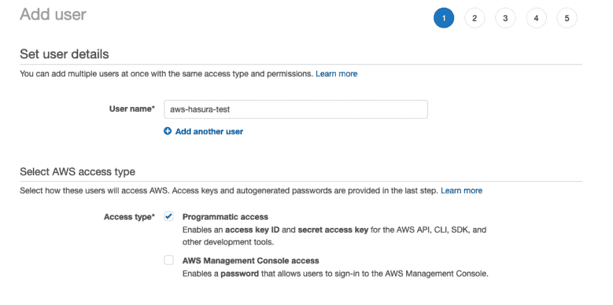](https://res.cloudinary.com/practicaldev/image/fetch/s--Bc5TNy5Q--/c_limit%2Cf_auto%2Cfl_progressive%2Cq_auto%2Cw_880/https://thepracticaldev.s3.amazonaws.com/i/espqxi0ua5uyx72b0b6o.png)
[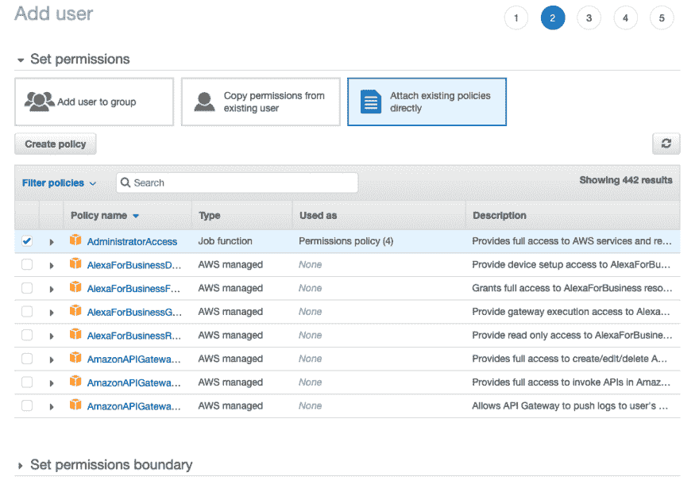T6】](https://res.cloudinary.com/practicaldev/image/fetch/s--62pBwEKZ--/c_limit%2Cf_auto%2Cfl_progressive%2Cq_auto%2Cw_880/https://thepracticaldev.s3.amazonaws.com/i/nenub6vtojh9bgy6ywjq.png)

接下来，我们需要设置 AWS 权限。我只需单击“下一步”,查看并创建一个用户。您将看到一个屏幕，上面有您应该在 amplify cli 中键入的访问密钥和密码

[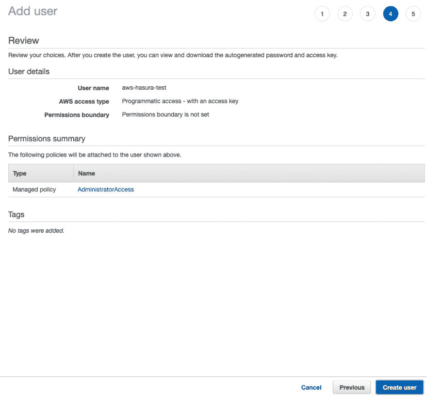](https://res.cloudinary.com/practicaldev/image/fetch/s--Qz9BoKnC--/c_limit%2Cf_auto%2Cfl_progressive%2Cq_auto%2Cw_880/https://thepracticaldev.s3.amazonaws.com/i/9iul2x2ed9gx4bg4cy8k.png)

[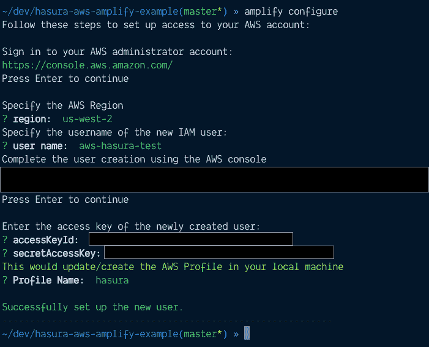](https://res.cloudinary.com/practicaldev/image/fetch/s--KFzaraQo--/c_limit%2Cf_auto%2Cfl_progressive%2Cq_auto%2Cw_880/https://thepracticaldev.s3.amazonaws.com/i/q9hyp95zc3lf1loc50vc.png)

# 创建你的前端

我们将使用带有 React 的 Amplify auth 模块，但您可以选择自己喜欢的框架。查看放大 [Vue 文档](https://aws-amplify.github.io/docs/js/vue)和[角度文档](https://aws-amplify.github.io/docs/js/angular)了解更多详情。

我们将从用
创建我们的前端开始

```
npx create-react-app react-frontend 
```

Enter fullscreen mode Exit fullscreen mode

然后运行

```
amplify init 
```

Enter fullscreen mode Exit fullscreen mode

[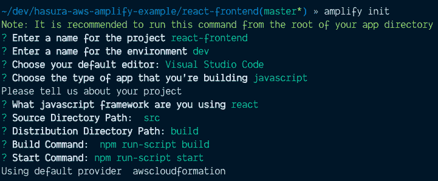](https://res.cloudinary.com/practicaldev/image/fetch/s--HDydWuw5--/c_limit%2Cf_auto%2Cfl_progressive%2Cq_auto%2Cw_880/https://thepracticaldev.s3.amazonaws.com/i/0332ylnvy4gyf8n8baez.png)

要使用用户池添加基本身份验证，请使用默认配置运行`amplify add auth`。添加 auth 后，我们需要将其部署到 AWS。这可以通过运行`amplify push`来完成，它将更新我们在云中的资源，并将 can 加入用户池

是时候给我们的 React 应用添加 auth 了:

```
yarn add aws-amplify aws-amplify-react 
```

Enter fullscreen mode Exit fullscreen mode

在我们的`App.js`文件中，让我们用 Amplify withAuthenticator HOC
包装我们的应用程序

```
import Amplify, { Auth } from 'aws-amplify';
import awsmobile from './aws-exports';
import { withAuthenticator } from 'aws-amplify-react'; // or 'aws-amplify-react-native';

Amplify.configure(awsmobile);

export default withAuthenticator(App, true); 
```

Enter fullscreen mode Exit fullscreen mode

我们将提出的是 AWS 认证屏幕，我们将注册，登录等。我们不会讨论如何为你的应用程序定制所有的东西，所以让我们只使用默认的

[](https://res.cloudinary.com/practicaldev/image/fetch/s--zgqtSv-Y--/c_limit%2Cf_auto%2Cfl_progressive%2Cq_auto%2Cw_880/https://thepracticaldev.s3.amazonaws.com/i/nxfdjba4xnmrgay6wedz.png)

现在让我们添加一些注册/登录行为。每当我们的应用程序被认证时，基本上我们的应用程序组件都会被渲染。
所以如果我将这段代码添加到我们的 App.js:

```
import { Auth } from 'aws-amplify'

//....rest of code

componentDidMount(){
    Auth.currentAuthenticatedUser().then(user => {
      console.log(user)
    })
}

//rest of code 
```

Enter fullscreen mode Exit fullscreen mode

你将能够获得用户数据。

到目前为止，我们有认证，但有一个问题。我们需要将这个认证数据添加到我们的 Hasura 中。

# 向 Hasura 添加新的用户池用户

如果我们在“用户池”选项卡上打开我们的 AWS 控制台，我们将能够看到我们可以为身份认证过程的不同阶段创建自定义触发器。我们需要创建至少两个触发器。预注册和预令牌生成。

[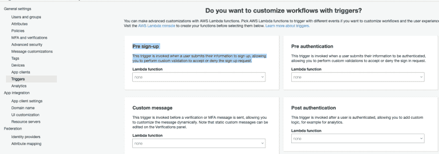](https://res.cloudinary.com/practicaldev/image/fetch/s--MadnwX2p--/c_limit%2Cf_auto%2Cfl_progressive%2Cq_auto%2Cw_880/https://thepracticaldev.s3.amazonaws.com/i/pnq4quf6k5jbwr0hpcbq.png)

让我们从注册触发器开始

## 预报名λ

让我们转到 AWS Lambda 控制台，创建一个新的 Lambda。您必须首先在本地创建它，因为我们将有`node-fetch`依赖，所以我们需要上传一个 zip 到 AWS 控制台。我们的 lambda `index.js`文件将看起来像这样:

```
const fetch = require('node-fetch');

const adminSecret = process.env.ADMIN_SECRET;
const hgeEndpoint = process.env.HGE_ENDPOINT;

const query = `
mutation addUser($id: String!, $phone:String!, $email: String!){
  insert_users(objects:[{
    email: $email
    id: $id
    phone: $phone
  }]) {
    returning {
      email
    }
  }
}
`

exports.handler = (event, context, callback) => {

try {
  const qv = {
    email: event.request.userAttributes.email, 
    phone: event.request.userAttributes.phone_number,
    id: event.userName
  };

  fetch(hgeEndpoint + '/v1alpha1/graphql', {
      method: 'POST',
      body: JSON.stringify({query: query, variables: qv}),
      headers: {'Content-Type': 'application/json', 'x-hasura-admin-secret': adminSecret},
  })
  .then(res => res.json())
  .then(json => {
      callback(null, event);
  });

} catch (e) {
  callback(null, false)
}

}; 
```

Enter fullscreen mode Exit fullscreen mode

我们在这里尝试做的是通过执行突变向数据库中插入一个新用户。您可以注意到，我们在头部传递我们的 Admin Secret，但是这对于服务器到服务器的通信是很好的。这里发生的是我们的`id`将会被认知到`username`

我们现在试着报名吧。

[](https://res.cloudinary.com/practicaldev/image/fetch/s--zgqtSv-Y--/c_limit%2Cf_auto%2Cfl_progressive%2Cq_auto%2Cw_880/https://thepracticaldev.s3.amazonaws.com/i/nxfdjba4xnmrgay6wedz.png)

我们将收到带有验证码的通知邮件

[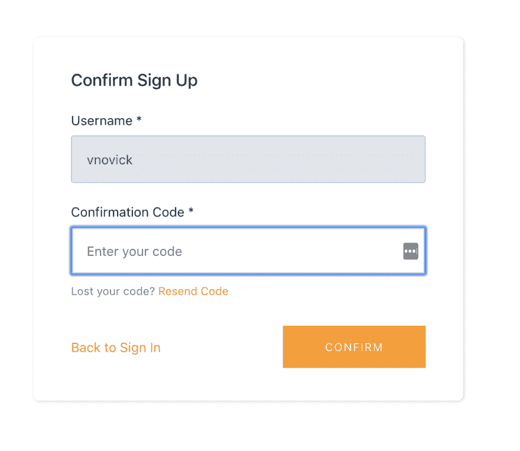](https://res.cloudinary.com/practicaldev/image/fetch/s--CF8xM6SR--/c_limit%2Cf_auto%2Cfl_progressive%2Cq_auto%2Cw_880/https://thepracticaldev.s3.amazonaws.com/i/wx0e4vf08qbweric6kud.png)

现在，我们可以登录并在控制台中查看我们的身份验证令牌。

酷的部分也是我们将有我们的用户在 Postgres 中创建。让我们检查一下我们的控制台:

[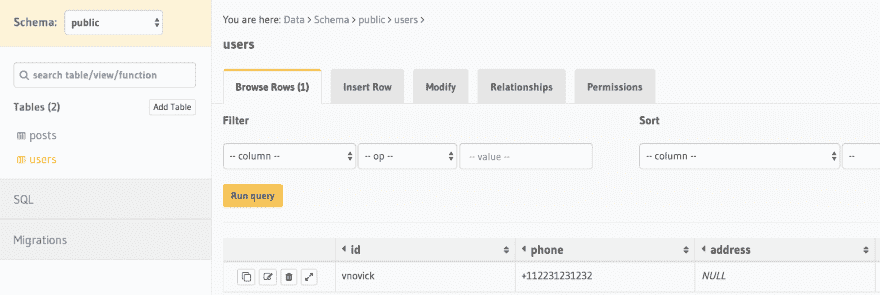](https://res.cloudinary.com/practicaldev/image/fetch/s--p_x0XH1w--/c_limit%2Cf_auto%2Cfl_progressive%2Cq_auto%2Cw_880/https://thepracticaldev.s3.amazonaws.com/i/1xcpe7thr04wmyep7dr5.png)

## 预令牌生成λ

我们得到了我们的令牌，但这还不够。如果我们想在 Hasura 中使用`JWT_TOKEN`,我们需要做几件事。(我在这里详细解释了 JWT auth[):](https://dev.to/hasurahq/hasura-authentication-explained-2c95)

### 设定`HASURA_GRAPHQL_JWT_SECRET`

在我们的 Heroku 中将`HASURA_GRAPHQL_JWT_SECRET`设置为 env 变量。我们的配置将是:

```
{  "type":"RS256",  "jwk_url":  "https://cognito-idp.{region}.amazonaws.com/{userPoolId}/.well-    known/jwks.json",  "claims_format":  "stringified_json"  } 
```

Enter fullscreen mode Exit fullscreen mode

> 请注意，应将{用户池 Id}替换为从 AWS 控制台获取的用户池 Id，并将{区域}替换为您正在使用的正确区域

### 创建我们的预令牌生成λ。

对于我们的预令牌生成 lambda，我们需要添加自定义声明。我们将用户名作为用户 id 传递，这样我们就可以在 Hasura 权限系统中引用它

```
exports.handler = (event, context, callback) => {
    event.response = {
        "claimsOverrideDetails": {
            "claimsToAddOrOverride": {
                "event": JSON.stringify(event.userName),
                "https://hasura.io/jwt/claims": JSON.stringify({
                    "x-hasura-allowed-roles": ["anonymous","user", "admin"],
                    "x-hasura-default-role": event.userName === "vnovick" ? "admin": "user",
                    "x-hasura-user-id": event.userName
                })
            }
        }
    }
    callback(null, event)
} 
```

Enter fullscreen mode Exit fullscreen mode

让我们从`Auth.currentAuthenticatedUser()`响应中复制`signInUserSession.idToken.jwtToken`并粘贴到 Hasura 控制台中作为`Authorization`T3 令牌

现在，所有自定义声明都将被传递到 Hasura 权限系统，我们将能够在那里引用它们。

## 在 Hasura 权限系统中创建角色

让我们看看它是怎么做的。我们将创建两个没有任何权限的额外角色- `anonymous`和一个`user`角色。

我希望用户能够只查询自己的用户数据，以及只看到他们的职位。我们可以在控制台中相应地设置权限:

[](https://res.cloudinary.com/practicaldev/image/fetch/s--Jy5Gg8UT--/c_limit%2Cf_auto%2Cfl_progressive%2Cq_auto%2Cw_880/https://thepracticaldev.s3.amazonaws.com/i/chrhls55ko0vk2luzh8a.png)

`user`角色将只能看到自己的数据。

让我们通过查询所有用户来仔细检查一下:

[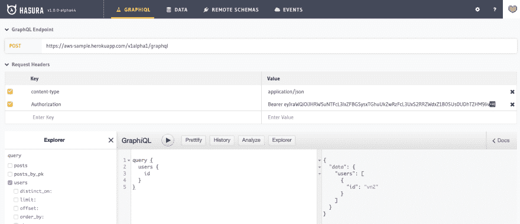](https://res.cloudinary.com/practicaldev/image/fetch/s--GwP916lM--/c_limit%2Cf_auto%2Cfl_progressive%2Cq_auto%2Cw_880/https://thepracticaldev.s3.amazonaws.com/i/xony4qi9e89psbjwqq4d.png)

# 总结

这篇博客文章只是对你可以用 Hasura 和 AWS Cognito 做什么的一个简要概述，但是我希望你得到你应该坚持的主要 auth 工作流的想法。如您所见，因为我们使用 Lambda 触发器并将它们插入到 Cognito auth 流程中，所以我们可以处理任何级别的复杂性。我们可以验证我们的用户是否存在，向 hasura 自定义声明添加自定义变量等等。

读完这篇博文后，如果您能给我反馈，告诉我您希望我更深入地讲述哪些部分，我将不胜感激，这样我就可以写另一篇更高级的博文，或者引导您找到解释这些部分的资源。