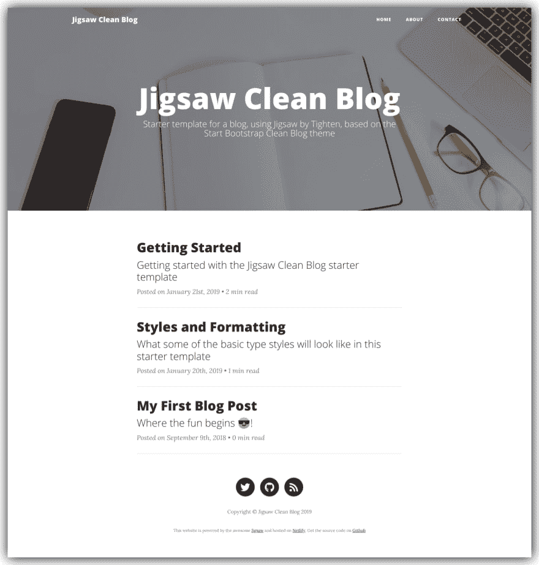

# 拼图清洁博客📚

> 原文：<https://dev.to/rickwest/jigsaw-clean-blog-1pco>

好吧，这实际上并不像听起来那么令人兴奋。我基本上只是用 strings Jigsaw static site generator 重建了我的博客，然后把它打包到一个初学者模板中，让它在 [Packagist](https://packagist.org/packages/rickwest/jigsaw-clean-blog) 上可供他人使用！

* * *

我决定将我的博客从 Wordpress 转移到一个更轻量级、面向开发者的静态站点生成器，Jigsaw 是一个显而易见的选择，原因有很多，我之前在这里讨论过。

使用 Jigsaw 的唯一缺点是博客本身的最初“开发”。我说不好，但是作为一个热情的开发者，我真的很享受这个过程。然而，我可以看到最初的障碍和时间承诺可能会阻止一些人进行转换。找到时间写一篇博客文章已经够难了，更不用说把博客搬到一个新的平台上，让它看起来更漂亮了。毕竟我们都过着忙碌的生活！

不仅如此，可以肯定地说，我们并不都有设计眼光，我当然没有！然而，我最近偶然发现了努诺·马杜罗的博客，并且非常喜欢它简洁的外观，所以我决定将 T2 的 Startbootstrap Clean 博客移植到 Jigsaw，并在这个网站上使用它😊。

## 包

当 Tighten 发布了一个关于 [Jigsaw starter 模板](https://tighten.co/blog/jigsaw-starter-templates)的帖子时，这启发了我将我的 Jigsaw 实现打包成 Clean Blog 主题，并提供给其他人。于是，[拼图清理博客](https://github.com/rickwest/jigsaw-clean-blog)启动器诞生了！这是我的第一个“包”，我真的很喜欢把它放在一起的过程。如果它可以帮助一个人避免重新发明轮子，或者降低一个人想要尝试令人敬畏的拼图游戏的门槛，那么它就是一项出色的工作👌。

去拿开胃菜！——[https://github.com/rickwest/jigsaw-clean-blog](https://github.com/rickwest/jigsaw-clean-blog)

[](https://res.cloudinary.com/practicaldev/image/fetch/s--BuaGXpWV--/c_limit%2Cf_auto%2Cfl_progressive%2Cq_auto%2Cw_880/https://raw.githubusercontent.com/rickwest/jigsaw-clean-blog/master/screenshot.png)

* * *

### 包含哪些内容

这个完全响应的(基于 [Bootstrap 4](https://getbootstrap.com/) )入门模板包括一些示例页面，并预先配置了:

*   用 [highlight.js](https://highlightjs.org/) 进行语法高亮显示
*   自动生成`sitemap.xml`的脚本
*   自动生成 RSS 提要的脚本
*   自定义 404 页面
*   一个与[表单礼包](https://formspree.io/)集成的联系表单

### 入门

您可以通过 3 个简单快捷的步骤开始使用此入门产品:

1.  创建项目目录

```
mkdir my-clean-blog 
```

1.  通过编辑器安装 Jigsaw

```
cd my-clean-blog
composer require tightenco/jigsaw 
```

1.  初始化您的项目

```
./vendor/bin/jigsaw init rickwest/jigsaw-clean-blog 
```

一旦你安装好了所有的东西，你就可以使用 PHP `./vendor/bin/jigsaw serve`或者使用 Browsersync `yarn run watch`来服务这个站点

## 交给你了

虽然只是一个非常简单的项目，但仅仅是把一些东西放在那里对我来说已经是一件非常大的事情了，而且是一个我全心全意享受的过程。

也就是说，我很想得到你对这个拼图游戏的反馈，尤其是如果你已经决定试一试的话。

我对我的新的 Jigsaw powered 博客的结果非常满意，所以能看到你一直在做的事情会很棒。也许你已经建立了自己的拼图启动器？我很想听听！

去拿开胃菜！——[https://github.com/rickwest/jigsaw-clean-blog](https://github.com/rickwest/jigsaw-clean-blog)