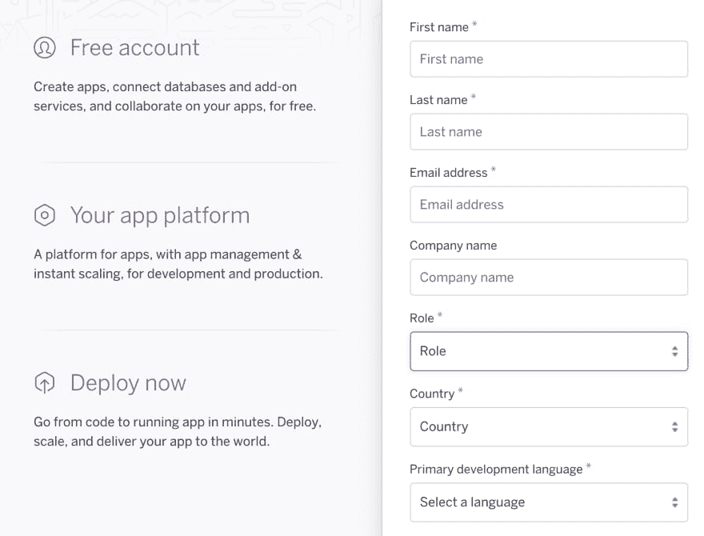
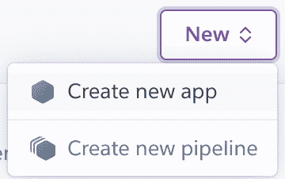
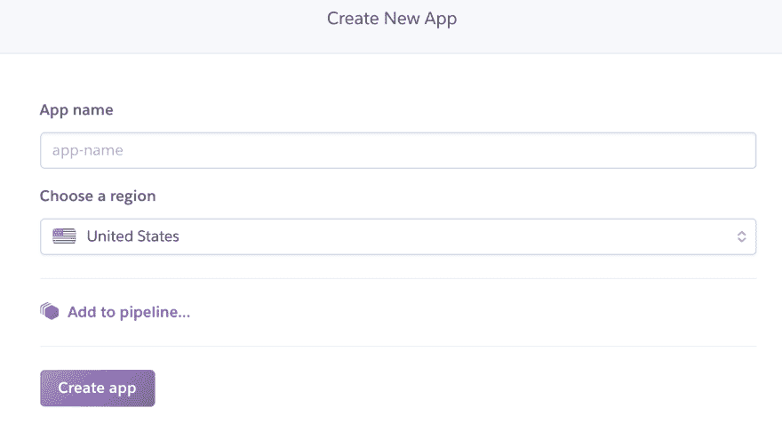

# 在 Heroku 上部署的简单分步指南

> 原文：<https://dev.to/lucysuddenly/easy-step-by-step-guide-to-deploying-on-heroku-3m9p>

[](https://res.cloudinary.com/practicaldev/image/fetch/s--K2q0A5SX--/c_limit%2Cf_auto%2Cfl_progressive%2Cq_auto%2Cw_880/https://thepracticaldev.s3.amazonaws.com/i/2elgd5zp07wkeilkna63.png)

在 Heroku 上部署可能很棘手——作为一个新用户，很难确切地知道应该采取什么步骤，并且有许多陷阱。下面是通过 Heroku CLI 部署现有项目的分步指南。

## 报名

首先，访问 Heroku.com 并注册一个新账户(或者点击[此链接](https://signup.heroku.com/))。这很简单，以下是您需要填写的字段:

[](https://res.cloudinary.com/practicaldev/image/fetch/s--hEgnFvyj--/c_limit%2Cf_auto%2Cfl_progressive%2Cq_auto%2Cw_880/https://thepracticaldev.s3.amazonaws.com/i/i9h66n37820m60c7ndvp.png)

## 创建您的应用

拥有帐户后，点击右上角的“新建”菜单，选择“创建新应用”

[](https://res.cloudinary.com/practicaldev/image/fetch/s---CyG0EV8--/c_limit%2Cf_auto%2Cfl_progressive%2Cq_auto%2Cw_880/https://thepracticaldev.s3.amazonaws.com/i/1hyhh7v3r831td34952i.png)

现在，简单地命名您的新应用程序！不要担心添加管道，这是一种与我们正在使用的 CLI 不同的部署方法。

[](https://res.cloudinary.com/practicaldev/image/fetch/s--NijPq7Lq--/c_limit%2Cf_auto%2Cfl_progressive%2Cq_auto%2Cw_880/https://thepracticaldev.s3.amazonaws.com/i/2il0s258ry5cb090y1w7.png)

## 部署您的应用

注意，下一步需要[自制](http://osxdaily.com/2018/03/07/how-install-homebrew-mac-os/)。接下来，您将前往终端，并导航到您现有的应用程序文件夹(启动 git 的根文件夹)。现在，复制并粘贴这个:

```
 brew install heroku && heroku login 
```

一个窗口将会弹出——因为你已经登录到 Heroku，你应该能够简单地通过点击“登录”在这个屏幕中移动。那很容易！现在 Heroku 安装好了，你们都登录了。

下一步是将 Heroku remote 添加到您的 git 中:在命令行中输入以下内容:

```
heroku git:remote -a your app name you selected at creation 
```

其中，您在创建时选择的应用程序名称是您选择的不带空格的全小写名称。

现在，您将把现有代码推送到 Heroku 遥控器:

```
git push heroku master 
```

现在你可以高枕无忧地在 Heroku 上看它编译了！完成后，您应该可以通过访问. herokuapp.com 来访问您托管的项目

## 常见陷阱

### 不支持 Ruby 版本

这是一个相对简单的解决方法——转到终端并键入

```
rvm install 2.4.5 && rvm use 2.4.5 
```

然后转到 Ruby 版本文件，将其更新到 2.4.5。您还需要打开您的 gemfile，将那里的 Ruby 版本更新到 2.4.5，删除您的 gemfile.lock，然后运行

```
bundle install 
```

那你可以再推一次 heroku 大师试试！

### 未指定节点和/或 NPM 版本

删除 package-lock.json 并编辑 package.json 文件，以包含:

```
"engines": {
"node": "<your node version>",
"npm": "<your npm version>"
  }, 
```

您可以通过键入以下命令找到您的节点和 npm 版本

```
npm list 
```

和

```
node -v 
```

## 
  
成功了！

应该可以了！如果您正在部署并遇到任何其他陷阱，请在评论中告诉我，我将更新指南并进行修复！