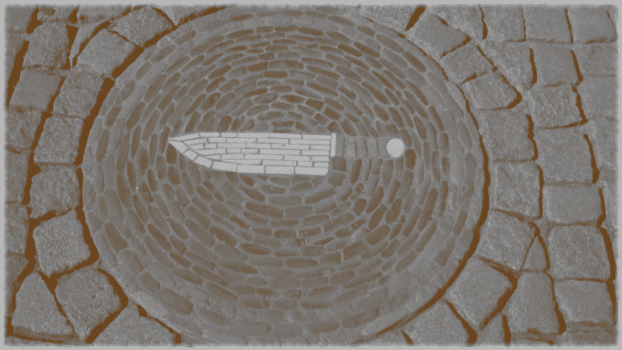

# 樱庭落的循环以及何时使用它们

> 原文：<https://dev.to/jj/loops-and-when-to-use-them-1p86>

[](https://res.cloudinary.com/practicaldev/image/fetch/s--JPZCNrkR--/c_limit%2Cf_auto%2Cfl_progressive%2Cq_auto%2Cw_880/https://thepracticaldev.s3.amazonaws.com/i/fvap69yd0whi8yu4hjug.png)

迟早你需要在一个元素和下一个元素之间保持某种状态，产生某种副作用，使用几种数据结构，或者，总的来说，以一种不能用 grep 过滤、映射或简化的方式工作；或者简单地说，您需要在数据结构的处理过程中执行一些输出，这是在上一节看到的函数中无法完成的。你需要的是一个 for 循环。但是让我们先来谈谈在什么地方和什么时候你可以使用它们。

迭代器是一个角色，一般来说，它并不打算被程序员直接使用，而是作为一些非常有用的类的基础。迭代器的基本思想是它们是只能被遍历一次的列表；它们将被顺序访问，从第一个元素开始，到最后一个元素，标记为`IterationEnd`。它们唯一最重要的功能是拉一，从它们身上提取一种元素。一般来说，您将能够迭代被恰当地称为`Iterable`的结构。Iterable 是一个有几个方法的角色，其中最重要的是 iterator，它在迭代器中转换任何数据结构。当使用 for 循环时，所有这些都是在幕后发生的。

让我们来看一个简单的 for 循环:

```
 .say for ^3 # 0␤1␤2␤ 
```

Enter fullscreen mode Exit fullscreen mode

␤是一个马车返回；也就是说，它们将出现在单独的行中。`^3`是一个范围。Ranges 实现迭代器角色，所以 for 实际上是在调用`^3.iterator`，它返回一个迭代器。每次迭代，for 调用在迭代器上拉一，直到到达`IterationEnd`。

当然，即使这是在幕后发生的，你也可以认为 for 所做的是将它所应用的数据结构的每个元素主题化。您也可以在前面使用 for，但在这种情况下，语法要求使用块作为循环体。

```
 for ^3 { .say } # 0␤1␤2␤ 
```

Enter fullscreen mode Exit fullscreen mode

如图所示，这与之前的结果完全相同。我们可以将这个“做”循环与一个“产生”语句结合起来；当您需要动态创建一个数据结构时，gather/take 语句可以做到这一点。Gather 将被用作循环的开始，并将在其中有一个块，每个 take 将在列表中产生一个新元素。

```
say gather { take "this"; take "that" }  (this that) 
```

Enter fullscreen mode Exit fullscreen mode

这将产生一个包含两个元素的列表，每个元素对应一个“take”。显然，这不是一个循环，尽管它的用例与其他语言中的循环相同。但是，您可以在循环中使用它

```
say gather { take "Number-$_" for 1..3 } # (Number-1 Number-2 Number-3) 
```

Enter fullscreen mode Exit fullscreen mode

在本例中，我们使用循环创建的主题变量$_，来生成一个包含三个字符串的列表；每次使用 take 时，都会生成一个新的字符串，它们都通过 gather 重新组合到一个结构中。

**注意**:我最初是为《Perl 6 快速参考》这本书写的这个迷你教程，这本书~~我正在为~~ [写，最终由出版社](https://www.apress.com/gp/book/9781484249550)出版。然而，它不适合这本书的其余部分。反正可能有用，所以在这里。