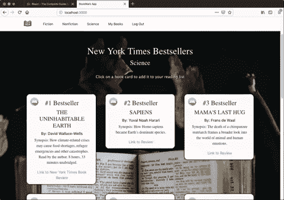
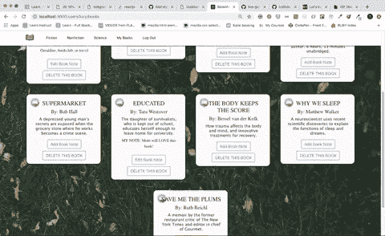

# React/Redux:添加搜索功能

> 原文：<https://dev.to/emiko/how-to-create-a-search-bar-for-your-react-redux-app-1jmk>

## App

从我记事起，我就一直喜欢阅读。小时候，我喜欢去图书馆和书店，看无尽的书架。我可以选择阅读的所有这些选项都令人兴奋和扩展。快进到我作为一个成年人走进图书馆或书店，看到同样无尽的书架上的书；现在图书馆和书店是我的[布尔木达三角](https://en.wikipedia.org/wiki/Bermuda_Triangle)。我一进图书馆或书店，我就记不起任何我想看的书，也记不起任何朋友给我的书单。我的脑子坏掉了。

[](https://i.giphy.com/media/mPytjcsG3XS4o/giphy.gif)

研究表明，拥有太多的选择实际上阻碍了我们做出明智的决定(你可以通过听[这里](https://www.wnycstudios.org/story/91640-choice)了解更多)。

这个难题促使我创建了我的应用书签(React/Redux，Rails 后端，并使用 NYT API)，用户可以按流派细读《纽约时报》畅销书排行榜，获得每本书的一些信息，阅读书评，为一本书做笔记，并点击图书卡将一本书保存到他们的“阅读列表”中。

[](https://i.giphy.com/media/d7ndZcNhmGd0VaDdT9/giphy-downsized-large.gif)

## 搜索功能

在我创建了我的应用程序的基础之后，我想创建一个搜索功能，以便用户可以通过输入搜索词来搜索他们保存的书籍。

React 的结构使这一点变得无缝，因为 [React](https://reactjs.org/) 是基于组件的，这意味着您可以创建一个搜索组件，并将该组件插入您希望搜索框出现的位置。

我首先做了一个彻底的互联网搜索，了解其他人是如何在他们的 React 应用上完成搜索的。在看了很多例子和代码之后，我决定采用对我的应用程序最有意义的最佳方法。

然后，我开始列出实现这一功能需要做的事情。

1.  使用`<form>`和`<input>`创建一个简单的搜索框。
2.  将 Search 组件放入 UserBooks 组件中(在这里可以看到用户的图书列表)。
3.  将来自搜索组件的搜索输入(搜索词)绑定到 UserBooks 组件。
4.  创建逻辑:如何根据搜索词过滤用户图书列表并编写函数。
5.  测试以确保功能正常。

第一步。我创建了一个简单的表示搜索组件，接受用户输入。我知道每次用户在框中输入内容时，我都想触发我的搜索功能。为此，我知道我必须创建一个 onChange 事件处理程序，这样当时机成熟时，我就可以将输入发送到我尚未编写的搜索函数中。

第二步。然后，我决定将该组件放在我的 UserBooks 组件的顶部，以便搜索框出现在该组件的顶部。

第三步。因为我的搜索组件是 UserBooks 组件的子组件，所以我必须想办法将搜索词传递回 UserBooks 组件。为此，我在 UserBooks 组件中创建了一个 callback()函数，并通过 props 将其传递给 Search 组件，然后将我得到的内容设置回我的 UserBooks 本地状态。

在我的搜索组件中，我使用了一个`onChange`事件处理程序，并在 onChange 中使用了我的回调函数，如下所示:

```
const Search = (props) => {
   return (
     <>
     <form>
       <input
         placeholder="Search for..."
         onChange={(event)=>props.callback(event.target.value)}
       />
     </form>
     </>
   )} 
```

在我的用户手册组件中:

```
 callback = (term ) => {
    this.setState({
           term: term 
        })
  } 
```

现在，我的搜索词连接到了我的 UserBooks 组件。

第四步。我知道在我的 UserBooks 组件中，我已经显示了用户的所有书籍，所以我需要找出一种方法来过滤掉与用户的搜索词不匹配的书籍，以便只显示匹配的书籍。我还需要弄清楚我希望搜索词搜索的内容(作者姓名、标题、图书描述、用户对图书的注释)。

我决定让搜索对这本书的所有属性都起作用。我开始画出我想要发生的事情。

显示用户的图书(带有搜索框)= >输入搜索项= >某种过滤功能= >匹配搜索项的用户图书保持显示。

在我的 UserBooks 组件中，我已经遍历了用户的图书列表，并将每本书传递给了 UserBookCard 组件，所以我知道这是放置搜索过滤器逻辑的地方。我首先编写了一个过滤函数，它将书和搜索词作为参数。

```
filterIt = (book, searchTerm) => {
return book.title.includes(searchTerm) || book.author.includes(searchTerm) || book.description.includes(searchTerm)
} 
```

上面的代码获取了一本书，并检查这本书是否包含您的搜索词的字符。includes()方法根据字符串是否包含输入的字符返回一个布尔值。如果字符串包含输入的字符，则该方法返回 true。在我的 filterIt()函数中，我说，如果任何图书属性包含搜索词，则返回图书。*需要注意的是。includes()区分大小写，所以您必须。toLowerCase()您的输入和图书属性。

现在，我有了一个 filterIt()函数，它返回包含搜索词的书籍。现在怎么办？

有了我已经拥有的图书列表和 filterIt()函数返回的图书，我可以使用。filter()方法，["创建一个数组，其中填充了通过测试的所有数组元素(作为函数"](https://www.w3schools.com/jsref/jsref_filter.asp))，以获取包含搜索词的用户书籍，然后遍历过滤后的列表，并将书籍传递给我的 UserBookCard 组件，如下所示:

```
 const booksList = books.filter(this.filterIt(this.state.term)).map(book => {return (<UserBookCard
          key={book.id}
          book={book}
          deleteUserBook={this.props.deleteUserBook}
          userId={this.props.user}
          addBookNote={this.props.addBookNote} />)
        }
    ) 
```

第五步。测试。调试。测试。调试。测试。

## 结果

这是它实际运行的样子！

[](https://i.giphy.com/media/NsBjrSdM1OexBac4la/giphy.gif)

感谢阅读和快乐编码！