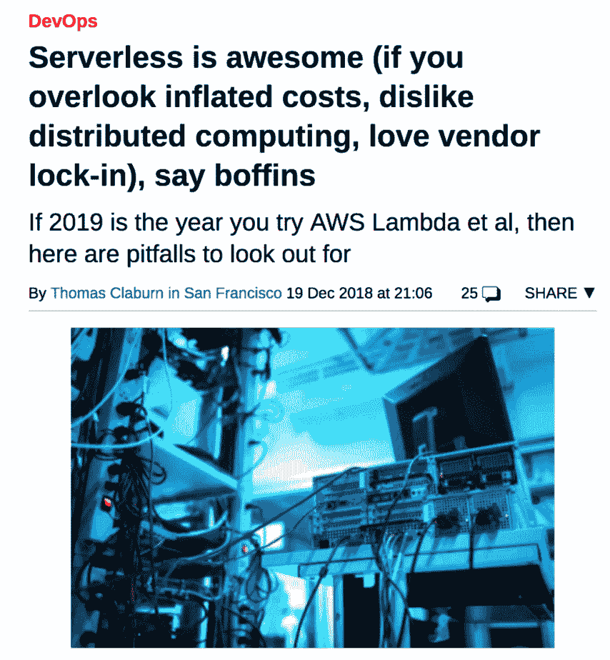
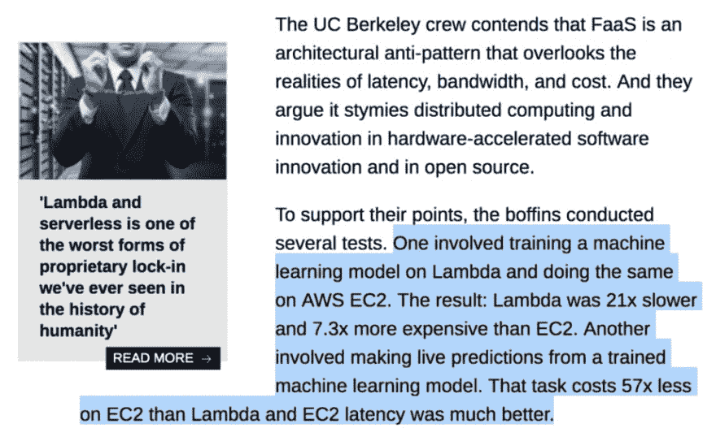
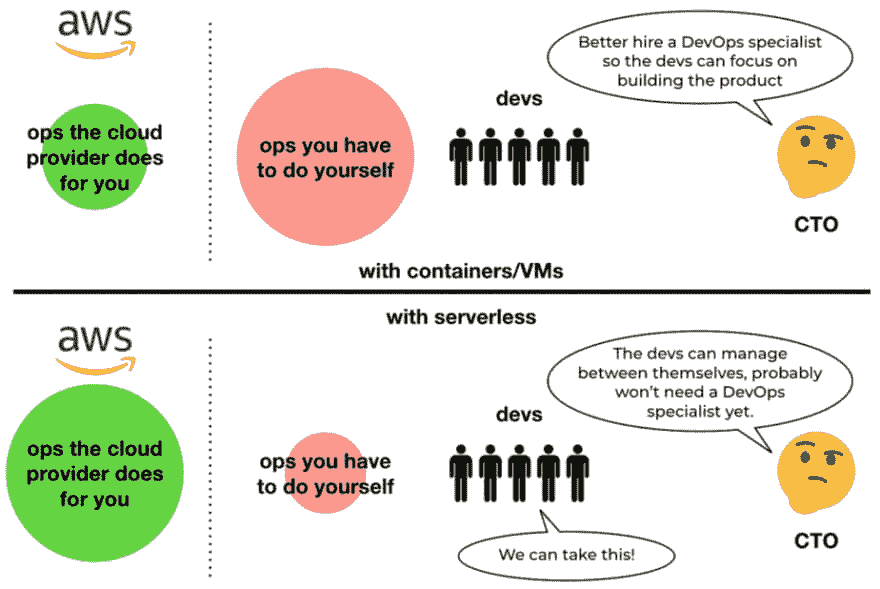

# 你对无服务器成本的想法完全错误

> 原文：<https://dev.to/theburningmonk/you-are-thinking-about-serverless-costs-all-wrong-570b>

就在 2018 年圣诞节前，注册处发表了一篇文章。它有一个有点挑衅性的标题，不知何故，它从几个不同的来源出现在我的收件箱里。

我觉得文章提到的白皮书提供了一些有趣的分析。但是它用来证明其观点的案例研究并不能代表大多数开发者的所作所为。*模型训练*和*通过批处理的低延迟预测服务*可能是学术研究人员所做工作的代表。但它们在整个行业中并不典型。当您只查看突出其弱点的工作负载时，很容易夸大局限性。

我自己也写了很多关于 AWS Lambda 局限性的文章。我也分享了我的许多变通方法和技巧。事实上，许多在生产中使用过无服务器的开发人员会告诉你它有很多限制。现在有些工作负载不太适合使用无服务器。但是话说回来，有很多工作负载都非常适合使用无服务器。如果使用得当，无服务器将会给开发者带来很大的权力。

## 考虑 TCO，而不仅仅是 Lambda 成本

我想重点谈谈这篇文章和白皮书提到的一点——**成本**。

同样，该论文研究了不符合按调用付费模型的工作负载的 AWS Lambda 服务成本。他们得出这样的结论并不奇怪。

但是当 AWS Lambda 被用来解决正确的问题时，其他人发现[成本节省高达 90%](https://aws.amazon.com/solutions/case-studies/financial-engines/) **在现实世界中**！

如果我把鞋子穿在手上，我真的应该惊讶我的脚是冷的吗？

此外，对于本文中讨论的工作负载，还有其他更紧迫的成本需要考虑。大多数公司在看到膨胀的 Lambda 成本之前很久就会碰到这些问题。雇佣有 ML 经验的人的成本[已经疯了](https://www.nytimes.com/2018/04/19/technology/artificial-intelligence-salaries-openai.html)。大的科技公司都在给机器学习博士毕业生发工资(！)一年几十万的工资和股票。

大多数公司不会有担心使用 AWS Lambda 训练其 ML 模型的成本的奢侈。他们甚至不能指望从一开始就能竞争到设计这些工作负载所需的工程人才。这让我想到了无服务器带来的最大成本节约，这一点几乎没有人谈过。**人员成本**的节省。

让我们花点时间考虑一下我们的总拥有成本(TCO)。

这些费用会计入你每月的 AWS 账单。服务成本、数据传输等。这种成本很容易衡量，而且往往是我们衡量成本的唯一标准。

然而，与工程师的薪水相比，它往往相形见绌。在伦敦，一名软件工程师平均年薪在 8 万英镑左右，约合 10 万美元。对于 AWS 和 DevOps 等抢手的技能，你甚至可能不得不进入承包商市场。一个有 AWS 和 DevOps 经验的承包商每天可以花费你 550 到 800 英镑！

借助无服务器，您可以将更多运营职责委托给云提供商。修补操作系统、供应和扩展服务器、设置负载平衡器等。这将您的开发人员从许多无差别的繁重工作中解放出来。这让他们能够更好地专注于打造对客户至关重要的产品。

一般来说，你不需要那么多专门的工具。部署和 CI/CD 变得更加简单，并且您可以获得开箱即用的基本监控和日志记录支持。当你不再需要 CloudWatch 日志等原生工具时，很容易[与外部解决方案](https://theburningmonk.com/2018/07/centralised-logging-for-aws-lambda-revised-2018/)集成。虽然还有一个学习曲线，但这比其他选择要浅得多。掌握 Docker、Kubernetes、Istio/Linkerd 以及相关的 DevOps 工具绝非易事。许多创业公司从第一天起就没有 DevOps 专业知识。让云提供商负责大部分管道工程意味着他们可以推迟雇佣 DevOps 专家。如前所述，这是一笔巨大的成本节约，每位工程师每年节省 100，000 多美元！

在 Yubl，当我们[将大部分服务迁移到无服务器](https://theburningmonk.com/2016/12/yubls-road-to-serverless-architecture-part-1/)时，我们能够解散 DevOps 团队。开发人员完全有能力承担剩余的运营责任。

正如本文所讨论的，按调用付费模型不适合某些工作负载。在这些情况下，你最终会为 Lambda 支付比容器或虚拟机更多的费用。但是，当您计算解决方案的真实成本时，您需要考虑支持解决方案所需的工程师成本。冒着一概而论的风险，我敢打赌，对于 90%的公司来说，天平严重倾向于工程师的成本。

然后就是**机会成本**的问题。

虽然先发优势不是市场成功的保证，但比竞争对手迭代更快的能力无疑是一种商业优势。将您的开发人员从管理底层计算基础架构的无差别繁重工作中解放出来，可以让他们更快地行动。这反过来意味着，作为一家企业，你可以更快地针对市场测试你的想法，并更快地迭代。

这也意味着您可以用更少的开发人员完成更多的工作。这意味着更少的组织通信开销。这意味着花在招聘上的时间和金钱更少，花在产品上的时间更多。

在创业公司，或许在生活中，时间是最稀缺的资源。
*——Yevgeniy brik man，Gruntwork*
[联合创始人来源](https://blog.gruntwork.io/how-we-got-to-1-million-in-annual-recurring-revenue-with-0-in-fundraising-340ed2b4e158)

## 结论

每次调用付费模型对许多人来说是新的，我们谈论它的潜力是正确的。但我不禁觉得，我们只是在有限地思考这个问题——当我们的代码不运行时，它能为我们节省多少钱。

理解我们决策的真实成本是复杂的。通过这篇帖子/咆哮，我想让您思考一下对我们的总拥有成本有影响的不太明显的因素。这些因素通常比我们每个月在 AWS 账单上看到的标题数字重要得多。我们作为开发人员不习惯考虑的元素。

我们甚至还没有提到 FinDev 这个概念，它是由西蒙·沃德利提出的。按调用付费模型允许在每个用户事务上分配成本。它让您真正了解不同功能的投资回报(ROI ),并允许企业在此基础上做出明智的决策。但那是另一个时间的另一篇文章。