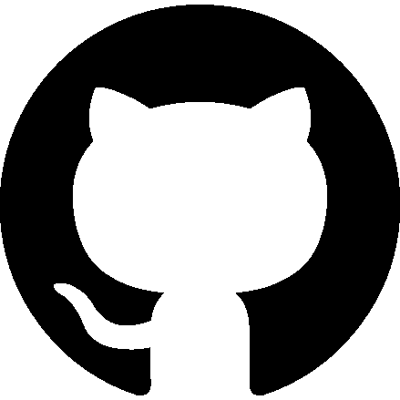
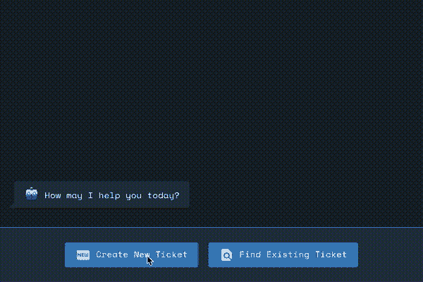
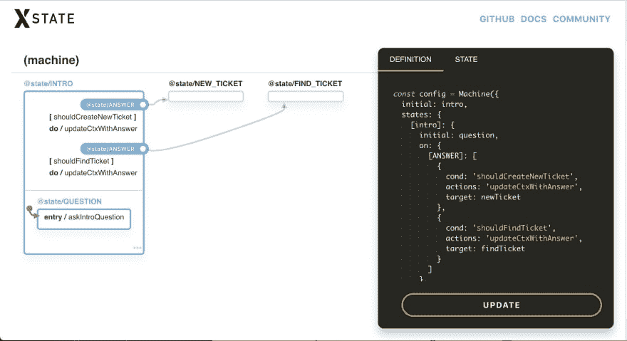

# 使用 Xstate 和 ReactJS 的纯 UI

> 原文：<https://dev.to/cris_o/pure-ui-using-xstate-and-reactjs-5em7>

我们将讨论什么是状态机，以及类似“状态机 2.0”的状态图如何帮助您构建更强大的应用程序。

我们将使用`xstate`，它是一个`statechart`库和 reactJS。但是你可以用任何其他框架代替`reactJS`。

总的目标是通过让你的 UI 成为状态的函数来减少开发 UI 时的认知负荷。

| 初速电流状态 | 用户界面 |
| --- | --- |
| 目录 | 显示列表 |
| 列表.加载 | 显示特定列表加载图像 |
| 无结果 | 不显示结果消息 |

> 这篇文章的代码可以在以下网址找到:

##  [ criso ](https://github.com/criso) / [售票机器人](https://github.com/criso/ticket-bot)

### 用 Xstate 和 ReactJs 构建的聊天机器人示例

<article class="markdown-body entry-content container-lg" itemprop="text">

[](https://github.com/criso/ticket-bot/blob/master/blog/assets/flow.gif?raw=true)

### 这个回购包含这篇[博客文章](https://dev.to/cris_o/pure-ui-using-xstate-and-reactjs-5em7)的代码

我们将介绍什么是状态机，以及类似“状态机 2.0”的状态图如何帮助您构建更健壮的应用程序。

它使用 Xstate(statecharts)和 reactJS 来构建聊天机器人流程<g-emoji class="g-emoji" alias="fire" fallback-src="https://github.githubassets.cimg/icons/emoji/unicode/1f525.png">🔥</g-emoji>

这个项目是用 [Create React App](https://github.com/facebook/create-react-app) 引导的。

## 可用脚本

在项目目录中，您可以运行:

### `npm start`

在开发模式下运行应用程序。
打开 [http://localhost:3000](http://localhost:3000) 在浏览器中查看。

如果您进行编辑，页面将重新加载。您还会在控制台中看到任何 lint 错误。

</article>

[View on GitHub](https://github.com/criso/ticket-bot)

### 一个状态机？

我一直觉得状态机这个术语有点奇怪。
最初可能更容易理解为:

> 一个函数，在给定的输入下，只做与应用程序的当前状态相关的事情。

```
const currentState = "isLoading";
function machine(input) {
  if (currentState === "isLoading") {
    // *only* do things related to `isLoading` state with `input`
  }

  if (currentState === "isError") {
    // *only* do things related to `isError` state with `input`
  }
} 
```

这里有一个熟悉的状态机:

```
// currentState is `idle`

fetch() // currentState is `fetching`
.then(
  (successResults) => {
    //  currentState is 'success'
    // stateful data is 'successResults'
  }
  (errorMsg) => {
    // currentState is 'error'
    // stateful data is 'errorMsg'
  }
); 
```

既然，`currentState`一次只能是**一件事**，你就不要碰到这些检查:

```
 // NOPE, NOPE, NOPE
if (isLoading && !isError) // ...
if (!isLoading && isError) // ...
if (isLoading && isError) // ... 
```

> 一个有效的复杂系统总是被发现是从一个有效的简单系统进化而来的。约翰·高尔

### 两种状态

有两种状态:

1.  你的应用程序的当前状态。这些问题回答如下:

*   “正在加载吗？”
*   “有错误吗？”
*   “我们正在获取用户数据吗？”

这里的答案将决定使用哪个**组件**:

```
if (currentState === 'error') {
  return <Error />;
} 
```

1.  有状态数据。这在`xState`里叫做`context`。这些问题回答如下:

*   “错误信息是什么？”
*   " API 请求的结果是什么？"
*   "当前选择了哪个过滤器/选项？"

这里的答案将决定一个组件拥有哪些**道具**:

```
if (currentState === 'error') {
  return <Error msg={context.errorMsg}>
} 
```

### 告诉我我们在哪个状态，我会告诉你用户界面是什么样子的

UI 应该是状态的一个函数。这不同于让用户界面成为我们现有数据的函数。

👍状态功能:

```
if (currentState === list.noResults) {
  return "No Results found";
}

if (currentState === list.isError) {
  return "Oops!";
} 
```

#### vs

👎我们目前掌握的数据:

```
if (list.length === 0) {
  // the list is empty, so we probably don't have any results"
  return "No Results found";
}

if (list.errMsg) {
  // list.err is not empty, show an error message #yolo
  return "Oops";
} 
```

##### ☝️这是一个重要的区别。☝️

这里的对话从:

> “如果结果为零，我们该怎么办？”请记住:
> 由于一个错误，我们可能没有任何结果，我们还没有获取任何东西，或者我们真的没有任何结果。这些中的每一个都是一个**不同的**状态。

收件人:

> “当处于`error`、`initial`或`noResults`状态时，**的用户界面是什么样的？”**

您现在正在构建您的 UI 来考虑每个状态。

> 题目变了吗？图标会改变吗？
> 某样东西会变成残废吗？
> 应该有重试按钮吗？

### 状态图表配置

状态图是一个可以包含其他状态机的状态机...还有更多！

所有这些的基础是状态图的配置。

你声明:

*   可能存在的状态`loading, error, noResults, listing, details, etc..`
*   在每个状态的**中可能发生的`actions/events`:`action/TRY_AGAIN`只有在我们处于`listing.error`状态时才会发生**
*   在转移到另一个状态之前，需要通过`conditionals/guards`，例如:如果我们有一个成功的响应和`total === 0`，我们将只转移到`noResults`状态

配置一个可以理解绝大多数 UI 逻辑的状态机很酷。

在看到解释之前，试着理解下面的配置:

```
// guards.js - conditional functions used to determine what the next step in the flow is
const guards = {
  shouldCreateNewTicket: (ctx, { data }) => data.value === "new_ticket",
  shouldFindTicket: (ctx, { data }) => data.value === "find_ticket"
};

// actions.js - functions that perform an action like updating the stateful data in the app
const actions = {
  askIntroQuestion: ctx => {
    return {
      ...ctx,
      chat: ["How may I help you?"]
    };
  }
};

// constants/state.js constants to represent the current state of the app
const intro = "@state/INTRO";
const question = "@state/QUESTION";
const newTicket = "@state/NEW_TICKET";
const findTicket = "@state/FIND_TICKET";

// constants/actions.js: constants to represent actions to be taken
const ANSWER = "@state/ANSWER";

const config = Machine({
  initial: intro,
  states: {
    [intro]: {
      initial: question,
      on: {
        [ANSWER]: [
          {
            cond: "shouldCreateNewTicket",
            actions: "updateCtxWithAnswer",
            target: newTicket
          },
          {
            cond: "shouldFindTicket",
            actions: "updateCtxWithAnswer",
            target: findTicket
          }
        ]
      },
      states: {
        [question]: { onEntry: "askIntroQuestion" }
      }
    },
    [newTicket]: {},
    [findTicket]: {}
  }
}).withConfig({
  actions,
  guards
}); 
```

[](https://i.giphy.com/media/xUPGcJRMK0NxGNEkKY/giphy.gif)

#### 上面的片段如下:

*   初始状态是从*状态开始的`intro`*
    *   `intro`里面的初始状态是*问题*
    *   `intro.question`的`onEntry`我们将触发行动`askIntroQuestion`
    *   这里什么也没发生...用户界面处于空闲状态...现在我们等待
    *   在发生`ANSWER`事件时:
        *   如果`shouldCreateNewTicket`
        *   `updateCtxWithAnswer`
        *   进入`newTicket`状态
        *   如果`shouldFindTicket`
        *   `updateCtxWithAnswer`
        *   进入`findTicket`状态

#### ，在 https://statecharts.github.io/xstate-viz/[可以看到](https://statecharts.github.io/xstate-viz/)

[](https://res.cloudinary.com/practicaldev/image/fetch/s--ERBC-Z8t--/c_limit%2Cf_auto%2Cfl_progressive%2Cq_auto%2Cw_880/https://thepracticaldev.s3.amazonaws.com/i/3h1cvpqtpeztlukabuia.jpg)

哟！这种可视化是从实际代码中构建的！

我❤️这个！

这些不是代码注释，也不是共享硬盘上 8 个月没有更新的`spec-32.pdf`。

想象一下，这有助于推动关于产品流的对话，以及它如何围绕应用程序的每个状态与利益相关者保持一致。

很明显，是否有一个`error`状态、
T4，或者是否应该有一个`noResults`对一个`error`状态

## 好的...让我们构建一个聊天机器人流程

[](https://res.cloudinary.com/practicaldev/image/fetch/s--ZxXf-xH_--/c_limit%2Cf_auto%2Cfl_progressive%2Cq_66%2Cw_880/https://thepracticaldev.s3.amazonaws.com/i/miqglabh6eg9s8j4y5g2.gif)

这是规格和流程...无聊我知道...但是和我一起呆在这里。

### 规格:

作为用户，我希望能够:

1.  创建一张新的订单
2.  查找现有票证
3.  如果适用，应该有`loading`状态和`error`状态

`Create new ticket`

*   订购产品时:
    *   如果我们没有该项目的库存:
    *   显示警告消息
    *   显示商品选项，缺货商品显示为灰色
    *   用户应该能够再次从选项中选择
    *   如果我们有该商品的库存:
    *   显示成功消息
    *   如果有错误
    *   显示错误消息

`Find ticket`

*   如果找到:

    *   显示订购的内容
    *   询问用户是否愿意向该订单发送“ping”
*   如果找不到:

    *   显示警告消息
    *   询问用户是否要创建新票证

这里有一点机器配置:

```
const flowMachine = Machine({
  initial: intro,
  states: {
    [intro]: {
      initial: question,
      on: {
        [ANSWER]: [
          {
            target: newTicket,
            cond: "shouldCreateNewTicket",
            actions: "updateCtxWithAnswer"
          },
          {
            target: findTicket,
            cond: "shouldFindTicket",
            actions: "updateCtxWithAnswer"
          }
        ]
      },
      states: {
        [question]: { onEntry: "askIntroQuestion" }
      }
    },

    [findTicket]: {
      initial: question,
      on: {
        [ANSWER]: { target: `.${pending}`, actions: 'updateCtxWithAnswer' }
      },
      states: {
        [question]: { onEntry: 'askFindTicket' },
        [error]: {},
        [noResults]: {},
        [pending]: {
          invoke: {
            src: 'getTicket',
            onDone: [
              {
                target: done,
                actions: 'updateCtxWithResults',
                cond: 'foundTicket'
              },
              { target: noResults }
            ],
            onError: error
          }
        },
        [done]: { type: 'final' }
      },
      onDone: pingTicket
  }
}); 
```

*   在`findTicket`中:
*   一旦用户回答了问题，我们将进入`pending`状态，在这里我们将调用一个叫做`getTicket`的`promise`
*   如果有错误:
    *   我们进入`error`状态
*   其他
    *   如果`foundTicket`为真，我们转移到`done`状态
    *   如果`foundTicket`为假，我们转移到`noResults`状态

### 这里有一种按状态渲染组件的方法

基于当前状态呈现组件是很棒的。

这是你可以选择的渲染组件
或者根据应用程序的`currentState`传递不同道具的多种方式之一。
再次:
`currentState`这里指的是 app 状态“正在加载、出错等”
`currentState.context`是指当前有
的有状态数据

```
/**
 * Array of
 * [].<StateName, function>
 *
 * NOTE: specificity matters here so a more specific state
 * should be first in the list. e.g:
 * 'findTicket.noResults'
 * 'findTicket'
 *
 * On state 'findTicket.foo', 'findTicket' will be matched
 */
const stateRenderers = [
  [newTicket, ({ onSelect, currentState }) =>
    <Choices
      options={currentState.context.options}
      onSelect={onSelect} />
  ],

  [`${findTicket}.${noResults}`, () =>
    <Msg>Sorry, we can't find your ticket</Msg>],

  [`${findTicket}.${error}`, () => <Msg>Oops, we ran into an error!</Msg>],

  [findTicket, ({ onSelect }) => <FindTicketForm onSelect={onSelect} />]
];

// components/Choices.jsx
const Choices = ({ currentState, ...props}) => (
  // based on current state, get a function from `stateRenders`
  // and render it with the props we have
  const [stateName, renderState] =
      stateRenderers.find(([key]) => currentState.matches(key));

  return renderState(props);
) 
```

### 还有这里的...

[](https://i.giphy.com/media/5OWLUbuMq4YXEl2ECg/giphy.gif)

这里有一个基于当前
应用程序状态显示组件的不同设置。

这里需要注意的是。`currentState`一次只有一件事
，所以这里不做
`isLoading`对`error`
的布尔检查

```
<ChatBody data-testid="ChatBody">
  // display any chat info that exists in context
  {currentState.context.chat.map(({ question, answer }) => (
    <React.Fragment key={`${question}.${answer}`}>
      <ChatMsgQuestion>{question}</ChatMsgQuestion>
      {answer && <ChatMsgAnswer>{answer}</ChatMsgAnswer>}
    </React.Fragment>
  ))}

  // display message based on the current state that we're in
  // NOTE: only one of this is possible at a time
  {currentState.matches(pending) && <ChatMsgLoading />}
  {currentState.matches(error) && <ChatMsgError />}

  {currentState.matches(noResults) && (
    <ChatMsgWarning>{getNoResultsMsg(currentState)}</ChatMsgWarning>
  )}

  {currentState.matches(itemOrdered) && (
    <ChatMsgSuccess>{getSuccessMsg(currentState)}</ChatMsgSuccess>
  )}
</ChatBody> 
```

### 外卖

没问题的...希望你已经走了这么远。查看更多内容的代码。

我认为这很好地建立在已经成功的`redux`模式之上，比如消息传递、单向流动、数据管理与组件分离。

我发现使用这种模式来适应需求变化非常容易。

事情大概是这样的:

1.  规格变化
2.  首先调整状态机配置
3.  在 UI 中反映新状态

> “好吧，我们只需要到达这个新的状态。一旦我们处于这种状态，我们只需要让用户界面反映出这种特定状态应该是什么样的”

### 意见

1.  这个代替 redux 吗？没错。但是 redux 模式仍然适用。
    *   有一个地方，减少你的数据基于一个事件
    *   数据单向流动
    *   独立的 API
2.  道具钻探呢？
    *   我认为这个问题被夸大了。
    *   您可以更好地分解组件，或者使用 react.context

### 推荐阅读

[https://xstate.js.org](https://xstate.js.org)
T3】https://state charts . github . io