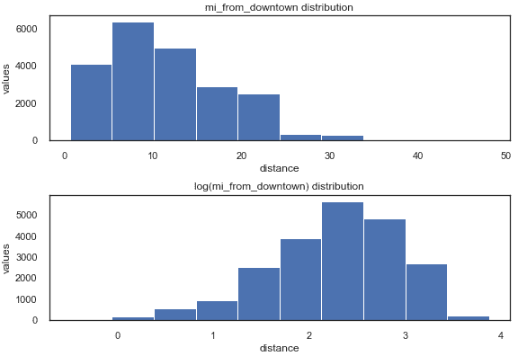
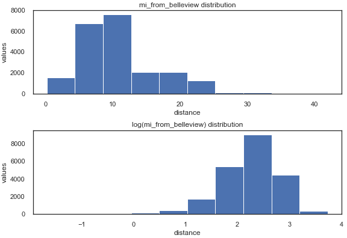
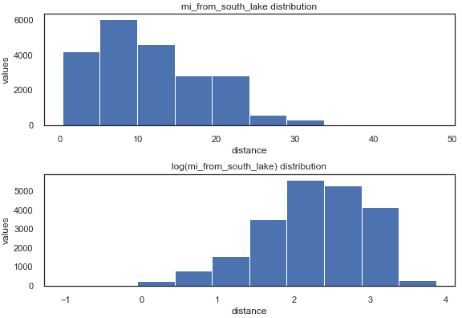
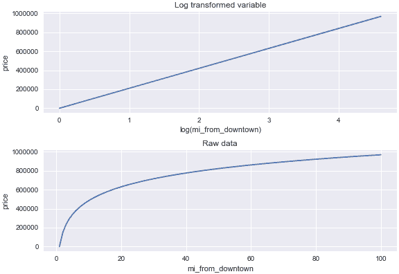
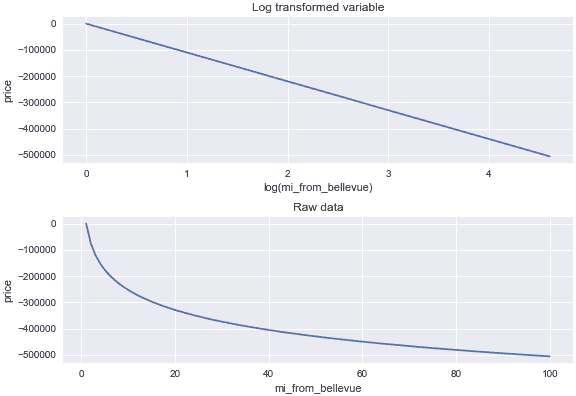
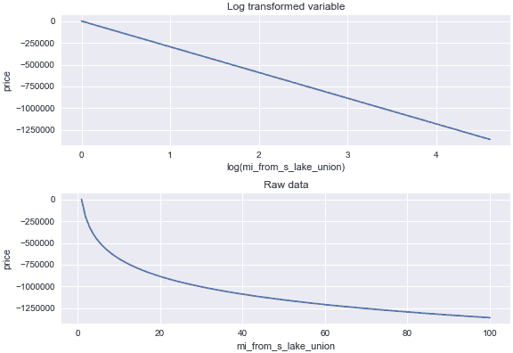

# 金县房屋销售数据集:对数转换和解释结果

> 原文：<https://dev.to/annazubova/king-county-house-sales-dataset-log-transformations-and-interpreting-results-19b2>

当使用线性回归模型时，对数转换变得非常有用。它们非常有助于纠正数据中的偏斜，并使分布更加正常。

Alexander Bailey 和我研究了 King County 的房价数据集，目的是开发一个线性回归模型来解释价格变化。

我们尝试对几个连续变量进行对数变换，但我们将对数变换应用于离主要中心位置的距离集取得了最佳结果:西雅图市中心、贝尔维尤市中心和南联合湖。到这些地点的距离用英里表示。

让我们来看一个变量:距离西雅图市区的英里数。这是对数转换前后的分布情况:

我们可以看到，对数转换纠正了偏态，使分布更加正常，这有利于线性回归模型的性能。通过采用参数值的自然对数，我们能够在一次模型拟合迭代中改进我们模型的指标:R 平方从 0.627 到 0.686，MAE 从 134016.02 到 131342.48。

在距离贝尔维尤市中心的情况下，通过取变量值的自然对数，分布也得到显著改善:

距离南湖联合参数对数变换后的分布变化:

### 线性回归模型中对数转换的距离参数

我们最终的房价模型着重于预测高达约 110 万美元的房价。距离西雅图市中心、贝尔维尤市中心和南湖联盟是价格的最强预测因素。

以下是我们模型中距离值的系数:

| 系数名称 | 价值 |
| --- | --- |
| ' mi_from_downtown_log ' | 210431.83668516215 |
| ' mi_from_bellevue_log ' | -109855.7636174455 |
| “南湖日志” | -294919.7693134867 |

对系数值的一般解释是，假设模型中的其他变量保持不变，增加一个单位的“mi_from_downtown_log”变量将导致房价平均增加 210，431.84 美元。然而，困难在于解释变量是对数转换的。

### 距离市区的距离参数

假设其他变量不变，让我们模拟一下距离西雅图市中心英里数的增加会如何影响房价。

首先，让我们生成一个从 1 到 100 的数字数组，表示距离西雅图市中心的距离增加。下一步是取这些数字的对数值，得到一个范围从 0 到 1.6 的数组。然后，我们使用线性回归模型中的系数 210，431.84 计算 log(x)的每个值的 y 值(即我们的预测价格)。

`miles_range = np.arange(1, 101)`
`miles_range_log = np.log(miles_range)`
T2】

这是表示 y 和 log(x)之间的关系与 y 和 x 之间的关系的比较图:

`fig, axs = plt.subplots(2, 1, constrained_layout=True)`

`axs[0].plot(miles_range_log, y)
axs[0].set_title('Log transformed variable')
axs[0].set_xlabel('log(mi_from_downtown)')
axs[0].set_ylabel('price')`

`axs[1].plot(miles_range, y)
axs[1].set_title('Raw data')
axs[1].set_xlabel('mi_from_downtown')
axs[1].set_ylabel('price');`

我们可以看到，对数转换这个变量将关系从指数转换为线性，这有助于改进线性回归的度量。

有趣的是，在距离西雅图市中心的距离的情况下，相关性是正的，这与我们的预期相反。然而，房价与距离贝尔维尤市中心和南湖联盟的距离呈负相关。原因可能是人们更喜欢远离西雅图市中心，而喜欢接近其他地方。

### 距离贝尔维尤市中心的距离参数

根据我们的模型，系数是-109855.76。

让我们构建一个 y 值数组:

`y_bellevue = -109855.76 * miles_range_log`

绘制测井曲线(x)和 x 对 y:

`fig, axs = plt.subplots(2, 1, constrained_layout=True)`

`axs[0].plot(miles_range_log, y_bellevue)
axs[0].set_title('Log transformed variable')
axs[0].set_xlabel('log(mi_from_bellevue)')
axs[0].set_ylabel('price')`

`axs[1].plot(miles_range, y_bellevue)
axs[1].set_title('Raw data')
axs[1].set_xlabel('mi_from_bellevue')
axs[1].set_ylabel('price');`

这里的关系更符合逻辑:房子离贝尔维尤越远，价格就越低。

### 距离南湖联盟参数

该参数的系数为-294919.77，是所有三个距离参数中最重要的。

计算具有 y 值的数组:

`y_s_lake_union = -294919.7693134867 * miles_range_log`

可视化的 x 和 log(x) vs y:

### 解读结果

当对数据集进行日志转换时，可能很难向非技术人员解释模型是如何工作的。下面是如何使用我们的模型示例来完成的。

让我们看看距离南湖联盟的距离，因为它是三个距离参数中最重要的变量。该值的系数为-294919.76，在非对数转换变量的情况下，这意味着距离南湖联盟 1 英里的距离增加将导致平均价格下降 294，919.76 美元。

然而，价格的值是对数变换的，所以我们不能使用这种增加 1 个单位的技术。在对数数据转换的情况下，我们可以谈论百分比变化。

为了找出目标价的涨幅，让我们来看看这个等式:

**价格(x 1 ) -价格(x0)= coef * log(x1)-coef * log(x0)= coef *(log(x1)-log(x0)= coef * log(x1/x0)**

因此，在我们的案例中，为了找出距离增加 10%会导致什么样的价格变化，我们必须计算如下:

`change_in_price = -294,919.76 * log(1.1)`

`change_in_price = -294,919.76 * 0.95`=-28108.85

根据上述计算，**距离南湖联盟的距离每增加约 530 英尺(10%英里)，价格将下降 28，108.85 美元**。

如果我们想知道距离增加 1 英里的影响，我们需要进行以下计算:

`change_in_price = -294,919.76 * log(2)` = -204422.8

顺便提一下，如果我们谈论的是 x 值的小百分比变化(高达 5%)，例如，x 增加 5%几乎相当于 log(x)增加 0.05。同样，x 增加 2%，几乎相当于 log(x)增加 0.02。