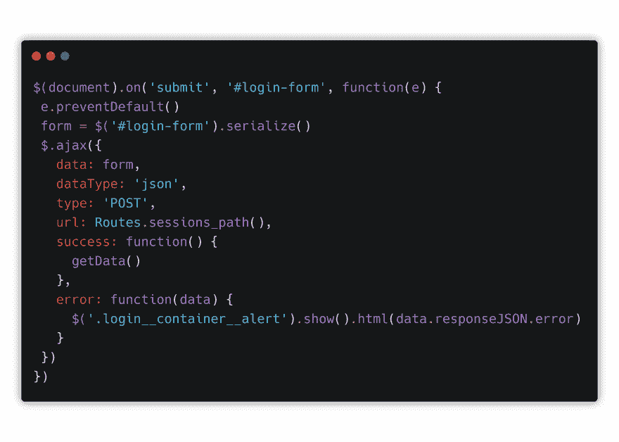
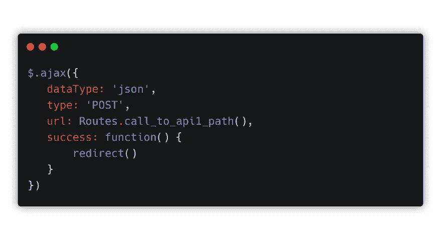
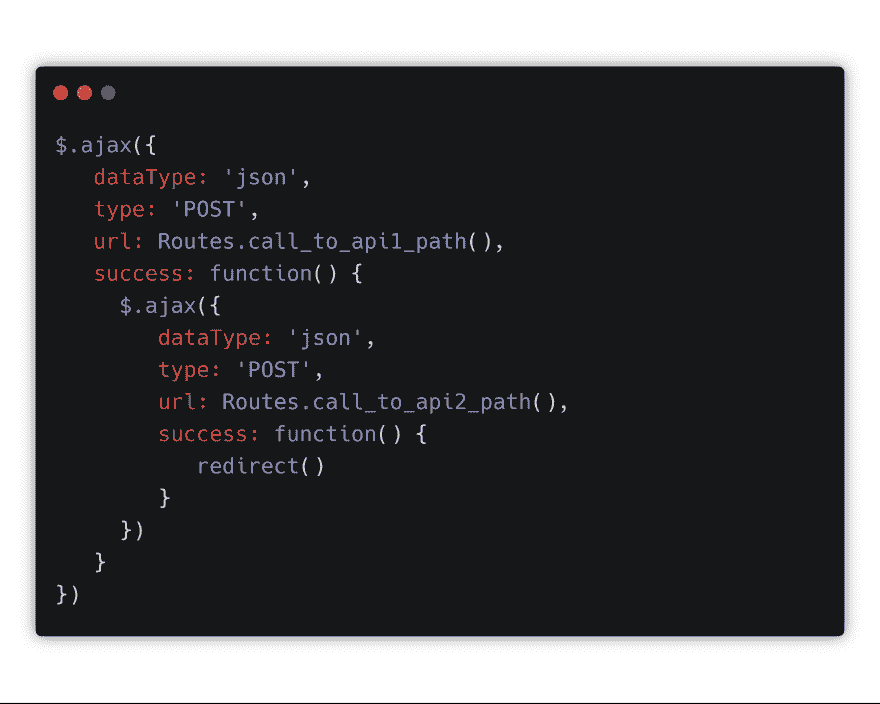
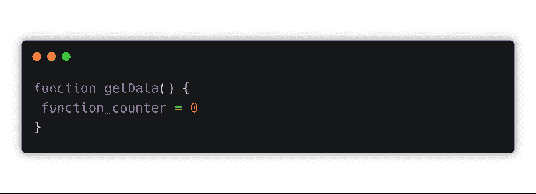
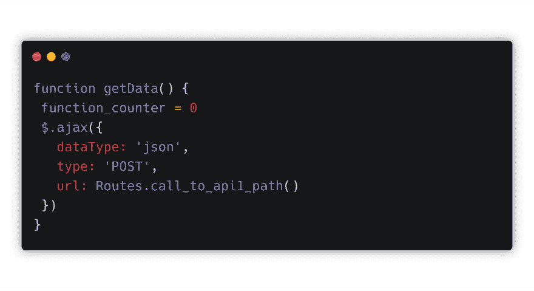
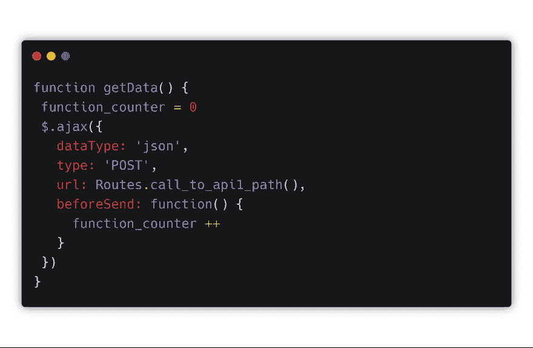
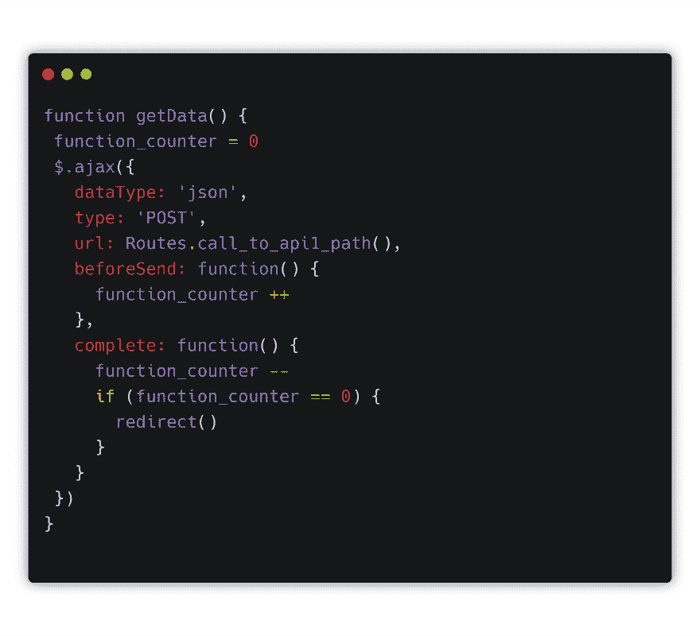
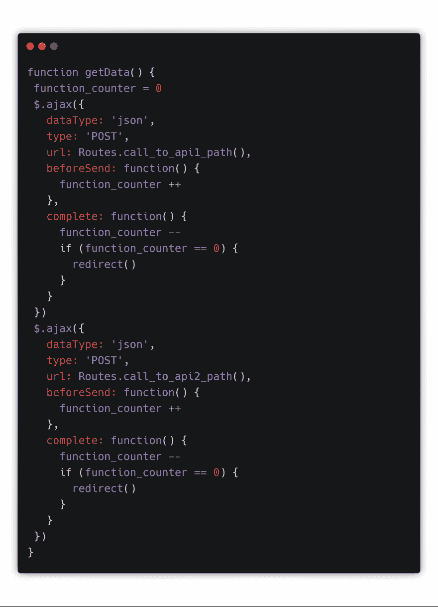
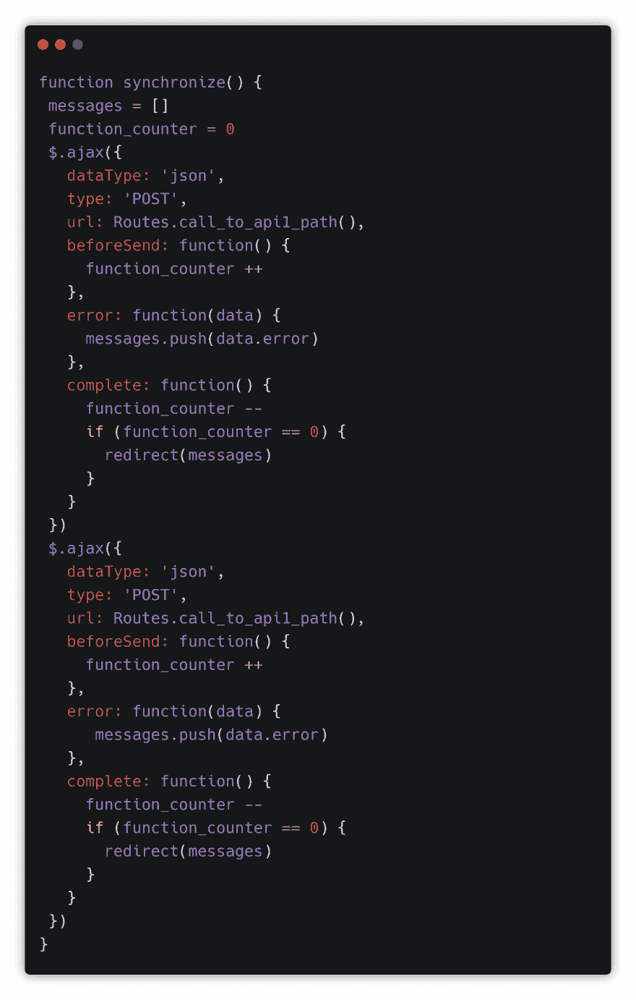

# 如何为并行请求使用 AJAX 事件

> 原文：<https://dev.to/2nit/how-to-use-ajax-events-for-parallel-requests-1g7h>

AJAX(异步 JavaScript 和 XML)在 2000 年代中期获得了极大的关注，它是一套技术，包括在浏览器和应用服务器之间发送异步(因此称为“A”)请求，使用 JavaScript(因此称为“J”)包含 XML 对象(因此称为“X”)，并允许动态内容更改，而无需重新加载整个页面。AJAX 的 API 对象的核心是一个强大的 XMLHttpRequest，它使我们能够从服务器检索数据(任何数据，显然不仅仅是 XML ),然后在客户端进行处理。在许多 JavaScript 抽象出现之后，其中最大的当然是 jQuery，AJAX 的使用变得越来越容易，这使得这项技术至今仍然适用。这就是为什么我们将结合 jQuery 事件来讨论 AJAX，或者更准确地说，如何使用“beforeSend”和“complete”事件来发出并行 AJAX 请求。

我们的应用程序严重依赖外部 API 调用，这些调用允许收集数据，然后将这些数据保存到数据库的 users 表中。这种同步发生在应用程序“运行时”的几个点上，其中一个发生在登录过程中。让我们研究一下简单的 AJAX 登录方法。

(一个小小的免责声明——在我们的代码中，我们使用“js-routes”gem，它允许我们在 js 文件中使用类似助手的路径)

这非常简单——我们阻止提交操作，序列化表单数据，然后将请求发送到控制器，控制器检查凭证等等，最终得到包含错误消息的 JSON，或者，如果成功，调用负责从外部 API 收集数据并重定向到主页的函数。这个函数将由两个 AJAX 调用组成，这两个调用命中负责 HTTP 调用各自 api 的控制器(让我们称它们为 api1 和 api2)。单个请求如下所示:

就其本身而言，就这么简单，但我们还有另一个控制器要点击。我们可以这样做:

这种解决方案的问题是，第二个函数必须等待前一个请求解决，AJAX 的异步性就丧失了。我们需要的是并行地发出这些请求，并在两个请求都解决后才进行重定向。这就是“beforeSend”和“complete”事件派上用场的地方。第一次发生在发送请求之前，第二次发生在请求完全解决之后，无论成功与否。在这种情况下，我们在技术上可以完全放弃“成功”事件，因为我们希望用户被重定向到主页，而不管我们的函数结果如何，因为我们不能因为外部 API 的停机时间而将他们锁定在页面之外。需要解决的一件事是我们决定何时重定向的方式，或者换句话说，是否所有的功能都被解决了。为此，我们将创建一个计数器标志，并在前面提到的“beforeSend”和“complete”事件中更新它。所以让我们开始构建 getData 函数。

显然，首先我们将计数器设置为 0，然后进行“第一次”(不完全是第一次，因为它们将并行进行)。

现在是我们的活动。我们想要做的是，当请求开始表明有一个正在进行的时候，递增 function_counter。

然后，当它完成时(同样，不管它是否成功)，我们递减计数器，检查是否所有的请求都被解析(function_counter 等于 0)，如果是这样，将用户重定向到主页。

瞧啊。现在让我们添加第二个请求。

我们可以通过将 URL 移动到数组中，然后遍历数组以消除重复来清除这种情况，但是我将把这留给您。但是，我们可以做的是添加`error`事件来收集潜在的错误。我们将从函数开头的空数组开始，然后在每个请求的“error”事件中向它推送错误消息。然后，您可以将这些消息传递给重定向函数，然后作为参数传递给我们的 path，这样您就可以在用户成功登录后使用它们来设置 flash 消息。我们的函数现在应该是这样的:

就这样，我们的两个请求被同时处理，充分发挥了 AJAX 的潜力。