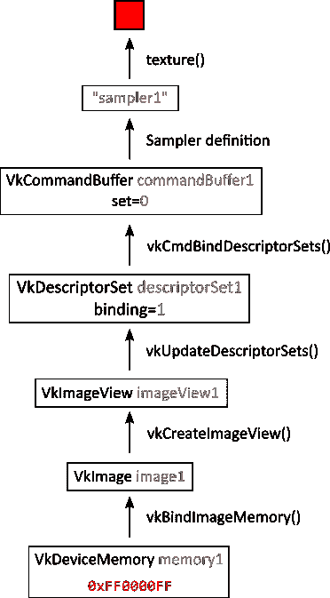

# Vulkan:访问数据的漫长道路

> 原文：<https://dev.to/reg__/vulkan-long-way-to-access-data-13bl>

如果你想在一个着色器中访问一些 GPU 内存，你需要经历多个层次的间接访问。理解它们是学习 Vulkan API 的重要部分。以下是对整个路径的解释。

[](https://res.cloudinary.com/practicaldev/image/fetch/s--b8OePK-c--/c_limit%2Cf_auto%2Cfl_progressive%2Cq_auto%2Cw_880/http://asawicki.info/files/Vulkan%2520-%2520Long%2520way%2520to%2520access%2520data.png)

我们以纹理采样为例。我们将从着色器代码开始，并从那里回到存储纹理像素的 GPU 内存。如果你用 GLSL 语言编写你的着色器，你可以使用`texture`函数进行采样。您需要提供一个采样器的名称，以及纹理坐标。

```
vec4 sampledColor = texture(sampler1, texCoords); 
```

在着色器的早期，需要定义采样器。与这个定义一起，你需要提供一个槽的索引，当着色器执行时，采样器和纹理将在这个槽中绑定。将资源绑定到不同编号的插槽是一个已经在各种图形 API 中存在了一段时间的概念。在 Vulkan 中，实际上有两个数字:描述符集的索引和该集中特定绑定的索引。GLSL 的采样器定义可能是这样的:

```
layout(set=0, binding=1) uniform sampler2D sampler1; 
```

你绑定到这个槽的不是纹理本身，而是所谓的描述符。描述符被分组为描述符集——类型为`VkDescriptorSet`的对象。它们是从`VkDescriptorPool`中分配出来的(为了简单起见，我们在这里忽略它)，并且它们必须遵守一些`VkDescriptorSetLayout`。当定义描述符集的布局时，您可以指定绑定编号 1 将包含组合图像采样器。(这只是这样做的一个例子。还有其他可能性，如类型描述符:采样图像、采样器、存储图像等。)

```
VkDescriptorSetLayoutBinding binding1 = {};
binding1.binding = 1;
binding1.descriptorType = VK_DESCRIPTOR_TYPE_COMBINED_IMAGE_SAMPLER;
binding1.descriptorCount = 1;
binding1.stageFlags = VK_SHADER_STAGE_FRAGMENT_BIT;

VkDescriptorSetLayoutCreateInfo layoutInfo = {
    VK_STRUCTURE_TYPE_DESCRIPTOR_SET_LAYOUT_CREATE_INFO };
layoutInfo.bindingCount = 1;
layoutInfo.pBindings = &binding1;

VkDescriptorSetLayout descriptorSetLayout1;
vkCreateDescriptorSetLayout(device, &layoutInfo, nullptr, &descriptorSetLayout1);

VkDescriptorSetAllocateInfo setAllocInfo = {
    VK_STRUCTURE_TYPE_DESCRIPTOR_SET_ALLOCATE_INFO };
setAllocInfo.descriptorPool = descriptorPool1; // You need to have that already.
setAllocInfo.descriptorSetCount = 1;
setAllocInfo.pSetLayouts = &descriptorSetLayout1;

VkDescriptorSet descriptorSet1;
vkAllocateDescriptorSets(device, &setAllocInfo, &descriptorSet1); 
```

当您创建了描述符集布局，并分配了基于它的描述符集时，您需要将描述符集绑定为命令缓冲区中设置索引 0 下的当前描述符集，然后才能发出将使用我们的着色器的绘制调用。函数`vkCmdBindDescriptorSets`就是为此目的而定义的:

```
vkCmdBindDescriptorSets(
    commandBuffer1,
    VK_PIPELINE_BIND_POINT_GRAPHICS,
    descriptorSetLayout1,
    0, // firstSet
    1, // descriptorSetCount
    &descriptorSet1,
    0, // dynamicOffsetCount
    nullptr); // pDynamicOffsets 
```

如何设置描述符来指向一个特定的纹理？有多种方法可以做到这一点。最基本的一个就是使用`vkUpdateDescriptorSets`函数:

```
VkDescriptorImageInfo imageInfo = {};
imageInfo.sampler = sampler1;
imageInfo.imageView = imageView1;
imageInfo.imageLayout = VK_IMAGE_LAYOUT_SHADER_READ_ONLY_OPTIMAL;

VkWriteDescriptorSet descriptorWrite = {
    VK_STRUCTURE_TYPE_WRITE_DESCRIPTOR_SET };
descriptorWrite.dstSet = descriptorSet1;
descriptorWrite.dstBinding = 1;
descriptorWrite.descriptorCount = 1;
descriptorWrite.descriptorType = VK_DESCRIPTOR_TYPE_COMBINED_IMAGE_SAMPLER;
descriptorWrite.pImageInfo = &imageInfo;

vkUpdateDescriptorSets(
    device,
    1, // descriptorWriteCount
    &descriptorWrite, // pDescriptorWrites
    0, // descriptorCopyCount
    nullptr); // pDescriptorCopies 
```

请注意，该函数不会将命令记录到任何命令缓冲区。描述符立即更新。这就是为什么您需要在提交命令缓冲区以便在 GPU 上执行之前执行它，并且您需要保持这个描述符集有效并且不变，直到命令缓冲区完成执行。

还有其他方法可以更新描述符集。例如，您可以使用`vkUpdateDescriptorSets`函数的最后两个参数来复制描述符(出于性能原因，不建议这样做)，以及使用一些扩展，例如:VK _ KHR _ 推送 _ 描述符、VK _ KHR _ 描述符 _ 更新 _ 模板。

我们作为描述符的值写入的是对对象的引用:`imageView1`和`sampler1`。让我们忽略采样器，只关注`imageView1`。这是一个类型为`VkImageView`的对象。像在 Direct3D 11 中一样，图像视图是一个简单的对象，它封装了对图像的引用以及一组附加参数，允许您以某种方式“查看”图像，例如，限制对一系列 mipmap 级别、阵列层的访问，或者将其重新解释为不同的格式。

```
VkImageViewCreateInfo viewInfo = {
    VK_STRUCTURE_TYPE_IMAGE_VIEW_CREATE_INFO };
viewInfo.image = image1;
viewInfo.viewType = VK_IMAGE_VIEW_TYPE_2D;
viewInfo.format = VK_FORMAT_R8G8B8A8_UNORM;
viewInfo.subresourceRange.aspectMask = VK_IMAGE_ASPECT_COLOR_BIT;
viewInfo.subresourceRange.baseMipLevel = 0;
viewInfo.subresourceRange.levelCount = 1;
viewInfo.subresourceRange.baseArrayLayer = 0;
viewInfo.subresourceRange.layerCount = 1;

VkImageView imageView1;
vkCreateImageView(device, &viewInfo, nullptr, &imageView1); 
```

如您所见，图像视图对象持有对`image1`的引用。这是一个类型为`VkImage`的对象，表示实际的资源，在其他 API 中通常称为“texture”。它是由一组丰富的参数创建的，如宽度、高度、像素格式、mipmap 级别数等。

```
VkImageCreateInfo imageInfo = {
    VK_STRUCTURE_TYPE_IMAGE_CREATE_INFO };
imageInfo.imageType = VK_IMAGE_TYPE_2D;
imageInfo.extent.width = 1024;
imageInfo.extent.height = 1024;
imageInfo.depth = 1;
imageInfo.mipLevels = 1;
imageInfo.arrayLayers = 1;
imageInfo.format = VK_FORMAT_R8G8B8A8_UNORM;
imageInfo.tiling = VK_IMAGE_TILING_OPTIMAL;
imageInfo.initialLayout = VK_IMAGE_LAYOUT_UNDEFINED;
iamgeInfo.usage =
    VK_IMAGE_USAGE_TRANSFER_DST_BIT | VK_IMAGE_USAGE_SAMPLED_BIT;
imageInfo.sharingMode = VK_SHARING_MODE_EXCLUSIVE;
imageInfo.samples = VK_SAMPLE_COUNT_1_BIT;

VkImage image1;
vkCreateImage(device, &imageInfo, nullptr, &image1); 
```

还没完呢。与上一代图形 API(direct 3d 9 或 11，OpenGL)不同，image 或 buffer 对象不会自动为其数据分配后备内存。你需要自己去做。您实际需要做的是首先查询图像的内存需求(所需的大小和对齐)，然后为其分配内存块，最后将这两者绑定在一起。只有这样，图像才可用作访问存储器的手段，被解释为 2D 图片的彩色像素。

```
VkMemoryRequirements memReq;
vkGetImageMemoryRequirements(device, image1, &memReq);

VkMemoryAllocateInfo allocInfo = {
    VK_STRUTURE_TYPE_MEMORY_ALLOCATE_INFO };
allocInfo.allocationSize = memReq.size;
allocInfo.memoryTypeIndex = 0; // You need to find appropriate index!

VkDeviceMemory memory1;
vkAllocateMemory(device, &allocInfo, nullptr, &memory1);

vkBindImageMemory(
    device,
    image1,
    memory1,
    0); // memoryOffset 
```

在生产质量代码中，您当然应该检查错误代码，例如，当您的分配由于内存不足而失败时。您还应该避免为每个图像和缓冲区分配单独的内存块。有必要分配更大的内存块并手动管理它们，将它们的一部分分配给你的资源。您可以使用绑定函数的 last 参数来提供从内存块开始的偏移量(以字节为单位)。你也可以通过使用现有的库来简化这一部分: [Vulkan 内存分配器](https://github.com/GPUOpen-LibrariesAndSDKs/VulkanMemoryAllocator/)。