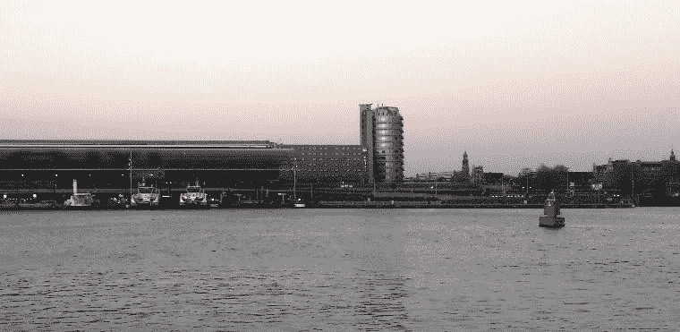
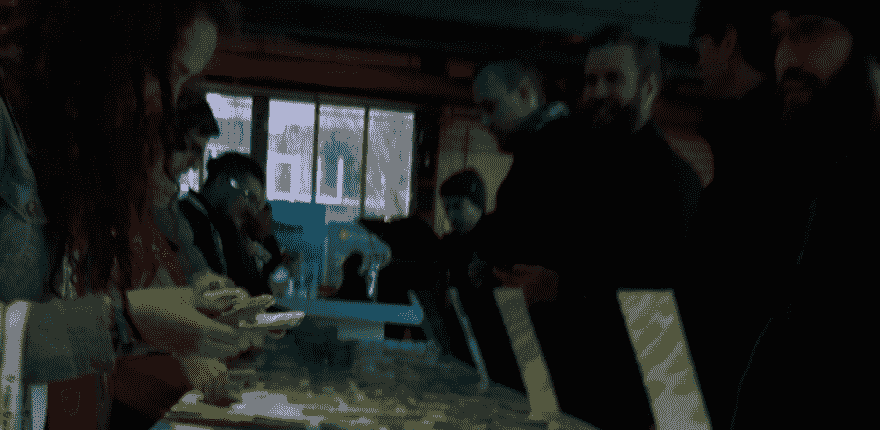
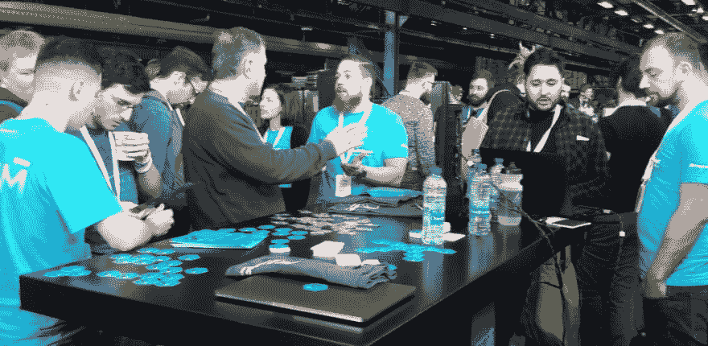

# 回顾 React Amsterdam 2019

> 原文：<https://dev.to/progresstelerik/a-look-back-at-react-amsterdam-2019-4bf5>

React Amsterdam 上周在阿姆斯特丹北部举行，由 [GitNation](https://gitnation.org/) 组织，这是一个了不起的团队，他们在举办开发者会议方面做得非常出色，如 [JS Nation](https://jsnation.com/) 另一个荷兰 JS 社区项目和 now 会议， [React Day Berlin](https://reactday.berlin/) 这是第一个此类的全天会议，在德国柏林举行，等等。今年的 React 阿姆斯特丹大会有超过 1500 名 React 开发者参加。我参加了会议，自愿参加了两天的研讨会，并为我的公司 [Progress](https://www.progress.com/) 经营了一个展台，展示我们的 [KendoReact](https://www.telerik.com/kendo-react-ui/) UI 组件套件。

## 一个令人惊叹的会议地点

克罗姆胡塔尔曾经是一个主要的船用发动机制造厂。我在前一天出现，在会议的大部分准备工作完成之前就看到了大厅。独自一人，这是一个寒冷黑暗的大厅，在过去，这是一个巨大的机器劳动强度大的场景，今天，它用于重大活动，可以容纳数千人的长大厅和巨大的天花板。使用从中央车站到 IJplein 终点站的轮渡很容易到达会场，但我也可以从 Noordpark 地铁站来，无论哪种情况，都只需经过一个繁华的创意区步行 5 分钟就可以到达会场，这里有当地居民住宅，很快将成为酒店和包装区。这个地区将继续是一个很好的位置，特别是计划从市中心延伸一座桥到 IJ 河。查看组织者精心制作的视频，从 React Amsterdam 过去的活动中了解会场、[的氛围和心情](https://www.youtube.com/watch?v=bLgrUrPJdKE)。

## 惊人的工作坊教授有价值的原则和模式

尽管不是在臭名昭著的 Kromhouthal，React Amsterdam(研讨会)的一部分也在附近举行，在 Tolhuistuin 的大坝了望台的阴影下，这是一家面向 IJ 的餐厅，为研讨会与会者提供了令人惊叹的景色。在这里，我做了两天志愿者，并有了一个很好的机会与工作坊的老师和参加者一起工作。我喜欢尽我所能提供帮助，我想如果我在阿姆斯特丹参加会议，我只能做这么多观光，我喜欢在这个城市工作到一定程度，感受在那里有截止日期、要求和工作要做的感觉。还有很多像这样的人，我遇到了他们中的很多人，我与一些了不起的志愿者和组织者一起工作，如 Olena、Daria、Sara、Ravi、Nicholas、Maksym 和 Aleksandra，还有其他人放弃了他们在这个了不起的城市为社区服务的时间，我想感谢他们这么棒。你可能不认识这些人，但我想让你知道，这次会议的成功在很大程度上取决于他们的辛勤工作。

像肯特·C·多兹这样的演讲者每天举办两次研讨会([高级反应](https://react.amsterdam/workshops#advanced) & [测试反应](https://react.amsterdam/workshops#testing))，他也在会议上发言。他的研讨会正是那种我会非常重视参加的研讨会，我可以成为墙上的一只苍蝇，但我听说你可以访问他的网站，并获得一些同样的培训。还有像 Andrey Okonetchnikov&Artem sape gin 这样的演讲者，他为 React 开发人员举办了一个关于[设计系统的精彩研讨会](https://react.amsterdam/workshops#design-systems)，展示了如何设计系统来提供产品创建过程的系统方法。他们对 IJ 的看法是惊人的，这在我的可怕的照片中你看不到。

也许我得到了一条河，...开始了。

在同一个地点，我们有 Michel Weststrate 为 React Devs 编写的[打字稿，以及 Alex Lobera&hora CIO Herrera 编写的 React Native Workshop，所有这些工作坊都在 T2 Tolhuistuin](https://react.amsterdam/workshops#typescript)的三个不同房间里。

在离阿姆斯特丹市中心更近的河对岸，有另一个工作室，我确信它提供了一个和我志愿服务的那个一样独特的位置。那是在皇家工业格鲁特俱乐部，我走过那里好几次，赞叹不已，却不知道那其实是其他工作坊的举办地。如此美丽的建筑就像阿姆斯特丹城里的许多其他建筑一样。在那个地点，Kitze 在两个不同的日子里进行了会谈( [GraphQL 研讨会](https://react.amsterdam/workshops#graphql) & [高级反应](https://react.amsterdam/workshops#advanced-with-kitze))。他们也有另一个有趣的关于[麦克斯·斯托伊伯]现代反应的基础研讨会。

我不可能同时出现在两个地方，但我对 Kitze 和 Kent 工作室之间的差异非常感兴趣。我希望这些研讨会能被记录下来，并在会谈结束后被公开。我知道在上课的时候会有间隙，但是老师会在这段时间变得聪明，可能会在广播中对练习进行现场编码。我不知道有多少方法可以让这种会议体验更加身临其境，但这听起来像是他们应该探索的事情。也许他们已经是了！

## 会议启动

帮助注册是如此有趣，以满足每个人，即使只是一分钟，让他们得到一个徽章和一些赃物。作为一名与会者，我得到了一个包，我喜欢我的新咖啡杯！有很多人要处理，我觉得我们做得很好，让那些在开始时出现的人按时进入活动，尽管在几个小时内有 1500 人进入大门，令人兴奋。感觉很成功，会议开始了。我去我的展位和我的 tam 登记，在 React Amsterdam 我最后一次换了帽子。在我们的展台工作，会见对安装我们的组件和玩 KendoReact 感兴趣的人。我喜欢谈论图书馆，让别人为之兴奋。

## 会议谈话集锦

有这么多精彩的演讲和精彩的讲座，我想花点时间强调一下我认为最有价值的。作为一个在 React 中使用大量 UI、布局和表示的人，我非常支持基础知识和一般知识。当谈到 UI 和基本 React 之外的高级和深入主题时，我开始迷失，而这次会议的伟大之处在于，他们为每个人提供了一些东西。让我们来看看其中的一些演讲，并在此进行回顾:

### 必不可少的反应(肯特·C·多兹)

会议以肯特·C·多兹在主舞台上的演讲[“必不可少的反应”](https://www.youtube.com/watch?v=4KfAS3zrvX8&t=1405s/)开始。用他自己的话来说，这个演讲是关于:“退一步思考基本面的有用性”。我们学习如何修理下垂的水龙头(有图片)，学习理解抽象概念如何帮助我们更有效地使用它们，而不仅仅是在现实生活中？？而且在我们的代码中。这意味着要注意我们的抽象概念，并理解每个抽象概念最终都有某种类型的成本。我最喜欢的他深入研究的抽象是 JSX 的，我不想破坏这个演讲，但是看看我们如何轻松地将巴别塔转换成原始的 JS，我们能够看到引擎盖下面，更好地理解这个抽象。我觉得很多讨论主要是关于如何提升 React 开发人员的水平，如果你是一个老板或经理，派几个开发人员去 [React Amsterdam](https://react.amsterdam/) ，这正是你想要的信息类型！

### 重构反应(Siddarth Kshetrapal)

没有时间浪费在另一个非常有价值的关于 React 中重构的基础讨论上，这次来自 [Siddarth Kshetrapel](https://github.com/siddharthkp/) 的独立开发人员在重构登录和认证表单方面做得非常出色，他提供了许多有用的提示，让我们的价值一目了然。从类组件和构造函数开始，并进行大量的适当训练，我们快速地将代码重构为更易管理和经得起未来考验的东西。他谈到的一些技术是传播道具，以正确的方式使用道具中传递的方法，以及如何确保我们不会因为没有正确管理我们的道具而覆盖方法的道具值或应用它们。他提到了“单一责任”和“关注点分离”等原则。我真的很喜欢他谈到的理解受控和非受控状态的混合以及如何避免这种情况的大部分内容。挑一个，他喜欢不受控制的组件，这给了我们进入高阶组件或更好的反应钩子的机会。`useSmartness()` FTW！

所以那些演讲代码非常多，我已经有心情做一些直截了当的幻灯片演讲了！我最喜欢的说话方式！我不必过度疲劳，而且我还能学到一些以前不知道的新东西。

### 一种通用的设计语言(安德烈·奥科涅奇尼科夫)

Andrey 也在 React 中就设计系统的相同主题举办了一个令人惊叹的研讨会，他将所有相关信息放入一个非常清晰、易于理解的讲座中，讨论如何构建一种通用的设计语言，减少字体、间距和颜色之间的选择，以创建一个设计语言系统。使用一个通用的设计语言系统允许跨多个产品和标志的设计选择的可重用性。就像他指出的德国政府标志和奥地利政府标志的设计一样简单。一个有清晰的设计系统和语言，另一个虽然有创意，但缺乏可区分的特征，通过一个共同的设计语言显示其所有属性的清晰排列。

[Andrey 的演讲](https://www.youtube.com/watch?v=4KfAS3zrvX8&t=6900s)有许多类似上面的视觉效果，向我们展示了设计系统语言不仅可以帮助您的开发人员和设计人员交流，还可以帮助您的组织向客户和顾客清楚地表达，并具有很好的意义和通用性。该演示引入了数字产品的设计语言，这是我们结合 React 面向组件的功能的地方，这些功能使您可以轻松地定义一种通用语言，您的 UI 可以实现与之前讨论的类似结果，但现在是在数字产品中。非常精彩的演讲，我真的建议你花点时间去看看。我还想指出，React Amsterdam 拥有令人惊叹的设计语言，并且年复一年地利用这一点，使用了一套类似的标志、字体和设计。

### 设计与反应(马克·达尔格利什)

在之前的设计语言演示之后，我们很好地过渡到 Mark Dalgleish 关于在 React 中进行[设计的演讲。使用与 React Mark 配对的设计系统能够在最终介质中进行设计。因为 React 是如此面向组件，它允许我们构建自己的领域特定语言。我亲眼看到我工作过的公司，比如特斯拉，在 React 和其他网络技术中利用这种能力。随着许多公司建立自己的设计系统，Mark 举了一些其他例子来说明这种想法在我们的行业中的传播。Mark 的主要观点支持从我们的设计系统中捕捉设计意图并将其应用于 web 和本地应用程序的能力。](https://www.youtube.com/watch?v=4KfAS3zrvX8&t=8562s) [Seek style-guide](https://github.com/seek-oss/seek-style-guide) 是马克的公司创造的东西，是 React 出色执行的设计系统的伟大资源和范例。

马克展示的另一个令人惊叹的资源是 [React Sketch.app](http://airbnb.io/react-sketchapp/) ，它将 React 组件渲染到 Sketch，帮助使用真实数据进行设计，使用真实组件代码进行反应，并管理 React 中实现的设计系统。观看视频，了解他们创建的名为`html-sketchapp`的令人惊叹的 npm 包的信息。我会让你自己去发现那颗神奇的宝石。

### 服务器端渲染会谈

到目前为止，我已经参加了 4 场讲座，我已经看到大多数讲座在每次休息时都回到我们的展位，与与会者和讲座内容进行互动。对于像我这样喜欢完全沉浸在技术中并谈论它的人来说，这个活动让你进入你的元素。很高兴能得到像我这样的公司的支持，让我们有机会以有机的方式开展这些活动，并让代表他们产品的人来到这里，只是在 React 上极客。除了我不得不回答的关于我们自己的组件库的问题之外，会议上的大部分讨论都围绕着基础知识、前沿特性和 React 路线图，以及接下来会发生什么。这是一次令人惊叹的会议，让你真正深入 JavaScript 并做出更具体的反应。

接下来的四个讲座都是关于服务器端渲染(SSR ),使用 Next JS 等框架进行预渲染，Crystalize for the backend 创建闪电般快速可伸缩的 SSR React 应用程序，创建使用 SSR 的应用程序的优缺点，再水合、互动时间等主题以及其他与我们大型电子商务网站如何渲染相关的事情。在电子商务领域，减少几毫秒甚至几秒钟的加载时间是非常有价值的。这 4 个讲座将带您了解 SSR 的优势和缺陷。

*   [Next for Next.js](https://www.youtube.com/watch?v=4KfAS3zrvX8&t=10427s)
*   [闪电般快速的 SSR 反应](https://www.youtube.com/watch?v=4KfAS3zrvX8&t=10991s)(霍肯·古勒德·克罗)
*   加速反应 SSR (大卫马克克莱门茨)
*   [揭开服务器渲染 React 应用的神秘面纱](https://www.youtube.com/watch?v=4KfAS3zrvX8&t=11870s)(费尔南多·波拉齐)

## 闪电圆...一个..开始！(快速阅读)

好的，非常快，让我告诉你关于惊人的闪电回合谈判，快速阅读这一部分，了解闪电回合是什么样子的。有四场精彩的闪电演讲，我亲自参加了其中两场，今天在家观看了另外两场，我不得不说，我带着每个主题的金块离开了他们，我可以用这些金块来自己探索这个主题。以下是这些演讲以及 YouTube 上的链接。

*   用 React Async 像老板一样拿东西
*   [微作业多线程](https://youtu.be/4KfAS3zrvX8?t=16267)(文森佐·法拉利)
*   强大而简单的图表
*   Git 历史展示(罗德里戈·庞博)

我是上一次演讲中展示的库的忠实粉丝，该演讲名为 [Git-history](https://dev.to/scottw/-git-history-5fpc-temp-slug-9335267) ，在被提醒了 React Amsterdam 的神奇之处后，我将在我即将到来的一些演讲和演示中使用这个包来展示当用钩子将基于类的组件重构为功能组件时的变化，我认为这将为这个主题的教学提供很好的视觉帮助。很容易使用，我可以在这里演示给你看。

在 GitHub 上的任何 repo 中获取任何文件。比如，我现在写的这篇文章:

`https://github.com/httpJunkie/telerik-blogs/blob/master/react-amsterdam-a-look-back.md`

用`http://github.githistory.xyz`替换`http://github.com`，得到以下字符串:`https://github.githistory.xyz/httpJunkie/telerik-blogs/blob/master/react-amsterdam-a-look-back.md`

下面是 Git History 对我的回购文件所做的处理:

如果你没有立刻爱上这个，你就不存在。我给我儿子看了，他被迷住了，我们注意到，如果我能更经常地存钱，我会有一个更精细的步骤。这是我对下一年 GitNation 开源奖的提名(这没有任何意义，因为我与 GitNation lol 没有任何关系)。我只是认为像 Rodrigo 这样的人会因为他们对开源的贡献而受到重视。真的很神奇，我说的够多了吗？

## 理工大悔望谱(麦克斯·斯托伊伯)

我承认 SSR 的谈话有点让我摸不着头脑，但接下来是马克斯·斯托伊伯谈论他在 Spectrum 被 GitHub 收购的[技术遗憾。另一个伟大的演讲，我不想破坏 Max 过去的遗憾，我建议你自己听听这个演讲，从事后的经验和他构建真实世界产品并交付给用户的经验中获得经验教训的价值。](https://www.youtube.com/watch?v=4KfAS3zrvX8&t=17600s)

## 用微前端扩展应用程序(马克斯·加洛)

每隔一段时间，在一个会议上有一些演讲，我认为台上的人比我在另一个层次上。老实说，我从来没有构建过任何微前端，如果我做了，我也不知道如何扩展它们。当他要求我们举手，如果我们听说过他们的话，我按照严格的合同把手放下，因为我从来没有听说过这个。一旦他开始解释这个想法，我就从一个非常高的层面上理解了。我喜欢他的演讲为理解这个微前端的事情设置了三个主要途径。我们为什么需要它们？这是什么？他们是如何在引擎盖下工作的？我需要尽可能多的人来帮我做这个演讲。

微前端就像是微服务和实际的前端单页面应用程序的混合体。微前端是一种将前端的代码库分割给许多团队的方式，显然使用了某种类型的设计系统来保持它们在风格和品牌上的相似性，我们已经听说了如何使用 React 的额外优势来实现这一点。

## 阿姆斯特丹的女性反应

没有比 React 领域的先锋女性做三场精彩的演讲更好的方式来结束 React 专题讲座和会议了。我最喜欢的来自 React Amsterdam 的演讲来自伊丽莎白·奥利维拉。同样，我确实受到了 Peggy 和 Ashi 的启发，因为我正在慢慢地进入 GraphQL，看到 WebGL 和 Hooks 一起使用绘制像素必须是我在 React Amsterdam 上第二个最鼓舞人心的演讲之一。

### 一个 SVG 的故事(伊丽莎白·奥利维拉)

我说过的 SVG 的故事是我最喜欢的话题。她是爱尔兰 Optum 的高级 UX 设计师。如果我可以为 React Amsterdam 上最鼓舞人心的演讲和最有可能让我开始使用一种古老但令人惊叹的强大技术颁奖，这种技术由于 React 而获得了新的租约，那就是 SVG。我一直是 SVG 的超级粉丝，但是在她的演讲之后，我有了很多想法，如何在我的 React 应用程序中使用内联方法或 JSX 和组件来正确和动态地使用 SVG。使用 React JS 创建动画和样式是可能的，在 React 下可能很复杂，但可以让不精通 SVG 的开发人员通过您的组件轻松使用它们。除了 SVG 和 React，Elizabet 还展示了她这些年来的一些业余项目。其中之一是一个应用程序，你可以在潮湿的嘻哈节拍上录制自己的声音，这是[伊丽莎白用一些令人惊叹的抒情技巧为我们演示的](https://www.youtube.com/watch?v=4KfAS3zrvX8&feature=youtu.be&t=22153)。这位演讲者绝对让我大吃一惊，我希望我能在演讲结束后看到她，给她一个大大的感谢。真正令人惊叹的演示，她让每个人都离开座位欢呼，包括我自己，有时强忍泪水，因为她的(虚构的)故事是如此惊人和温暖，她的表演是纯粹的兴奋剂！

### graph QL 开发者体验(Peggy Rayzis)

Peggy Rayzis 必须是 GraphQL 主题上最有说服力的演讲者，尤其是对于像我这样的初学者。这是我最想听的演讲之一，就像在大多数会议上发生的那样，我转移了话题，错过了？？。但是今天听回来，当佩吉告诉我们她去年在阿姆斯特丹住了一个月，而且那是她在世界上最喜欢的城市时，我一点也不惊讶。我想我们大多数第一次来阿姆斯特丹的人都有同样的感受。我想不出比这更好的背景了。这是我对欧洲真正的介绍！我喜欢接受 Peggy 为我们带来的关于 GraphQL 的所有知识，她作为阿波罗公司的一名员工有着很好的前景，她在那里担任工程经理。这家公司构建了 GraphQL 最令人惊叹的实现。Apollo 帮助我们在应用程序和 API 之间架起了一座桥梁，我不想破坏她的演讲，所以我只是建议，如果你对 GraphQL 感兴趣，可以看看这篇文章。

### 用 WebGL 和钩子绘制像素(Ashi Krishnan)

Ashi Krishnan 是一位经验丰富的演讲者，在 React 之外的许多不同主题上都有演讲。她一直在我的雷达上，因为像 React 中的深度学习和从机器中学习这样令人惊叹的演讲。她与英国的 GitHub 合作，在 React Amsterdam，她结束了 React Amsterdam 的一般 React 跟踪，带我们进入 WebGL 的旅程，以及如何利用 Hooks 的这一旅程。这个演讲让我想起了我们可以在 React 中做的许多事情，这些事情挑战了我们对 React 应用程序是什么以及它能做什么的看法。我第一次开始意识到我们可以用 React 和 rendering 做的所有令人惊奇的事情，是从 Ken Wheeler 关于建造架子鼓或用画布渲染网页的演讲开始的。 [Ashi](https://github.com/queerviolet) 继续挑战我们关于 React 的想法，用一个惊人的现场演示用 WebGL 在 React 中绘制像素。如果我能选择一个我认为最包含创造力和跳出框框思考的演讲，那就是这个。在不透露太多的情况下，她浏览了许多真正艺术化的演示，这些演示使用 React 中的 WebGL 实现了不同的风格和方法来绘制屏幕。

## 反应过来的原生轨迹

虽然我在 React Amsterdam 的普通赛道上“et，slept，breth”过，但我不能经常去 React Native 赛道。但我确实有意识地看了一部分。我从未使用过 React Native，但我听说过很多关于它的好消息，当我在 React Amsterdam 时也确实捕捉到了一些片段。如果我可以指出一个我认为有助于我更好地理解 React native 的演讲，那就是 React native 核心团队成员 [Parashuram](https://github.com/nparashuram) 的演讲，这也是 React Native 专题讲座的第一个演讲:[构建 React Native](https://www.youtube.com/watch?v=NCLkLCvpwm4&t=934s) 。

React 原生曲目[可以在 YouTube](https://www.youtube.com/watch?v=NCLkLCvpwm4) 上完整观看。以下是你可能想听的所有演讲的完整列表！如果你更多的是网络开发者，而不是本地开发者，我建议你也去看看由佛罗里达的竞争对手开发的[本地网络应用](https://www.youtube.com/watch?v=NCLkLCvpwm4&t=18906s)。

在 React native 赛道上，我们看到了安娜·道科娃关于[实用性能](https://www.youtube.com/watch?v=NCLkLCvpwm4&t=2844s)的精彩演讲，安基塔·库尔卡尼关于[让 React 应用变得可访问](https://www.youtube.com/watch?v=NCLkLCvpwm4&t=17234s)的精彩演讲，以及弗拉基米尔·诺维克关于[揭开复杂动画创作过程](https://www.youtube.com/watch?v=NCLkLCvpwm4&t=25644s)的精彩演讲。作为一个非 React 本地开发人员，我可以很容易地跟上所有的谈话。

*   建筑反应自然
*   React Native 的实战表演(安娜·道可娃)
*   React 和 React Native 之间共享代码:不共享什么(本·埃勒比)
*   为一个比手机更大的世界而建造
*   [咨询室](https://www.youtube.com/watch?v=NCLkLCvpwm4&t=9801s)(小组讨论)
*   [让你的 React 原生应用可以访问](https://www.youtube.com/watch?v=NCLkLCvpwm4&t=17234s) (Ankita Kulkarni)
*   原生网络应用 : React 和 WebAssembly 重写原生应用(Florian 对手)
*   [无服务器计算时代的全栈反应本地](https://www.youtube.com/watch?v=NCLkLCvpwm4&t=20715s)(Nader Dabit)
*   揭开 React Native 中复杂动画创作过程的神秘面纱
*   [React Native App 首次展示](https://www.youtube.com/watch?v=NCLkLCvpwm4&t=27212s) -一种替代方法(亚当·特尔森)

## 开源大奖

由于 React Amsterdam in heart 是一个 JavaScript 会议，对开源的热爱是 GitNation 举办的每个会议的核心，他们在突出和认可伟大的开源项目方面做得非常好。今年他们有几个类别，你可以观看颁奖典礼了解更多的背景。

### 突破之年

Michel Weststrate 是荷兰人，也是流行的开源库 [Immer](https://github.com/immerjs/immer) 的主要贡献者，该库用于通过改变当前状态来创建下一个可改变的状态。我只是粗略地了解了这个库所能提供的帮助，但是我已经用它来使 React 中我的 reducers 的返回状态用来改变(同时保持不变)我的本地组件状态。我相信这个图书馆还有很多其他的伟大用途，我认为它应该得到这个奖项。获得该奖项提名的是 [Linaria](https://github.com/callstack/linaria) 、 [Formik](https://github.com/jaredpalmer/formik) 和 [React-navigation](https://github.com/react-navigation/react-navigation) 。

### 最激动人心的技术

这个奖项授予了 [VX 开源库](https://github.com/hshoff/vx)，它使得将 D3 图表结合到 React 中构建惊人的可视化组件变得很容易。在 [vx-demo.now.sh](https://vx-demo.now.sh/gallery) 上可以看到一个演示，展示了制作你自己的可重复使用的图表库或者你自己的灵活的定制的一次性图表是多么容易。虽然没有代表把这个奖项带回家，但是 VX 团队为 JS 开放源码做出了如此惊人的贡献，这是非常值得称赞的。

### 年度趣味副业项目

该奖项的名称说明了一切，这只是 GitNation 认为有趣、轻松和令人惊叹的开源贡献。这个类别的被提名者是[React 95](https://github.com/React95/React95)(Windows 95 上的一个游戏)是一个具有 Windows 95 风格 UI 的 React 组件库。这也是我的选择，尽管我认为这两个项目都非常棒。下一个被提名者是 [React-insta-stories](https://github.com/mohitk05/react-insta-stories) 一个 Instagram like stories 的 React 组件。该组件对动作做出响应，比如在右侧轻击下一篇文章，在左侧轻击上一篇文章，然后按住以暂停。可以提供每个故事的定制持续时间。该奖项的获奖者是 React95。Gabriel Daltoso 和 Alysson Dos Santos(巴西圣保罗)都上台接受了这个当之无愧的奖项！

### 对社区最有影响力的贡献

这个奖项的获得者是[反应测试库](https://github.com/kentcdodds/react-testing-library)。该奖项的其他被提名者是[排毒](https://github.com/wix/Detox)和[反应导航](https://github.com/react-navigation/react-navigation)和[减档](https://github.com/downshift-js/downshift)，它们在我们的 JS 社区都非常有影响力。台上的播音员应该注意到，其中两个库的主要贡献者与肯特·C·多兹是相同的。如果他自己没有获得阿姆斯特丹最具影响力和影响力的人的奖项，他也应该和其他几个在研讨会和会议上发言的演讲者一起，碰巧肯特也能赢得开源奖，但有许多人戴着许多帽子发言，志愿服务，教授研讨会，总的来说只是生活和呼吸这个会议。

### 生产力助推器

最后一个奖项是关于作为开发人员的生产力。作为一个喜欢在 markdown 中写作的人，获胜者是我的最爱，我现在使用 VS 代码在 Markdown 中写这篇文章，我使用 Git 记录我为这个博客写的每篇文章的进度和迭代。我也写了很多演示文稿和幻灯片，也喜欢用 markdown。你可以猜到，这个奖项的得主去了 [MDX Deck](https://github.com/jxnblk/mdx-deck) ，被 [Time Neutkens](https://github.com/timneutkens) 接受并交付给 [Brent jackson](https://github.com/jxnblk) 。该类别的其他提名者是 [Formik](https://github.com/jaredpalmer/formik) 、 [React-cosmos](https://github.com/react-cosmos/react-cosmos) 和 [React-table](https://github.com/tannerlinsley/react-table) 。

## 做出反应的是阿姆斯特丹

谈论阿姆斯特丹对于 JavaScript 来说是一个完美的城市，更重要的是 React 开发者。通风口的一些赞助商位于阿姆斯特丹或荷兰，或在那里设有办事处。这座城市在历史、艺术、科技和购物方面提供了如此多的东西，所以它显然是一个吸引 React 社区的好地方，非常放松，同时又充满活力。如果有足够的时间和能力走遍整个城市，了解地铁、荷兰国家铁路公司 NS (Nederlandse Spoorwegen)和各种其他渡轮和电车系统，您可以很容易地移动到您想要访问的区域，并通过离开市中心来提高或降低能量。

我住在 [Wilbautstraat 区](https://www.google.com/search?q=Wilbautstraat&rlz=1C1CHBF_enUS841US841&oq=Wilbautstraat)离中央车站仅 4 站地铁，在我的[开发商指南 React Amsterdam](https://dev.to/httpjunkie/the-developers-guide-to-react-amsterdam-4h60/) 中我会详细介绍这个酒店。

## 反应过来 2020

如果您计划参加 React Amsterdam 2020 活动，请在日历上做好标记，日期是 4 月 16 日和 17 日。我知道我错过了发生的其他令人惊讶的事情，但希望，如果你不能参加，这可以作为一个指南，或者也许是一个工具，你可以用来说服你的老板明年去。如果有，请到我们的展位来和我聊聊，我明年四月一定会再来的！