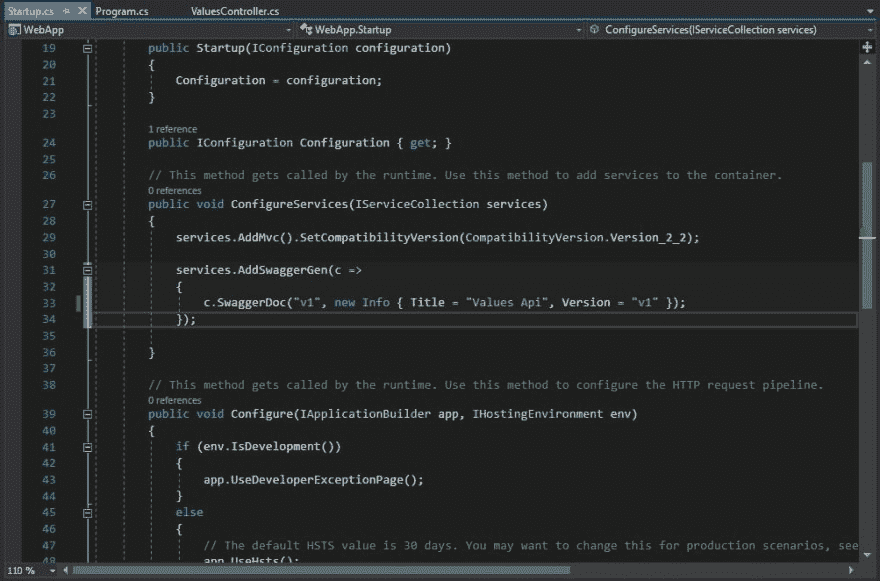
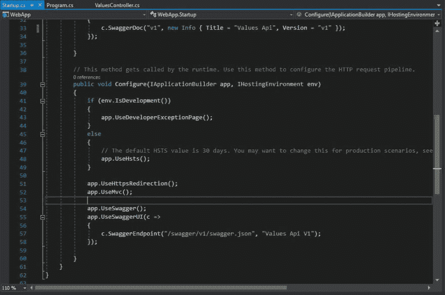
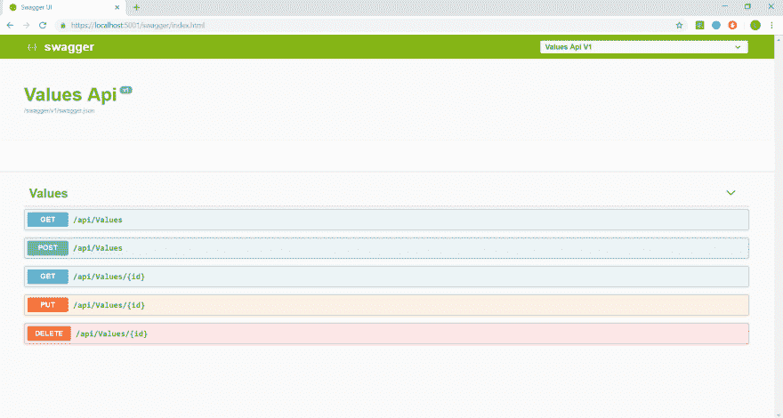
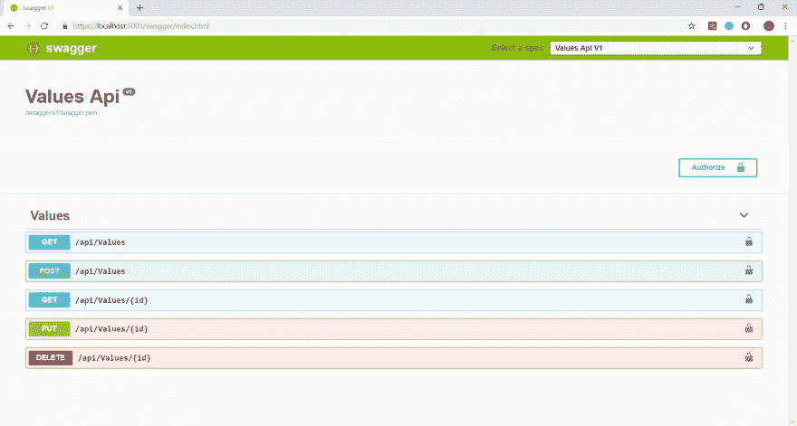

# 如何在. NET 核心应用中快速安装 swagger

> 原文：<https://dev.to/lucas0707/how-to-quickly-install-swagger-in-a-net-core-application-jkc>

## 什么是霸气？

Swagger 是一个不可思议的 API 文档工具。它将自动创建您需要的文档和 UI 界面，以便您可以测试您的控制器和端点。

这对于公共 API 来说是惊人的，如果你有多个微服务并且需要快速的文档，swagger 就是你要找的人。在。net 环境中，安装 swagger 的一种方法是使用我们今天将使用的 Swashbuckle 包。

## 如何安装。

首先，您进入您的软件包管理器控制台并运行以下命令:
`Install-Package Swashbuckle.AspNetCore`

软件包安装完成后，您必须在 Startup.cs 文件中对其进行配置。转到 ConfigureServices，添加一个名为 AddSwaggerGen 的 swagger 方法，并在其中插入您的文档。

```
 services.AddSwaggerGen(c =>
            {
                 c.SwaggerDoc("v1", new Info { Title = "Values Api", Version = "v1" });
              }); 
```

您可以通过添加版本来控制您的文档。而且，只要不重复，想插多少插多少。

之后，您的 ConfigureServices 将类似于以下内容:

[](https://res.cloudinary.com/practicaldev/image/fetch/s--Mo2WAixr--/c_limit%2Cf_auto%2Cfl_progressive%2Cq_auto%2Cw_880/https://thepracticaldev.s3.amazonaws.com/i/pzpokapz0xzouzh57vgc.JPG)

下一步是添加 SwaggerUI，您将在 Startup.cs 文件的 configure 方法中配置和添加它。首先添加 UseSwagger 方法，然后添加 UseSwaggerUI 方法，并在其中添加访问 Swagger 的 url，您可以添加任意多个，只要您已经在 AddSwaggerGen 中为它创建了版本。

```
 app.UseSwagger();
            app.UseSwaggerUI(c =>
            {
                c.SwaggerEndpoint("/swagger/v1/swagger.json", "Values Api V1");
            }); 
```

完成后，您的配置方法应该如下所示:

[](https://res.cloudinary.com/practicaldev/image/fetch/s--Z-RqFxb6--/c_limit%2Cf_auto%2Cfl_progressive%2Cq_auto%2Cw_880/https://thepracticaldev.s3.amazonaws.com/i/ltzzqy6dlyteu0svxrau.JPG)

运行您的应用程序，访问您的应用程序创建的 url，并在末尾添加/swagger。您的 swagger UI 应该会出现:

[](https://res.cloudinary.com/practicaldev/image/fetch/s--3uXZYs-I--/c_limit%2Cf_auto%2Cfl_progressive%2Cq_auto%2Cw_880/https://thepracticaldev.s3.amazonaws.com/i/1p8kzpm5vjwbwqs6kt7y.JPG)

那就是安装和使用 swagger。还有许多其他选项可以配置和使用，这里我们就不展示了。我想谈谈最后一个配置。

# 添加令牌头。

如果您碰巧需要在现有的应用程序中安装 swagger，您可能需要一个令牌来识别您的请求，使用 swashbuckle 很容易做到这一点。你需要把它添加到你的 AddSwaggerGen 方法中，就像这样:

```
services.AddSwaggerGen(c =>
            {
                c.SwaggerDoc("v1", new Info { Title = "Values Api", Version = "v1" });
                c.AddSecurityDefinition("Bearer",
                       new ApiKeyScheme
                       {
                           In = "header",
                           Name = "Authorization",
                           Type = "apiKey"
                       });
                c.AddSecurityRequirement(new Dictionary<string, IEnumerable<string>> {
                    { "Bearer", Enumerable.Empty<string>() },
                    });

            }); 
```

您添加一个安全定义，并指定您到底需要什么，如果您再次尤然应用并访问 swagger，您将看到一个授权按钮，您可以在其中添加您的令牌:

[](https://res.cloudinary.com/practicaldev/image/fetch/s--mEpwKSup--/c_limit%2Cf_auto%2Cfl_progressive%2Cq_auto%2Cw_880/https://thepracticaldev.s3.amazonaws.com/i/d4ha1n1fr5qt0f36yqvq.JPG)

## 了解更多！

如果你想了解更多关于 swagger 和 swashbuckle 的知识，请查看以下链接:

[https://docs . Microsoft . com/en-us/aspnet/core/tutorials/getting-started-with-swash buckle？view = aspnetcore-2.2&tabs = visual-studio](https://docs.microsoft.com/en-us/aspnet/core/tutorials/getting-started-with-swashbuckle?view=aspnetcore-2.2&tabs=visual-studio)

[https://github.com/domaindrivendev/Swashbuckle.AspNetCore](https://github.com/domaindrivendev/Swashbuckle.AspNetCore)

# 结束。

我希望通过分享我使用 swagger 的经验，我可以帮助你快速安装 swagger 并成功地记录你的 API。

任何问题，意见或建议都非常感谢！