# 和珀西一起改善你的视觉效果

> 原文：<https://dev.to/rowlandekemezie/improving-your-visual-review-with-percy-315b>

[](https://res.cloudinary.com/practicaldev/image/fetch/s--UXL5Cm_N--/c_limit%2Cf_auto%2Cfl_progressive%2Cq_auto%2Cw_880/https://thepracticaldev.s3.amazonaws.com/i/la8ofw61rvukdhebdo8b.jpg) 
*照片由肯·特雷罗亚尔在 Unsplash 上拍摄。*

### 问题

您的开发团队对面向客户端的应用程序进行了大量的更改。在很大程度上，开发人员不知道他们什么时候破坏了 UI 上的任何东西。您发布 UI 更改时信心不足，不知道是否出了问题。尽管有不错的代码审查、人工 QA 和测试覆盖，它们仍然不足以捕捉所有的 UI 错误。一个选择是全力以赴，多聘请人工 QA 人员。或者，找到一种可扩展的方法，将自动视觉审查与即时反馈周期相集成，以改进整个流程并满怀信心地发货。

### 视觉点评有几个原因:

*   手动 QA 不可扩展
*   视觉回归测试是救命稻草
*   自动反馈是一个巨大的收获
*   跨浏览器兼容性问题仍然存在

### 为什么珀西

我认为珀西在上述问题上做得很好。它与您现有的 CI 工作流相集成，突出显示浏览器、屏幕和快照之间的视觉差异。锦上添花的是能够审查和批准这些变化。基本上，珀西结合了视觉测试和审查平台在一个很酷。

> 在撰写本文时，Percy 每月可以免费获得高达 5k 的快照。

#### 让我们来看看如何使用 Percy

我会将它整合到我个人网站的[库](https://github.com/rowlandekemezie/rowlandekemezie.com)中。它由[盖茨比](https://gatsbyjs.com)制作，并部署到 [Netlify](https://netlify.com) 。

因此，让我们首先克隆存储库

```
git clone https://github.com/rowlandekemezie/rowlandekemezie.com.git 
```

### 本地运行珀西

您可以配置 percy-cli 进行本地测试

```
$ gem install percy-cli 
```

在我们继续之前，我们需要一个 *PERCY_TOKEN* ，这是一个*只写* API 密钥，它只能创建构建、快照和上传资源到这个项目。所以，用你的 GitHub 账户注册[珀西](https://percy.io)。

接下来，创建一个组织名称、确认电子邮件并点击*开始新项目*。

[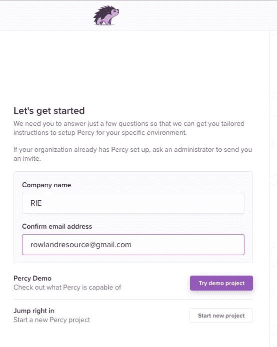](https://res.cloudinary.com/practicaldev/image/fetch/s--kIQjXftd--/c_limit%2Cf_auto%2Cfl_progressive%2Cq_auto%2Cw_880/https://thepracticaldev.s3.amazonaws.com/i/lxfdb2kkx5lnhsi4xoky.png)

下一步是向您的组织添加一个项目。或许，使用存储库名称是个好主意。

[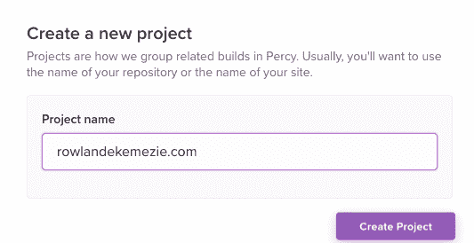](https://res.cloudinary.com/practicaldev/image/fetch/s--l4eR03Lh--/c_limit%2Cf_auto%2Cfl_progressive%2Cq_auto%2Cw_880/https://thepracticaldev.s3.amazonaws.com/i/9hky3mp2f2ht7qm0y52u.png)

一切就绪。现在，您有了您的 *PERCY_TOKEN* ，它将用于在本地和 CI 上运行测试。

[](https://res.cloudinary.com/practicaldev/image/fetch/s--596AeZMf--/c_limit%2Cf_auto%2Cfl_progressive%2Cq_auto%2Cw_880/https://thepracticaldev.s3.amazonaws.com/i/7vcwdey91uv87ap5cufg.png)

让我们回到终端，用令牌在本地测试它

[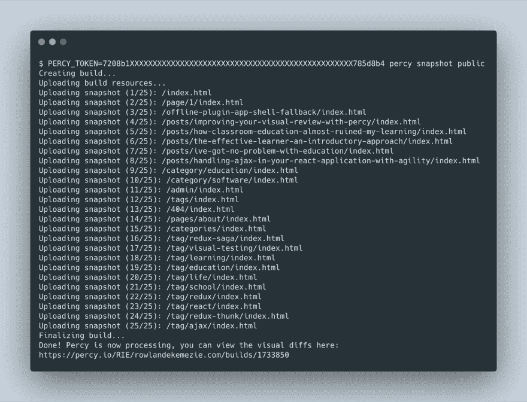](https://res.cloudinary.com/practicaldev/image/fetch/s--bHb7jRDH--/c_limit%2Cf_auto%2Cfl_progressive%2Cq_auto%2Cw_880/https://thepracticaldev.s3.amazonaws.com/i/zxb9dn0d4msa1p9ezhrf.png)

> 确保首先运行*纱线制造*。

单击下面生成的链接，在 Percy platform 上查看。

[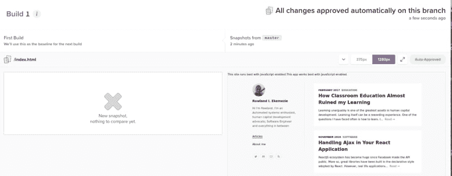](https://res.cloudinary.com/practicaldev/image/fetch/s--LlqpugM1--/c_limit%2Cf_auto%2Cfl_progressive%2Cq_auto%2Cw_880/https://thepracticaldev.s3.amazonaws.com/i/lwuqxmn5t7xnxp1b7s7x.png)

> 左栏是空白的，因为还没有可以比较的快照。

### 将 Percy 集成到您的 CI 工作流中

我们很乐意将 Percy 整合到我们的 CI 工作流程中。它应该在每次提交时运行。

让我们使用 CircleCI。然而，它与其他所有受支持的 [CI 平台](https://docs.percy.io/docs/ci-setup)配合得很好。

首先，让我们在 CircleCI 上建立这个项目。使用 GitHub 帐户登录/注册 CircleCI。

点击工具条上的*添加项目*，然后点击选择项目的*设置项目*按钮。

[](https://res.cloudinary.com/practicaldev/image/fetch/s--AkrCSo8_--/c_limit%2Cf_auto%2Cfl_progressive%2Cq_auto%2Cw_880/https://thepracticaldev.s3.amazonaws.com/i/xhgg5wpyxf78s2bt7jev.png)

我们将在下一页保留默认设置(Linux 和 Node ),并遵循其他说明。

接下来，创建*。根目录中的 circleci/config.yml* 并填充

```
 version: 2

defaults: &defaults
  docker:
    - image: circleci/node:10.15.1
  working_directory: ~/repo

jobs:
  # install: ...

  # lint: ...

  visual:
    - image: circleci/ruby:2.6.2-node-browsers
    working_directory: ~/repo

    steps:
      - checkout
      - run:
          name: install dependencies
          command: |
            yarn install gem install percy-cli
      - run: 
          name: Run visual test
          command: |
            yarn build
            percy snapshot public

workflows:
  version: 2
  # test: ...
  visual-test:
      jobs:
        - visual 
```

> 我注释掉了项目中已经存在的一些工作，以帮助我们关注本文的范围。当您完成测试时，可以随意取消注释👌。

向 master 提交并推送您的代码。前往 CircleCI 点击*开始建造*。希望这是成功的👍

构建成功，但是因为没有提供 *PERCY_TOKEN* ，所以不会将快照推送到 percy.io 供我们查看。

[](https://res.cloudinary.com/practicaldev/image/fetch/s--Ez2UOqoZ--/c_limit%2Cf_auto%2Cfl_progressive%2Cq_auto%2Cw_880/https://thepracticaldev.s3.amazonaws.com/i/be228jommad8da2o4ahh.png)

让我们修理它...

与我们使用 *PERCY_TOKEN* 在本地运行 Percy 的方式相同，我们将把它添加到环境变量中。所以，点击设置图标

[](https://res.cloudinary.com/practicaldev/image/fetch/s--yuocJGh4--/c_limit%2Cf_auto%2Cfl_progressive%2Cq_auto%2Cw_880/https://thepracticaldev.s3.amazonaws.com/i/f7fn4qppt4l1ib4vovkx.png)

点击侧边栏中的*环境变量*来添加您的令牌

[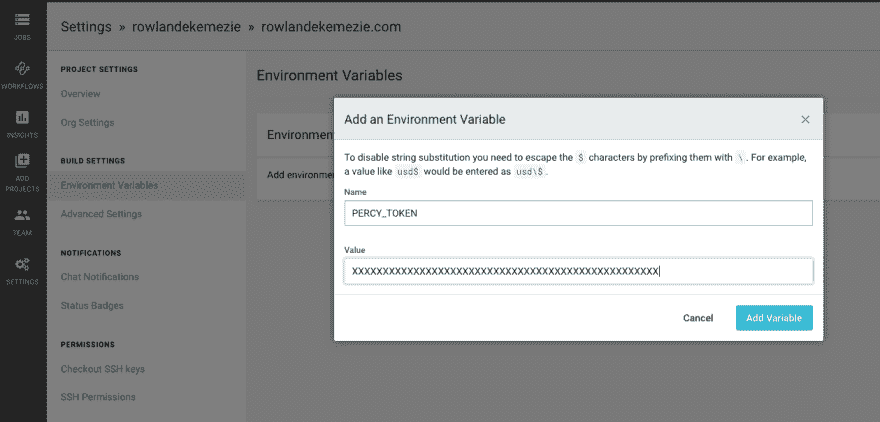](https://res.cloudinary.com/practicaldev/image/fetch/s--gNT32zKp--/c_limit%2Cf_auto%2Cfl_progressive%2Cq_auto%2Cw_880/https://thepracticaldev.s3.amazonaws.com/i/v9qdl3pi0g8i2dkvhqn8.png) 。

提交您的更改并再次推送到 master。

现在，我们可以前往 percy.io 查看构建创建的快照。

[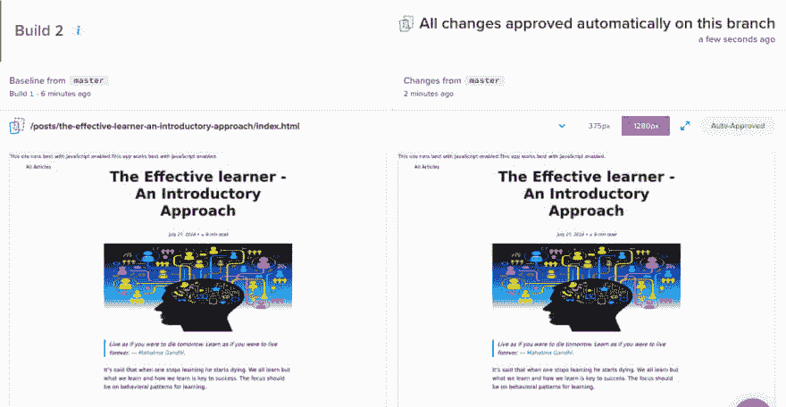](https://res.cloudinary.com/practicaldev/image/fetch/s--TjUl5U9Z--/c_limit%2Cf_auto%2Cfl_progressive%2Cq_auto%2Cw_880/https://thepracticaldev.s3.amazonaws.com/i/d6in6edb8h8zu0r2wf0n.png)

> Percy 自动检测到没有更改，因此，“所有更改在此分支上自动获得批准”。

### 将珀西连接到你的仓库

该设置的最后一部分是将 Percy 链接到我们的存储库，以便在每次构建后获得即时反馈。

在 Percy 上的项目设置中，点击*安装一个集成*并选择 *GitHub* 。
[](https://res.cloudinary.com/practicaldev/image/fetch/s--4b7j2ECy--/c_limit%2Cf_auto%2Cfl_progressive%2Cq_auto%2Cw_880/https://thepracticaldev.s3.amazonaws.com/i/1qdmwre64wgxrj84y44p.png)

给你...
选择要安装 Percy 的库，点击*安装*。

[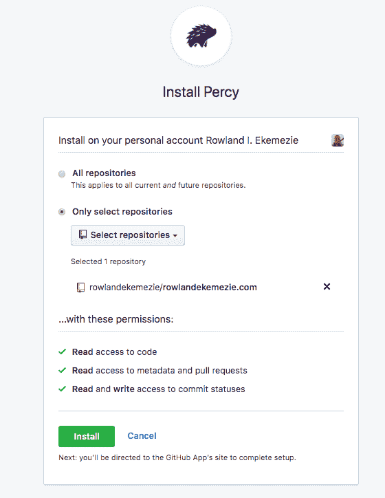](https://res.cloudinary.com/practicaldev/image/fetch/s--Ulf9t_sS--/c_limit%2Cf_auto%2Cfl_progressive%2Cq_auto%2Cw_880/https://thepracticaldev.s3.amazonaws.com/i/ci2w6fktwz4bnpnmiyv3.png)

启用源代码集成后，我们可以管理我们的拉式请求状态，在检测到可视更改时通知我们。它还提供了一个很好的界面来批准这些变更，并记录了批准拉取请求的人。

现在你可以选择资源库来链接到每个项目
[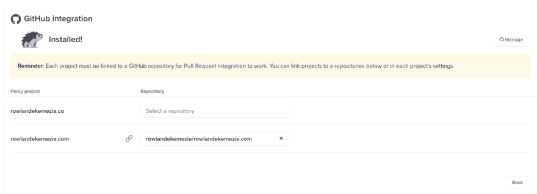](https://res.cloudinary.com/practicaldev/image/fetch/s--t0KFv7JH--/c_limit%2Cf_auto%2Cfl_progressive%2Cq_auto%2Cw_880/https://thepracticaldev.s3.amazonaws.com/i/vkfkmu2soos1cnvr7zxo.png)

### 端到端测试

现在，让我们一起测试一切。让我们创建一个测试分支，增加*/components/Post/Content/Content . module . scss*中内容标题的*字号*。提交更改并创建一个拉取请求。

```
......

.content {

  &__title {
    font-size: $typographic-base-font-size * 4; /* change font-size */
    max-width: $layout-post-width;
    ......
    ......
  } 
```

这是它奇妙的一部分。字体大小的改变带来了 15 种视觉上的巨大变化。

[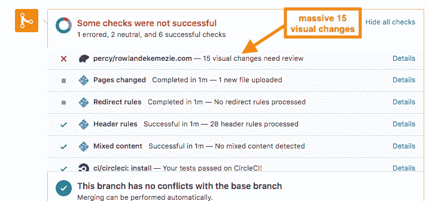](https://res.cloudinary.com/practicaldev/image/fetch/s--H7GG20Dd--/c_limit%2Cf_auto%2Cfl_progressive%2Cq_auto%2Cw_880/https://thepracticaldev.s3.amazonaws.com/i/p5npstvzj90dbm9vfu2i.png)

你可以点击详情直接带我们去珀西比较变化
[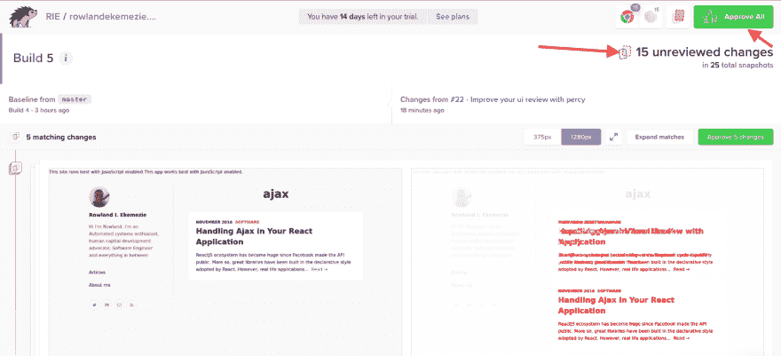](https://res.cloudinary.com/practicaldev/image/fetch/s--fMZagD6V--/c_limit%2Cf_auto%2Cfl_progressive%2Cq_auto%2Cw_880/https://thepracticaldev.s3.amazonaws.com/i/wch3zkhcjdta169ikvx0.png)

> 右栏的红色字体颜色仅显示受更改影响的 UI 区域。你可以点击它来查看实际的变化。

我们可以通过单击*批准所有*来批准这些更改，然后 boom 所有检查通过✅

[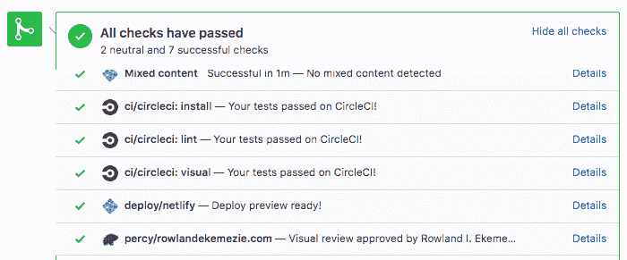](https://res.cloudinary.com/practicaldev/image/fetch/s--ltcVdvGA--/c_limit%2Cf_auto%2Cfl_progressive%2Cq_auto%2Cw_880/https://thepracticaldev.s3.amazonaws.com/i/ckfmo7ft0365xxc5o0us.png)

Percy 让您和您的团队能够满怀信心地审查和批准 UI 更改。您可以围绕它提供的功能构建工具。

#### 进一步阅读

*   [故事书的视觉测试](https://docs.percy.io/docs/storybook)。

*   [将珀西与赛普拉斯融合](https://docs.percy.io/docs/cypress)。

*   [将 percy 视觉测试集成到现有框架中](https://docs.percy.io/docs/build-your-own-sdk)。

*   [配置 webhook 事件](https://docs.percy.io/docs/webhooks)

*   [跨浏览器视觉测试](https://docs.percy.io/docs/cross-browser-visual-testing)

*   [反应视觉测试](https://docs.percy.io/docs/responsive-visual-testing)

> 本帖原载于[我的网站](https://rowlandekemezie.com/posts/improving-your-visual-review-with-percy/)。考虑订阅我的[时事通讯](https://tinyletter.com/rowland)获取更新。没有垃圾邮件！