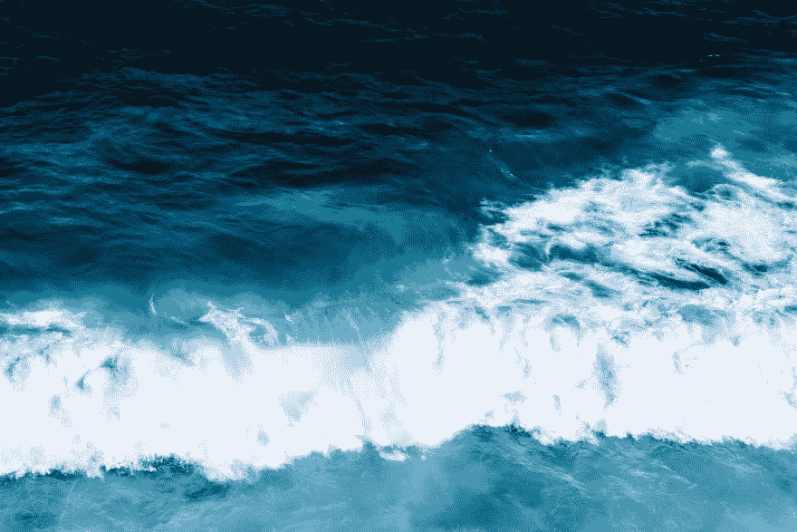

# 用 Gatsby-Image 和 React 挂钩制作幻灯片

> 原文：<https://dev.to/pr0x1ma/building-a-slideshow-with-gatsby-image-and-react-hooks-4ajf>

[](https://res.cloudinary.com/practicaldev/image/fetch/s--AOOpFEUc--/c_limit%2Cf_auto%2Cfl_progressive%2Cq_auto%2Cw_880/https://thepracticaldev.s3.amazonaws.com/i/nqv6f3v2zyfrwx9q18a5.jpg)

GatsbyJS 是我最近最喜欢的技术之一，它使前端开发再次变得令人愉快，但我最近遇到了一些限制(不是特定于 Gatsby)
，似乎[其他](https://spectrum.chat/gatsby-js/general/slideshow-with-gatsby-image~690e3aee-3f2a-4bb6-9acb-2dc2b903b243)也遇到了类似的问题。即利用
`gastbyjs`和`gatsby-image`构建幻灯片/轮播/多张图片。

> TLDR；我制作了一个懒惰加载图像的“幻灯片”,在[盖茨比幻灯片](https://gatsby-slides-cv2pxyejg.now.sh/)演示

免责声明:这是相当实验性和 hacky，我相当肯定它可以得到改善，批评是受欢迎的。

## 树立盖茨比和盖茨比形象

因为`gatsby`文档是**的，所以**做得很好，开始并建立一个基本项目是相当容易的。在您的终端上，键入

```
$ gatsby new gatsby-slide
$ cd gatsby-slide 
```

这将从一个 starter 模板创建一个新的 gatsby 项目(已经安装了`gatsby-image`),并在 gatsby 完成文件设置后更改目录。

现在，如果我们运行`npm start`并导航到 [localhost:8000](http://localhost:8000) ，我们应该会看到我们的 gatsby 站点启动并运行。

我们都准备好继续了！

## 查询多张图像

幸运的是，该模板已经包含了查询图像的代码，如下所示

```
//src/image.js

const Image = () => (
  <StaticQuery
    query={graphql`
      query {
        placeholder: file(relativePath: { eq: "gatsby-logo.png" }) {
          childImageSharp {
            fluid(maxWidth: 300) {
              ...GatsbyImageSharpFluid
            }
          }
        }
      }
    `}
    render={data => }
  />
) 
```

这将找到图像`gatsby-logo.png`并装载它的
片段`GatsbyImageSharp`，点击阅读更多关于片段和`gatsby-image` [的内容。但是我们如何使用这个来查询多个图像呢？前几天我在阅读时偶然发现了这个 lil gem，感谢](https://www.gatsbyjs.org/packages/gatsby-image/) [Kent C. Dodds](https://github.com/kentcdodds/kentcdodds.com/blob/master/src/components/testing-cta.js#L75) 写了它。

```
graphql`
  query {
    allFile(
      sort: { fields: name, order: DESC }
      filter: { relativeDirectory: { eq: "slides" } }
    ) {
      edges {
        node {
          id
          name
          childImageSharp {
            fluid(maxWidth: 600) {
              ...GatsbyImageSharpFluid_withWebp_tracedSVG
            }
          }
        }
      }
    }
  } 
```

现在我们有了获取多个文件的查询，让我们继续用好的 ol 钩子把它连接起来。

```
import { useStaticQuery, graphql } from 'gatsby'

function SlideShow() {
  const [index, setIndex] = useState(0)
  const { allFile } = useStaticQuery(
    graphql`
      query {
        allFile(
          sort: { fields: name, order: DESC }
          filter: { relativeDirectory: { eq: "slides" } }
        ) {
          edges {
            node {
              id
              name
              childImageSharp {
                fluid(maxWidth: 600) {
                  ...GatsbyImageSharpFluid_withWebp_tracedSVG
                }
              }
            }
          }
        }
      }
    `
  )
  //Minus 1 for array offset from 0
  const length = allFile.edges.length - 1
  const handleNext = () =>
    index === length ? setIndex(0) : setIndex(index + 1)
  const handlePrevious = () =>
    index === 0 ? setIndex(length) : setIndex(index - 1)
  const { node } = allFile.edges[index]
  return (
    <div>
      <div>
        
      </div>
      <div>
        <button onClick={() => handlePrevious()}>Previous</button>
        <button onClick={() => handleNext()}>Next</button>
      </div>
    </div>
  )
} 
```

一些额外的逻辑来处理下一张和上一张幻灯片，但总的来说还是一个简单的例子。

## 结论

通过 [React Hooks](https://reactjs.org/docs/hooks-intro.html) 和 graphql 的神秘力量，我们可以`useStaticQuery` hook 以及
在我们的`allFiles`上指定一个过滤器进行查询，以获取`slides`文件夹中的所有图像(幻灯片的所有图像都在那里，duh Jordan)。结果相当不错，请看演示[盖茨比幻灯片](https://gatsby-slides-cv2pxyejg.now.sh/)。

> 你对这个感兴趣吗？[前往 jordnjones.com](https://jordnjones.com/16-04-2019-Gatsby-and-Hooks/)了解更多信息！