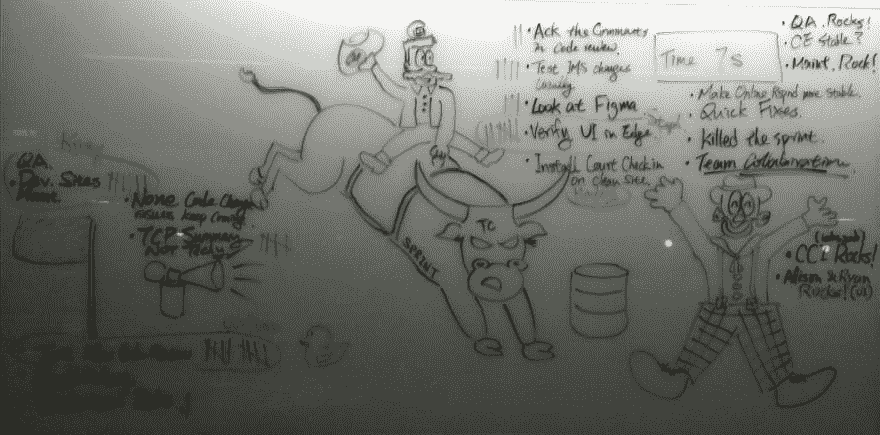

# 促成迷人回顾展的 8 个步骤

> 原文：<https://dev.to/allenheltondev/8-steps-to-facilitating-a-captivating-retrospective-53ij>

回顾会一直是敏捷世界的红发继子。对于许多团队来说，它经常被当作事后的想法，甚至被完全忽略，这是一个悲剧，因为回顾是你建立一个高效团队的最有力的工具之一。

回顾是有益的，因为它们确保团队在整体愿景和目标上保持一致，让所有团队成员了解情况，并提高对好的或坏的 sprint 的认识。今天，我们将讨论如何促进迷人的复古，帮助你吸引人们的注意力，并为你可能有的任何问题提供诚实的答案。

## 1。有破冰船吗

作为会议中经常被忽视的部分，破冰对于让人们参与进来至关重要。破冰的目的是让每个人至少说一次话。如果有人在会议上发言一次，他们很可能会再次发言。

尽早打破僵局会让你获得成功回顾所需的参与度。在我的团队里，我们有一个人走到黑板前画一幅画。当这个人画图时，团队中的其他人尽可能地起哄。它让团队成员开怀大笑，并通过共享的体验建立联系。当然，每个人都知道这是很好的幽默，所以在尝试之前确保你有一个亲密的团队。

其他容易打破僵局的例子包括:

*   这个周末你在做什么？
*   你最喜欢什么…(颜色、动物、度假地点等。一定要改起来)
*   你认为……怎么样？(插入电影、电视节目、学校戏剧、当地街头艺人)
*   玩一个简短的游戏(猜字谜、禁忌、猜字谜)

这里的想法是让人们开始交谈，让他们心情愉快。他们在开始时越舒服，你在复古过程中得到的反馈就越真实。

## 2。专注地去做

并非所有的回顾都是平等的。你可以也应该根据潜在的动机来安排会议。你有一个新的团队或者正在尝试改变工作流程吗？关注过程。你的团队成员是否开始偏离指导方针或自行其是？关注团队目标和愿景。团队是否一直达不到冲刺目标？关注你能做些什么来调整承诺或提高绩效。

带着一个焦点进去将有助于自然地引导会议的流程。促成一次有重点的回顾会让参与者思考相关的细节，并最终引出你所寻找的答案和观点。通过关注过程、目标和愿景，或者调整承诺，你将能够在你的主题中选择合适的话题。

## 3。有主题

任何人都可以有一个成功的回顾展。但是在一次又一次的冲刺中保持高效率需要技巧。围绕回顾会建立一个积极的名声会让你的团队成员对一次又一次的参与和贡献感到兴奋。保持复古趣味和新鲜感的最好方法之一就是变换主题。主题指的是你的团队将要演讲的类别。使用我们在不同重点领域的示例，我们可以看到一些适用的主题:

*   关注流程变革
    *   开始:在下一次冲刺中开始不同的事情，让事情变得更容易
    *   **停止**:在这次冲刺中，团队应该停止前进的是什么
    *   **继续**:团队应该继续做哪些进展顺利的事情
*   关注目标和愿景
    *   从在黑板上写下团队的总体目标开始
    *   使能因素:是什么让团队轻松实现他们的目标
    *   **阻碍者**:是什么每天都阻碍着团队实现他们的目标
    *   阻碍者:最近导致问题的暂时分心是什么
    *   **想法**:团队可以尝试哪些新事物来更容易地实现他们的目标
*   专注于调整承诺和提高绩效
    *   **Mad** :抑制冲刺的可避免的事情是什么
    *   悲伤:抑制冲刺的不可避免的事情是什么
    *   **高兴**:哪些事情有助于团队实现冲刺目标

主题可以让你随心所欲地发挥创造力。以上几点只是指导方针。当我进行回顾时，我将这些点伪装成《破冰船》中的元素。例如，我最近举办了一个主题为“提高绩效”的牛仔竞技回顾会。我让人画了一个骑着公牛的牛仔，一边是小丑和桶，另一边是喇叭和红旗。骑着公牛的牛仔代表团队和冲刺，小丑和桶代表帮助团队向冲刺目标前进的事物，而喇叭和红旗代表抑制冲刺的事物。当团队成员有东西要分享时，他们会说“我有一面红旗……”然后我们会把它写在图片旁边的黑板上。

## 4。变得具体

作为一名辅导员，你最重要的目标之一是将可操作的项目写在黑板上。要做到这一点，你必须从参与者那里获得细节。说“我们在两个故事上受阻”并不足以成为一个行动项目。在本例中，作为主持人，您将提出类似“我们能够解除对它们的封锁吗”、“是什么导致它们被封锁的”和“我们知道下次如何避免这种情况吗？”这些问题的答案都可以放在黑板上。

*   我们能让他们解除封锁吗——“是的，约翰解决了问题，并告诉我哪里出了问题”——把它放在**高兴**下面
*   是什么导致了它们被阻塞——“一个测试环境因为一个修复程序的实施而崩溃”——把它放在 **mad** 下
*   我们知道下一次如何避免这种情况吗——“是的，我们被教导如何在本地测试这些类型的变化，所以我们不必修补测试环境”——把它放在**高兴**下面

所以，你看到了模糊的“我们在两个故事上受阻”是如何变成两个值得高兴的事情，以及一个可操作的项目来防止下一次的事情。

## 5。填补空白

如果你开始注意到一个专栏得到的反馈明显比其他的多，不要害怕把焦点放在别的事情上。如果没有人有任何障碍，花几分钟时间和他们一起把东西放进去。有时候，人们只需要一个例子就可以开始行动。作为主持人，如果你能想到可以填补黑板空白的东西，那就去做吧！

尽你所能让对话达到平衡。正如我们刚刚从第 4 步中了解到的，您可以提出引导性问题来获取信息以填写一个列。试着引导他们从不同的角度思考问题。换一种说法，成为一个阻碍者，一个推动者，或者为某事疯狂是什么意思。

打电话给有一段时间没说话的人。无论发生什么，总有一个人拒绝说话。拜访他们。确保他们的声音被听到。记住谁最近给了一些反馈，谁没有给。通过拜访那些已经有一段时间没有提供任何东西的人来保持平衡。

除了保持董事会的平衡，你还想保持房间里的反馈平衡。不要让一个人带动所有内容。你是在为一个团队而不是个人进行回顾。

## 6。为重要项目投票

一旦你把团队的所有要点都写在黑板上，就该进入*点投票*了。点投票是团队中的每个人都有三张选票来选择他们认为最重要的项目。一个人可以投三个不同的东西，也可以投同一个东西两三次。你可以用几种不同的方式进行点投票，这取决于你的团队如何最好地运作。

对于我的团队的回顾，我们在房间里走来走去，每个人说他们想在哪里投他们的票。如果你更喜欢“无记名投票”的方式，团队可以在一张纸上写下他们的投票，主持人可以用这种方式进行统计。第三种选择是让整个团队立刻走到黑板前，在他们投票的项目旁边贴上便利贴。在会议的最后部分，这可能是一种为团队重新注入活力的有趣方式。

## 7。创建行动项目

当投票完成时，在黑板上取三个投票最多的项目，并把它们变成行动项目。如果你写下每件事时足够具体，这一步应该很容易。你知道团队认为什么是最重要的工作或解决的事情，它应该已经是一个可操作的格式。

定义行动项目后，将其分配给团队中的某个人。此人负责完成行动项目。他们不一定要执行相关的任务，但他们有责任确保任务完成。例如，如果委员会说“用户故事没有明确的用户接受标准”，那么行动项可以是“向用户故事添加特定的 UAC 以防止歧义”然而，行动项目并不一定要分配给 BA 或任何为你写故事的人。可以分配给任何人。如果 QA 被分配了这个行动项目，他们负责确保 BA 将特定的 UAC 添加到故事中。因此，QA 可以深入到故事中，找出任何需要更多工作的内容，并将它们发送回 BA。

在下一次回顾开始时，团队应该回顾上一次 sprint 的行动项目，并讨论结果。如果一个行动项目没有完成，除了你的三个新项目之外，它还可以延续到下一个冲刺阶段。

## 8。记录一切

记录一切是回顾的一个重要部分。它可以让你看到团队正在经历的困难，或者团队认为他们做得特别好的事情的趋势。如果你正在尝试定义一个新的过程，这是一个很好的工具，可以回头看看你已经尝试了什么，以及团队是怎么想的。这也是在整个冲刺阶段跟踪行动项目的好方法。将你的文档放在云中或网页上，这样整个团队都可以访问它。

让一个记录员记录正在进行的回顾，这样，如果主持人错过了在板上写东西，它可以被电子记录下来，不会在翻译中丢失。另外，如果你像我的团队一样画这些画，回去看看这些美妙的艺术品会很有趣。

## 结论

回顾会议很难学，但很容易掌握。一旦你找到了你团队的最佳状态，就很容易从他们那里得到你想要的信息。参与是复古成功的关键，所以要确保每个人都乐意参与。以一个有趣的练习或笑话开始，让团队成员开怀大笑，准备开始讨论。当有人做出贡献时，提取每一点细节，让他们尽可能的具体。不要害怕停顿，有时候沉默会给人一个思考新事物的机会。给团队一个投票的机会，表达他们对团队运作方式的关注。让人们对行动项目负责。记下所有内容，这次会议的唯一目的是收集信息，所以每一条都很重要。

我希望你在下一次回顾中尝试上面的一些技巧。如果做得好，回顾可以成为团队在每次冲刺结束时期待的有趣练习。让我知道你的想法，你试过上面的任何一个步骤吗？你的团队做得特别好的是什么？