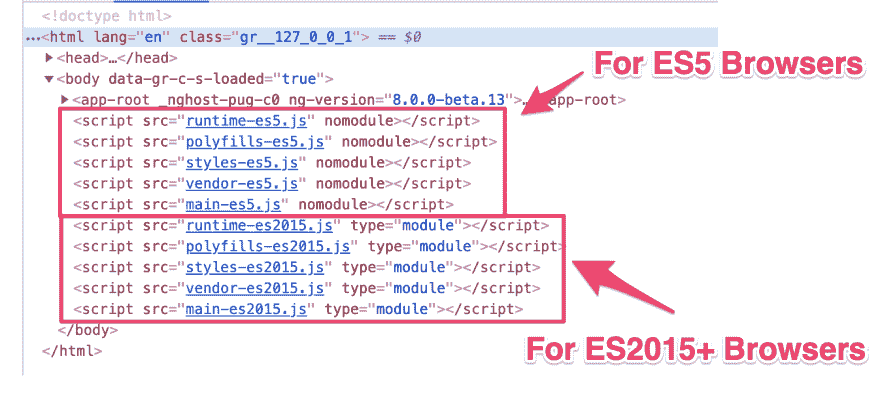

# “差异加载”Angular CLI v8 的新功能

> 原文：<https://dev.to/lacolaco/differential-loading-a-new-feature-of-angular-cli-v8-4jl>

## TL；速度三角形定位法(dead reckoning)

*   Angular CLI 了解浏览器支持的范围从`browserslist`配置。
*   如果应用程序需要支持 es5 浏览器，并且 TypeScript 目标高于 ES5，CLI 会自动生成额外的包以实现兼容性。
*   `browserslist`是真理的唯一来源，因此`es5BrowserSupport`将被弃用。

* * *

Angular CLI v8(现在在**beta 15**中)搭载了名为**“差动加载”**的新功能。它允许我们不用考虑你的应用程序的浏览器兼容性。

CLI 可以理解应用程序需要支持的浏览器，并可以为 ES5 浏览器和非 ES5 浏览器制作不同的包。

## 如何使用

要启用差异加载，应用程序必须具有`browserslist`配置。它可以放在`package.json`或`browserslist`文件中。此配置已被 postcss 的 autoprefixer 进程使用。CLI 最近创建的应用程序应该包含它，您可以在项目中找到它。

[浏览器列表/浏览器列表](https://github.com/browserslist/browserslist)

即使你现在没有，也可以用[在线演示](https://browserl.ist/?q=%3E+0.5%25%2C+last+2+versions%2C+Firefox+ESR%2C+not+dead%2C+not+IE+9-11%2C+not+Chrome+41)轻松创作。如果`browserslist`文件与`package.json`放在同一个目录下，Angular CLI 可以查找。

准备结束！如果你的 tsconfig 的目标在`browserslist`确定的浏览器范围之外，Angular CLI 会分离 bundles 一个用于原始目标，另一个用于 **ES5 浏览器**。

比如让我们支持 Chrome 和 IE 11 的最新 2 个版本。`browserslist`是以下；

```
last 2 Chrome versions, IE 11 
```

而`tsconfig.json`如下图。

```
{
  "compilerOptions": {
    "target": "es2015",
        ...
  }
} 
```

你可能知道，IE11 是一个 ES5 浏览器。因此，如果没有差异加载，这个应用程序将在 IE11 上抛出错误，因为缺少箭头函数、`class`等`es2015`特性...

有了差动加载， **Angular CLI 提前了解这个问题**。CLI 判断应用程序是否必须支持 ES5 浏览器，并检查当前 tsconfig 的目标是否可以支持它们。
如果它们不匹配，所有的束就像`main-es5.bundle.js`和`main-es2015.bundle.js`一样被分开。

然后，将 ES5 包的`<script>`标签与`nomodule`属性放在一起。它避免了在非 ES5 浏览器上加载 ES5 包。因此，在现代浏览器上，**用户将加载浏览器需要的更小的包**。它可以提高装载性能。

[](https://res.cloudinary.com/practicaldev/image/fetch/s--Opk1JGHj--/c_limit%2Cf_auto%2Cfl_progressive%2Cq_auto%2Cw_880/https://thepracticaldev.s3.amazonaws.com/i/7hbyinyypnhlfmrvemnc.png)

## `es5BrowserSupport`选项怎么样？

是的，Angular CLI v7.3 添加了一个类似于差异加载的功能，但它仅适用于聚合填充。它使用了`angular.json`中的`es5BrowserSupport`选项。

[你不知道的 5 个 Angular CLI 特性](https://blog.mgechev.com/2019/02/06/5-angular-cli-features/)

在 Angular CLI v8 之后，**将被弃用**，因为在 CSS 的`browserslist`和 JavaScript 的`es5BrowserSupport`中管理支持浏览器并不简单。所以 CLI 团队采用`browserslist`作为判断应用程序是否需要支持 ES5 浏览器的唯一来源。

## 结论

*   差异加载已在 Angular CLI v8 beta 中着陆。
*   CLI 使用`browserslist`来判断应用程序需要支持 ES5 浏览器。
*   如果 tsconfig 不匹配，CLI 会添加只由 ES5 浏览器加载的不同包。

为了尝试这个特性，让我们用下面的命令创建一个应用程序；

```
$ npx @angular/cli@next new example-app
$ cd example-app
$ npm run build 
```

感谢阅读！