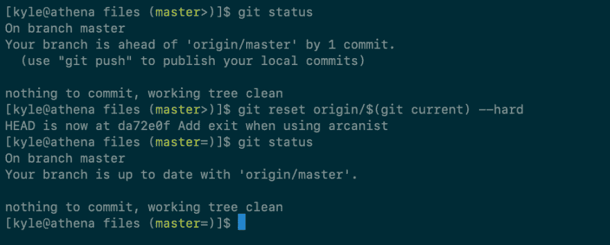

# git 电流

> 原文：<https://dev.to/chilcutt/git-current-15g0>

作为一个狂热的用户，我对使用鼠标/触控板做任何事情都有一种奇怪的厌恶——尤其是在命令行上。我注意到我经常做的一件事是运行 git branch 或 git status 来查看我在哪个分支上，以便在另一个命令中使用分支名称。我不喜欢那样。

**TL；创建一个 git 别名来查看你当前的分支:** 

```
$ git config alias.current "rev-parse --abbrev-ref HEAD"
$ git current # displays the current branch 
```

别名命令打印您当前所在的分支到`STDOUT`:

[](https://res.cloudinary.com/practicaldev/image/fetch/s--BzXdaIjb--/c_limit%2Cf_auto%2Cfl_progressive%2Cq_auto%2Cw_880/https://cdn-images-1.medium.com/max/2000/1%2AQvA9ubVXTQwsUIPmiI6hNA.png)

一旦创建了别名，我们可以更简单地完成这项工作:

[](https://res.cloudinary.com/practicaldev/image/fetch/s--Dkm4FLk7--/c_limit%2Cf_auto%2Cfl_progressive%2Cq_auto%2Cw_880/https://cdn-images-1.medium.com/max/2000/1%2AfK9Yii2QMsIDjsASz5FdOQ.png)

该命令的真正魅力在于当您使用它来编写另一个 shell 命令时。假设我将要进行一些复杂且有潜在危险的操作，我想创建一个备份分支，因为如果可以避免的话，我不喜欢搜索引用列表。我现在可以轻松地基于相同的名称创建一个备份分支:

<figure>[](https://res.cloudinary.com/practicaldev/image/fetch/s--C1NRucPC--/c_limit%2Cf_auto%2Cfl_progressive%2Cq_auto%2Cw_880/https://cdn-images-1.medium.com/max/2000/1%2Alj8i1we_cR5hvOCh_4pZ4g.png) 

<figcaption>有用在比较复杂的情况下的基地分支名称...</figcaption>

</figure>

或者如果我意识到我走错了路，需要重新开始:

[](https://res.cloudinary.com/practicaldev/image/fetch/s--T1Br8R_Q--/c_limit%2Cf_auto%2Cfl_progressive%2Cq_auto%2Cw_880/https://cdn-images-1.medium.com/max/2000/1%2ASzFFqSLxTPJB43EF2hp3UA.png)

* * *

懒惰有时会激发一些小技巧/窍门/窍门的酷点子，让工作变得更愉快。你最喜欢的是什么？