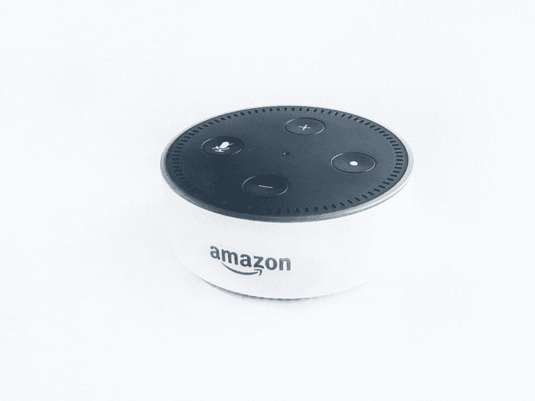
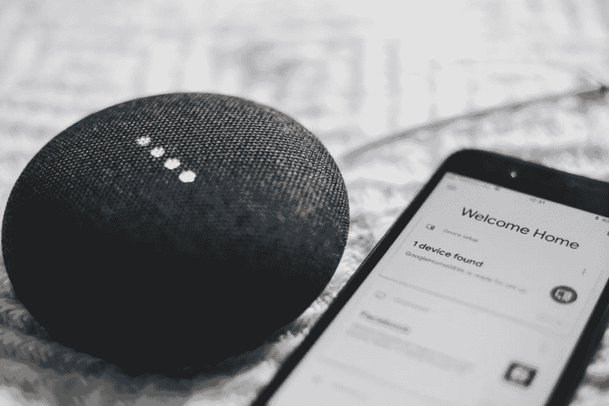

# 在浏览器中采集“唤醒词”的音频

> 原文：<https://dev.to/ibmdeveloper/capturing-audio-in-the-browser-for-wake-words-345k>

#### 使用 Watson 语音转文本、助手和媒体流录制 API 进行基于浏览器的唤醒词演示

我知道你在想什么。“Amara，如果你在浏览器中工作，你为什么不直接安装 npm 为基于节点的应用程序提供的 6+个不同的软件包中的一个？”因为我不想搞得更乱，我需要指定音频格式。我需要感觉舒服。

所以现在你知道这不是一个“如何 npm 安装我最喜欢的音频包”让我们来设置场景。

<figure>[](https://res.cloudinary.com/practicaldev/image/fetch/s--I9ZSSijn--/c_limit%2Cf_auto%2Cfl_progressive%2Cq_auto%2Cw_880/https://cdn-images-1.medium.com/max/1000/0%2AJNA5QcV6Z8uRyyDk) 

<figcaption>黑白亚马逊回声点—图片由 [Rahul Chakraborty](https://unsplash.com/photos/nGzvZe1iWOY?utm_source=unsplash&utm_medium=referral&utm_content=creditCopyText) 上传 [Unsplash](https://unsplash.com/search/photos/alexa?utm_source=unsplash&utm_medium=referral&utm_content=creditCopyText)</figcaption>

</figure>

### 醒字用例

对于主流用户来说，个人助理设备是语音转文本技术的主要用例之一，不包括屏幕阅读器等辅助工具。“唤醒词”让设备处理他们听到的内容，如“嘿谷歌”或“Alexa”，如果连接已经建立，通常会将其发送到云。Watson Speech to Text 的用法有些类似，这取决于您如何编写您的客户端应用程序。

请注意，这种功能被设计为“一直监听”，只是在听到“沃森”时才向云端发送特定命令。出于测试目的，我实现了 html 按钮来启动和停止音频数据向云的传输，因为没有人希望看到我在编码时咒骂的日志。

虽然我不会提供一个完整的教程级别的帖子，但我们正在努力发布一个更干净的实现，如果你想用沃森语音到文本来构建类似的东西。

<figure>[](https://res.cloudinary.com/practicaldev/image/fetch/s--CgeceFiJ--/c_limit%2Cf_auto%2Cfl_progressive%2Cq_auto%2Cw_880/https://cdn-images-1.medium.com/max/1000/0%2AT2PCC4l0ZlQWr4N5) 

<figcaption>打开木炭的 Google Home Mini 和智能手机—照片由 [BENCE BOROS](https://unsplash.com/photos/anapPhJFRhM?utm_source=unsplash&utm_medium=referral&utm_content=creditCopyText) 在 [Unsplash](https://unsplash.com/search/photos/google-home?utm_source=unsplash&utm_medium=referral&utm_content=creditCopyText)</figcaption>

</figure>

### (通过浏览器)处理音频

我不是声音工程师，但我最近一直从事语音到文本的工作，所以我知道编码和音频格式可以决定语音服务的准确性和性能。我知道我想要非常灵活的东西，清楚地向我显示我正在使用的音频格式，以确保我可以传递一个服务可以接受的格式。我看了几个 npm 包，但不喜欢我看到的那些包的灵活性。

我做了一些搜索，发现了 MDN 和网络音频 API。我找到了几个关于 [ScriptProcessorNode](https://developer.mozilla.org/en-US/docs/Web/API/ScriptProcessorNode) 的例子和样本代码，这是一个被否决的特性，它将我指向了 [AudioWorklet](https://webaudio.github.io/web-audio-api/#audioworklet) 。这让我置身于 W3C 编辑的 Audio API 草稿中，它看起来像一本令人生畏的大学教科书，但却是在线的和巨大的。立即逃离了那个。

不知何故，我使用了 [MediaStream 录制 API](https://developer.mozilla.org/en-US/docs/Web/API/MediaStream_Recording_API) ，它在浏览器捕获中提供了音频和视频，并且没有被弃用(耶！).文档中的一个[样本应用](https://developer.mozilla.org/en-US/docs/Web/API/MediaStream_Recording_API/Using_the_MediaStream_Recording_API)比 AudioWorklet 文档更令人鼓舞。

有了这些知识，我开始在 Node.JS 中寻找模式。

### 破解出一个图案

我想在现有模式的基础上构建一个新的界面，这样我就不需要在 Watson Assistant 中构建新的界面或对话框，这一点做得很好，因为它是一个节点。从基于 JS 的应用程序开始。

#### Index.html

从 index.html 开始，我添加了一些按钮，就像我前面提到的那样，所以当我调试这段代码时，没有人会听到我在咒骂。这些按钮可以放在任何地方，但是我把它们放在了 scrollingChat div 中。

```
<button class="button" onclick="Api.micCue()">Start</button>
<button class="button" onclick="Api.micStop()">Stop</button> 
```

Enter fullscreen mode Exit fullscreen mode

就像现在一样，它们不会被设计，但它们会帮助提示和停止麦克风，所以我不会冒险在你设置的时候把所有东西都录下来并发送给 Watson。

#### Api.js

在 api.js 的顶部，我添加了一个语音到文本识别的端点和一个全局 mediaRecorder 变量。

```
var sttEndpoint = '/api/recognize';
var mediaRecorder; 
```

Enter fullscreen mode Exit fullscreen mode

如果您在家里遵循，请确保将您的新方法 micCue()和 micStop()定义为可公开访问的。

```
// Publicly accessible methods defined
  return {
    sendRequest: sendRequest,
    micCue: micCue,
    micStop: micStop,

    // The request/response getters/setters are defined here to prevent internal methods
    // from calling the methods without any of the callbacks that are added elsewhere.
    getRequestPayload: function() {
      return requestPayload;
    },
    setRequestPayload: function(newPayloadStr) {
      requestPayload = JSON.parse(newPayloadStr);
    },
    getResponsePayload: function() {
      return responsePayload;
    },
    setResponsePayload: function(newPayloadStr) {
      responsePayload = JSON.parse(newPayloadStr);
    }
  }; 
```

Enter fullscreen mode Exit fullscreen mode

接下来，让我们创建我们的 micStop()方法。实际上，我们只需要调用 mediaRecorder.stop()，但是您可能希望包括一些调试信息，比如 mimeType，我知道我已经这样做了。

```
function micStop() {
    mediaRecorder.stop();
    console.log("recorder stopped");
    console.log(mediaRecorder.mimeType);
  }; 
```

Enter fullscreen mode Exit fullscreen mode

我不确定浏览器会给我什么样的 mimeType(我通常在 Chrome 上运行开发，然后在 Firefox 上测试)，所以在控制台上有一点信息是很重要的，以防每个浏览器决定给我不同的格式。面向未来，你知道吗？

下一个方法 micCue()稍微复杂一点。

```
function micCue(){
    console.log("micCue hit");

    var audioCtx = new (window.AudioContext || webkitAudioContext)();

    if (navigator.mediaDevices.getUserMedia) {
      console.log('getUserMedia supported.');

      var constraints = { audio: true };
      var chunks = [];

      var onSuccess = function(stream) {
      mediaRecorder = new MediaRecorder(stream);
      mediaRecorder.start(3000);
      console.log(mediaRecorder.state);
      console.log("recorder started");

      mediaRecorder.onstop = function(e) {
        var blob = new Blob(chunks, { 'type' : 'audio/webm; codecs=opus' });

      // Built http request
      var http = new XMLHttpRequest();
      http.open('POST', sttEndpoint, true);
      http.setRequestHeader('Content-type', 'audio/webm;codecs=opus');
      http.onreadystatechange = function() {
        if (http.readyState === 4 && http.status === 200 && http.responseText) {
          Api.setResponsePayload(http.responseText);
        }
      };

      // Send request
      http.send(blob);
      chunks = [];
      };

      mediaRecorder.ondataavailable = function(e) {
        chunks.push(e.data);
      };

    };

    var onError = function(err) {
      console.log('The following error occured: ' + err);
    }

    navigator.mediaDevices.getUserMedia(constraints).then(onSuccess, onError);

    } else {
      console.log('getUserMedia not supported on your browser!');
    }

  }; 
```

Enter fullscreen mode Exit fullscreen mode

这里发生了很多事情。我们需要确保我们的浏览器能够捕捉媒体，在这种情况下是音频。

我还通过给 mediaRecorder.start()一个参数来设置应用程序只捕获一定量的音频。在这种情况下，我用了 3 秒钟 3000，因为我们基于这种模式中的对话假设了短命令。

确保 blobs 和 http 请求都为 audio/webm 设置是很重要的；编解码器=opus，因为它与您的浏览器正在收集的音频类型兼容(惊喜！)以及华生语音转文字会接受什么。[查看文档](https://cloud.ibm.com/docs/services/speech-to-text/audio-formats.html)了解更多关于可接受的音频格式和编码类型的信息。

最后，我们需要修改 sendRequest 方法。这主要是为了用户界面，所以你可以输入一条消息，得到和音频一样的唤醒词行为，这是我的大脑在测试时保持理智所需要的。在后端，一切都是基于文本的分析。

```
// Send a message request to the server
  function sendRequest(text, context) {
    // Build request payload
    var payloadToWatson = {};
    if (text) {

      if(text.search("Watson") == 0 || text.search("watson") == 0){
        text = text.replace("Watson", "");
        console.log("? " + text);

        payloadToWatson.input = {
          text: text
        };

      if (context) {
        payloadToWatson.context = context;
      }

      // Built http request
      var http = new XMLHttpRequest();
      http.open('POST', messageEndpoint, true);
      http.setRequestHeader('Content-type', 'application/json');
      http.onreadystatechange = function() {
        if (http.readyState === 4 && http.status === 200 && http.responseText) {
          Api.setResponsePayload(http.responseText);
        }
      };

      var params = JSON.stringify(payloadToWatson);
      // Stored in variable (publicly visible through Api.getRequestPayload)
      // to be used throughout the application
      if (Object.getOwnPropertyNames(payloadToWatson).length !== 0) {
        Api.setRequestPayload(params);
      }

      // Send request
      http.send(params);

    } else {
      text = null;
      console.log("No Wake Word detected");
    }
  }
} 
```

Enter fullscreen mode Exit fullscreen mode

#### App.js

请确保包含您的语音转文本凭据，因为如果您将它们留在 app.js 中，它们将以纯文本形式显示。部署应用程序时，您应该使用环境变量。

照我说的做，不要照我要做的做。

```
const speechToText = new watson.SpeechToTextV1({
  username: '{username}',
  password: '{password}'
}); 
```

Enter fullscreen mode Exit fullscreen mode

我们需要定义将从客户端调用的端点。我们将在这里处理语音转文本和识别方法的所有参数。

请确保内容类型与从浏览器中捕获的内容相匹配，并且与语音到文本服务兼容。我说不完，因为这件事困扰了我好几天。

此示例使用美国宽带模型，但也有其他模型。[查看文档](https://cloud.ibm.com/docs/services/speech-to-text?topic=speech-to-text-models#models)了解更多信息。

```
//endpoint to be called from client side
app.post('/api/recognize', function(req, res) {

  var recognizeParams = {
    audio: req,
    objectMode: true,
    content\_type: 'audio/webm;codecs=opus',
    model: 'en-US\_BroadbandModel',
  };

  speechToText.recognize(recognizeParams, function(error, speechRecognitionResults) {
    var inputText = {};

    if (error) {
      console.log(error);
    } else {
      var receivedText = speechRecognitionResults.results[0].alternatives[0].transcript;
      console.log(JSON.stringify(speechRecognitionResults.results[0].alternatives[0].transcript, null, 2));

      if (receivedText){
        if(receivedText.search("Watson") == 0 || receivedText.search("watson") == 0){
          receivedText = receivedText.replace("Watson", "");
          inputText = {
            text: receivedText
          };
        } else {
          console.log("You didn't say the magic word. Empty message sent to Watson");
        }
      }

      var payload = {
        workspace\_id: workspaceID,
        context: req.body.context || {},
        input: inputText || {}
      };

      // Send the input to the conversation service
      conversation.message(payload, function(err, data) {
        if (err) {
          return res.status(err.code || 500).json(err);
        }
        return res.json(updateMessage(payload, data));
      });
    }
  });

}); 
```

Enter fullscreen mode Exit fullscreen mode

在识别方法中，我们需要处理消息的构建，并确保它包含唤醒词——“Watson”。这是实际发送给助理服务的内容，但我们需要先检查唤醒词。

请记住，如果您向 Watson 发送一条没有上下文的空消息，它仍然会用欢迎节点进行响应，这就是服务的工作方式，这也让我有点困惑。

<figure>[](https://res.cloudinary.com/practicaldev/image/fetch/s--fsZw-y24--/c_limit%2Cf_auto%2Cfl_progressive%2Cq_66%2Cw_880/https://cdn-images-1.medium.com/max/640/1%2AMATz0KH9x_qD3JysYbySWg.gif) 

<figcaption>带唤醒词的 app 打字演示</figcaption>

</figure>

### 包装完毕

这真的是一个丑陋的实现吗？绝对的。这是否在功能上向您展示了在带有音频和文本的浏览器中使用唤醒词？绝对的！

我没有把它打包成一个完整的回购协议，但是这里有一个[链接，又是一个](http://ibm.biz/BdzRad)链接，链接到我攻击的模式。希望我提供的步骤和片段对你来说足够简单，如果你想自己构建这个小混乱的话。当然还要在此基础上有所改进！

我的同事发表了一个稍微不同的观点，如果你喜欢一些不太基于浏览器的东西，这个观点也适用于终端——看看教程。

你对基于浏览器的唤醒词感兴趣吗？你正在构建一个可以在浏览器中捕获音频的东西吗？你是怎么做到的？下面让我知道！