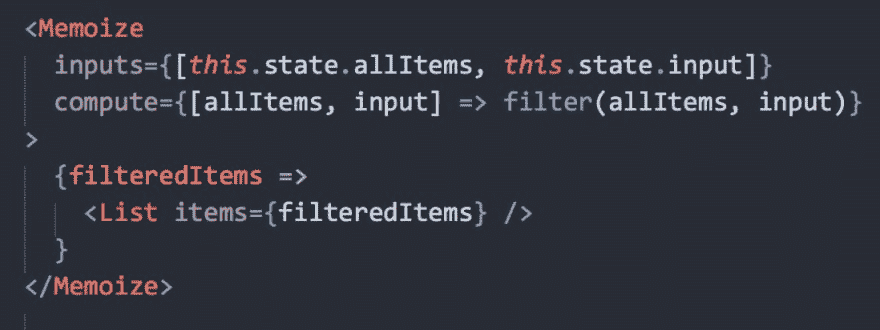

# 我如何编写世界上最快的记忆库

> 原文：<https://dev.to/thekashey/how-i-wrote-the-world-s-fastest-memoization-library-34io>

有如此多的记忆库，以至于已经很难将它们全部记忆并找到最快的一个。不开玩笑，昨天的记忆库的一半明天会更快，所以，如果你正在寻找最好的，选择一个并不容易。

但是速度不是你需要的。所以我又写了一个库，速度不快。都是因为一件事...

> 所以，我为什么又写了一个？为什么现有的没有...不是什么？

# 备忘录

这是减少或完全跳过不必要计算的常见模式。工作非常简单——

> 你有一个函数。你用一些参数调用 than 函数。下一次你做同样的事情——只是重复使用已知的结果。因为😉你拿到了。

所有的图书馆都做得很好。唯一的区别是 1)它们如何处理函数 arity(参数的数量)，2)它们可以存储多少结果，3)它们的速度有多快。

默认情况下，`lodash.memoize`只“看到”第一个参数，`memoizerific`使用 ES5 `Maps`来存储数据，而`fast-memoize` *使用 stringifies* 来存储所有参数，并使用 JSON 作为缓存键。

速度也不一样。`Ramda`比没有记忆的代码**快 100 倍**，`lodash`比`ramda`快 100 倍**，`nano-memoize` **比`lodash`快 100 倍**。**

它们都一样快，很多时候它们可以“跳过”调用真正的函数。如果比“真实”函数快 1.000.000 倍的`nano-memoize`，能够处理每秒钟的调用——它只是快了 2 倍。经常会出现 0x，甚至是负的结果。

> 不需要**速度**。你需要**记忆**。

速度比较刚刚以上，1000 倍的价值，是为斐波纳契数计算。它非常适合记忆的情况，所有这些库都非常擅长记忆基于简单参数的函数结果，并且能够根据需要记忆函数调用的任意多的*变量*。正如我所说的，这对于斐波那契数计算来说是很棒的，但是对于其他任务来说却打破了所有的内存限制，因为长缓存的大小通常是不受限制的，而“内存”有非常严格的限制。

> 你没有无尽的记忆。也不需要。

# 一个人的记忆

关于这个问题的第一个电话(对我来说)是由 Alex Reardon 写的一个名为`memoize-one`的库打的。主要意图很清楚——它纪念一个，而且只有一个结果。因为你可能不需要更多。你几乎不需要更多。

“什么都不做，如果和以前一样”——其实是 React/Redux world 唯一需要的。只有中断更新的能力，没有任何副作用(比如内存化缓存中的内存泄漏)

而主要的*特性*，React 可能需要从 memoization 库来执行这个任务，不是速度。速度也很重要，但是**误报**更重要。**记忆不该这么快**。应该是**可靠**可用。

> 这并不一定会引起反应，但是通常需要适当的记忆，并且对于反应生态系统来说通常是有问题的。
> PS:而 useMemo 解决了这个。这篇文章发表两年后。

# 好了，记忆化

对于每一种情况，你必须写一个“特殊的”代码来正确地记忆你需要的东西。有时候很简单，有时候不简单。回顾我自己的经历(哦，我在这方面有问题),你需要一个特殊的心态，和特定的*工程方法*来正确地做这件事。

简而言之——所有现代库都依赖于不可变结构和结构化数据共享来加速和简化比较，而且，基本上，你使用记忆库所需要的一切——就是提供*适当的*参数。显然——为了给选择器提供合适的参数，你必须知道你的数据结构是如何构成的，如果没有*类型*或者是基于外来代码库，这可能会是个问题。

```
const mapStateToProps = state => ({
   todos: state.todos.filter(todo => todo.active)
}); 
```

这是一个简单的`mapStateToProps`，在每次`state`变更时都会被调用，每次都会产生一个绝对唯一的`todos`(`.filter`返回一个派生数组)，导致连接的`component`更新，并丢弃生命周期挂钩。

很容易“修复”它——只需用**任何**记忆库包装。

```
const filterTodos = anyMemoization(todos => todos.filter(todo => todo.active));
const mapStateToProps = state => ({
   todos: filterTodos(state.todos)
}); 
```

现在，它只会对`state.todos`对象的变化做出*反应*-*ref 等式*通常就是这样产生的。但是让我们把它变得复杂一点:)

```
const filterTodos = memoize(todos => todos.filter(todo => todo.active));

const getTodos = todos => todos.map(todo => todo.text)

const mapStateToProps = state => ({
   activeTodosText: getTodos(filterTodos(state.todos))
}); 
```

这一个仍然会在`state.todos`物体变化时*对*做出反应。这是每个人对这段代码的期望。改变 todos -产生一个新的状态。

但是仔细看看——它实际上应该如何表现？长话短说- **它应该只对`.active`到**的变化做出反应。🤯
它应该尽可能长时间地保持记忆。这就是目标。

> 你能用任何形式的记忆库来实现这个吗？嗯，没有。

## 与此同时，在 MobX 领地

我一直喜欢 MobX 的一点——懒惰。不是图书馆懒，是我的。我可以偷懒，写一段代码，这样就可以了。

您不必考虑— *“哦，当这个事件被调度时，Redux 将触发所有的 ConnectedComponents，mapStateToProps 所有的东西，并可能重新绘制应用程序的一半，这都是由于我的一个选择器在每次运行时产生一个唯一的值”*。哦，我讨厌它！

你知道——由于低级优化，除了你之外，没有人必须提供，但没有提供——Vue 和 Angular(数据模型)开箱后可以快得多。我是说 React/Redux 可能很烂。还有 MobX——石头！

还有一件事 Redux 不够令人愉快——reducers。那 10 万行长的缩减器，充满了对象`spread`和对象`rest`操作符。
幸运的是，我们有`immer`和 immer 让这一刻变得更加愉快和愉快。它带来了透明度，消除了摩擦。

```
return {
  ...state,
  x: {
    ...state.x,
    y,
  }

// vs
produce(state, draft => {
 draft.x.y = y;
}); 
```

哦，**我多么希望**也能有**一样的记忆化**的神奇体验。

# 那么记忆化呢？

TL；DR -有一个我创建的库，memoization 库，它与 MobX 和 immer 共享一些东西。它只是工作，解决你的问题。

> 不知何故。神奇地。隐形的。

正如我在开始所说的——我已经建立了最慢的记忆库，同时也是最快的记忆库。我把它叫做——`memoize-state`。

##  [卡西](https://github.com/theKashey) / [记忆状态](https://github.com/theKashey/memoize-state)

### 国家管理的神奇记忆。✨🧠

<article class="markdown-body entry-content container-lg" itemprop="text">

# 记忆状态

[](https://circleci.com/gh/theKashey/memoize-state/tree/master)[](https://codecov.io/github/thekashey/memoize-state)[](https://www.npmjs.com/package/memoize-state)[](https://www.npmjs.com/package/react-focus-on)[](https://bundlephobia.com/result?p=react-focus-on)[](https://greenkeeper.io/)

> 缓存(又名记忆化)是一种非常强大的优化技术——然而，它只有在维护缓存本身并且查找缓存结果比再次执行计算本身更便宜时才有意义[你不需要 WASM 来加速 JS](http://mrale.ph/blog/2018/02/03/maybe-you-dont-need-rust-to-speed-up-your-js.html)

**极快的基于使用跟踪的选择和记忆库**，它总是有效....

阅读我是如何编写世界上最快的记忆库的

**重选**？Memoize-one？大多数记忆库只记得你提供的参数，而不是你在里面做了什么。有时候不容易达到很高的缓存命中率。有时你必须*思考*如何将计算恰当地分解到*可记忆的*部分。

**我不想去想怎么用记忆化，我要用记忆化！**

建立记忆状态是为了记忆更复杂的情况，甚至是那些重新计算更快的情况，而不是因为一次廉价的计算就可以导致…

</article>

[View on GitHub](https://github.com/theKashey/memoize-state)

*   **它很慢**,因为它利用 ES6 `Proxy`来观察内存化的函数正在做什么，并使用复杂的算法来管理结果。它比普通的记忆库多 100 倍甚至 1000 倍的代码来执行这个操作，并且需要更多的操作来完成。
*   **它之所以快速**是因为当它必须决定是返回记忆值还是刷新记忆值时，它不会像其他记忆库那样比较*参数*，但它只能比较**使用的参数部分**，只有*的东西*用于产生结果，这使它成为……

> “请尽可能多地记住案例”

而且，只要它记忆得“更频繁”，它在实际计算中花费的时间就会更少，工作速度也会更快。它并没有工作得更快——它只是工作。

我可能应该贴一个例子:

```
const filterData = memoize( data => data.filter(item => item.selected) )
// ^ we are filtering only "selected" elements

filterData([{selected:true, value:1}, {selected: false, value: 2}]) 
// ^ first call. run it
filterData([{selected:true, value:1}, {selected: false, value: 2}])
// ^ second call. It's the same, you will be given prev result

filterData([{selected:true, value:1}, {selected: false, value: 3/* HEY! */}])
// ^ value of the second, not selected element is changed, but we "dont need it".
// you will be given the old result

filterData([{selected:true, value:2}, {selected: false, value: 2}])
// value of the first argument is changed. re-run 
```

在这个例子中-**`{selected:false}`元素中的任何变化**都将被**忽略**。我们不需要它。我们在找的东西。

> 不需要*去结构化*你的选择器，不需要创建 5 个不同的选择器和复杂的`isEqual`逻辑——只需要`memoize-state`。

老实说，如果你尝试运行这个例子，它不会工作。`filterData`是返回*选中的*物品，并且每次我们都用一个新的物品列表来调用它。虽然它会忽略未选中项目的更改，但更改选中的项目，甚至只是证明*看起来和*一样，都会导致重新运行。这是我们所要求的。“不可变数据结构”，还记得吗？

```
// so this is how it would work with "immutable" data
filterData([selectedValue, notSelectedValue])
filterData([selectedValue, anotherNotSelectedValue]) // still memoized 
```

但是，我们可能会要求一些更具体的东西，并删除“寄生虫”的计算。

```
const filterData = memoize( data => data.filter(item => item.selected)[0].value/*YEP, only value*/)
// we need only a __value__ of the first selected element 
```

在这种情况下，algorythm 会理解您对“数据结构”不感兴趣，而只对“值”感兴趣。所以-它只会对它做出反应。

# 不认为

不要去想它是如何工作的。它工作了。无论你将如何使用它

```
const getVisibleTodos = (state, props) => 
    switch (state.visibilityFilter) {
      case 'SHOW_COMPLETED': return state.todos.filter(todo => todo.completed)
      case 'SHOW_ACTIVE': return state.todos.filter(todo => !todo.completed)
      default: return todos
    }

// works like this
const mapStateToProps = (state, props) => {
  return {
    todos: memoize(getVisibleTodos(state, props))
  }
}

// and like this
const mapStateToProps = memoize( (state, props) => {
  return {
    todos: getVisibleTodos(state, props)
  }
})

// and even with "double" memoization
const mapStateToProps = memoize( (state, props) => {
  return {
    todos: memoize(getVisibleTodos(state, props))
  }
}) 
```

没有特别的逻辑。没有选择器。没有“参数级”记忆。你可以在任何地方应用内存状态！你想要多少次都行。你可以在里面或外面再加一个记忆。没关系。它会跟踪你提供的参数的用法，并完成工作。

> 记忆状态不是“内部”记忆，不是“功能级”记忆，而是“外部”记忆。只要用 memoize-state 包装任何东西并让它被记忆。任何可能被记忆的纯函数！

# 稳定

编写这个库不是一项简单的任务。我写了它，花了大约两天的时间，我测试了它，发布在 Twitter 上，发现这个库不工作，我的意思是完全不工作，并花了两个多星期在研发上。

我解决了这些问题。接下来，我写了一篇关于这个库的文章。发现我又做错了几件事。修好了。一年后，在无数问题解决和大量测试完成后，我开始写这篇文章。

# 工作原理

它实际上是如何工作的——它只是用来自`proxyequal`库的`Proxy`包装所有给定的参数，并观察对象`key`的访问。

一旦你运行了 *memoized* 函数，它就会知道哪些传递的参数被用来产生一个结果，哪些被返回作为结果。

它会知道你去年夏天做了什么，你有没有叫过`.forEach`，你需要`.value`或者你要找的一切都是有一个`key`的存在。

> 不是深平，不是浅平，是巧平。代理-平等。

# 速度

很难理解这个库的性能——它总是在记忆功能的“成本”和记忆糖的“成本”之间保持平衡。

### 标准“记忆”。3 个整数参数的函数。没有变化。

```
memoize-one    x 6703353 ops/sec
lodash.memoize x 3095017 ops/sec
fast-memoize   x 1013601 ops/sec 
memoize-state  x 4007493 ops/sec 
```

一点也不慢，甚至比`lodash`还要快

### 函数以一个对象作为自变量，返回一个部分

```
base            x    10095 ops/sec
memoize-one     x    10054 ops/sec
lodash.memoize  x  1695449 ops/sec
fast-memoize    x  1287216 ops/sec
memoize-state   x  1574688 ops/sec 
```

一旦你开始使用比整个对象少的*-*-----------------------------------------------依赖于引用相等的对象库停止工作，而其他对象库继续竞争

### 函数以一个对象作为自变量，改变其他值，返回一个部分

```
memoize-one     x   10066 ops/sec
lodash.memoize  x   92596 ops/sec
fast-memoize    x   89224 ops/sec
memoize-state   x 1469865 ops/sec 
```

但是当你开始改变状态的某些部分时，你不使用——所有其他的库也变慢，而`memoize-state`继续工作。

memoize-state -忽略你不感兴趣的状态更新。这是国家管理的一个常见案例。

[](https://res.cloudinary.com/practicaldev/image/fetch/s--Zck1Wwne--/c_limit%2Cf_auto%2Cfl_progressive%2Cq_auto%2Cw_880/https://thepracticaldev.s3.amazonaws.com/i/woms5vfm61tobu18livp.jpg)

# 用它可以建造什么

## [反应——记忆](https://github.com/theKashey/react-memoize)

Memoize-state 工作起来非常简单，对用户来说是不可见的，因此我在另一个库中使用了它，并考虑到了 Memoize。正如丹.阿布拉莫夫所提议的。

> 丹阿布拉莫夫[@丹 _ 阿布拉莫夫](https://dev.to/dan_abramov)有人做这个了吗？可能比所有用于记忆的组件都要好。2018 年 2 月 19 日上午 00:11[](https://twitter.com/intent/tweet?in_reply_to=965378278461755392)[](https://twitter.com/intent/retweet?tweet_id=965378278461755392)51[](https://twitter.com/intent/like?tweet_id=965378278461755392)411

我建立的库不是基于这个规范，只要你的记忆函数是“外部的”，就不需要输入。

```
import Memoize from 'react-memoize';

 <Memoize
   prop1 = "theKey"
   state = {this.state}

   compute={ ({prop1, state}) => heavyComputation(state[prop1]) }
  >
  { result => <Display>Result is: {result}</Display> } </Memoize> 
```

可能不太清楚这个例子有什么好处，但简而言之——`compute`在`state[prop1]`时只被称为**，或者里面的*确切地说*会发生变化。memo ization+shouldcomponentdupdate 在一个包中！它只是将所有的道具(除了 compute)传递给 compute 函数，并通过 function-as-children(又名 renderProps)渲染结果。**

 **这个库是**良好类型的**，并且包含很少的组件来使您的生活更容易。例如“流”,你可以用一种类似于*流*的方式处理数据。

```
 <MemoizedFlow 
          input={{...this.props, ...this.state}}
          flow={[
            // will react on rows or filter change
            ({rows, filter}) => ({rows: list.filter(filter)}),
            // will react on rows(from step1) change or order
            ({rows, order}) => ({rows: rows.slice().sort(order)}), // !! clone array before sort
            // will react on rows and pagination changes
            ({rows, page, perPage}) => ({rows: list.slice(page*perPage, (page+1)*perPage)}),
            // will react on something else, not related
            ({rain, bows}) => ({rainbows: rain+bows, rain: null, bows: null })
            ]}
          >
            {output => <Table {...output} onSortChange={this.onSortChange} onPageChange={this.onPageChange}/>}
          </MemoizedFlow> 
```

仅此而已。其他的都藏在引擎盖下。通过推断所提供变量的*用法*，它将知道哪个步骤依赖于哪个步骤。在*发生一些*变化后，它会知道哪一步应该重新运行，并且永远不会做多余的事情。

## [美丽-反应-还原](https://github.com/theKashey/beautiful-react-redux)

一个小型的库，它继承了 T1，并提供了一个开箱即用的 T2 式的美丽记忆。

## [why-do-you-update-redux](https://github.com/theKashey/why-did-you-update-redux)

另一个 redux 相关的库，让你**调试**你的选择器和`mapStateToProps`。
只要`memoize-state`很酷——它可以检查你的*手工*选择器——它们是不是也*酷*。如果不是——它会解释出了什么问题，哪个函数不够纯粹，并帮助您使您的应用程序更快，而无需在生产中使用 *magic memoization* 。

## [反应-反应-还原](https://github.com/dai-shi/reactive-react-redux)

再一次——Redux 相关的库，这次是由钩子组成的。
这个库中没有什么*特别的*，除了使用它是一种乐趣，而且它开箱后的性能会比你预期的更好。
再次-它使用下面的`memoize-state`，来优化你的组件更新。

# 浏览器支持

所有魔术的基础层都使用 ES6 代理，这在 IE11 和一些反应式环境中是不存在的。`proxyequal`搭载`proxy-ponyfill`。
只有一个边缘情况，不能多填充(访问不存在的属性)，其他都是安全和快速的。

# 局限性

记忆库也有一个常见的“限制”——它们只能存储一个“最后”结果。而且，如果你有几个不同的连接组件，都从一个商店选择一些东西，但有不同的道具——你总是会有记忆*中断*。没坏——只是没用了。

**只能有一个**！对于一部电影来说是一个很好的口号，但不适用于实际应用。这个图书馆正在改变...这里什么都没有。

# 结论

原始性能测试不仅包含每秒操作数，还包含“缓存命中”参数。这要重要得多。

> 你的记忆功能可以很慢，只要它比“错过的”记忆和树渲染导致的 react/redux/redraw 快。

正确的重选级联可以有 100%的缓存命中率，但是很难编写正确的级联，调试它，使它保持最新。嗯，只是需要时间。
而`memoize-state`的“缓存命中”能力接近理想。它将尽可能多地记忆案例。

它比普通的记忆库大 10 倍，(应该)比普通的记忆库慢 10 倍，但是，你知道，你的应用程序将同样快 10 倍。没有任何你的时间花在优化上。

这就是目标。没有什么“特殊”的事情需要你去做。

> **不是“更快”**，而是“更好”——**“请尽可能多地记忆案例”**。

[](https://res.cloudinary.com/practicaldev/image/fetch/s--FSmm0wBq--/c_limit%2Cf_auto%2Cfl_progressive%2Cq_auto%2Cw_880/https://thepracticaldev.s3.amazonaws.com/i/gn3g5gnbs3ysakp0ob6t.jpg)

## 对了

我有另一篇关于另一个库的文章，那个库可能用“只有一个结果”来解决问题

[](/thekashey) [## 记忆勿忘我炸弹

### Anton Korzunov 4 月 1 日 1912 分钟阅读

#javascript #cache #memoization #optimization](/thekashey/memoization-forget-me-bomb-34kh)**