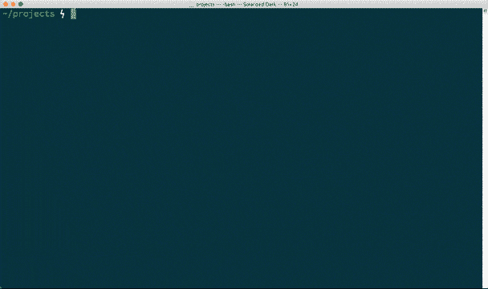
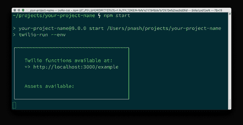

# 以最简单的方式开始一个新的 Twilio 函数项目

> 原文：<https://dev.to/twilio/start-a-new-twilio-functions-project-the-easy-way-3b8l>

如果你正在构建一个 Twilio 项目，你将不可避免地需要运行一些代码来响应一个传入的 [webhook](https://www.twilio.com/docs/glossary/what-is-a-webhook) 请求。最简单的方法之一是使用 [Twilio Functions](https://www.twilio.com/docs/runtime/functions) ，这是我们运行 Node.js 的无服务器平台。最近[我的同事张秀坤发布了`twilio-run`包](https://dev.to/twilio/locally-developing-and-debugging-twilio-functions-5apf)，使得在本地开发、测试和调试 Twilio 函数变得更加容易。

我想让 Twilio Functions 项目更容易上手，所以我构建了一个名为 [`create-twilio-function`](https://www.npmjs.com/package/create-twilio-function) 的项目生成器。

让我们看看如何使用`create-twilio-function`和`twilio-run`轻松启动和开发一个 Twilio 函数项目。

## 入门

有几种方法可以使用`create-twilio-function`。最简单的是如果你有`npm`版本 6 或更高。您可以在命令行上使用
来检查这一点

```
$ npm --version
6.9.0 
```

Enter fullscreen mode Exit fullscreen mode

如果您没有最新版本的`npm`，您可以使用
进行更新

```
$ npm install -g npm@latest 
```

Enter fullscreen mode Exit fullscreen mode

如果您在尝试安装全局模块时出现权限错误，请看看这篇文章。

如果你使用的是 Windows，你还有更多的工作要做，我建议你阅读 npm 文档中的说明。

一旦你有了最新的`npm`，你就可以通过运行
来使用`create-twilio-function`

```
$ npm init twilio-function your-project-name 
```

Enter fullscreen mode Exit fullscreen mode

### 替代品

`npm init <initializer>`实际上调用了`npx`工具。如果你安装了`npx`，你可以拨打:

```
$ npx create-twilio-function your-project-name 
```

Enter fullscreen mode Exit fullscreen mode

最后一个选项是全局安装`create-twilio-function`:

```
npm install -g create-twilio-function
create-twilio-function your-project-name 
```

Enter fullscreen mode Exit fullscreen mode

当您运行`create-twilio-function`时，脚本会询问您的 Twilio 帐户 SID 和身份验证令牌，或者如果您已经在环境中存储了凭据，它会询问您是否想要使用它们。

如果您提供了凭据，`create-twilio-function`将使用它们来创建一个`.env`,以便在您的功能中使用它们。你不需要提供你的证件，如果你不想，你的`.env`文件将会是空白的。

然后为您生成一个新的项目结构并安装所需的依赖项。

[](https://res.cloudinary.com/practicaldev/image/fetch/s--kXdjumCz--/c_limit%2Cf_auto%2Cfl_progressive%2Cq_auto%2Cw_880/https://s3.amazonaws.com/com.twilio.prod.twilio-docs/original_images/GwK8XK9l-A6NwvQX9Z9aB6A6B96uIHcctu7RVWdvnEz-oKFqauIoexrEFEWIkOB91Vo6nx33Kqfd2H)

## 具有 Twilio 功能的建筑

一旦脚本运行完成，您将拥有一个全新的本地 Twilio 功能开发项目设置。切换到新目录，看看文件结构。应该是这样的:

```
.env
.gitignore
.nvmrc
assets
functions
node_modules
package-lock.json
package.json 
```

Enter fullscreen mode Exit fullscreen mode

我们看到的文件和目录依次是:

*   `.env`:它将包含您的帐户 sid 和身份验证令牌(如果您提供了的话)。您可以使用它为您的函数添加更多的环境变量
*   `.gitignore`:来自 [GitHub 的 gitignore 项目](http://github.com/github/gitignore/)的 Node.js `.gitignore`文件
*   `.nvmrc` : Twilio 函数目前支持 node . js 8 . 10 . 0 版本。如果你使用的是 [nvm](https://github.com/creationix/nvm) ，你可以运行`nvm use`并获得正确的版本。
*   `assets`:可以存储图片、HTML、CSS、JavaScript 等资源的目录
*   编写 Twilio 函数的目录
*   `node_modules`和`package-lock.json`:你所有的依赖
*   你的依赖关系，脚本和其他关于项目的元数据

如果你看一下`package.json`，你会看到一个`start`脚本被定义为运行`twilio-run --env`。用
调用它

```
npm start 
```

Enter fullscreen mode Exit fullscreen mode

您的 Functions 项目将开始显示您在这个本地环境中托管了哪些函数和资产。`create-twilio-function`提供了一个示例函数来帮助您入门。

[](https://res.cloudinary.com/practicaldev/image/fetch/s--xbsjGbUz--/c_limit%2Cf_auto%2Cfl_progressive%2Cq_auto%2Cw_880/https://s3.amazonaws.com/com.twilio.prod.twilio-doimg/dHC8sC3fRcdEI2YZS-_G1TrHZ7aGJBU16kZLFI1GXeAfPZ.width-500.png)

打开`functions/example.js`中的例子，看看它是如何构建的。目前，它是一个“你好世界！”使用 [Twilio Node.js 库](https://www.twilio.com/docs/libraries/node)(在 Twilio Functions 环境中提供)构建 TwiML 响应的语音 webhook 响应应用程序。

```
exports.handler = function(event, context, callback) {
  const twiml = new Twilio.twiml.VoiceResponse();
  twiml.say("Hello World!");
  callback(null, twiml);
}; 
```

Enter fullscreen mode Exit fullscreen mode

如果您使用`curl`向[http://localhost:3000/example](http://localhost:3000/example)发出请求，您将看到 TwiML 输出:

```
$ curl http://localhost:3000/example
<?xml version="1.0" encoding="UTF-8"?>
<Response>
  <Say>Hello World!</Say>
</Response> 
```

Enter fullscreen mode Exit fullscreen mode

一个命令给`create-twilio-function`，另一个给`npm start`，我们已经从零到 Twilio 函数的完全本地开发环境。

如果你想了解更多关于[`twilio-run`的高级特性，从公开使用 ngrok 服务你的函数到与调试器挂钩，看看张秀坤的帖子](https://dev.to/twilio/locally-developing-and-debugging-twilio-functions-5apf)。

## 如何将我的功能和资产部署到 Twilio 上运行？

现在，你必须在 Twilio 控制台中复制并粘贴[功能代码](https://www.twilio.com/console/runtime/functions/manage)和/或[拖放资产文件](https://www.twilio.com/console/runtime/assets/public)来实时部署它们。我们正在努力开发用于部署的 API。期待不久，如果你想成为第一个尝试它的人，请与我联系。

## 接下来是什么？

`create-twilio-function`是开始构建你自己的 Twilio 函数的好方法，而`twilio-run`使得在本地运行和测试你的函数变得容易。

现在轮到你自己写函数了。如果你正在寻找一些灵感，看看我关于使用 [SendGrid API](https://www.twilio.com/sendgrid) 转发短信或[传真为电子邮件](https://dev.to/twilio/forward-fax-to-email-with-sendgrid-and-nodejs-2o65)或[将 WhatsApp 信息翻译成表情符号](https://www.twilio.com/blog/2018/08/emoji-translations-twilio-api-whatsapp-node-js.html)的帖子。

我们总是对如何帮助您更快更好地构建 Twilio 应用程序感兴趣。如果你有关于 [`create-twilio-function`](https://github.com/philnash/create-twilio-function/) 如何能提供更多帮助的想法，请在评论中告诉我，或者[在 GitHub 回购](https://github.com/philnash/create-twilio-function/issues)上提出问题。