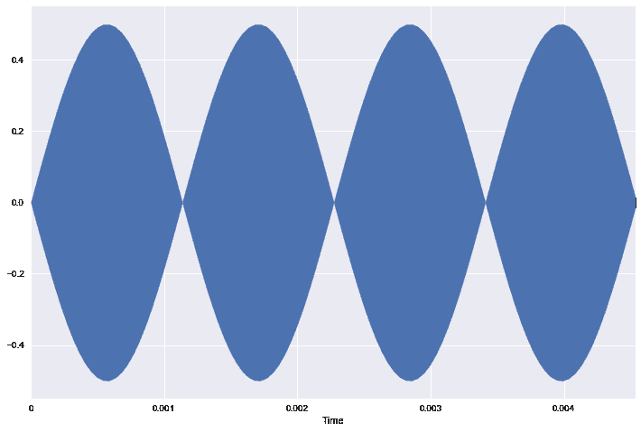
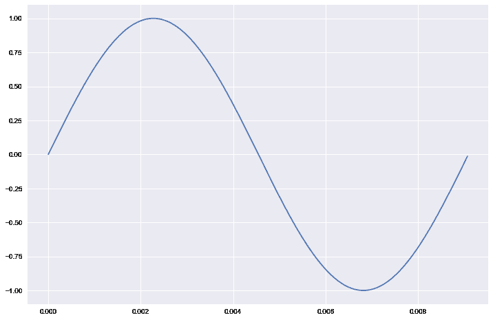
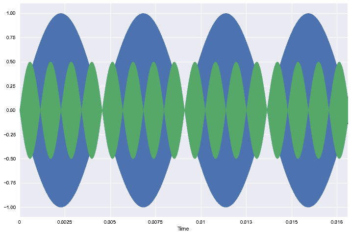
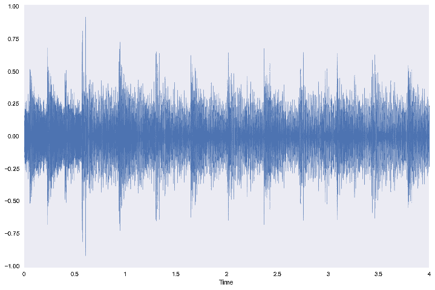
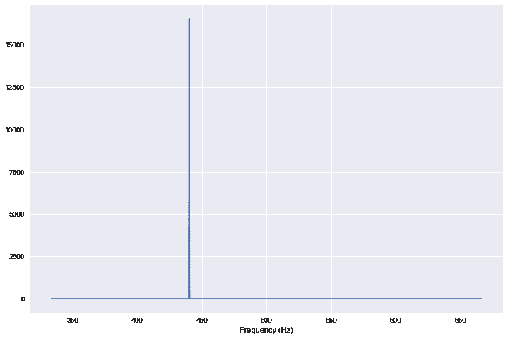
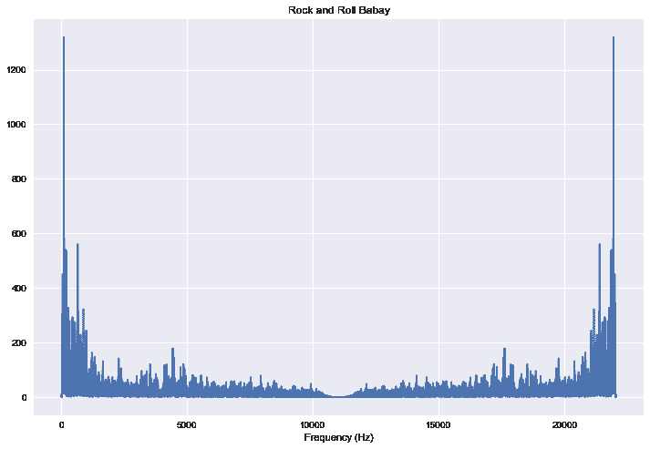

# 音乐信息检索导论。一

> 原文：<https://dev.to/bfdykstra/introduction-to-music-information-retrieval-pt-1-4i2j>

# 音乐信息检索入门 Pt。一

我喜欢音乐。上班一天都在听，会弹，(有时候)会做。我也喜欢分析像国会选举这样的事情，或者探索第一次出生 T2 的年龄。那么，为什么不试着把这两件事结合起来，分析我的 iTunes 资料库中的一些音乐呢？

### 动机

Spotify 知道我的音乐味道比我好，而且十有八九，他们为我制作的精选播放列表绝对准确无误。我想我会试着从基本原则的角度来复制他们所做的一些事情。

我开始查看 Spotify 的 API，试图找出如何在他们的 T2 音频分析 GET 路线中复制他们的结果。然后我被带到了[这个](https://www.reddit.com/r/learnprogramming/comments/703ocf/replicating_spotifys_audio_features_extraction/) reddit 讨论，在这里给出的搜索关键词是主题音频分类。然后我的谷歌搜索引擎就把我带到了这个神发的网站[https://musicinformationretrieval.com/](https://musicinformationretrieval.com/)。这个网站有大量的资源，还链接到国际音乐信息检索协会，那里有大量的研究论文。下面的很多例子都是基于那里的课程。

我的主要目标是帮助其他人澄清他们在分析音乐时应该寻找什么，以及一些帮助他们开始的工具。

### 你需要什么

我在装有 High Sierra 的 macOSX 上工作。我用 python 2.7.13 运行了一个 anaconda 发行版。
对于这款笔记本来说，你所需要的就是`numpy librosa matplotlib`和`Ipython`。如果你试图用 librosa 加载一首歌，但没有成功，你可能需要用自制软件安装`ffmpeg`。

### 入门:最初的挑战和解决方案

在很长一段时间里，着手这个项目是非常令人沮丧的。我不知道我应该谷歌什么关键字(音频数据的特征提取？)并且只有一两个教程专门讨论声音分类或环境声音。此外，在教程中，没有对任何被提取的特征进行解释或说明，它们是非常专业的术语。这一领域的另一个巨大挑战是歌曲的版权法。没有大量的流行歌曲 MP3，音乐文件格式也没有任何标准化。

那么，我是如何应对这些挑战的呢？

*   对于工具:我发现的第一个妨碍 Python 的是 [Librosa](https://librosa.github.io/librosa/install.html) 。我立即开始尝试从我的 iTunes 库中读取 *.m4a* 文件，但是我的电脑突然死机了。使用自制软件安装 [**ffmpeg**](https://www.ffmpeg.org/) 。现在我可以在电脑上阅读文件了。
*   对于歌曲，我用的是我自己电脑上有的。你可以从原始音频数据中找到其他的[源](https://github.com/mdeff/fma)，尽管许多其他人出于上述原因省略了原始文件。
*   就解释特性而言，我必须回到基础！这就是我想要开始的:)

### 信号处理的基本术语和概念

我遇到了很多我非常熟悉的术语，但肯定需要一些更新。

**周期**:又称时期。a 重复一次需要多少弧度。对于正弦，这是 2$\pi$弧度。更实际的是，如果心脏每 30 秒跳动一次，我们说它的周期是 30 秒

**赫兹**:(不是租车公司)。1 赫兹=每秒 1 个周期。440 赫兹意味着每秒 440 个周期。

**频率**:信号在单位时间内重复多少次。这是循环的逆过程。如果我的心脏每半秒跳动一次(周期)，那么我的频率就是每分钟 120 次。

**信号**:文件中某一时间点的实际时间序列频率。我们使用`librosa.load('filename.mp3', sr=our_sampling_rate)`将文件加载到音频时间序列中。

**采样率**:从音频文件中抽取样本的速率。默认为 22050。如果你把它乘以某个单位时间，你就得到了这段时间内的样本数。

**能量**:形式上是信号平方幅度下的面积。大致对应于信号的负载程度。

[**傅立叶变换**](https://en.wikipedia.org/wiki/Fourier_transform) :这是信号处理中非常重要的运算。虽然它的数学非常复杂，但它的功能却非常直观。它将信号分解成组成信号的频率。换句话说，它将时域中存在的东西(信号)映射到频域，其中 y 轴是幅度。这非常类似于音乐和弦如何被分解成组成它的独立音符，即 C 三和弦由 C、E 和 g 组成。

现在我们已经有了一些基本的术语，让我们来看一些使用这些术语的简单例子。

```
from __future__ import division
import numpy as np
import seaborn as sns
%matplotlib inline
import matplotlib.pyplot as plt
plt.rcParams['figure.figsize'] = (12,8)

import librosa.display
import IPython.display as ipd 
```

让我们创建一个持续 3 秒钟的 440 HZ 的简单音频波(中音 C 以上的音符，特别是 A4)。这将是一个纯音。我们将使用`numpy.sin`来构建正弦波。回想一下高中物理/trig，正弦波的公式是$A* sin(2*{\pi}*R)$其中 R 是弧度，A 是振幅。我们可以通过将频率(弧度/时间)乘以时间变量来获得弧度数。

```
sr = 22050 # sample rate T = 3.0    # seconds t = np.linspace(0, T, int(T*sr), endpoint=False) # time variable, evenly split by number of samples within timeframe freq = 440 #hz A4 amplitude = 0.5

# synthesize tone signal = amplitude * np.sin(2 * np.pi * freq * t) # from our formula above print "there are " + str(signal.shape[0]/T) + " \ samples of audio per second, if T was 2 seconds, the shape would be " + str(signal.shape[0]*2) 
```

```
there are 22050.0 samples of audio per second, if T was 2 seconds, the shape would be 132300 
```

我们来弹音调吧！

```
ipd.Audio(signal, rate=sr) # 
```

如果我们画出整个时间序列，那么它看起来就像一个固体，因为频率很高。相反，让我们绘制一个音调的小样本，这样我们就可以只看到两个周期。

```
# sr / freq = # of frames in one period, two_periods = int(2 * (sr / freq))

librosa.display.waveplot(signal[:two_periods + 1], sr=sr); 
```

[](https://res.cloudinary.com/practicaldev/image/fetch/s--HGrvzB_p--/c_limit%2Cf_auto%2Cfl_progressive%2Cq_auto%2Cw_880/https://thepracticaldev.s3.amazonaws.com/i/28rbr1sd6oove91ylqq5.png)

让我们用低得多的频率制作一个音调

```
sr = 22050 # sample rate T = 2.0    # seconds t = np.linspace(0, T, int(T*sr), endpoint=False) # time variable, freq = 110 #hz amplitude = 1

# synthesize tone low_signal = amplitude*np.sin(2*np.pi*freq*t) 
```

您可能无法通过计算机扬声器播放此音调，如果没有播放，请尝试耳机。

```
ipd.Audio(low_signal, rate=sr) # BASS 
```

由于频率为 110 hz 的信号中有 22050 个样本，这意味着如果我们将样本数除以频率，我们应该能够看到信号的一个周期中有多少帧，并绘制出单个周期。

```
# 22050 / 110 = 200.45 => round up to 201 plt.plot(t[:201], low_signal[:201])
plt.show() 
```

[](https://res.cloudinary.com/practicaldev/image/fetch/s--yjGIQiSK--/c_limit%2Cf_auto%2Cfl_progressive%2Cq_auto%2Cw_880/https://thepracticaldev.s3.amazonaws.com/i/ez9qxeii66uep1vz7c5s.png)

为了帮助我们的直觉，让我们看看这两个信号是如何相互联系的。由于 110 hz 大约是 440 hz 频率的四分之一，因此 4 个周期的较高频率信号应该适合 1 个周期的较低频率。绿色是较高的频率。

```
librosa.display.waveplot(low_signal[:4*two_periods], sr=sr);
librosa.display.waveplot(signal[:4*two_periods], sr=sr); 
```

[](https://res.cloudinary.com/practicaldev/image/fetch/s--oZITkmpt--/c_limit%2Cf_auto%2Cfl_progressive%2Cq_auto%2Cw_880/https://thepracticaldev.s3.amazonaws.com/i/pnytgcl3xy1ke1xbax1s.png)

好极了。我们已经能够构建自己的声波，并了解频率是如何影响音调的。

## 加载自己的音乐！

让我们不要合成我们自己的音调，而是从你的音乐库中载入一首歌曲的小样本来看看吧！

```
# read 4 seconds of this song, starting at 6 seconds music_dir = '/Users/benjamindykstra/Music/iTunes/Led Zeppelin/Led Zeppelin IV/02 Rock & Roll.m4a'
data, sr = librosa.load(music_dir, offset=6.0, duration=4.0) 
```

```
ipd.Audio(data, rate=sr) 
```

```
librosa.display.waveplot(data, sr=sr); # it just looks loud! 
```

[](https://res.cloudinary.com/practicaldev/image/fetch/s--5rsN7S1x--/c_limit%2Cf_auto%2Cfl_progressive%2Cq_auto%2Cw_880/https://thepracticaldev.s3.amazonaws.com/i/auh60fmsrskmlhvyge62.png)

### 傅立叶变换

让我们看看对原始信号(440 hz)进行快速傅立叶变换会发生什么。我预计 x 轴上将有一条 440 hz 标记的单线。在我们完成简单的案例后，我们还可以分解我们的小歌曲片段。

```
import scipy 
```

```
X = scipy.fft(signal)
X_mag = np.absolute(X)
f = np.linspace(0, sr, len(X_mag)) # frequency variable 
```

```
plt.plot(f[1000:2000], X_mag[1000:2000]); # magnitude spectrum plt.xlabel('Frequency (Hz)'); 
```

[](https://res.cloudinary.com/practicaldev/image/fetch/s--hgq68qve--/c_limit%2Cf_auto%2Cfl_progressive%2Cq_auto%2Cw_880/https://thepracticaldev.s3.amazonaws.com/i/ia6joo6ednjpv04e3esp.png)

看那个！一个 440 赫兹的尖峰信号。温暖了我的心:)

现在我们可以快速浏览一下摇滚乐。

```
rr_fft = scipy.fft(data)
rr_mag = np.absolute(rr_fft)
f = np.linspace(0, sr, len(rr_mag)) # frequency variable plt.plot(f, rr_mag) # magnitude spectrum plt.xlabel('Frequency (Hz)')
plt.title('Rock and Roll Babay'); 
```

[](https://res.cloudinary.com/practicaldev/image/fetch/s--aKAc_plC--/c_limit%2Cf_auto%2Cfl_progressive%2Cq_auto%2Cw_880/https://thepracticaldev.s3.amazonaws.com/i/r5mpbsy64yhtazcu9mu2.png)

傅立叶变换对我们如此重要的原因是，它允许我们分析整首歌中每个频率的出现和功率。如果我们把一首歌分成几个部分，我们就可以开始观察这种分布在歌曲中是如何变化的。我们也可以用它来分离信号中的谐波和敲击成分。它是利用频率分析的任何算法或特性的基本构建模块。

感谢您的关注！在我的下一篇文章中，我们将通过分割和特征提取以及大量的解释来深入杂草。